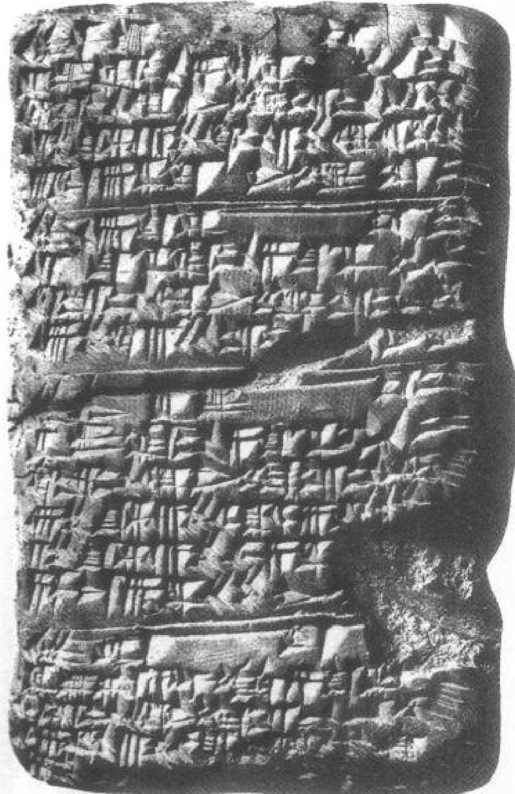
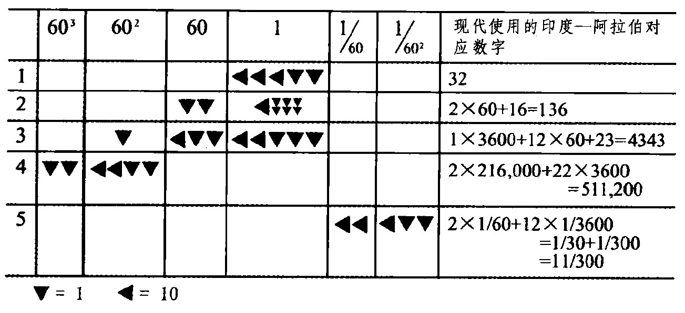

# 第一章 科学及其起源

## 什么是科学

什么是科学的本质？这是数个世纪以来人们激烈争论的一个主题，参加争论的有科学家、哲学家、历史学家以及其他有关的人。虽然仍未得出一致意见，但有关科学的几个概念已得到有利的支持。（1）一种观点认为，科学是人类藉此获取对外界环境控制的行为模式。由此，科学就与工匠传统和技术紧密关联，于是持这一派观点的人认为，当史前人类在学习如何加工金属或致力于农业丰收时，他们对科学的进步就已经有所贡献了。（2）另一种观点认为应该把科学与技术严加区分，科学是理论形态的知识体系，技术则是应用理论知识来解决实际问题。由此看来，汽车的设计和制造技术当区别于对其具有指导作用的理论机械学、空气动力学以及其他一些理论学科。这样，只有理论学科才能被作为“科学”。

赞同第二种观点的人认为科学是理论知识，但并不是都同意所有理论（不论其特性和内容）都是科学，对这些人来说，定义什么是科学的任务才刚刚开始。如果他们希望把某些理论排除在科学之外，他们必须提出判明某一理论是科学而另一理论不是科学的标准。(3)因此，依据理论的陈述形式来定义科学是现在流行的做法。陈述形式应当是一般的、定律式的陈述，最好以数学语言表达。这样，波

---

义耳定律（由罗伯特·波义耳（Robert Boyle）在17世纪提出）就表述为，如其他一切保持不变，气体的压力与它的体积成反比。(4)如果这种标准显得太严格，科学还可以从方法论的角度来定义。这样，科学就与具体的一套程序联系在一起，通常是为探明自然奥秘和证实或证伪某一有关自然特性理论的实验程序。因此，一个陈述如果而且只有以实验为依据，才是科学的。(5)这种定义很容易导致以下的情况，即试图根据对科学的认识论态度（即紧紧抱住自己的理由不放），甚或根据实践者坚持其教条的固执程度来定义科学。由此，伯特兰·罗素(Bertrand Russell)曾经说：“不能根据从事科学活动的人相信什么来评判他是不是一个科学家，而要根据他如何和为什么相信。科学家的信念是尝试性的、非教条的，他们以证据为基础，而不以权威或直觉为基础。”据此观点，科学应是个人获取知识和评判知识的某种独特方法。

(6)在很多情况下，科学并不是以它的方法论或认识论态度来定义的，而是依据其陈述的内容。这样科学就是具体的一套关于自然的信念，多少与现行的物理学、化学、生物学、地质学的学说相仿。根据这样的标准检验，炼金术、占星术和泛心理学都是非科学的。(7)“科学”和“科学的”这两个术语经常用来指具有严格、精确或客观等特性的过程或信念。根据这种用法，夏洛克·福尔摩斯(Sherlock Holmes)采取了科学的方法进行犯罪调查。(8)最后，“科学”和“科学的”往往仅仅用来作为一般表示同意的用语，用以形容我们希望表示赞赏的事物。

上述回顾简短且不甚完整，但它所要表明的东西我认为在本书开篇即应搞清楚。也就是说，许多词语（包括大多数我们感兴趣的词语）都具有多义现象，在具体的语境中意义有所不同。这些意义有时能够相互兼容、相互补充，有时则无法做到。而且，试图消除这种用法上的分歧似将劳而无功。毕竟，语言不是关于宇宙本质的一套规则，而是为一群人所采用的一套常规。上面讨论的“科学”一词的每一种涵义，都作为一种约定俗成为众多的人们所接受。要让他们放弃自己所赞成的“科学”一词的用法，不经过一场战斗是不

---

可能的。或者稍稍换个角度来说，词汇编纂这门学问必须致力的是描述而不是规定。因此，我们必须承认，“科学”一词具有不同的涵义，每一种都合乎情理。

即使我们能够对现代科学下一个人人满意的定义，历史学家仍然面临一个让他们头痛的问题。如果科学史家只把过去那些与现代科学相仿的实践活动和信念作为他们的研究对象，结果将是对历史的歪曲。这一歪曲之所以在所难免，因为科学的内容、形式、方法和作用都已发生了变化。这样，历史学家面对的就不是一个过去实存的历史，而是透过不完全相符的网格去看历史。如果我们希望公正地从事历史研究这一事业，就必须把历史真实本身作为我们研究的对象。这就意味着我们必须抵抗诱惑，不在历史上为现代科学搜寻榜样或先兆。我们必须尊重先辈们研究自然的方式，承认这种方式尽管与现代方法相去甚远，却仍是重要的，因为它是我们现代人理智生活的先驱。这才是理解我们现在之所以是这个样子的惟一合理途径。由此，历史学家需要对“科学”下一个相当宽泛的定义，这个“科学”的定义将允许历史学家对范围广泛的实践及其基于的信念进行研究，并帮助我们更好地理解现代科学事业。我们所需要的科学概念应是宽泛的、具有包容性的，而不是狭义的、具有排斥性的。同时，我们还要注意，我们追溯的历史年代越久远，所需的科学概念就越宽泛。 $ ^{2} $

上述一番告诫，对刚刚着手从事古代和中世纪研究的人尤为重要。如果把注意力局限于对现代科学的预期，我们就只能注意到范围非常狭隘的历史活动，并且肯定会在此过程中歪曲历史本身，忽视许多应属于研究范围内的古代和中世纪信念和实践，而它们恰恰能够帮助我们理解后来出现的现代科学的发展。

我将尽全力在本书中遵循自己提出的建议，采取宽泛到符合历史人物思想倾向的科学定义。我们试图理解的正是他们在理智方面进行的努力。这当然并不意味着要泯灭一切差别。我将对科学的技艺方面和理论方面加以区分，这一区分也是许多古代和中世纪学者坚持的做法，我将集中关注理论方面。 $ ^{3} $从我的叙述中排除技术和技

---

艺，并不意味着我对它们的相对重要性作了评价，而是承认在面对技术史及其地位时还存在着大量的问题，因为技术史作为一门专门的历史学科自有其行家里手。我个人将把关注点放在科学思想的起源方面，事实将证明这是一个极富挑战性的课题。

关于术语的问题还有最后一点要讲。上述讨论我用的都是“科学”这一术语，然而现在应该引入两个替代术语“自然哲学(natural philosophy)”和“关于自然的哲学(philosophy of nature)”。这两个术语在本书中将频繁出现。为什么需要这些新的表述呢？它们到底想传达什么意思？“科学”一词的内涵，不论古代还是现代，都在某种程度上（和某些情况下）不同于我们的研究所针对的主题。 $ ^{4} $ 现代的“科学”一词存在上述的一切模糊不清之处，而古代的这个术语（拉丁文是Scientia，希腊文是episteme）适用于任何具有严格和确定性特征的信念体系，不管这些信念与自然是否相关。因此，中世纪把神学作为科学，这在当时来说是很普遍的现象。本书将探讨的是古代和中世纪对自然的研究，这一研究活动在过去和现在的最明确提法就是“自然哲学”或“关于自然的哲学”。

但需注意，使用“自然哲学”或“关于自然的哲学”这样的表述，并不意味着中世纪对自然的研究活动与“科学的”研究活动相比，在地位上有所下降。我们应该铭记自然哲学当时是一种思想探险，以致(17世纪后期的)科学伟人伊萨克·牛顿（Isaac Newton）把他有关力学和万有引力理论的伟大著作冠名为《自然哲学的数学原理》(Mathematical Principles of Natural Philosophy)。在牛顿看来，同样也在其他古代和中世纪的先驱者们看来，自然哲学(即对自然的研究)是人类探索所面对现实世界的较宽泛的哲学探讨中一个不可或缺的组成部分。

在本书中，我将使用不同的语汇，对各种各样的习惯用法做切合实际的让步。我将经常使用“自然哲学”一词，它或者表示整个科学事业，或指科学事业更为哲学化的一面。也将使用“科学”一词，往往作为“自然哲学”的同义语，有时也指自然哲学更技术化的方面。偶尔则仅仅因为在某一上下文中，为了适于习惯用法需要

---

使用这一术语。仅仅哲学，就有许多可读的，因为如果我们忽视了自然哲学所隶属的大事业，自然哲学将变得无法理解。当然，我会不断参照自然哲学的亚学科，即各门具体学科：数学、天文学、物理学、光学、医学、自然史，以及类似的其他学科。在每一种情况下细心注意上下文，可以使术语的涵义一一得以彰显。

## 史前人类对待自然的态度

从一开始，人类的生存就取决于他们应付自然环境的能力。史前人类为了取得生活必需品，发展出了令我们惊奇不已的技术。他们学会了制作工具、生火、营造栖身之所、狩猎、捕鱼、采集果实和菜蔬。成功的围猎和采集食物（在公元前7000或8000年之后产生了农业）需要了解有关动物习性和植物特性的大量知识。在一个更高的水平上，史前人类学会了识别有毒的草本植物和有治疗作用的药草。他们还发展出了许多技艺，包括制陶、纺织和冶炼金属的工艺。到公元前3500年，人类已发明了轮子，他们认识到有季节之分，并看到了季节与某些天象的联系。简言之，他们对自己的外界环境已知道得很多。

“知道”一词看起来似乎既清楚又简单，但它和“科学”一词几乎同样令人难以捉摸。确实，它使我们又回到上文对技术和理论科学的区分上来。知道如何去做事情是一回事，但要知道事物为什么如此却是另一回事。例如，一个木匠在使用木料时，即使对木料的应力没有任何理论知识，仍可是一名合格的、精细的木匠。一个电工只要具备电学理论中最基本的知识，就能成功地为房屋布线。人们即使没有掌握可以解释毒性或治疗性的生化知识，也同样可能区分出有毒的草本植物和有治疗作用的药草。其实这很简单，即使对经验背后的理论定理一无所知，实际的经验法则也能够得到成功应用。即使没有理论知识，人们也可以具备“专门知识”。

从实用或技术的涵义上讲，史前人类的知识显然相当丰富且不断积累。但那时的理论知识如何呢？史前人类对他们生活在其中的世

---

界的起源、本质、以及层出不穷的现象的起因“知道”或相信些什么呢？他们意识到具体事件背后有普适的定律或原理在起作用吗？甚至他们是否会提出这类问题？我们几乎找不到什么证据回答这类问题。史前文化当然是口头文化，而口头文化只要保持绝对的口头，就没有留下任何文字的印迹。然而，考察19世纪和20世纪人类学家研究无文字部落的成果，并认真注意进入最早文字记录中的史前思想遗痕，我们可以形成一些推测性的概括。

对文字出现前社会的思想文化进行研究，关键在于对交流过程的理解。在没有文字的环境里，口头交流的惟一方式就是词语的吐露，而知识的惟一储存库就是一个群体里每一个人对知识的记忆。在这种文化中，意见和信念的传递只能通过面对面的交流来完成，通过内部成员之间“环环相扣的对话长链”加以传递。这些对话中的一部分被群体成员认为至关重要，必须铭记在心并代代相传，这样就形成了口头传统的基础。它是这个群体的集体经验、一般信念、态度以及价值观的主要储存库。 $ ^{4} $

口头传统中有一个重要特征需要我们注意，即它的流动性。口头传统往往处于持续演化的状态，它在群体内部吸收新的经验，调整传统以适应新的条件和需要。在这里，如果认为口头传统的作用是交流抽象的历史或科学数据，即现在的历史档案或科学报告的口头对应物，那么口头传统的这种流动性就会变得极其令人迷惑不解。但是，由于没有文字能力，口头文化理所当然不可能产生出档案或报告。的确，口头文化甚至对文字没有一点概念，当然也不可能对历史档案和科学报告有任何概念。口头传统的基本功能是非常实用的，即用于解释群体当时的状态和结构，因而证明其合理性，为群体提供一个连续演进的“社会成员共同遵守的规则”。例如，对过去事件的描述可用于使当前的领导地位、财产权、特权和义务的分配合法化。为了使这一功能能够有效运作，口头传统必须有能力根据社会结构的变化迅速调整自己。

但在这里，我们主要对口头传统的内容感兴趣，尤其对有关宇宙本质的那部分内容，即可认为是世界观或宇宙观成分的那部分内

---

容感兴趣。这些成分存在于每一口头传统之中。但一般说来深藏在表层下，很少被具体阐述出来，几乎从来没有被组合成一个统一的整体。因此，如果由我们来代表文字出现以前社会的人类明确阐述出他们的世界观，那必然极其勉强，因为，没有我们来提供连贯性和系统性，它就难以表达，而这也就恰恰歪曲了那些是我们试图描绘的一般概念。虽然如此，我们还是有可能对文字出现以前社会口头传统里的世界观成分或因素提出某些结论。（下面所做的结论以史前文化和当代无文字社会为依据，除非有明显相反的证明，应认为这些结论适用于上述两种环境。）

可以肯定，无文字社会的人类也需要能够带来秩序、统一，尤其是能够说明身边明显随机和混乱的事件的涵义的解释原则，他们在这方面的需要绝不少于生活在现代科学文化之中的我们。但我们不应该期望史前人类所接受的解释原则与我们自己的解释原则相类似：由于没有任何“自然规律”的概念或以决定论为基础的、追溯因果关系的机械论，他们关于因果关系的想法远远超出现代科学所认可的那种机械或物理的相互作用。在寻求意义的过程中，他们很自然地在自己的经验范围内进行这一活动，把人或生物的特性投射到物体或事件上去，而这些物体或事件在我们看来，不但与人性无关，而且与生命无关。他们一般是用出生来描述宇宙的生成，而宇宙里发生的事件可能会被解释为善和恶两种相反力量斗争的结果。无文字社会的文化有这样一种倾向，即不仅把原因人格化，而且把它个性化，假定事情如此发生，是因为它们被期望这样做。H. 弗兰克福特和 H.A. 弗兰克福特(H. and H.A. Frankfort)如此描述这一倾向：

“我们的因果观之所以不能满足原始人的需要，在于这种因果观提供的解释的非人格特征，还在于这种解释的一般性。我们对现象的理解，不是根据这一现象的特点，而是依据现象所体现的普遍规律。但是普遍规律不可能对每一事件的单个特性都同样适用，而事件的单个特性恰恰是原始人在经验范围内感受最强烈的。我们在解释一个人的

---

死亡原因时，可把它归于某个生理过程。但原始人会问：为什么这个人在这个时候这样死去？我们只能说，在这样的条件发生时死亡总会发生。原始人想找一个如所要解释的事件本身一样具体、单个的原因。原始人经历了事件的复杂性和具体性，它们需要有同样具体的原因来解释。

口头传统中所描述的宇宙一般都包括天与地，也可能包括地下世界。一则非洲神话把地球描绘成一张铺开但翘起的席子，并由此解释了水的上游和下游，这是人们一般倾向根据自己所熟悉的事物和过程来描述宇宙的一个实例。一般说来，在口头传统中，自然物、超自然物和人类之间并没有截然分明的界限，但神是无处不在的现实。神没有超出宇宙而是深深地植根于宇宙，并且也要受宇宙规则的约束。口头传统的另一普遍特征，是相信存在着亡灵、鬼神和许多看不见的力量，人们可以通过巫术仪式对这些隐形力量加以控制。人们广泛相信转世的说法（一种以为人死后，灵魂进入其他人或动物体内的信念）。那时，空间和时间的概念不是（像现代物理学那样）既抽象又数学化的，而是充满从群体经验那里得到的意义和价值。例如，一群生活在河流附近的人，他们的方向感可能主要是“上游”或“下游”，而不是东西南北。某些口头文化难以对稍微久远的过去做少许的设想，例如，非洲有一个叫蒂奥(Tio)的部落，他们追溯古人的范围不超过两代人。 $ ^{8} $

口头传统有一种把原因与开端等同起来的明显倾向。这样，解释某个事件就等同于追溯该事件的历史起源。在这样的思想框架里，我们现在对科学和历史所做出的区别就无法得到尖锐的划分，或者这种区别根本就不存在。于是，当我们寻找说明世界观或宇宙论的口头传统的特征时，发现它们几乎总是把对事物起源的描述包含其中，如世界的开端，第一个人的出现，动植物和其他一些重要物体的起源，最后则是群体的形成。与描述起源相联系的，通常是神、国王或群体历史上其他英雄人物的谱系，还有描述这些英雄的事迹的故事。我们必须注意，在这样的历史描述里，历史不是被描述为一

---

系列引起渐变的因果链，而是一系列确定和孤立的事件，通过这些事件，现在的秩序得以存在。 $ ^{9} $

上述这些倾向在古今的口头文化中都有实例可循。20世纪赤道非洲的库巴人(Kuba)认为：

姆伯 (Mboom) 或者称源水有九个孩子，都叫作乌特 (Woot)，他们依次创造了世界。根据出现的先后顺序，他们是：海洋乌特；挖掘乌特，他挖掘河床和沟渠，然后堆起小山；流淌乌特，他使得河水流动；创造树林和热带草原的乌特；创造树叶的乌特；创造石头的乌特；雕刻师乌特，他从木球中造出人类；发明多刺之物的乌特，他发明了诸如鱼、荆棘和划桨等多刺之物；削尖者乌特，是他第一次使尖的东西有刃。当后两个乌特争斗起来，用削尖的物体造成一方死亡时，死亡也就在这个世界上诞生了。 $ ^{10} $

请注意这一则传说既描述了人类的起源和库巴世界的主要热带特征，也解释了库巴人显然认为至关重要的尖状物体的发明。

类似的主题在古代埃及和巴比伦的创世类神话里也很多。据一则埃及神话描述，起先太阳神阿多姆(Atum)产下了空气之神尚(Shu)和潮湿女神泰福纳特(Tefnut)。

后来，空气之神尚和潮湿女神泰福纳特交合，生出了土地和天空，即土地之神吉伯(Geb)和天空女神纳忒(Nut)……。然后，土地之神吉伯和天空女神纳忒交配，产生了两对双胞胎，即奥西里斯(Osiris)神和他的配偶伊希斯(Isis)，以及赛斯(Seth)和他的配偶奈福赛斯(Nephthys)。上述诸神代表了存在于这个世界的各种力量，他们或是人，或是神，或是宇宙的力量。 $ ^{11} $

一则巴比伦神话则把世界的起源归因于河流之神恩克(Enki)的性

---

行为。恩克使大地女神或土壤女神妮合莎(Ninhursag)受孕，这一水和土壤的结合产生了草木，于是植物女神宁莎(Ninsar)诞生了。后来恩克先与他的女儿交配，再与他的孙女交配，产生了多种具体的植物和植物产品。在妮合莎给八种新的植物命名之前，恩克吞食了它们，这使得妮合莎非常恼火，于是对恩克施以诅咒。其他诸神由于害怕恩克死去会带来灾难(显然即水的枯竭)，他们迫使妮合莎收回诅咒，并让她治愈了恩克因诅咒而患的多种疾病。妮合莎这样做了，于是产生了八位治疗疾病的神。每一位治疗神都与身体的一个部分相关联——这样就解释了治疗术的起源。 $ ^{12} $

为了有益于描述一些口头文化的特征，需要在治疗术这里停留一下。在古代的口头文化中，医疗实践无疑极为重要，因为在原始条件下，疾病与受伤是家常便饭。 $ ^{13} $ 小的医疗问题，如创口和身体某部位的损伤无疑是由家庭成员来照料。更严重的疾病，如大的创口、骨折、严重和意想不到的疾病，则需要求助于知识丰富和技能较高的人。于是某种程度的医疗专门化就产生了：部落或村庄里某些人因具备药草采集能力、熟练的接骨技术、疗伤技术或丰富的接生经验而闻名。

但是如此描述，使无文字社会的原始医学实践看上去非常像基本的近代医学的翻版。进一步研究发现，口头文化中的治疗术与宗教和巫术既不能截然分开，也不能清晰划分。巫婆或“巫医”之所以身价颇高，不仅因其有配药和治疗外伤的技术，而且在于他们知道神鬼是引起疾病的原因，知道通过巫术的或宗教的仪式能够治疗疾病。如果病情属于扎刺、创伤、常见的疹子、消化不良或骨折之类，治疗者就会用常用的方法简单处理，即拔出棘刺、包扎创口、使用某种能够消疹的东西（如果治疗者知道这种东西的话）、建议禁食某些食物、接骨、给断骨上夹板等等。但是如果一个家庭里有成员忽然莫名其妙地病倒了，并且还相当严重，人们就会怀疑是魔法作怪，或是外来的精灵附体。面对这样的病情，需要更加剧烈的治疗手段，如用祈祷、占卜、斋戒、唱颂歌、念咒或其他一些仪式活动来驱魔。

---

在(古代和当代的)口头文化中，还有最后一种值得我们注意的有关信念的特点，即同时接受在我们看来不能兼容的几种信念，却没有明显地意识到这样可能带来问题。这类情形不胜枚举，但是，只需注意这一点就足够了：上面提到的九个乌特的故事只是在库巴人中流传的七个(或更多)创世神话之一。同样，埃及也有许多类似于阿多姆、尚、泰福纳特及其后嗣故事的不同神话。人们现在似乎(或过去似乎)从来就没有注意到或并不在乎所有这些原始神话都不可能是真实的。此外还有上面所描述的许多信念看起来那种“想象”性质，我们不禁会提出一个“原始思维”的问题：无文字社会成员的思维是否尚未具备逻辑能力，或者是神秘的，或者与我们现代人不同？如果确系如此，我们应该怎样确切地描述和解释这种思维呢？ $ ^{14} $

这是一个极为复杂且难以回答的问题，在20世纪的大半时间里，人类学家和其他人对此进行了热烈的讨论，我当然不可能在这里解决这一问题。但我至少能提出一个方法论上的建议：指望生活在无文字社会的人们使用(或曾经使用)他们从未相识的概念和知识标准，即对史前人来说还需好几百年才发明出的概念，实在是白费功夫，对理解无文字社会没有任何裨益。如果我们假定无文字社会的人类曾经试图实行我们现代人关于知识和真理的概念体系，结果会是一无所获。只需略微思考一下便能看到，无文字社会的人类生活在一个与我们的世界相去甚远的世界里，他们一定是在一个极为不同的语言和概念世界里活动，目标也与我们现代人不同。我们必须依据这些对他们的成就进行评判。

口头传统中包含的故事可以传递和强化群体的价值观和态度，根据群体的经验提供有关世界主要特征的令人满意的解释，而且能使当前的社会结构合法化。这些故事进入口头传统(共同的记忆库)，是因为它们能行之有效地实现上述目的，并且只要继续做到这一点，人们就没理由对它们质疑。在这样的一种社会环境里，怀疑主义得不到赞赏，并且，几乎不存在促进质疑的有利条件。我们有关真理的高度发达的概念体系，以及一个陈述要被判定为真就必须遵守的评判标准(例如，保持内在的一致性，或者符合外部现实)，在口头

---

文化中一般是不存在的；而且若向一个生活在口头文化中的人加以解释，这些概念和标准在他看来也几乎是毫无用处的。史前社会里有效的原则是被认可的信念——来自群体共识的认可。 $ ^{15} $

最后，我们如果希望理解古代和中世纪科学的发展，就必须要问：上面讨论的无文字社会的信仰模式怎样屈服于新的知识和真理概念（在亚里士多德的形式逻辑原理和由此衍生出来的哲学传统中体现得最明显）或者说得到其补充。看来，最具有决定意义的发展是文字的发明，它经历了一系列的步骤。首先是图画阶段（pictographs），图画阶段的文字记号代表的是事物本身。在公元前3000年左右，出现了词的记号（或标符）系统。创造出记号来表示重要的词汇，埃及的象形文字即如此。但是在象形文字的书写体系中，记号还能表示声音或音节，这就是音节文字的起源。大约在公元前1500年前后，全音节系统（即在音节系统里抛弃全部非音节记号）的发展使得人们可以轻易写下他们所能说的一切。最后，每一个记号对应一个声音（既有辅音又有元音）的全字母文字于公元前800年在希腊出现，并且在公元前6世纪和5世纪在希腊文化中广泛传播开来。 $ ^{16} $

文字尤其是拼音文字的重要贡献之一，是为口头传统提供了一种记录方式，它使得口头文化到那时为止所具有的流动性得以固定，使得瞬息即逝的声音信号转变为经久不变的可视信号。 $ ^{17} $ 由此，文字提供了储存功能，取代记忆成为知识的主要储存库。这一变革性影响即在于，它使知识处于开放的状态，使人们有可能对知识进行审视、比较和批评。有了描述事件的文字记录，人们就能够把它与描述同一事件的其他（包括曾经有的）文字记录进行比较，这种比较所能达到的程度是在绝对的口头文化社会中所不可想象的。这样的比较鼓励了怀疑主义。在古代，它有助于把真理同神话或传说区别开来，而这一区别又需要制订使真理得以肯定的标准。制订适当标准的努力会产生推论规则（rules of reasoning），后者则为严肃的哲学活动提供了基础。 $ ^{18} $

口头表达的词语在拥有永久保留的形式后，不仅鼓励了审视和批评，还使得在口头文化中找不到对应物(或只有极弱的对应物)的

---

新的智力活动得以出现。杰克·古迪(Jack Goody)令人信服地说，早期文字社会产生了大量文字目录和其他种类的清单(多数为了管理目的)，其详尽程度超过口头文化所能产生的任何东西。而且，由于有了这些清单，出现了新的审视，同时也要求出现新的思考过程或新的组织思想的方式。例如，清单上的物品脱离了口头传统社会赋予它们的背景，从这个意义上说，它们变成了抽象的东西。可以根据不同的标准，对这些抽象的形式进行区别、分类和归纳。因而可以提出大量在口头文化中不可能提出的问题。举一个简单的例子，早期巴比伦人为收集精确的天象观察所列的清单，不可能以口头形式收集并传播，它们只能存在于文字记录之中，这样人们才能细致地进行检查和比较，从而发现与数理天文学和占星术起源有关的天体运动的复杂形式。 $ ^{19} $

从上面的讨论可以得出两个结论。首先，文字的发明是古代世界哲学和科学得以发展的先决条件。其次，哲学和科学在古代世界的繁荣程度与文字系统的有效性（拼音文字比所有其他文字都具有更大的优势）和它传播的广度直接相关。我们看到最早在公元前3000年左右埃及和美索不达米亚使用词的记号或标符所带来的好处。然而，标符文字难以掌握且效率低下，不可避免地限制了它的传播，并使它成为一小部分学者精英的私有财产。相形之下，在公元前6世纪和5世纪的希腊，字母文字的广泛传播促进了哲学和科学蔚为壮观的发展。在这里，我们务必不要认为文字系统本身能够产生公元前6世纪和5世纪的“希腊奇迹”，事实上，其他因素也发挥了促进作用，包括社会繁荣、新的社会和政治组织原则、与东方文化的接触，以及把竞争作风引入希腊人的灵智生活。但是，毫无疑问，在诸多的因素中堪称最重要的因素，乃是希腊是世界上第一个拥有广泛文字文化的地区。 $ ^{20} $

## 埃及和美索不达米亚科学的起源

我将在下一章转向对希腊世界的研究。在此之前，我必须简要

---

地描述一下发生在埃及和美索不达米亚（后一地区位于底格里斯河和幼发拉底河之间，是古巴比伦和亚述和现代伊拉克的所在地——见图2）的前希腊文化的发展。为了揭示埃及人和美索不达米亚人的宇宙学和宇宙起源论的关键特点，我在前一节讨论了很多那时的创世神话。此处讨论的是埃及和美索不达米亚对另外一些学科或领域的贡献，正是这些学科或领域后来在希腊和中世纪欧洲的科学里找到了它们的位置，这就是数学、天文学和医学。这方面的证据虽少，但足以描画出一幅大致的图景。

希腊人自己认为数学起源于埃及和美索不达米亚。希罗多德(Herodotus，公元前5世纪)告诉人们，毕达哥拉斯(Pythagoras)曾游历埃及，在那里，祭司们把埃及数学的秘诀介绍给他。根据古代的传统，在那里，毕达哥拉斯成了俘虏，被带到巴比伦。在巴比伦，他又接触到了巴比伦的数学。最后，他回到家乡萨摩斯(Samos)岛，把埃及和巴比伦的数学宝藏带回到了希腊。无论这则故事以及有关其他数学家的类似故事，在历史上真有其事还是传说，与这些故事要告诉我们的这样一个事实相比较都显得并不重要，这个事实就是希腊人曾经(并且他们自己也认识到)是埃及和巴比伦数学知识的接受者。

到公元前3000年前后，埃及人发展出了一套十进制的数系，用不同的符号来表示10的不同次幂(如1, 10, 100等等)。这些符号可以像罗马数字一样排列起来，用以表达任何一个想要表达的数。这样，如果|代表1, ∩代表10，那么数字34就可以表示为||||∩∩∩。到公元前1800年前后，为其他的数设计出了更多的符号，于是7可以用一个镰刀形的符号(∅)来表示，而不是用7根竖道来表示。加法和减法在埃及人的算数中运算起来很简单，就像罗马数字的加减。但是乘法和除法在运算时却相当笨拙。分数的广义概念尚不为人知，一般规则中只允许单位分数（即分子为1的分数）存在。下述类型的基本问题可以得到解答：一个数的七分之一与该数相加等于16，该数为多少？ $ ^{21} $

埃及人的几何学知识似乎注重实用问题，可能是丈量者和建筑

---

图1.1 一块古巴比伦黏土板（约为公元前1990-1600年）。板上内容叙述了一个数学问题，涉及砖及其数量和覆盖面积。耶鲁大学巴比伦藏品，YBC4607。板上内容已得到翻译，并在O.Neagebauer和A. Sachs编辑的Mathematical Cuneiform Texts一书的第91-97页得到讨论。

表 1.1 五个巴比伦六十进制数字与其印度—阿拉伯对应数字。

---

者所面对的问题。埃及人能够计算出简单平面图形的面积，比如三角形和六边形；并能计算出简单立方体的体积，如金字塔的体积。例如，为了算出三角形的面积，他们用三角形底边长度的一半乘以三角形的高。为了算出金字塔的体积，就用金字塔底面积的三分之一乘以金字塔的高度。为了计算圆的面积，埃及人计算出与约为3.17的 $ \pi $的值相对应的规则。最后，在应用数学最明显的领域之一，埃及人设计了一种正式的年历，由12个月组成，一个月30天，年底再加上五天——比起同时代的巴比伦年历和早期希腊城邦所使用的年历要简易得多，因为它具有固定性质。而早期希腊城邦所采用的历法则试图考虑到月球和太阳的活动周期。 $ ^{22} $

同时代美索不达米亚的数学成就，是在数量级方面超过埃及人。大量发现的黏土板(见图1.1)揭示出巴比伦人的数系，这一系统于公元前2000年前后已得到充分的发展，它既是十进制(基于10这个数)，也是六十进制(基于60这个数)的。我们今日的计时制度(一小时为60分钟)和计角制度(一度为60分，一周为360度)保留了六十进制的数字。巴比伦人已经把1的符号(▼)与10的符号(▲)区分开来，这样可以像罗马数字一样，结合起来形成直到59的数字。例如，32这个数可以用3个代表10的符号再加上2个代表1的符号来表示，如表1所示。

但是，59以后的数表达起来就出现了重要的不同。巴比伦人在16表达60这个数时不是把6个表示10的符号排成一列，而是利用了与我们现在的进位制相类似的方式。例如，在我们的数字234中，4（位于个位）仅仅代表4这个数；3位于十位，就代表30这个数，2位于百位，就代表200这个数。这样，234就是 $ 200+30+4 $。巴比伦人的进位制类似于此，不同的只是连续的位是以60为幂底，而不是以我们日常使用的十进制中的10为幂底。在表1.1的第二例中，在60位上的两个单元符号代表的不是2，而是 $ 2 \times 60=120 $；在第三例中，位于 $ 60^{2} $位上的单元符号代表的不是1，而是 $ 1 \times 60^{2}=3600 $。在巴比伦的数学体系中，没有与十进制中区分位的小数点相对应的符号，只能从上下文推断出这一区分。为便利运算使用了乘法表、倒数表、乘方表

---

和开方表。六十进制的最大优点之一在于，使用分数进行运算时相当简单。 $ ^{23} $

当我们把目光投向更困难的问题(这些问题我们自己会用代数方法来解决)时，巴比伦数学彻底优于埃及数学之处就很明显了。研究数学史的学者有时称这些难题为“代数学”。就巴比伦数学的这一方面而言，这也许是一个有用的简略表达方式，但如果认为这意味着他们在运用真正的代数，即认为他们掌握了一套普遍的代数概念，或理解了我们所理解的代数规则，那就很危险了。有一点我们可以保证，即巴比伦的数学家使用算术运算来解那些我们会用二次方程来解的问题。例如，我们发现许多巴比伦黏土板，包括教学用的教材，指导人们如何解决类似于这样的问题：给出两个数的乘积，再给出两个数的和或差，求这两个数。 $ ^{24} $

天文学是巴比伦人运用其数学技巧的领域之一。恒星自远古时代就是研究和思考的对象。回溯到四千多年以前，一些最古老的文字记录就是关于天体的。这种对天的兴趣有以下几个原因。首先是农业的原因，因为即使从极偶然的观察中也能看出农业的季节，即播种和收获的时间，与太阳的运动、某些恒星和星座相对太阳的位置有着明显的关联。另一个是宗教的原因，因为人们总是把天和神，尤其把太阳和月亮与神联系在一起。第三个原因是占星的需要，第四个原因是历法的需要。

最初的努力是致力于描绘星空图——识别并命名主要的恒星和星座，观察它们之间的关系，并把它们的亮度与季节联系起来。在美索不达米亚，系统的天文学观测开始是在寺庙里，为了宗教、占星以及历法上的目的进行的。寺庙里的祭司不仅要绘制恒星图，还要识别“漫游的星”，或者说行星，也就是现在被命名为水星、金星、火星、木星和土星的行星。（日和月也被他们作为行星，因为相对恒星而言它们也在运动。）人们观测到，这七颗行星在天空中狭窄的黄道带内缓缓移动。到公元前500年前后，巴比伦的祭司们就定义了这一狭窄的带状区域，并找到了一系列星座，以这些星座为界把黄道带划分为12等份，每一等份30度，这样就告诉了我们黄道带的标志。

---

黄道带一旦确定下来，在对太阳、月亮和其他行星的确切运动进行制图时，它就可以用来作为方便的测量系统，同时也作为占星预卜的一个来源。 $ ^{25} $

此处，我们需要简单提及巴比伦天文学中的占星术方面（关于占星术，也见下文第十一章）。很明显，占星的需要是巴比伦数理天文学发展的主要动力。由于以星为基础的宗教，即把星（尤其是漫游的星）与神联系起来，以及天上发生的事件与季节和天气相关联这一明显事实，发展出了一种具有司法性质的占星系统，即试图根据当前的星象进行对国王及其王国具有影响的短期预测。利用生辰的天象来预测某人的一生，也可能是在巴比伦时代后期发展起来的。重要的是上述两种占星术都需要对太阳、月亮和其他行星的运动具有精确的知识。巴比伦的占星术传到希腊，在希腊得到进一步发展，然后下传到中世纪，再传到现代早期阶段，最后到20世纪。我们应该注意，在这段漫长历史的大部分时间里，天文学传统和占星术传统一直紧密联系在一起。 $ ^{26} $

本书没有足够的篇幅去详细讨论巴比伦数理天文学的发展。重要的是，在公元前500-300年间，巴比伦那些既是天文学家又是祭司的人们把他们所从事的这门技艺发展到了很高的水平，以至他们能够把握大量的天文学数据，提出大量天文学方面的预言。利用算术的级数形式，他们找到了许多计算模式，据此能够画出太阳和月亮每天通过黄道带的运动情况。根据这些数据，他们能够预言新月第一次出现的时间（这在历法中很重要，因为新月标志着新的月份的开始），预言月食，预言有没有可能发生日食。必须强调的是，巴比伦人在做这些时，并不像希腊天文学家那样根据几何模型，而是简单地通过计数的方式，把过去的观测结果外推到将来的情形中去。 $ ^{27} $

埃及和美索不达米亚成就中最后一个需要重视的领域是医学。若干有关医学的埃及纸莎草书(写于公元前2500-1200年)幸存至今，为我们提供了一幅残缺不全的古埃及治疗术图景。从几部纸莎草书中，可以看出，当时人们认为疾病的主要原因是邪恶的力量或魔鬼进入人体之中。通过设计某种驱魔仪式，使魔鬼平静下来或者把它

---

图 1.2 埃德温·史密斯外科医学纸莎草书（约公元前 1600 年）中的一页，现存于纽约医科院。

---

吓跑，由此达到解除痛苦的目的。这些仪式包括祈祷、念咒、斋戒或佩戴合适的符咒。也可以求神来保护：在莱登纸莎草书(Leyden papyrus)中，有这样一段对神祇何露斯(Horus)的祷文：“向你致意，何露斯……，我求助于你，我赞美你的美德，求你除掉我体内的恶魔吧。” $ ^{28} $ 有些神祇渐渐与治疗作用和治愈仪式专门联系在一起，如透特(Thoth)、何露斯、伊希斯和依姆豪泰普(Imhotep)。有一种观点在那时非常流行，即认为体内每一器官都由一个具体的神骱掌管，可以乞求这个神祇来治愈它所掌管的器官。当然，所有这些仪式都需要一个内行的协助，这个内行必须具有人们公认的纯洁，他知道应该念什么咒语，他可以保证仪式在最细微之处都做到毫厘不差，这个人就是兼祭司和医师于一身的人。

治疗术在古埃及并不局限于祈祷、念咒和仪式。利用动物、植物或矿物质为原料配制出来的药物也相当普及，尽管人们相信这些药物的有效性是有条件的，它们只有在适当的仪式下制作和服用才会有效。埃伯斯纸莎草书(Ebers papyrus，约写于公元前1600年，但其中一些材料根据的是远比它古老得多的文本)里有一些治疗皮肤、眼、嘴、手足、消化系统、生殖系统和其他内脏疾病的药方，以及处理创口、烧伤、脓肿、溃疡、肿瘤、头痛、腺体肿胀和呼吸困难的药方。 $ ^{29} $

另一部纸莎草书涉及处理外科疾病的做法，这就是埃德温·史密斯纸莎草书(Edwin Smith papyrus，大约与埃伯斯纸莎草书写于同一时期)，其中包含了一部外科手册，系统地描述了对创伤、骨折和关节错位的治疗(见图1.2)。 $ ^{30} $埃伯斯纸莎草书和埃德温·史密斯纸莎草书值得注意的特征之一，是它们对病例研究做了精心安排，开始是描述病情，既而进行诊断，然后做出判断(即确定该疾病是否可以医治)和治疗。

美索不达米亚的医学与埃及的治疗实践在诸多方面呈现出相同的特征。巴比伦的黏土板像埃及的纸莎草书一样载有根据病情的类型系统组织起来的案例研究，其中很多揭示了对病症细致的观察和机敏的预后。美索不达米亚的医师们也在外科技术和药物配制方面

---

表现出与埃及医师们同样的本领。如同在埃及，医学专门化得到了某种程度的发展，不同种类的医师开始有了不同的专业和不同的作用。我们再一次看到治疗与宗教、以及与我们现在视为巫术的实践活动密切地融合在一起。疾病被看作是恶魔(由于命运、疏忽、罪孽或魔法)附身的结果，治疗的目的是驱逐侵入人体的魔鬼，途径是通过占卜(包括解释占星得到的征兆)、祭祀、祈祷和巫术仪式。 $ ^{31} $

上述对埃及和美索不达米亚的数学、天文学和治疗术的简略描述，为我们研究西方科学传统的起源提供了匆匆一瞥，同时也为我们继续考察希腊的科学成就提供了背景。可以肯定地说，希腊人了解他们的先驱埃及人和美索不达米亚人的工作，并从中汲取了养分。在下面几章里，我们将看到埃及和美索不达米亚的这些成果如何进入并帮助形成希腊自然哲学。