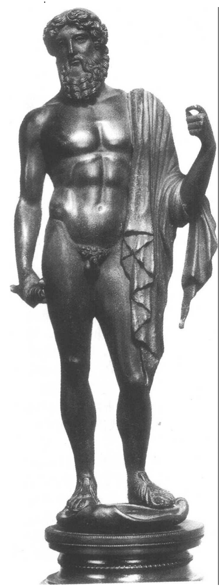
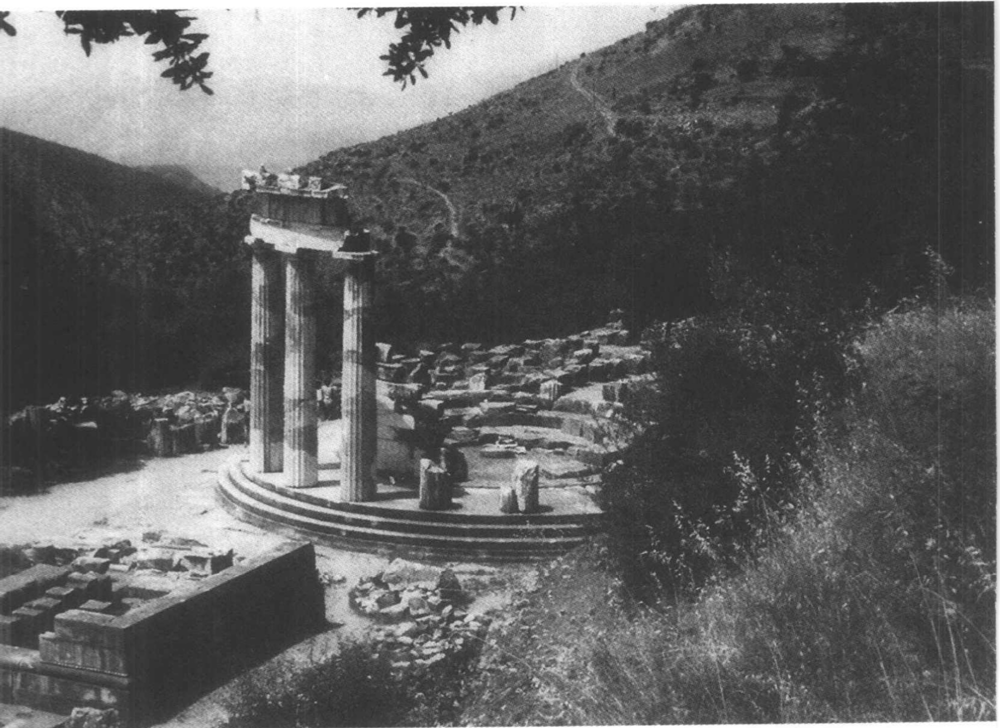
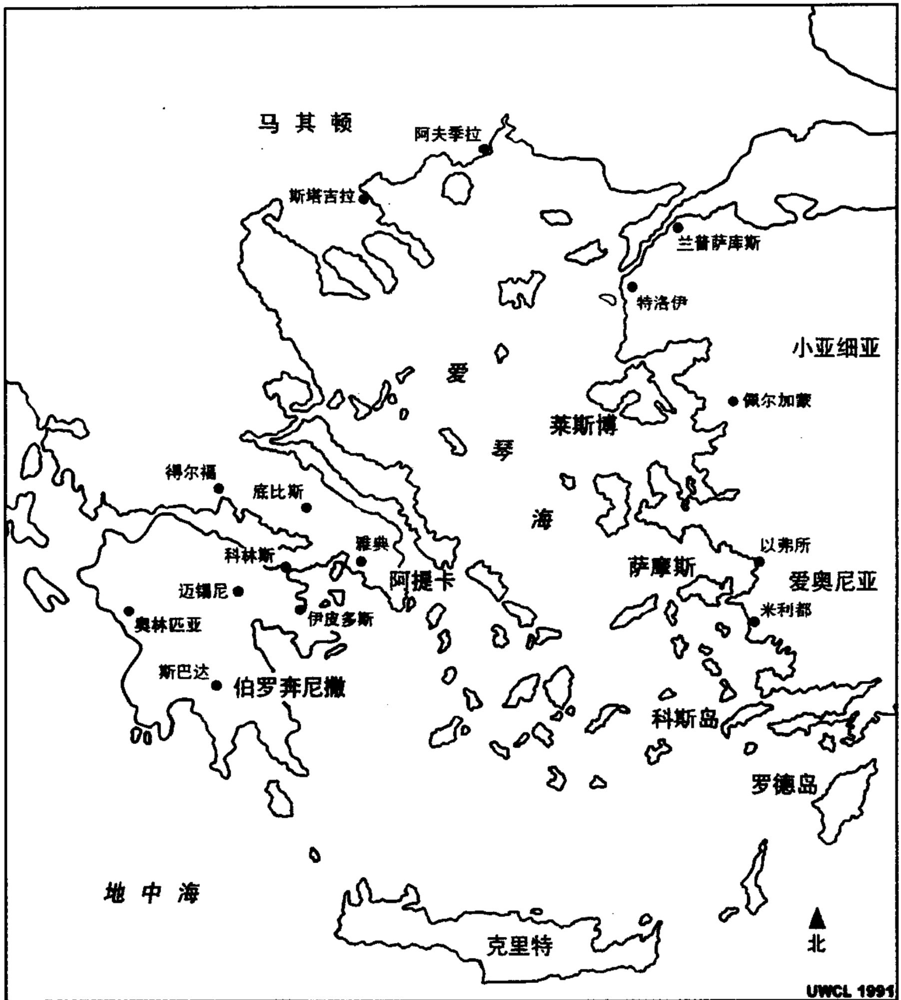
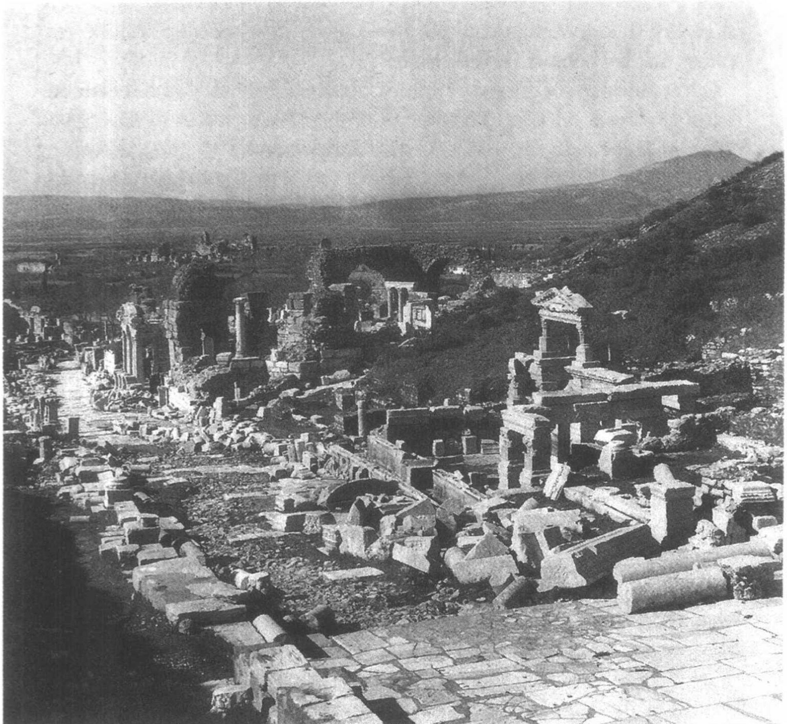
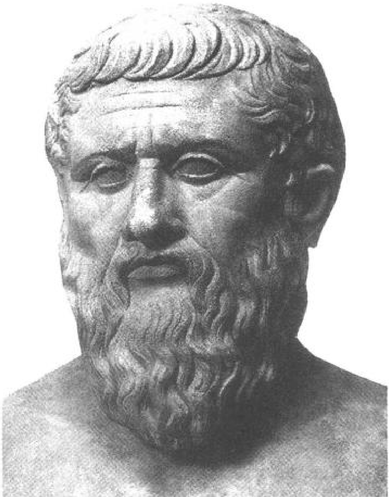
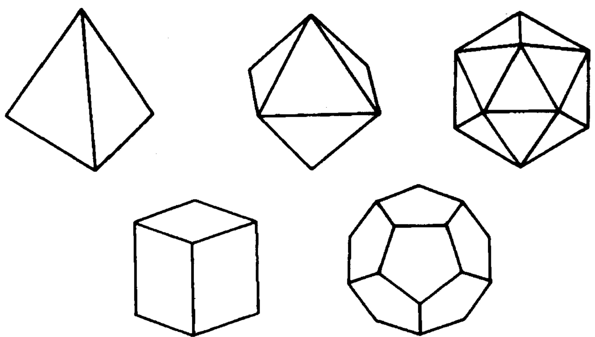
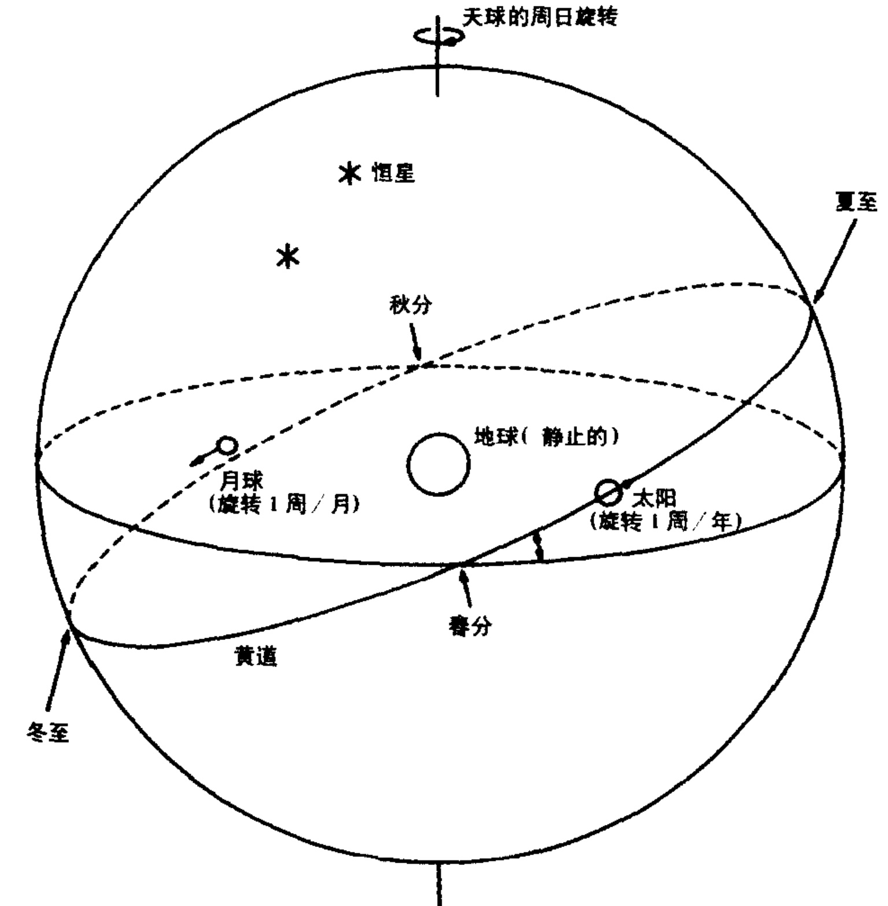

# 第二章 希腊人和宇宙

## 荷马和赫希俄德的世界

对荷马(Homer)这位传说中的两部伟大英雄史诗《伊利亚特》(Iliad)和《奥德赛》(Odyssey)的作者，我们一无所知。这两部史诗叙述了在希腊人和特洛伊之间的特洛伊战争的末期和刚刚结束以后英雄们的冒险经历。它们显然是一个悠久的口头传统的产物，根源可远溯到希腊历史上的迈锡尼时代(Mycenaean Age，公元前1200年以前)。它们好像也受到近东非希腊史诗传统的影响。这两部史诗可能作于公元前8世纪，但它是由一人(荷马)还是多人所写，仍是一件有争议的事情。不论其真正的起源是什么，《伊利亚特》和《奥德赛》成为了古希腊文化和教育的基础，并且仍然是我们评价古希腊思想的内容和形式的一个最好尺度。

我们必须要把活跃于大约公元前8世纪末的赫希俄德(Hesiod)与荷马相提并论。赫希俄德是一位农民之子，他写了两部重要的诗作：《工作与时日》(Works and Days)(在其众多内容中包括一个农耕指南)，和讲述神与世界起源的《神谱》(Theogony)。 $ ^{2} $赫希俄德把众神排在一个宗谱之中，并与荷马一道，确立了他们各自的性格特征和掌管的功能。正是在荷马和赫希俄德的共同影响下，12位奥林匹斯山神被从众多的地方神祇中挑选出来，成为希腊人的神。

---

图 2.1 宙斯的铸像，藏于佛罗伦萨考古博物馆。

---

宙斯(Zeus)是奥林匹斯山众神之一，他被荷马和赫希俄德描绘成最伟大、最有权力的神，是天之主、气候之神、闪电的掌管者、律法和道德的判决者以及万物之父。他的姐妹和妻子赫拉(Hera)掌管着婚礼和姻缘。宙斯的兄弟波塞冬(Poseidon)是海和大地之神，也是风暴和地震的创造者。宙斯的另一位兄弟哈得斯(Hades)是地狱和死亡之神。宙斯的女儿雅典娜(Athena)是战争女神和城邦的保护者，而阿瑞斯(Ares)这位宙斯之子，则是残暴的战争之神。

在荷马的描写中，众神密切地卷入了人类的事务之中，他们决定着胜利、失败、灾祸与命运。《奥德赛》中有神的卷入的各种事例。它的主人公奥德修斯(Odysseus)，因神发怒而遭受海难，被囚禁在女神卡吕普索(Calypso)的岛上长达八年。后来，在宙斯的命令下，他被释放，于是乘船驶向伊萨卡(Ithaca)。然而，波塞冬由于释放奥德修斯一事未与他商量，认出了乘坐在筏上的奥德修斯并决定阻挠他：

他手擎三叉戟，聚起漫天乌云，激起滔天巨浪。他使风暴齐作，乌云遮天蔽日：黑夜骤然来临……波塞冬，地的撼动者，在身后搅起恐怖凄惨的巨浪，然后越过浪尖，直向他击去。

奥德修斯就是这样一路回到家中的，有时得到神的帮助，有时又遭到神的阻挠。 $ ^{3} $

在赫希俄德的《神谱》中，我们看到了一幅简略的世界史，从原初的混沌到宙斯的有序统治。从混沌中产生了该亚(Gaia，胸膛宽阔的大地)和各种其他产物，包括厄洛斯(Eros，爱)、冥界(Erebos，地狱的一部分)和最黑暗的夜。冥界和夜结合产生了白昼(Day)和天(或Aither)。该亚首先生出布满星辰的天空乌拉诺斯(Ouranos)，“遮盖她的每一处并作为被赐福的天神们的永恒不动的根基。她生出高山作为女神们迷人的隐居所，她们住在它布满树木的幽谷中。而且……她生出潘多斯(Pontos)，广阔无垠、汹涌翻腾的大海。” $ ^{4} $该亚(地母)继而与她的后代乌拉诺斯(天父)交配，从这种结合中产生了

---

图2.2 位于得尔福的地母该亚神殿（公元前4世纪）。

俄刻阿诺斯(Oceanus，环流世界的河，是所有其他河流之父)、十二泰坦(Titans)和一大群怪物。最终，十二泰坦之一的克洛诺斯(Kronos)阉割并推翻了他的父亲乌拉诺斯；继而，克洛诺斯又被他的儿子宙斯所废黜。宙斯从独眼巨人(Cyclopes)那里得到了雷电，并用它打败了泰坦巨人，从而建立了自己在奥林匹斯山神中的统治。

即便这个简略的描述，也揭示出荷马和赫希俄德的世界与近代科学世界两者之间的鸿沟。在他们的世界中，拟人化的神干预着人

---

类的事务，而且把人作为实现其阴谋诡计的筹码。这必然是一个反复无常的世界，在其中，由于神的干涉的无限可能性，任何事情也不可能得到可靠的预测。自然现象被人格化和神化了。太阳和月亮被看成是神，是忒伊亚(Theia)和许珀里翁(Hyperion)结合产生的后代。风暴、霹雳和地震不是非人的、自然力量的不可避免的结果，而被认为是神意下的壮举。

我们对此应如何看待呢？古希腊人真认为构成我们称之为“古希腊神话”的那些故事是真实的吗？他们真的相信那些神住在奥林匹斯山上或某个神秘的地方，相互引诱并蛊惑遇到他们的人类吗？难道没有人对风暴和地震产生于神的任性表示怀疑？在前一章讨论史前思想时，我们已经看到，这些问题是多么难以回答。 $ ^{5} $清楚的是，任何用近代科学真理标准去衡量这些信仰的企图，都必然要通向误解。然而，略观当代科学领域以外的信仰，我们可以了解一些东西。当一位政治候选人、军事指挥官或职业运动员为胜利而感谢上帝时，他们是否真的相信胜利的取得是超自然的？答案并不完全明朗，可能随情况而异。但似乎可以肯定，这些公众人物并不是试图要用哲学或科学的方式来处理原因问题，可能他们也从未想到要用哲学或科学的标准来评判他们的主张。出于同样的理由，虽然荷马和赫希俄德的著作似乎也阐述了因果问题，但我们必须明白，这些著作并非要写成科学或哲学论文。荷马和赫希俄德——以及其后的史诗作者——记录英雄们的事迹，是为了教育和娱乐；如果把他们看作失败的哲学家，我们就必然会误解他们的成就。

我们还不能过早地撇开这些古代文献。毕竟，荷马和赫希俄德的著作是我们能够支配的极少数反映远古时代希腊思想的资料来源之一；如果说它们不能代表原始的希腊哲学，但多少世纪以来，它们一直是希腊教育和文化的核心，因而不可能对希腊人的思想没有任何影响。人们所采用的语言和形象影响了他们感知到的实在，这一点是非常清楚的。即使荷马和赫希俄德史诗的内容不像我们相信近代物理学那样得到人们的“相信”，但奥林匹斯山众神的神话（不去谈论地方神的神话）却是希腊文化的一个核心特征，它影响着希腊

---

人的思想、言论和行为方式。

## 最早的希腊哲学家

早在公元前6世纪，希腊哲学就开始出现。这并不像有些人描写的那样，是哲学取代了神话；因为希腊神话并没有消失，而是继续繁荣了几个世纪。更正确地说，是出现了一种新的哲学思维模式，有时与神话并行，有时与之交织在一起。简而言之，荷马和赫希俄德不是哲学家，也没有进行哲学思考。生活在一个神话仍然大行其道的文化里，泰勒斯(Thales)、毕达哥拉斯、赫拉克利特(Heraclitus)等人开始了一种新的理智探求，我们可以称之为“哲学”。

但是，被我们确定为哲学的新的思维模式是什么呢？公元前6世纪，一批思想家开始对他们所生活的世界的本质进行一种严肃的、批判性的探求——这种探求从那时一直延续到现在。他们询问关于它的成份、它的组成和它的运作的问题；他们质询它是由一种还是多种事物组成的；他们探究它的形状和位置并猜测它的起源；他们追求理解事物产生和转化的变化过程；他们沉思地震、日食、月食等异常自然现象，并寻求不仅适用于一次具体的地震或食、而且适用于所有地震或食的普遍性解释；他们开始仔细思考推论和证明的规则。

早期的哲学家不仅提出了一系列问题，他们也寻求新的解答。在他们的讨论中，自然的人格化所占的地位越来越不显著，神从他们对自然现象的解释中消失了。我们已经看到了荷马和赫希俄德的神话方法：在赫希俄德的《神谱》中，大地和天空被看作神的后代。相反，在留基伯(Leucippus)和德谟克利特(Democritus)那里，世界及其各个部分来源于原始涡流中原子的机械分类。晚至公元前5世纪，历史学家希罗多德还保留了很多古老的神话，在其《历史》(Histories)一书中关于神的干涉的传说还随处可见。根据他的描述，波塞冬用汹涌的潮水淹没了波斯人正在穿越的一块沼泽地。而且，希罗多德把一次恰好在波斯军队出发奔赴希腊时出现的日食看成是一个超自然的征兆。而哲学家却对洪水和食提出了完全不同的解释，他们的

---

解释不带有任何超自然干涉的暗示。阿那克西曼德(Anaximander)认为食是天火火圈中缝隙被挡的结果。根据赫拉克利特的看法，天体是盛满火的碗，当碗的开口一面背向我们时，就会产生食。阿那克西曼德和赫拉克利特的理论似乎并不特别精致(在赫拉克利特的观点提出50年后，哲学家恩培多克勒(Empedocles)和阿那克萨哥拉(Anaxagoras)认识到，食仅仅是由宇宙阴影造成的)，但至关重要的是，他们排除了神。这些解释纯粹是自然主义的；食并不反映人的怪念头或神的恣意想象，而仅仅反映了火圈或天碗及其包含的火的性质。

简而言之，哲学家眼中的世界是一个有序的、可预言的世界，事物按其本性在其中运作。用来指称这个有序世界的希腊词是 kosmos（宇宙），从中引申出我们现在所用的“宇宙论”(cosmology)。反复无常的神的干涉被弃置一旁，让位于有序和规则性；宇宙取代了混沌。自然和超自然的区分正在出现；人们普遍同意，应当仅仅从事物的本性中寻求原因（如果是用哲学的方式探求原因的话）。由于他们关注于自然(physis)，这些引入新的思维方式的哲学家就被亚里士多德(Aristotle)称为自然哲学家(physikoi 或 physiologoi)。

## 米利都派与终极实在的问题

这些哲学上的发展似乎首先出现在小亚细亚西海岸的爱奥尼亚（Ionia，今天的土耳其，与希腊大陆隔爱琴海相望；见图1）。希腊殖民者已经在这里建立了以弗所（Ephesus）、米利都（Miletus）、佩尔加蒙（Pergamum）、士麦那（Smyrna）等繁华的城市，它们的繁荣建立在贸易和对当地自然资源的开发之上。像许多边疆社会一样，爱奥尼亚鼓励了辛勤劳动和自给自足；作为回报，这带来了繁荣和机会。这也使希腊人得以接触近东的艺术、宗教和学问，爱奥尼亚与这一地区有着文化、商业、外交和军事上的联系。无疑这些方面的影响是重要的，但关键因素还是全字母文字的出现及其在希腊人中间的广泛传播。结果就是爆发了在抒情诗和哲学上的创造力。

---

地图 1 公元前 450 年的希腊版图。

我们知道的最早的哲学家来自爱奥尼亚南部海岸的米利都城。泰勒斯、阿那克西曼德和阿那克西米尼(Anaximenes)的名字从公元前6世纪，留基伯的名字从公元前5世纪，一直流传到今天。可得的残篇把最早的米利都哲学家泰勒斯描述成一位几何学家、天文学家和工程师。传说他成功地预测了公元前585年的一次日食；然而这个传

---

说的来源并不特别可靠，以希腊天文学在泰勒斯时代所达到的高度，是不大可能作出这种预测的。其他的残篇认为“大地(一个扁平的盘)浮在水上”的理论是泰勒斯提出的，这个观念或许是衡量泰勒斯的天文学和宇宙论的精致程度的一个更准确尺度。

我们对米利都人的了解被资料来源令人质疑和残缺不全的问题所困扰；我们必须带着健康的怀疑精神考察关于早期希腊哲学家的所有断言。然而，看来不容否认的是，他们对基本实在、即组成宇宙或宇宙从中产生的基本质料的问题抱有兴趣。亚里士多德在公元前4世纪(带着他自己的用心，并且他本身也仅仅掌握残篇和间接证据)给我们作了如下叙述：

对于事物首先从中产生，最终复归于它的所有存在物的始源，实体始终存在但其属性不断变化，（最早的哲学家们）断言这是存在物的基本的或首要的原则，并且出于这个理由，他们认为没有绝对的生与灭，因为这样一个自然总是被保持着。 $ ^{8} $

根据亚里士多德的记载，泰勒斯认为水是最基本的实在，尽管亚里士多德仅仅能对泰勒斯作这种选择时的推理进行猜测。

公元前6世纪的其他米利都派哲学家，可能是泰勒斯的学生或弟子(我们并不确切了解他们的生平)，似乎对同样的问题给出了不同的答案。根据大量后来的记载，阿那克西曼德(活跃于公元前550年)相信，事物起源于无定形(apeiron)，即无限或无穷的。按照他的一位现代解释者的说法，就是“一团巨大无穷的、向所有方向无限扩展的东西”。 $ ^{9} $从这个无定形中出现了一个种子，它产生出宇宙。最后，阿那克西米尼(活跃于公元前545年)似乎已经认为，基本的质料是气，它可以被稀释或浓缩，从而产生我们所知世界中的各种物质。值得注意的是，米利都派哲学家是唯物论者和一元论者，即他们把基本实体看成是某种物质质料，并且只是一种。

所有这些看起来可能是原始的。在某种意义上，也确实如此。它

---

们既不能等同于、也不能导引出任何现代理论。但是，拿过去与现在相比，肯定要导致对历史成就的歪曲。当我们拿米利都派与他们直接的前人相比时，他们的重要性立刻就彰显出来。首先，米利都派提出了一种新问题：事物的起源是什么？或者说，能以各种形式产生出我们感知到的多样物质的简单的基本实在是什么？这就是在探求多样性背后的统一性和变化背后的秩序。其次，米利都派给出的答案不包含我们在荷马和赫希俄德那里看到的那种自然的人格化和神化。他们把众神请了出去。我们(在大多数情况下)并不知道他们对奥林匹斯山众神可能有什么想法；但他们并不诉诸神灵来解释事物的起源和本质。第三，米利都派似乎已经意识到，不仅要表述他们的理论，而且还要反驳这些理论的批评者或竞争者。这样，我们就看到了批判性的评价传统的开端。 $ ^{10} $

米利都派对基本质料的思索仅仅是持续到今天的探求活动的开始。在古代，米利都派以后出现了各种思想流派。50年后，以弗所（一个离米利都不远的爱奥尼亚城市）的赫拉克利特（活跃于公元前500年）把事物的起源与火联系起来：“既不是神也不是人创造了这一世界秩序，它在过去、现在和未来永远是一团永恒的火，点燃几分，熄灭几分。” $ ^{11} $ 在公元前5世纪下半叶时，公元前6世纪的唯物论被原子论者米利都的留基伯（活跃于公元前440年）和阿夫季拉（Abdera）的德谟克利特（活跃于公元前410年）接受并发展了。留基伯和德谟克利特认为，世界由在一个无限虚空中随意运动的无数微小原子所组成。这些原子是小到无法看到的固体粒子，有无穷多种形状；他们用这些原子的运动、碰撞和暂时的排列，解释我们所经历的实体和复杂现象的多样性。留基伯和德谟克利特还试图解释世界是如何从原子的旋涡或涡流中形成的。 $ ^{12} $

原子论者也对其他许多自然现象提出了天才的解释，但我们一定不能偏离主要的问题。关于原子论者，重要的是，他们把实在看作一架无生命的机器，其中发生的任何事情都是惯性和物质性的原子按其本性运动的必然结果。没有精神或神侵入这个世界。生命本身被还原为惯性粒子的运动。他们也没有为目的或自由留下空间，只

---

图 2.3 古代以弗所遗址。SEF / Art Resource N. Y.

留下铁的必然性统治着世界。这种机械论的世界观将会在柏拉图(Plato)和亚里士多德以及他们的追随者那里失宠；但它在17世纪又彻底地(带着一些新的变化)回来了，从那时起，它就一直是科学讨论中一股强大的力量。

并不是所有考察基本质料的人都是一元论或唯物论者，而且并

---

不是所有的神都不存在于他们的解释中。阿克拉格斯(Acragas)的恩培多克勒(活跃于公元前450年)，是一个与公元前5世纪下半叶的留基伯大致同时代的人，他确立了所有物质的四种元素或“根”(他这样称呼它们)：火、气、土、水(以神话形式出现时，它们分别是宙斯、赫拉、冥王和冥后)。恩培多克勒写到，从这四根之中“产生出所有过去、现在和将来都存在的事物，树木、男人女人、野兽、鸟和水生的鱼，以及享有至高特权的长命的神。因为这些东西存在，通过相互渗透，它们就产生了许多形状。” $ ^{13} $但是，只有物质性的组成成分还不能解释运动和变化。因此，恩培多克勒引入了另外两个非物质性原则：爱与斗(love and strife)，它们引致了四根的结合或分离。

恩培多克勒并不是惟一把非物质性原则包含在基本实在中的古代哲学家。公元前6世纪和5世纪的毕达哥拉斯派（主要集中在意大利南部的希腊殖民地，他们不是以单个人而是以一个思想“流派”而为人们所知）似乎已经认为（如果我们理解了他们的学说的话），终极实在是数的而非物质性的，即它们不是物质，而是数。亚里士多德讲述说，毕达哥拉斯派在研究数学的过程中，被数解释音阶等现象的能力震撼了。根据亚里士多德的记载，“由于……所有其他事物的整个本质似乎都摹仿着数，并且数似乎是自然中最早的东西，所以他们就推想数的元素就是万物的元素，并且整个天就是一个音阶和一个数。” $ ^{14} $ 这是一段令人费解的文字，我们的不确定也来自于亚里士多德可能并没有充分理解毕达哥拉斯派的学说或没有完全公正地对待它。毕达哥拉斯派是否完全相信物质性的东西就是由数构造出来的？或者，他们仅仅是要声称，物质性的东西有一个基本的数的属性，通过这种属性就可以洞见事物的本质？我们永远也不会知道确定的答案。对毕达哥拉斯派的观点，一种明智的理解是：在某种意义上，数首先出现，其他所有事物都是它们的产物；在这种意义上，数就是基本实在，物质性的东西从数中获得它们的存在，至少获得它们的属性。如果更谨慎一些，至少我们还可以断言：毕达哥拉斯派把数看作实在的一个根本方面，而把数学看作探究这种实在的一个基本工具。 $ ^{15} $

---

## 变化问题

如果说公元前6世纪最突出的问题是这个关于世界起源和基本组成的问题，一个与此相关的问题却开始在公元前5世纪的哲学事业中占据主导地位。当我们真的发现了世界的基本成分时，我们会怀疑它们是不变的这一观点吗？似乎不会：被认为是终极实在的东西如果改变了形式或产生、消失了，它们还会被判定为是真正的终极吗？我们是不是会用甚至更终极的实在来解释这个实体中的变化呢？在解释的尽头，必定有某些东西是固定不变的。而如果我们同意终极实在一定是不变的，我们还能够解释或能够接受变化的真实性吗？在终极实在层面上的不变性与其他层面上的真实变化能够并立共存吗？世界怎样才既是不变的又是变化的呢？

最早表述这个问题的哲学家是赫拉克利特，他毫不含糊地断言了变化的真实性。赫拉克利特因宣称无人能两次踏入同一条河流（因为第二次踏进的河流与第一次已不再完全相同）而著称于世，这句格言使得他甚至在古代就已成为“万物皆变”这种观点的代表。赫拉克利特还认为，一种整体上平稳或稳定的状态可能隐藏着表现为各种力量的均衡或对立面的斗争的根本变化。例如，在物质土、水、火之间就存在着永恒的斗争，每一方都尽力消耗其他各方，然而，通过整体上的均势或互动，就实现了动态的平衡。 $ ^{16} $

赫拉克利特所肯定的东西正是巴门尼德(Parmenides，活跃于公元前480年，来自意大利南部的希腊城邦爱利亚(Elea))要否定的。巴门尼德写了一部长篇哲理诗(哲学还没有把散文固定为其惟一的论说形式)，该诗的大部分保留了下来。在这篇诗作中，巴门尼德采用了一种激进的观点：变化——所有变化——在逻辑上是不可能的。用各种合乎逻辑的理由，巴门尼德首先否认了一种事物从无到有的可能性。例如，如果一事物要生成，为什么是在此一时刻而非彼一时刻？通过什么方式生成？他的结论是，从无中只能产生出无。他写到：“从来不能证明，存在的东西却不存在。” $ ^{17} $以类似的理由，巴门尼德进

---

一步否认所有其他形式的变化。他还否认了时间和多的存在；认为存在着的只有一和现在。

巴门尼德的学生芝诺(Zeno，活跃于公元前450年)，以一系列证明来反驳一种变化——运动，即位置的变化——的可能性，拓展并捍卫了巴门尼德的观点。这些证明之一，即“运动场悖论”，可以说明芝诺所采用的方法。芝诺论证道，穿越一个运动场是不可能的，因为在跑完所有路程之前，你必须跑完全程的一半；而在跑完这一半之前，你必须先跑完四分之一；在跑完四分之一之前，必须先跑完八分之一；以此类推以致无穷。因此，要穿越一个运动场就是要穿越一个无穷二等分序列，而在一个有限的时间里穿越或者“接触”(这是亚里士多德在讨论该悖论时所用的表述)无穷个间隔是不可能的。同样的论证可以应用于任何空间间隔，从中得出，所有运动都是不可能的。 $ ^{18} $

所有这些看起来似乎都是不合情理的。只要稍稍努力，巴门尼德和芝诺就能睁开眼睛看到身边的各种变化。难道他们不是早上起床，享用一顿美妙的早餐，然后赶去集会所(公共广场)开始一天艰辛的哲学思考？难道他们没有发现要做这些事情他们就必须运动？毫无疑问，巴门尼德和芝诺非常了解经验能告诉他们些什么，但是问题在于经验是否可以依赖。如果经验表明变化是真实存在的，而仔细的论证(关注逻辑规则)却清楚地表明了变化的不可能性，那么该如何是好呢？对巴门尼德和芝诺来说，答案显然是：理性过程必定是胜利者。巴门尼德区别了与观察相关的“表象之路”和理性所循的“真理之路”。他在他的诗中警告说，不要让“习惯这一大量经验的产物，迫使你漫无目的的眼睛、随声附和的耳朵或你的舌头沿着这条路游荡；而是要用理性来裁定包围在杂乱中的那种我已经说过的证据。” $ ^{19} $ 因此，巴门尼德和芝诺也承认：是的，经验告诉我们，变化是真实存在的。但他们在理性的基础上知道这是一种幻觉——可能是一个赏心悦目的、强烈的幻觉，但不过就是个幻觉而已。

4 巴门尼德对变化的可能性的否定有着巨大的影响，它给好几代哲学家提出了无法回避的挑战。恩培多克勒用他的四元素或四

---

“根”、加上爱与斗的理论作了回答。元素既不产生也不消亡，这样就满足了巴门尼德的基本要求；但它们确实会聚合、分离和以不同的比例相混合，这样，变化就是真实存在的。原子论者留基伯和德谟克利特承认，单个原子是绝对不变的，所以在原子层次上，没有任何形式的生与灭或变化。然而，原子在永恒地移动、碰撞和聚合着；通过原子的各种运动和排列，就产生了感觉世界中的无限多样性。因此，根据原子论者的看法，根本性的不变是表面变化的基础；两者都存在，并且两者都是真实的。 $ ^{20} $

## 知识问题

除了这些关于基本实在、变与不变问题的讨论，还有第三个基本问题——关于知识的问题(更专业的名称为认识论)，早期希腊哲学家们也阐述过这一问题。它隐含在对感觉揭示出的各种事物背后的根本实在的探求中：如果说感觉没有显现出事物的统一性，那么我们必须寻找通往真理的其他向导。知识问题在公元前5世纪关于变与不变的讨论中表现得很明确。巴门尼德在变化问题上的激进立场具有清晰的认识论蕴含：如果感觉揭示了变化，这就证明了感觉的不可靠性；真理只有运用理性才能获得。原子论者也倾向于贬低感觉经验。在他们看来，毕竟，感觉揭示的是“第二”属性，即颜色、味道、气味和触觉属性，而理性告诉我们，只有原子和虚空才真实存在。在保留下来的一个残篇中，德谟克利特定义了“两种形式的知识，一种是真正的知识，另一种是含混不清的知识。所有下面这些都属于含混不清的知识：所见、所闻、所嗅、所品、所触”。 $ ^{21} $这一思想尚未阐述完整，该残篇就中断了，但我们可以推想，在德谟克利特看来，真正的知识是理性的知识。

如果说早期的哲学家倾向于认为理性胜过感觉，那么这种倾向既不是普遍的，也不是毫无限制。恩培多克勒反驳了巴门尼德对感觉的抨击。他论证说，感觉可能并不完美，但如果有鉴别地加以利用，感觉却是有用的向导。“但是，来，用你的全部能力去思考每一

---

35 事物是怎样变得明显的，”他写到，“既不要认为看到的比听到的更值得信任，也不要大声宣扬你听到的比你舌头上的清晰感受更好，也不要拒绝你对感觉的信任，无论哪儿，都有一条理解之路。”克拉索门尼(Clazomenae，爱奥尼亚的另一海岸城市)的阿那克萨哥拉(活跃于公元前450年)在一个简短的残篇中说，感觉为我们提供了“对含混不清的事物的一瞥”。 $ ^{22} $

希腊人的认识论关怀(特别是古希腊的理性主义)带来的一个有益之处是，他们把注意力投向了推理规则、论证和理论评价。形式逻辑将是亚里士多德的创造；但在公元前6世纪和5世纪，他的前人们已经日益意识到了，验证一个论据的健全性和评价一个理论需要依赖根据。巴门尼德和芝诺的论证的精致性，比如，他们对推论规则和证明标准的敏感，展现出在一个半世纪里希腊哲学家迈出了多么大的步伐。

## 柏拉图的相世界

苏格拉底(Socrates)死于公元前399年，正好是在世纪之交(当然不是按照他们的日历，而是按照我们的日历)，他的死成为古希腊哲学史上一个便利的分界点。这样，公元前6世纪和5世纪苏格拉底的前人们(本章前面讨论过的所有哲学家)就被统称为“前苏格拉底哲学家”。但苏格拉底的突出不只是作为一个日历事件。苏格拉底代表了古希腊哲学重点的转移，从公元前6世纪和5世纪的宇宙论关怀转向了政治和伦理问题。虽然如此，这种转移并未剧烈到使人们不再继续关注苏格拉底以前的那些主要问题。在苏格拉底年轻的朋友和学生柏拉图的著作中，我们同时可以发现新、旧两种问题。

柏拉图(公元前427-348或347年)出生于一个雅典世家，他热衷于国事；无疑，他亲眼目睹了导致苏格拉底被处死的那些政治事件。苏格拉底死后，柏拉图离开雅典，游历意大利和西西里，在那里他似乎已经接触到了毕达哥拉斯派的哲学家们。公元前388年，柏拉图回到雅典开办了自己的学校，即(柏拉图)学园，在这里，年轻人可

---

以从事高级的研究(见图 4.2)。柏拉图的作品差不多全部由对话录组成，其中大部分保留了下来。我们将会发现，对柏拉图哲学的考察必须有高度的选择性，让我们首先从他对基本实在的探究开始吧。 $ ^{23} $

在他的一篇对话录《理想国》(Republic)中，有这样一段，柏拉图反思了木匠制造的实际桌子和他头脑中对于一张桌子的观念或定义两者间的关系。木匠在他制造的每一张桌子中，尽可能精确地摹仿心灵观念，但这种摹仿总是不完美的。没有两张桌子可以在最细微的地方一模一样，材料的限制(例如，这里一块节疤，那里一块翘起的木板)使得没有一张桌子能完全达到理想的情况。

柏拉图认为，有一个神匠，他与宇宙的关系就如同木匠和桌子的关系。这个神匠(造物主(Demiurge))按照一个理念或计划构建了宇宙，因此，宇宙和其中万物都是永恒的理念或相的复制品(并且由于材料的内在的局限性，它们总是不完美的复制品)。简而言之，存在着两个世界：一个理念的或相的世界，包含着任何个别事物的完美理念；和物质的世界，这些理念或相在此得到了不完满的复制。

柏拉图的两个不同世界的观念在很多人看来很奇怪，因此，我们必须强调几个要点。相是非实体、无形状和不可感觉的；它们总是存在着，与造物主一样享有着永恒性；而且，它们是绝对不变的。它们包括物质世界中万物的形式，即完美的理念。人们无法说出它们的位置，因为它们是非实体的并因而是非空间性的。虽然它们是非实体和不能被感知的，但它们客观存在；的确，真正的实在（完全的实在）只存在于相世界中。相反，可感的、有形的世界是不完美和短暂的。实体是相的复制品，因此它的存在依赖于相，在这个意义上，它具有更少的真实性。有形物体的存在是第二位的，而相的存在则是第一位的。

柏拉图在其著名的“洞喻说”中阐明了这种实在观。“洞喻说”见于《理想国》的第七篇。一些人被囚禁在一个深深的洞穴中，受链条所缚，他们不能转动自己的头。在他们身后有一面墙壁，墙壁后面有一团火。人们在墙下走来走去，墙上放置各种东西，包括人和动物的雕像，它们在囚徒们可以看得到的墙壁上投下阴影。囚徒

---

图 2.4 柏拉图（公元 1 世纪的复制品），藏于梵蒂冈城，梵蒂冈博物馆。Alinary / Art Resource N. Y.

我们看到的仅仅是这些雕像和其他物体的投影；而且，他们从小就生活在洞窟中，记不起任何其他的实在。他们不会猜想这些影子是他们所不能看到的物体的影像；而是错把影子当作真实的东西。

柏拉图说，我们也是这样。我们是被囚禁在肉体之中的灵魂。寓言中的阴影代表了感觉经验的世界。灵魂，从它的囚所，向外凝视着，它能感知到的只是那些闪烁不定的阴影，无知的人却宣称这些阴影就是实在。然而，确实存在着雕像和其他的物品，这些阴影只是它们的微弱的表现；也确实存在着人和动物，这些雕像就是他们的不完美的复制品。为了达到更高的实在，我们必须摆脱感觉经验的束缚，爬出这个洞穴，直到最终发现我们自身能够看到永恒的实在，从而进入真知的世界。 $ ^{24} $

---

这些看法对于前苏格拉底哲学家所关注的问题具有什么涵义呢？首先，柏拉图将他的相等同于基本实在，而将可感物的有形世界确定为派生性的或第二性的存在。其次，通过将变与不变确定为实在的不同层次，柏拉图就给变与不变都留下了空间：有形世界呈现出的是一幅不完美和变化的图景，而相的世界则以永恒不变的完满为特征。因此，变与不变都是真实的，都是事物的特征；但不变属于相的世界，从而享有更大的实在性。

第三，正如我们已经看到的，柏拉图也阐述了认识论问题，把观察和真正的知识(或理解)对立了起来。感觉绝不是要把我们引向知识或理解，相反，感觉是限制我们的锁链；哲学的反思才是通往知识之路。这种观念清楚地反映在《斐多篇》(Phaedo)中，在这里，柏拉图坚持认为感觉对于获取真理没有助益，并指出，当灵魂试图借用感觉时，它就不可避免地要蒙受欺骗。

对柏拉图认识论的简短描述常常就在这里结束；但有一些重要的条件，如果遗漏它们就是一个严重的错误。事实上，柏拉图并不像巴门尼德所做的和《斐多篇》中的段落可能暗示的那样，完全否认感觉经验。在柏拉图看来，感觉经验有各种有用的功能。首先，感觉经验可以提供有益健康的消遣。其次，对某些可感物体（尤其是那些具有几何外观的物体）的观察可以将灵魂引向世界中更高贵的对象；柏拉图用这个论证为从事天文学研究作了辩护。第三，柏拉图（在他的回忆说中）认为，感觉经验可以实际唤起记忆，使灵魂回想起它在一种超验的存在中了解的相，这就促进了一种反思的过程，它将导向对相的真正认识。最后，虽然柏拉图坚信关于永恒的相的知识（是一种最高级的、也许是惟一真实的知识）只有通过运用理性才能获得，但可变的物质世界也是一个适当的研究对象，这种研究提供了宇宙中运用理性的典范。如果说这就是使我们感兴趣的东西（正如它有时引起了柏拉图的兴趣），那么探究的最好办法肯定是通过观察。显然，在《理想国》中柏拉图也暗示了感觉经验的正当性和实用性，在这里柏拉图承认，一个从洞穴中走出来的囚徒首先是用他的视觉来认识生灵、星辰，最终理解最高贵的（物质性的）可见物——

---

太阳。然而如果他渴望理解“根本性的实在”，他就必须要“沿着没有任何感觉帮助的理性”向前摸索。因此，理性和感觉都是应当掌握的工具；在具体情况中该采用哪种工具将取决于研究的对象。 $ ^{25} $

当柏拉图把相看作实在时，他实际上是将实在等同于一类事物共有的属性。实在的真正承受者既不是(例如)这只低垂着左耳的狗，也不是那只狂吠的狗，而是每只个别的狗(不完美，却是真实的)所共有的一只狗的理想化形式。因此，为了获得真正的知识，我们必须抛开事物作为个体所特有的性质，而寻求它们共有的、使它们成为一类的那些属性。用这种温和的方式来表述，柏拉图的观点就具有了明显的现代意味：理想化是许多近代科学的一个突出特征；我们发展出了注重本质而忽略偶性的模型或法则。(例如，伽利略的惯性原理就是试图描述理想状况下的运动，所有的阻力和干扰都被排除了。)然而，柏拉图比这走得更远，他不仅认为真正的实在存在于一类事物共有的属性中，而且认为这些共有的属性(理念或相)就是客观、独立和真正先验的存在。

## 柏拉图的宇宙论

我们正在考察的那些学说——柏拉图对前苏格拉底哲学家的反应，见于《理想国》、《斐多篇》和其他各种对话录——仅代表了他整个哲学的一小部分。柏拉图还写了一篇对话录《蒂迈欧篇》(Timaeus)，该篇显露出他对自然界的兴趣。在这里，我们能找到他在天文学、宇宙论、光与色、元素，以及人体生理学方面的观点。由于《蒂迈欧篇》是传到早期中世纪(12世纪以前)的惟一一部连贯的自然哲学著作，它就代表了柏拉图影响的一个主要渠道，因此我们应予以重视。

柏拉图把《蒂迈欧篇》中的内容说成是一个“可能的故事”，这已经误导一些读者将它看作一个神话，认为其中没有柏拉图自己的任何思想。实际上，柏拉图很清楚地说过，这是可能的最好解释，而超出一个可能的解释的东西都要被主题排除在外。只有当我们解释了永恒不变的相时，确定性才可能实现；而当我们描述不完美的、可

---

变的事物时，我们的描述就不可避免地也要带有被描述对象的不完美性和可变性——因此，它顶多只是“可能的”描述。

我们在《蒂迈欧篇》中发现了什么？它最引人注目的一个特征是，柏拉图强烈反对前苏格拉底哲学思想中的某些特征。自然哲学家已经剥夺了世界的神性；在这个过程中，他们也使它不再是有计划和有目的的。按照这些哲学家的说法，事物按照它们内在的本性运作，他们仅仅以此来解释宇宙的秩序和规律性。秩序是内在的，而不是外在的；它不被外部作用者所强加，而是来自于内部。

但柏拉图发现，这样一种观点不仅愚蠢，而且危险。他并无意请回那些干预宇宙日复一日运作的奥林匹斯山众神，但他坚信，宇宙的秩序和合理性只能被解释为由一个外在的精神所施加。如果说自然哲学家是从自然中找到了秩序的来源，那么他将把它定位于精神之中。 $ ^{26} $

柏拉图把宇宙描述为一位神匠即造物主的手工品。按照柏拉图的观点，造物主是一个仁慈的工匠、一位理性的神（实际上这恰恰是对理性的人格化），他努力克服质料的内在局限性，因为他必须使用这些质料来创造一个尽可能善美和理智上充分的宇宙。造物主面对着一个原初的混沌，它充满了尚未被赋予形式的物质，从中他构造出了宇宙，他按照一个理性的计划使其具有了秩序。这不像犹太教-基督教的创世说那样，是从无中的创造，因为原始材料已经存在并包含了造物主无法控制的性质；造物主也不是万能的，因为他要受他面对的材料的制约和限制。然而，柏拉图显然想要把造物主描绘成一个超自然的存在，区别于并且外在于他所建造的宇宙。柏拉图是否想让他的读者按他的文字内容来理解造物主，这是另一回事，有很多争论，或许不可能一劳永逸地解决它。但无可争论的是，柏拉图认为宇宙是理性计划的产物，宇宙中的秩序就是理性的秩序，从外部强加给不顺从的质料。

这个造物主不仅是理性的工匠，而且也是一位数学家，因为他按照几何原理构造了宇宙。柏拉图接受了恩培多克勒的四根或四元素：土、水、气、火。但受毕达哥拉斯派的影响，他将它们还原为

---

更基本的东西——三角形。他就这样系统地阐述了一个“几何原子论”。作为二维图形，三角形当然是非实体的；然而，如果适当组合，它们就能组成三维粒子，每个不同的形状对应一种元素。在柏拉图时代，人们已经知道，存在而且只存在五种几何正多面体（就是由完全相同的平面组成的对称几何体），它们是：四面体（四个等边三角形）、立方体（六个正方形）、八面体（八个等边三角形）、十二面体（十二个等边五边形）和二十面体（二十个等边三角形）。柏拉图将每种元素与这些图形中的一种联系起来——火与四面体（最小、最锐利和最易变动的正多面体），气与八面体，水与二十面体，土与最稳定的正多面体，即立方体。最后，柏拉图把十二面体（最接近球体的正多面体）等同于整个宇宙。 $ ^{27} $

41 这一体系的三个特征值得我们讨论。首先，它用与恩培多克勒的理论相同的方式解释了变化和多样性：元素以不同的比例混合，产

图 2.5 五个柏拉图正多面体：正四面体、正八面体、正二十面体、立方体和正十二面体。承蒙 J. V. Field 惠准。

---

生出物质世界的种类。其次，它允许一种元素向另一种元素转化，这样就进一步解释了变化。比如，一个单个水粒子(二十面体)可被分解为组成它的二十个等边三角形，这些三角形又可重新组合成两个气粒子(八面体)和一个火粒子（四面体）。只有土，由于是由正方形构成的(并且由于正方形沿对角线不能产生等边三角形)，被排除在这种转变过程之外。第三，柏拉图的几何粒子代表了向自然的数学化迈出重要一步。对我们来说，看看这一步究竟有多大，具有重要意义。柏拉图的元素并不是被包装成正多面体的物质性实体；在这样的体系中物质仍然会被看作基本质料。对柏拉图来说，所有的存在就是形状；粒子可以被完全还原(毫无残留)成正多面体，而它们又能够还原为平面几何图形。水、气和火不是三角形的物体；它们就是三角形。毕达哥拉斯派将任何事物还原为数学第一原理的纲领已经实现。

柏拉图接着描绘了宇宙的许多特征，让我们对其中一些作个快速浏览。柏拉图展示了他对天文学和宇宙论的精深造诣。他提出大地是球形的，被球形的天包围着。他在天球上定义了各种圆，标绘了太阳、月亮和其他行星的路径。他认识到太阳在一条相对于天球赤道的倾斜的圆（我们称之为黄道）上每年绕天球一周（见图2.6）。他知道月亮在大致相同的轨道上每月绕行一周。水星、金星、火星、木星和土星也同样如此，它们分别有各自的速度，偶尔也会逆运动，而且水星和金星从未远离太阳。他甚至知道这些行星体的整体运动（如果我们把它们沿黄道的缓慢运动和天球的周日旋转结合起来）是螺旋形的。可能最重要的是，柏拉图似乎已经认识到，行星运动的不规则性可以用匀速圆周运动的组合来解释。 $ ^{28} $

当柏拉图把目光从宇宙落向人体时，他解释了呼吸、消化、感情和感觉。比如，他有一个视觉理论，设想从眼中发出的视觉的火与外界的光相互作用，产生一条视觉路径，能将运动从可见物体传送给观察者的灵魂。《蒂迈欧篇》甚至还提出了一种疾病理论，大致描述出一种保证健康的养生法。

柏拉图描绘的是一个绝妙的宇宙。它最突出的特征是什么呢？用

---

图 2.6 柏拉图描绘的天球。

三角形和正多面体，造物主构建了一个具有最高合理性和美的最终产物；按照柏拉图的看法，这意味着宇宙必定是一个生灵。我们在《蒂迈欧篇》中读到，造物主“希望尽可能把世界建造成那个最好的、在每个方面都圆满的、易于领悟的东西，于是就将其造为惟一的可见的生灵”。但如果这个世界是一个生灵，它就必须有一个灵魂。确实如此。在宇宙的中心，造物主“设置了一个灵魂，并使它延展到整个宇宙，并进一步用灵魂将整个宇宙包裹起来；这样，他只建造了一个世界，它是圆的并绕着一个圆圈旋转，孤单但因为它的卓越而能以己为伴，不需任何其他相识者或朋友而是自足的”。这一世界灵魂是宇宙中所有运动最终的原因，正如人体的灵魂掌管着人体的

---

运动一样。在这里我们看到了强烈的泛灵论表现，它将成为柏拉图传统中的一个重要特征。出于对原子论世界那种死寂的必然性的反感，柏拉图描绘了一个有生气的宇宙，它渗透着理性，充满着目的与设计。 $ ^{29} $

柏拉图的宇宙论中并非没有神的存在。当然，造物主是存在的；但此外，柏拉图还使世界灵魂具有了神性，并把行星和恒星看作一群天神。然而，不像传统希腊宗教中的神，柏拉图的神从不干扰自然进程。恰恰相反，在柏拉图眼里，正是神的稳定保证了自然的规律性；太阳、月亮和其他行星必定以匀速圆周运动的某种组合而运动，这完全是因为这些运动是最完美、最理性的，因而这些运动是神惟一可以想象的运动。这样，柏拉图重新引入神并不代表向荷马世界的不可预测性的回归。恰恰相反，对柏拉图来说，神的功能是巩固和解释宇宙的秩序与合理性。柏拉图恢复神的目的正是为了解释宇宙的特征，而按照自然哲学家的观点，这个宇宙要求放逐神。 $ ^{30} $

## 早期希腊哲学的成就

如果我们用近代科学的眼光纵览早期希腊哲学，某些篇章似曾相识。对于宇宙的形状和排列、它的起源、或它的基本成份，前苏格拉底哲学家的研究使我们想起现代天体物理学、宇宙学和粒子物理学中仍在研究的问题。然而，早期哲学的其他部分却相当陌生。今天，那些孜孜不倦的科学家不再探究变化是否逻辑上可能，或在哪里可以找到真正的实在。那么，谁要还能找到有哪位物理学家和化学家尚在操心如何平衡各自对理性和观察的主张，可算是一个不小的功绩。这些事情再也不被科学家所谈论了，但这是否意味着，那些穷其一生研究这些问题的早期哲学家是“非科学的”，甚至可能是被误导或智力愚钝的呢？

这个问题需要小心对待。早期自然哲学家肯定是关注了某些我们不再感兴趣的事情，但不应用这一事实来讨伐他们一生的事业；在任何理智探索的过程中，总是有些问题得到了解决，而其他问题却

---

过时了。但反对意见可能会更进一步：是否存在本来就是不适当或不合理的问题，即一开始就是无意义的问题？柏拉图和那些自然哲学家是否在这些问题上浪费了时间？我们也许可以这样来回答。诸如终极实在为何物、自然与超自然的区别、宇宙秩序的来源、变化的本质和知识的基础等主题，这些问题截然不同于几个世纪以来吸引科学家的对具体观察结果（比如重物下落、化学反应和心理过程）进行解释；但不同并不等于不重要。至少直到伊萨克·牛顿为止，这些大的问题与充斥在现今大学的自然科学课程中的各种问题一样，要求自然研究者给予同等的关注。这些问题是有趣的也是根本性的，这完全是因为它们构成了为考察世界而创立一个观念体系和词汇表的努力的一部分。它们是关于基础的问题；而基础问题的命运通常会被后来那些将基础想当然的人们看成是没有意义的。例如，今天我们可以发现自然和超自然的区别显而易见；但在能够仔细作出这种区别之前，对自然的研究就不能正确地开展。

因此，早期哲学家是从惟一可能的地方开始了他们的探索，这就是起源。他们创立了一种自然观，诸多世纪以来，它一直是科学研究和信仰的基础——这种自然观，或多或少也成为了近代科学的预设。同时，他们提出的很多问题已经被解决——虽然通常只是得到了简陋而不是确定的解决，但已经解决得足以不再成为科学关注的前沿问题了。当它们从人们视野中消失时，它们的位置就被一批更细致的研究所代替。我们如果想要理解这一科学事业的丰富性和复杂性，就一定要看到它的两个组成部分——基础和上层结构——是互补互惠的。近代的实验室研究发生在一个宽泛的观念体系内，没有对自然或基本实在的预期，它甚至无法起步；反过来，实验研究的结果又使我们对这些最基本的观念进行反思，促使它们得到精炼和(偶然的)修正。历史学家的任务就是要欣赏这一事业的各个方面。如果说自然哲学家的花园位于通往现代科学之路的开端，那么科学史家在开始旅程之前，可以先在它阴凉的角落里作一番有益的流连。