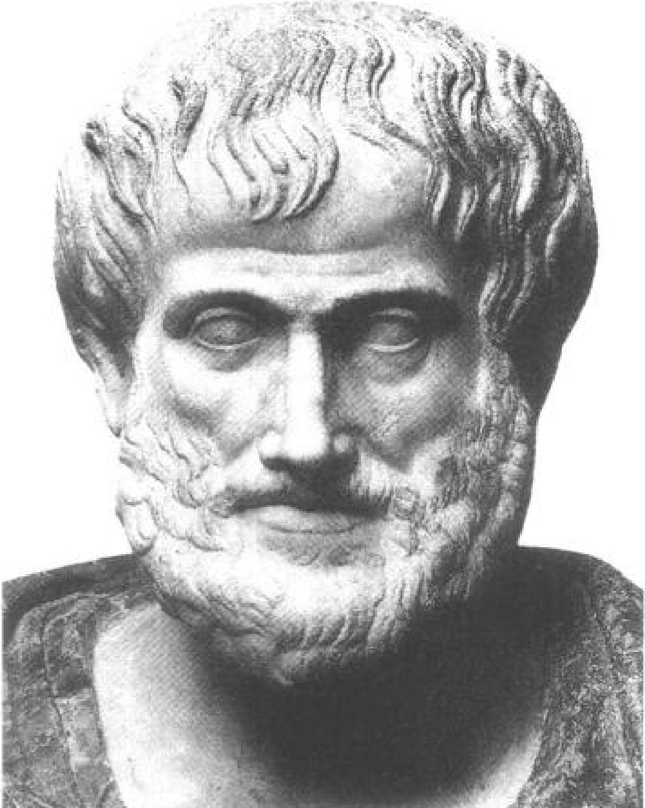
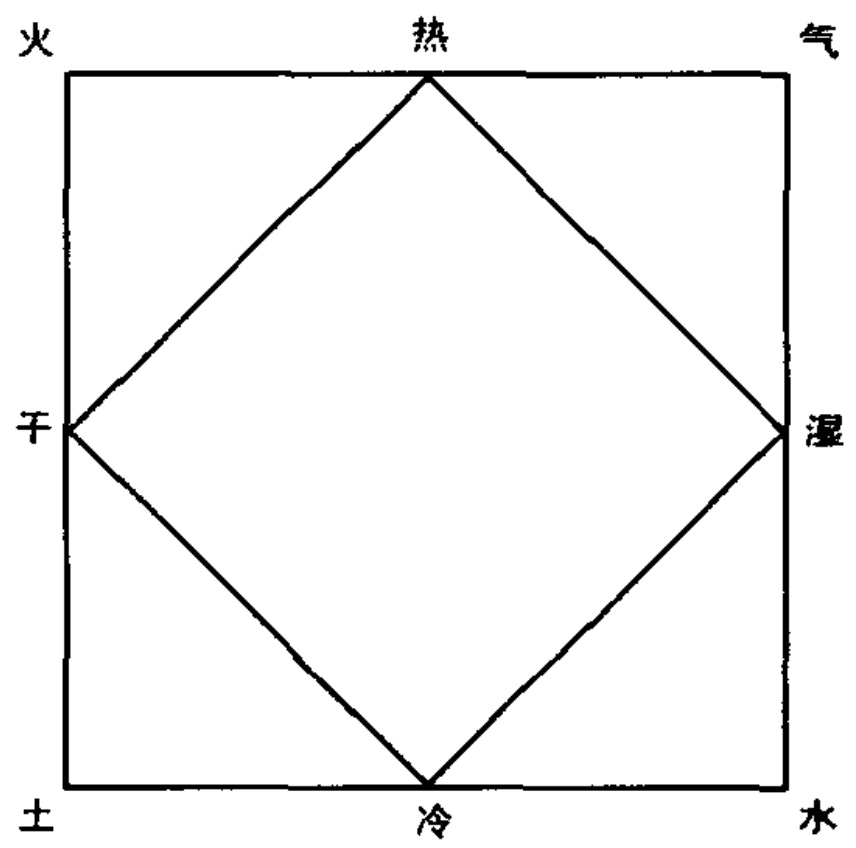
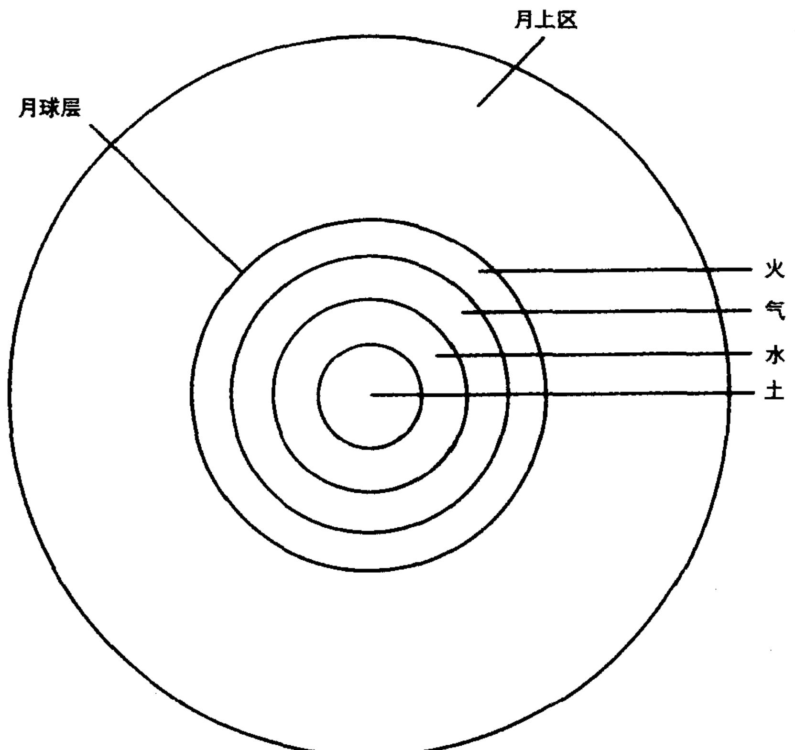

# 第三章 亚里士多德的自然哲学

生平和著作

公元前384年，亚里士多德出生于希腊北部城镇斯塔吉拉(Stagila)的一个特权家族。他的父亲是马其顿(Macedon)王阿敏塔斯二世(Amyntas II，亚历山大大帝的祖父)的御医。亚里士多德获得了接受特殊教育的机会：17岁时，他被送去雅典，师从柏拉图。作为柏拉图学园的一员，他在雅典生活了二十多年，直到公元前347年前后柏拉图去世为止。此后，亚里士多德花了几年时间进行旅行和研究，他穿过爱琴海，来到小亚细亚(现在的土耳其)及其沿岸诸岛。在此期间，他开展了生物学研究，并且在回到马其顿担任年轻的亚历山大(后来的亚历山大大帝)的老师之前，遇到了狄奥弗拉斯特(Theophrastus)，狄奥弗拉斯特后来成为他的学生和终生的同事。公元前335年，雅典沦于马其顿的统治之下，亚里士多德回到该城并开始在吕克昂(Lyceum)——一个老师们经常光顾的公共花园——从事教学。直到公元前322年逝世前不久，他一直生活在那里，并建立了一个非正式的学派。 $ ^{1} $

在长期的学习和教学生涯中，亚里士多德系统、全面地阐述了他那个时代的主要哲学问题。据说他写了不止150篇论文，其中大约有30篇流传了下来。幸存下来的作品似乎主要是一些讲课笔记，或

---

图 3.1 亚里士多德，藏于罗马国家博物馆。Alinari / Art Resource N. Y.

并未打算广为流传的未完成的论文；无论这些论文的确切来源如何，它们显然是针对高级的学生或其他哲学家的。它们的现代译本可以摆满半个书架，而且，它们包含了一个在影响和范围上都令人无法抗拒的哲学体系。此处我们不可能纵览亚里士多德哲学的全部，只能满足于考察他的自然哲学的基本原理——从他对前苏格拉底哲学家和柏拉图的观点的反应开始。 $ ^{2} $

## 形而上学和认识论

通过与柏拉图长期相处，亚里士多德当然彻底掌握了柏拉图不相的理论。柏拉图强烈贬低(而不是完全拒斥)感觉所观察到的物质世界的实在性。柏拉图认为，完满的实在只能被永恒的、不依赖任何其他东西而存在的相所拥有。相比之下，构成可感世界的物体从

---

相中派生出了它们的特征甚至它们的存在；因此，可感物体的存在只能是派生性的或第二性的。

亚里士多德拒绝接受柏拉图给予感觉对象的这种依属地位。它们必定可以自主地存在。因为在他看来，它们就是构成了真正的世界的那些东西。而且，亚里士多德认为，使个别物体具有了自身特点的那些特性并不先验地、独立地存在于相的世界，而是属于物体本身。例如，没有一只狗的完美形式能独立存在并且被不完美地复制在单个狗的身上从而赋予其属性。对亚里士多德来说，存在的仅仅是单个的狗。这些狗肯定共有一套属性——因为，否则我们就不能称之为“狗”了——但这些属性存在于并属于单个的狗。

可能对于这种看待世界的方式我们并不陌生。给个别的可感对象以第一性的实在(亚里士多德称之为“实体”)似乎是本书大多数读者健全的常识，并可能也给亚里士多德的同时代人留下了同样的印象。但如果说它是健全的常识，它是否也是好的哲学？即它能否成功地或至少表面上合理地解决前苏格拉底哲学家和柏拉图提出的那些困难的哲学问题——基本实在的本质、认识论关怀和变与不变的问题？让我们来逐一讨论这些问题。 $ ^{3} $

把实在赋予可感的、有形的物体，这种决定并没有告诉我们很多关于实在的认识——它仅仅告诉我们应该在可感世界中寻找（实在）。在亚里士多德的时代，哲学家们就已经需要知道得更多了：他们需要知道的一件事就是，有形物体是不可还原的还是必须被看作是由更基本的部分组成的。亚里士多德通过区分属性及其主体（比如温暖和温暖的物体）阐述了这个问题。他（像我们中的大多数人那样）坚持认为一种属性必定是物体的属性；我们称那些物体为它的“主体”。要成为一种属性就要属于一个主体；属性不能独立存在。

于是单个的有形物体既具有属性(颜色、重量、结构等)，也具有某些不同于属性而作为其主体的东西。这两种角色分别由“形式”和“质料”(这两个专门术语的涵义在亚里士多德那里和在我们这里并不完全一致)来承担。有形对象是形式和质料的“合成物”——形式包括使一个物体成为该物体的那些属性，而质料则作为形式的主体

---

或根基。例如，由于其形式，一块白色的岩石就是白的、硬的、重的等等；但质料也必须存在，以作为这些形式的主体，而且，在它与形式的结合中，这一质料没有带入自身的任何属性。 $ ^{4} $（亚里士多德的观点将在第十二章中联系中世纪人们为澄清和发展它而作的努力作进一步讨论。）

在现实中，我们从不能将形式与质料分离；它们仅以一个统一的整体呈现在我们面前。倘若它们可以分离，我们就可以把属性(不再是事物的属性)放在一堆，而把(完全没有属性的)质料放在另一堆

——这显然是不可能的。但是如果形式和质料从不可分离，那么说它50们是事物的真正组成成份不就毫无意义吗？它难道不是仅存在于我们头脑而非外部世界之中的吗？对亚里士多德来说，肯定不是这样，对我们来说可能也不是；在否认冷或红的实在性之前，我们中的大多数人会三思而行，尽管我们从未收集到一桶冷或红。简而言之，亚里士多德用常识观念构建了一座令人诚服的哲学大厦，从而又一次使我们惊奇。

第一性的实在是具体的个别事物，亚里士多德的这一断言肯定具有认识论的蕴含，因为真正的知识一定是关于真实存在的知识。按此标准，柏拉图的注意力自然而然被引向了永恒的相，它可以通过理性或哲学的反思而被认知，与此相反，亚里士多德的具体的个别事物的形而上学把他对知识的探求引向了个体、自然和变化的世界，即一个通过感觉感知的世界。

亚里士多德的认识论博大精深。这里必须充分指出的是，获取知识的过程开始于感觉经验；从重复的感觉经验中形成记忆；从记忆中，通过一个“直觉”或洞察的过程，有经验的研究者可以看清事物的普遍性特征。例如，通过对狗的反复观察，有经验的养狗人逐渐知道一只狗真正是什么；即他逐渐理解了狗的形式或定义，没有那些关键特性，一个动物就不能成其为一只狗。请注意，亚里士多德也决心把握普遍性，在这方面他不逊于柏拉图；但与他的老师不同的是，亚里士多德认为这样就必须要从个别事物开始。而一旦我们拥有了普遍性的定义，我们就可以把它用作演绎证明的前提。 $ ^{5} $

---

这样，人们就通过一个始于经验（在一些情况下，这是个宽泛到足以包括常识或道听途说的词）的过程获得知识。在这种意义上，知识是经验性的；离开这些经验什么也不能知道。但我们通过这一“归纳”过程而了解到的东西只有具备了演绎形式，才能获得作为真正知识的地位；最终获得的，是从作为前提的普遍定义出发的演绎证明（它在欧几里得几何学的证明中得到了很好的体现）。尽管亚里士多德对获取知识过程中的归纳和演绎阶段都作了讨论（后者远远多于前者），但他更多的是促进了后世方法论家的出现，尤其是在对归纳的分析方面。

从理论上说，这就是亚里士多德所勾勒出的知识理论。它是否也就是亚里士多德实际应用在自己的科学研究中的方法呢？可能不是——不过也许有一个偶尔的例外。像现代科学家一样，亚里士多德在研究中并不完全遵循方法论，而是凭借尽管简陋但却实用的方法，即那些业经实践证明的常用的程序。有些人就把科学确定为“尽你最大的努力，没有什么不可做的事”；(比如)当亚里士多德进行广泛的生物学研究时，毫无疑问，他正是这样做的。在思考知识的本质和基础时，亚里士多德将要阐述一种与自己的科学实践不完全一致的理论体系(认识论)，这并不让人感到惊讶，肯定也不是品格缺憾。 $ ^{6} $

## 本性与变化

在公元前5世纪，关于变化的问题已成为一个著名的哲学问题。公元前4世纪时，柏拉图通过将变化限于物质对不变的相世界的不完满的复制而解决变化问题。而对于亚里士多德这位在哲学上忠实奉守着可感世界中个体具有完全的实在性的杰出自然主义者，变化问题也是一个最紧迫的问题。

亚里士多德的出发点是这样一个常识假定：变化是真实的。但这一假定本身并没有告诉我们很多；变化的观念能否经受哲学的检查仍有待证明，变化能怎样得到解释仍有待表明。亚里士多德的武器库中有达到这些目的的各种武器。首先是他的形式与质料的学说。

---

如果每一物体都是由形式与质料组成的，亚里士多德就能通过这种论证给变与不变都留下空间：当一物体经历变化时，它的形式变化了（通过一个新形式取代旧形式的过程），而质料未变。亚里士多德进一步论证说，形式的变化发生在一对对立面之间，一方是将要实现的形式，另一方是它的匮乏或缺乏。当干的东西变湿，或冷的东西变热时，这就是一个从匮乏(干或冷)到预定形式(湿或热)的变化，因而在亚里士多德看来，它从不是一个开放的过程，而是一个限定在对立性质间的过程；因此，即使是在变化的过程中，秩序也是可辨认的。

一个坚定的巴门尼德主义者也许会抗议说，这仍旧不能逃脱巴门尼德对变化的反驳，因为它不可避免地要求从无中生有。对此，亚里士多德的回答见于其潜在与实在的学说。无疑，亚里士多德已经承认，倘若惟一的两种可能性就是存在与不存在，即事物要么存在，要么不存在，那么从不热到热的转变的确要涉及从不存在到存在的过程（从热的不存在到热的存在），这就易于遭受巴门尼德的攻击。但亚里士多德相信，通过假定有三个与存在有关的范畴，就可以成功

52 地避开这种反对，这三个范畴是: (1) 不存在, (2) 潜在, (3) 实在。如果事物的状态确实如此，那么变化就可以在潜在与实在之间发生，而无须涉及不存在。例如，一粒种子是一棵潜在而不是实际的树。当它长成一棵树时，其中的潜在就变成了实在。这样，变化就涉及从潜在到实在的过程——不是从不存在到存在，而是从一种存在到另一种存在。这种学说在生物学领域可以得到最好的说明，但它也具有普遍的适用性。从地上举起的重物之所以下落是为了实现它的潜在（与其他重物一起位于宇宙的中心）；一块大理石能潜在地变成雕刻家给予的任何形状。

如果说这些论证能使我们逃脱与变化的观念相关的逻辑困境，并由此而相信变化是可能的，那么它们还没有告诉我们变化的原因是什么。为什么一粒种子要从一棵潜在的树发展成一棵实在的树，或者一个物体要由黑变白，而不是保持它原来的状态？这些问题将我们带到了亚里士多德关于自然和因果性的观念。

---

亚里士多德认为，我们所居住的世界是一个有序的世界，其中的事物通常以可预测的方式运行，因为每一自然物都有一种“本性”，即一种使得物体按其习惯方式运行的属性（主要与形式有关），假如没有不可克服的障碍干扰它的话。在杰出的动物学家亚里士多德看来，可以用这样一种内在驱动力的活动来轻而易举地解释生物有机体的成长和发展。一粒橡籽之所以能成为一棵橡树，是因为这是它的本性。并且，这一理论不仅适用于生物的成长，事实上，它的适用范围甚至超出了整个生物学领域。狗吠、岩石下落、大理石受雕刻家的锤子和凿子摆布，这些都是因为它们各自的本性。最终，亚里士多德认为，宇宙间的所有变化和运动都可以追溯到事物的本性。对于那些对变化和可变化的事物感兴趣的自然哲学家来说，这些本性是核心的研究对象。关于对亚里士多德“本性”说的这个一般性表述，我仅需提醒读者两点：一、它并不适用于人工制品，因为这些制品不具有变化的内在源，而仅仅是外在影响的承受者；二、复杂有机体的本性并不来自各个组成成份的本性的叠加或混合，而是那种有机体作为一个统一整体所具有的独特的自然特征。 $ ^{8} $

通过这种本性说，我们就能够理解亚里士多德科学实践中一个一直令现代评论家和批评家迷惑和苦恼的特点——即他的著作中缺乏任何类似受控实验的东西。不幸的是，这种批评忽视了亚里士多德的目的——他的目的极大地限制了他在方法上的选择。亚里士多德相信，应该从事物在自然、无羁绊状态下的行为中发现其本性，人为的限制仅仅是（对这种自然状态的）干扰。如果说尽管有干扰存在但事物仍然能按其习惯方式去运行，那我们就是在庸人自扰。如果我们设定了阻止物体的本性显现出来的那些条件，那么我们已经了解到的就是它仍然能在干扰之下隐藏自己。实验并不比其他方式更多地使我们获得关于本性的知识。因此，不能把亚里士多德的科学实践解释为愚昧和缺陷——不能察觉到明显的程序上的改进——的结果，而应理解为一种与他所感受到的世界相一致并很适合于他所感兴趣的问题的方法。实验科学的产生并不是因为人类中终于出现了某些发现人工条件有助于探索自然的聪明之士，而是因为自然哲学家开

---

始询问这种方法可以回答的那些问题了。 $ ^{9} $

为了完成对亚里士多德的变化理论的分析，我们必须简要地探讨一下亚里士多德著名的四因说。理解一个变化或一件人工制品的产生就是去认识它的原因（也许最好翻译为“解释的条件和因素”）。这样的原因共有四个：物体所接受的形式；那种形式所基于的质料，它在变化中始终不变；引起变化的作用者（agency）；变化所要达到的目的。这些分别被称为形式因、质料因、动力因和目的因。举一个极为简单的例子：一座雕像的产生，其形式因是赋予大理石的形状，质料因是获得这种形状的大理石，动力因是雕刻家，目的因是制造这座雕像的目的（或许是为了美化雅典人，或许是为了赞美他们的一个英雄）。有时很难确定这种或那种原因，有时则不止有一个原因出现，但亚里士多德确信，他的四因说提供了一个普遍适用的分析体系。

我们已经充分阐述了形式与质料的区分，从而澄清了形式因和质料因的确切涵义，动力因则非常接近于现代的原因概念，因此无需作进一步的注解；但目的因还需再作一些解释。首先，“目的因”这一英文表述来源于拉丁词finis，意思是“目标”、“目的”或“结果”，与亚里士多德的四因名单里通常最后出现的那个原因毫无关联。亚里士多德十分正确地认为，缺少了对目的或功能的认识，许多事情就不可理解。例如，为了理解口中牙齿的排列，我们就必须理解它们的功能（前面的尖牙用于撕扯，后面的臼齿用于研磨）。或者举一个无机界的例子，倘若不了解锯子要承担的功能，就无法理解锯子为什么被造成那种样子。不仅如此，亚里士多德赋予目的因比质料因更高的地位，他指出锯的目的决定了它必须要用的材料（铁），而我们拥有一块铁这个事实丝毫不能使我们作出要将它做成锯的决定。 $ ^{10} $

也许关于目的因的最重要之处在于，它清楚地说明了目的在亚里士多德的宇宙中的作用(更专业的术语是“目的论”)。亚里士多德的世界不是原子论者的惯性、机械的世界，在原子论者的世界中，单个原子实现着自己的过程而完全不考虑其他的原子。亚里士多德的

---

世界不是一个机会和巧合的世界，而是一个有序的、有组织的世界，一个有目的的世界，事物在其中向着由它们的本性决定了的目标发展。用亚里士多德预示现代科学的程度(似乎他的目的在于回答我们的问题，而不是回答他自己的问题)来评价他的成就既是不公正的，也是不得要领的；但值得注意的是，由亚里士多德目的论所导致的对功能解释的强调，对所有科学都将具有深远的意义，并且直到今天，它仍然是生物科学中占支配地位的解释模式。

## 宇宙论

亚里士多德设计了探究、理解世界的方法和原则：形式与质料、本性、潜在与实在、四因。不仅如此，在此过程中，他还发展出一些详尽而影响深远的关于大量自然现象的理论，上至天空，下至大地及其栖息者。 $ ^{11} $

让我们从起源问题开始讨论。亚里士多德坚决否定一个开端的可能性，坚持认为宇宙一定是永恒的。相反的看法，即宇宙在时间的某个点上产生，在他看来不可想象，违反了巴门尼德对无中生有的限制。亚里士多德对此问题的观点将是他的中世纪评注者们感到非常棘手的问题。

亚里士多德把这个永恒的宇宙看作一个巨大的球，被月球所在的球壳分成一上一下两个区域。月球以上是天界，月球以下是地界；月球既是空间上的中间者，也是本性上的分界线。地界或月下区的特征是生与死和各种短暂的变化；而天界或月上区则是永不变化的循环的区域。这个体系源于观察看来是非常明显的；在他的《论天》(On the Heavens)中，亚里士多德提到：“在整个过去的时间，远至前人所记载的最古老时期，在整个最外层天和其中任何一个适当部分，都没有任何变化发生。” $ ^{12} $他继续写到，如果在天空中我们观察到永恒不变的圆周运动，我们就能由此推断，天不是由地上的那些元素构成的，它们的本性(观察表明)是以短暂的直线运动上升和下降。天必定是由不朽的第五种元素(地上有四种元素)组成的：第五元素(字

---

面上的意思就是第五种元素）或以太。天的区域完全被以太所充满（没有虚空），并且正如我们将要看到的，被分成许多承载着行星的同心球壳。在亚里士多德看来，它具有至高无上的、类似于神的地位。 $ ^{13} $

月下区的图景则是生成、腐朽和不持久。与前人们一样，亚里士多德也在探寻月下区中众多物质能还原成的一种或几种元素。他接受了最初由恩培多克勒提出随后被柏拉图所采纳的四元素：土、水、火、气。他同柏拉图一样，认为这些元素实际上还可以还原为甚至更基本的东西；但他不像柏拉图那样偏好数学，因此他拒绝接受柏拉图的规则几何体及其基本成份三角形。他选取可感性质作为终极的宇宙之砖，以此表达了自己对于感觉世界的实在性的忠诚。有两对性质是决定性的：热—冷和干—湿。它们有四种结合方式，每种产生出一种元素(见图3.2)。

请注意，亚里士多德又一次使用了对立面。任何东西都不能阻止这四种性质中的任何一种被其对立面所取代（作为外部影响的结果）。如果水被加热，这就是水的冷让位于热，水被转化成了气。这样一个过程不费力地解释了状态的变化（从固体到液体到气体，反之亦然），而且它也轻而易举地解释了从一种物质到另一种物质的更一般性的转变。

冷与干 = 土  
冷与湿 = 水  
热与湿 = 气  
热与干 = 火  

图 3.2 亚里士多德的元素与性质的对立面的正方形示意图，关于这幅图的中世纪（公元9世纪）版本，见 John E. Murdoch 著 Album of Science: Antiquity and Middle Ages, 第 352 页。

---

化。炼金术士们可以轻而易举在这种理论基础上发展起来。 $ ^{14} $

构成世界的各种物质完全充满了这个世界，绝对不留任何空间。为正确地评价亚里士多德的观点，我们必须抛开我们那近乎本能的原子论倾向；对物质性的东西，我们必须不把它想象为微小颗粒的积累，而想象为连续的整体。如果说一块面包显然是由细小空隙分隔开的面包屑组成，那么就没有理由不假定这些空隙会被某些更精细的物质，如气和水所充满。当然，对此没有任何简单的证明方式，但的确也没有任何明显的理由使我们相信水和气绝不是连续的。应用到整个宇宙的类似推理使亚里士多德得出结论说，宇宙是充满着的，它是一种 Plenum，不包含任何虚空。

亚里士多德采用各种论证来捍卫他的结论，比如说下面的这个论证：任何两种运动之间总会有一个比值（通过测量穿过给定空间所需要的时间）；如果这种时间的差别来自于两种媒质间密度的不同，那么时间之比将等于密度之比。然而，如果一种媒质是虚空，它的密度（等于零）与其他媒质的密度的比值将不存在，因此，一时间与另一时间也没有比值，这就违反了该论证最初的假定。今天我们可通过以下论证解决同样的问题：如果阻力是减缓物体运动速度的因素，那么没有阻力时物体将以无穷大的速度运动——这就是一种荒谬的观念。批评者常常指出，这个论证不仅可以用来证明虚空并不存在，而且可以证明没有阻力时并不产生无穷大的速度。这说的当然有道理。然而，我们要认识到，亚里士多德对虚空的否定并不单单是依赖这样一条推理。实际上，这仅是反对原子论者的长期运动的一小部分，在这场运动中，亚里士多德采用了各种论证来反对虚空（或空位）观念，有的更有说服力，有的则不然。 $ ^{15} $

除了热或冷、湿或干以外，元素之间还有轻重之分。土和水重，但土又是两者中最重的。气和火轻，但火比气还要轻。在说这两种元素轻时，亚里士多德并不只是想说(如我们说这话时可能会有的意思)它们相对不重，而是要说在一种绝对的意义上它们是轻的；轻不是重的较弱的表现，而是它的对立面。因为土和水重，所以向宇宙中心下落就是它们的本性；气和火轻，所以向外围(即地界的外围，

---

图 3.3 亚里士多德所描绘的宇宙。

月球所在的那个天球）上升就是它们的本性。因此，如果未受阻碍，土和水将落向宇宙的中心；土由于其更重，将聚集在宇宙的中心，水则位于它外面的同心球壳。气和火要上升，但火由于更轻，将占据最外层的区域，气则刚好作为它里面的同心球壳。理想情况下（指没有混合物，也没有任何东西阻止这四种元素实现它们的本性），这些元素将形成一系列同心球：火在外，接着是气和水，土则位于中心（见图3.3）。但在现实中，世界主要由混合体组成，一种元素总是干扰着另一种元素，理想状况从未能实现。不过，理想的排布确定了每种元素的自然位置；土的自然位置在宇宙的中心，火的位置刚好在

---

月球所在的天球之内等等。 $ ^{16} $

必须强调的是，元素的排列是球形的。土在中心集结形成大地，它也是球形的。亚里士多德运用各种论证来捍卫这种信仰。从自然哲学方面，他指出，既然土的自然趋势是移向宇宙的中心，那么它必然要以那个点对称地排列。他还要求人们注意观察证据，包括发生月食时地球投射到月球上的圆形阴影，以及观察者在大地表面进行南北方向的运动改变了星的视位置这一事实。亚里士多德甚至记录了数学家们估算出的地球周长(400,000斯塔=大约45,000英里，约等于现代值的1.8倍)。亚里士多德所坚持的大地是球状的主张，一直不曾被人们遗忘，也没有受到任何严重的质疑。广为流传的那种宣扬中世纪人们相信大地是一块平板的传说，是从近代才有的。 $ ^{17} $

最后，我们必须要指出这一宇宙论的一个内涵，即空间并不是事件发生于其中的一个中性的、同一的背景（类似于我们现代的几何空间的观念），而是具有属性。或者更确切地说，我们的世界是一个空间的世界，而亚里士多德的世界是一个位置的世界。重的物体之所以会向宇宙中心的位置运动，不是因为它趋向与位于那里的其他重物相结合，而仅仅是因为寻求那个中心位置是它们的本性；即使由于某种奇迹的发生，这个中心变成了空的（在亚里士多德的宇宙中，这种情况在物理上是不可能的，仅是一种有趣的想象状态），它仍将是重的物体的目的地。 $ ^{18} $

## 天地运动

探讨亚里士多德运动理论的最好方式，是从它的两个基本原理入手。第一个基本原理是运动从来不是自发的；没有推动者就没有运动。第二个原理是对两种运动的区分：朝向运动物体的自然位置的运动是“自然运动”，而朝向任何其他方向的运动是“受迫运动或伴以外力的运动”。

在自然运动的情况下，推动者就是物体的本性，正是它使得物体具有了朝向理想状况下元素的球形分布所确定的自然位置运动的

---

趋势。混合物体的运动倾向取决于在它们的混合中各种元素间的比59例。当一个作自然运动的物体到达其自然位置时，它的运动便停止了。在受迫运动的情况下，推动者是一个外来的力，它迫使物体违反其自然倾向，朝着不指向其自然位置的方向运动。当外部的力撤走以后，这种运动也停止了。 $ ^{19} $

这似乎是有道理的。然而，一个明显的困难在于如何解释这一现象：一个被水平投出并因而作受迫运动的物体，在与它的推动者脱离接触以后，为什么不立即停止运动？亚里士多德的答案是媒质代替了推动者。当我们抛射出一个物体时，我们也作用于周围的媒质（例如气），使它具有了推动物体的力量；这种力量从媒质的一部分传向另一部分，这样，抛射物总是接触着能够保持其运动的媒质的一部分。如果说这看上去令人难以置信，那么考虑一下，（从亚里士多德的观点看，）相反的观点则更难以置信，即因其本性而倾向于朝着宇宙中心运动的抛射物在没有任何东西促使它作水平或向上的运动的情况下，还能作这样的运动。

推动力并不是运动的惟一决定因素。在地上所有真实的运动中，还存在着阻力或反作用力。对亚里士多德来说似乎明显的是，运动的快慢显然取决于这两个决定性因素：动力和阻力。这样，问题就产生了：动力、阻力同速度或快慢之间的关系是什么？虽然亚里士多德可能并未提出一个普遍适用的定量法则，但是他并非对此问题不感兴趣，他对定量研究也有所涉猎。在其《论天》和《物理学》(Physics)中论及自然运动时，亚里士多德声称，当两个不同重量的物体下落时，它们穿过给定距离所需的时间与它们的重量成反比（一个重量两倍于它的物体只需一半的时间）。在《物理学》的同一章中，亚里士多德把阻力概念引入到对自然运动的分析中，他认为，如果相同重量的物体通过不同密度的媒质，它们穿过给定距离所需的时间与各自通过的媒质的密度成正比；即媒质的阻力越大，物体的运动就越慢。最后，亚里士多德在《物理学》中还讨论了受迫运动，认为如果用一个给定的力推动一个给定的重物（反抗其本性）在给定时间内穿过给定距离，那么，用同样的力在同样时间内可以推动两倍重的

---

物体穿过一半的距离(或用一半的时间穿过同样距离)；或者，用一半 60 的力推动一半重的物体在同样时间内将穿过同样的距离。 $ ^{20} $

从这些陈述中，亚里士多德的一些后继者以不懈的努力总结出一个一般法则。该法则通常被表述为：

$$
 \mathrm{~V~}\propto\mathrm{~F/R~}
$$ 

即，速度(V)与推动力(F)成正比，而与阻力(R)成反比。对于一重物自然下落这种具体情况，动力就是物体的重量(W)；于是这个关系式就变为：

$$
 \mathrm{~V~}\propto\mathrm{~W/R~} 
$$ 

在大多数运动的情况中，这样的关系也许与亚里士多德的意图并没有太大的偏差；然而，赋予它们数学的形式，如我们已经做的那样，就表明它们适用于 V、F 和 R 取所有的值——这种主张是亚里士多德肯定要拒绝的。例如，亚里士多德曾清楚地说过，阻力与动力相等时，运动将会停止，但上面的公式并不能给出这样的结果。而且，在这些关系中速度的出现严重地歪曲了亚里士多德的概念体系，在他的概念体系中并不包含任何速度概念作为运动的计量尺度，他仅仅用距离和时间来描述运动。速度作为一个可能被赋予数值的专门的科学术语是中世纪的一个贡献。

为这一运动理论，亚里士多德受到了猛烈的批判，批评者们的假定是，任何一个有判断力的人都能看出这一理论有致命的缺陷。这种批评正当吗？首先，几乎没有哪位历史学家会把评判功过作为他们的首要使命，而理解过去似乎是更为有用得多的目标。其次，一些批评实际上仅适用于那些由追随者或评论家添加给亚里士多德的理论，而不是他自己的理论。第三，真正的亚里士多德理论是十分有意义的；比如，各种考察已经表明，现代多数受过大学教育的人都乐于接受亚里士多德运动理论中的许多基本方面。第四，亚里士多德理论中相对有限的定量化内容可以被容易地解释为是其更大的自

---

然哲学的结果。他的主要目标是理解事物的本质，而不是去探讨适用于运动物体的时间—空间（或位置—时间）坐标等这些非本质因素之间的关系；即使对后者进行彻底考察，也不能给予我们任何关于前者的知识。（近代力学的一个重要特征恰恰在于它对待所有物体均一视同仁，而拒绝承认它们本质上的不同：无论物体是由什么组成的，它们都遵循同样的规律，产生同样的行为。）如果愿意，我们可以批判亚里士多德漠视了我们感兴趣的东西，但我们并不因此就获得对亚里士多德的某些重要的认识。

天界的运动则完全是另一种景象。天由第五元素构成，这是一种不朽的物质，没有对立面，因而不能产生性质上的变化。适合于这样一个区域的似乎是绝对的无运动，但是即使对天的最偶然的观察，也足以击破这种假设。因此，亚里士多德赋予天以最完美的运动——连续均匀的圆周运动。除了是完美的运动外，匀速圆周运动似乎还可以解释观测到的天体的周期。

到亚里士多德时代，这些周期成为人们研究的对象已有几百年。人们认识到：“恒”星的运动具有完美的一致性，它们好像被固定在一个匀速旋转的、周期大致为一天的球面上。但是有七颗星，即漫游的星或行星，则呈现出一种更复杂的运动；这七颗星是太阳、月亮、水星、金星、火星、木星和土星。太阳缓慢地自西向东运动（运动大约 $ 1^{\circ}/ $天），速度变化很小，它沿着一条被称为黄道的路径穿过恒星的天球，黄道经过了黄道带的中心（见图2.6）。月球大致沿着同样的路线运动，但速度更快（大约 $ 12^{\circ}/ $天）。其他的行星也以不同的速度沿着黄道运动，偶然也会改变运动的方向。

这些复杂的运动与天空中匀速圆周运动的要求相符合吗？比亚里士多德早一代的欧多克索(Eudoxus)，已经表明它们是符合的。我将在下面的第五章回到这个话题；此刻，只需指出欧多克索把每一复杂的行星运动看作一系列简单、均匀的圆周运动的组合就足够了。他使每一行星具有一系列同心球，使每个球成为该行星的复杂运动的一个组件。亚里士多德接受了欧多克索的体系，但做了各种改动。最终，他构造了一部复杂的天体机器，其中包括55个行星的天球再加

---

上恒星的天球。

天的运动原因是什么呢？亚里士多德的自然哲学不允许对此问题不闻不问。当然，天球是由第五元素构成的；它们永恒的运动一定是自然的而不是受迫的。这种永恒运动的原因本身一定是不动的，因为如果不假定一个不动的推动者，我们很快会发现自己陷入了一个无穷的倒退：一个运动的推动者一定是从另一个也在运动的推动者掌管着得了运动，以此类推。亚里士多德把行星天球的不动的推动者确定为“第一推动者”，一个代表着最高的善的有生命的神，他是一个完全实现的、彻底沉浸于自我沉思的、非空间的、与其所推动的天球相分离的神，全然不同于传统的人格化的希腊众神。那么，第一推动者或不动的推动者怎样引起天的运动呢？推动者不是作为动力因，而是作为目的的因，因为前者要求推动者与被推动者有一定的接触。这就是说，第一推动者是天球所渴求的对象，它们通过永恒的、均匀的圆周运动而尽力模仿其不变的完美。任何读到这里的读者都有理由认为，整个宇宙中只有一个不动的推动者；因此，当亚里士多德宣称实际上每一天球都有自己不动的推动者，即它所爱的对象和它的目的的因时，这就让人感到有点奇怪了。 $ ^{2} $

## 作为生物学家的亚里士多德

我们无法确定亚里士多德在什么时候以及如何对生物学发生了兴趣。他父亲是个医生，这是我们肯定要考虑的一个因素。无疑，亚里士多德的生物学研究经历了很长的时期，但他在莱斯博(Lesbos)岛(在小亚细亚的海边)度过的几年为他观察海洋生物提供了一个绝好的机会。在收集生物学数据方面，他可能得到了其学生的帮助，他肯定也利用了其他观察者的讲述，包括医生、渔夫和农民。这种辛勤研究的成果是一系列动物学方面的宏大论文，以及人类生理学和心理学方面的短小著作，它们的现代译本超过了400页。这些研究奠定了分类动物学的基础，并且在两千年来深深地影响了人类的生物学思想。 $ ^{22} $

---

在亚里士多德时代，人体解剖学和生理学由于在医学上的重要性，并可能无需假定别的理由，长期吸引着人们的注意力，但亚里士多德感到有责任去维护动物学的研究。在《论动物的器官》(On the Parts of Animals)中，他承认与天相比动物是卑贱的，并且也知道许多人对动物学研究有反感。然而，他认为这种反感是幼稚的，并且他争辩说，在动物学研究中可资利用的数据的数量和丰富性弥补了研究对象的卑下。而且，他认为由于动物和人体的性质极其相似，所以动物学研究有助于掌握有关人体的知识；他记录了揭示动物王国的奥秘所带来的快乐；他指出，在动物王国，秩序和目的被展示得尤为清晰，这就给了我们一个拒绝“自然的作品”完全是偶然的产物这种观念的黄金机会。 $ ^{23} $

亚里士多德看到生物学既有描述的一面，也有解释的一面。他把对生物学现象的解释看成是最终目的，但他也承认生物学数据的收集是整个事业的第一步。他为了满足这个第一需要而撰写的《动物史》(History of Animals)，是生物学知识的一个巨大宝库。亚里士多德从人体开始，把它作为理解其他动物的参照标准，他把人体细分为头、颈、胸、臂和腿；他接着讨论了人体的内外特征，包括大脑、消化系统、性器官、肺、心脏和血管。

然而，亚里士多德的最大贡献不在人体解剖学而在描述性的动物学领域。他在《动物史》中提到了五百多个物种的动物；许多动物的结构和行为被描述得相当细致，这常常建立在娴熟的解剖基础上。虽然亚里士多德将大量心血花费在分类的理论问题，但实际上，他采用了以多种属性(multiple attribute)为基础的“自然”或流行分类。他把动物分成两大类——“有血”动物(即有红色血液的)和“无血”动物。他把前一类进一步分为胎生四足动物(能产出活的幼仔的有四只脚的哺乳动物)、卵生(或孵卵)四足动物、海洋哺乳动物、鸟和鱼；而将后一类分成软体动物(如章鱼和墨鱼)、甲壳类动物(包括螃蟹和小龙虾)、贝壳类动物(包括蜗牛和牡蛎)和昆虫。亚里士多德将这些类别分成等级排列在一个按照生命热的程度而划分的等级系统中。 $ ^{24} $

---

虽然亚里士多德涉猎了整个动物王国，但他最熟悉的无疑是海洋生物，在此方面他展示出精湛的第一手知识。比如，人们经常提到，他对角鲛胎盘进行了直到19世纪才得以证实的描述。但亚里士多德也展现出在动物界其他方面的惊人技能。他对鸟卵孵化的描述就是他一丝不苟进行观察的一个极好例子：

所有鸟的卵生都以同样的方式进行，但从受孕到出生的整个时期却有着不同……在普通母鸡(孵化)三天三夜后，就有了胚胎的最初表现……同时蛋黄开始形成，它上升到尖端，卵的原初成份都在那里，那里也是破壳的地方；心脏出现了，就像蛋白上的一块血斑。这个斑点又动又跳，好像被赋予了生命……两条充血的血管在心脏中盘绕延伸……；一层携带着血纤维的薄膜现在包裹着蛋白，它从血管延伸出来。很快，身体开始分化出来，起初很小很白。头是清晰可辨的，在它的上面，眼睛高高地鼓起…… $ ^{25} $

列举和描述宇宙生命的博物学毫无疑问是个富有吸引力的工作，可能一些人认为它本身就是一个目标。但对于亚里士多德而言，它只是达到更高目标的一个手段即事实资料的来源，从而获得对生理学的认识和因果解释。对他来说，真正的知识就是因果知识。

亚里士多德把其自然哲学其他领域中的法则也应用于对生理学的认识。(它们是首先在生物学领域发展起来，然后应用于形而上学、物理学和宇宙论，还是反之，学者们对此还有争论。) $ ^{26} $这样，形式与质料、实在与潜在、四因，特别是与目的因相关的功能或目的的成分是他的生物学的核心。一个恰当的生物学解释的构成要素在亚里士多德的《论动物的产生》(On the Generation of Animals)中得到了很好的总结：“生成的或被造出的每个事物必定：一、是由某种东西构成的；二、是通过某种东西的作用而产生的；三、必定要成为某种东西。” $ ^{27} $当然，有机物的来源就是它的质料因；产生的作用是它的形式因或动力因(在亚里士多德的生物学中这两种原因经常合并在一

---

起）；发展的目标是它的目的因。

每个有机体都是由质料和形式组成的：质料包括构成躯体的各65种器官；形式是将这些器官塑成一个统一整体的组织原则。亚里士多德将形式等同于灵魂，并使它成为生命体的生命特性——营养、繁殖、生长、感觉、运动等等——的原因。亚里士多德根据各种生物具有何种灵魂而将它们排列在一个等级体系之中，这些灵魂各自执行了一定的功能。植物拥有营养的灵魂，这种灵魂使它们能得到营养、生长和繁殖。动物除拥有营养的灵魂外，还拥有感觉的灵魂，它解释了感觉并(间接地)解释了运动。最后，人除了拥有这些灵魂以外，还拥有一个理性的灵魂，它使人具有了更高的理性能力。如果像亚里士多德所坚持的那样，灵魂仅仅是有机体的形式，那么灵魂(包括人的灵魂)显然就不是不朽的；死亡以后，有机体就分解了，它的形式也化为乌有。 $ ^{28} $

灵魂，即生命有机体的形式，怎样在父子两辈之间传递呢？这就把我们引到亚里士多德生理学的一个中心问题，即器官的生成问题。首先，亚里士多德认为，雌雄两性的存在，反映了形式因或动力因（这里合并在一起）和这种原因所作用的质料之间的区别。在人类和高等动物中，雌性提供了月经血这种质料，雄性的精液承载着形式，将其印在月经血上就产生出新的有机体。具有大量生命热的高等动物的幼仔，被给予了像同类中其他成年动物一样的生命。对于生命力稍弱的动物，其产物是在体内孵化的卵；当我们沿着完美的等级往下，就见到了在体外孵卵的动物，卵的完美或多或少依赖于热量的确切程度；在这个等级的最底层，是产生幼虫或蛆的无血动物：

我们必须观察大自然是如何将生成正确地排列到一个有秩序的等级中。更完美、更热的动物产生出性质上完美的后代……，这些动物从一开始就从它们的体内产出活的动物。第二类动物并没有从一开始就在体内产生完美的动物(因为它们是先在体内产卵后才成为胎生的)……第三类动物并不生出完美的动物，而是生出一只卵，这个卵是完

---

美的。本性更冷的动物生出了卵，但它是一个不完美的卵，在母体外获得了完美…第五和最冷的一类动物甚至不从自身产卵；但只要其后代获得这个条件，在母体外……昆虫首先生出蛆，发展后的蛆就变成似卵物……29

在亚里士多德的生成理论中如此突出的完美观念，将我们带到了亚里士多德生物学解释的第三个也是最后一个因素——目的因，或者，正如亚里士多德在上面一段引文中所说的，一个生物有机体处在一个形成的过程中。用亚里士多德的眼光来看，生物学家总是需要了解有机体完全的、成熟的形式或本质。只有这种知识会使他理解有机体的结构，及其各个部分的存在和彼此关系。比如，亚里士多德根据整个有机体的需要解释了陆地动物的肺的存在。他认为，有血动物，由于它的生命热，需要一个外部的冷却机制。对于鱼来说，这个机制是水，因此鱼用鳃代替了肺。而会呼吸的动物由空气来冷却，因此就配备了肺。 $ ^{30} $关于成熟形式的知识也是对有机体发展的解释的一部分，因为，随着有机体努力实现存在于自身的潜在，有机界中就有一种向上的运动。例如，倘若我们不知道橡树是橡子的最终目标，我们就不能理解发生在橡籽中的变化。最后，目的和功能在亚里士多德的生物学中不仅是对个体或物种的形式或发展的一种解释，而且也是为了在宇宙的层面上解释在本性的等级中各物种之间的相互依赖和相互关系。

当然，亚里士多德的生物学体系还有相当多的内容。他解释了营养、生长、运动和感觉。他考察了各主要器官的功能，包括大脑、心脏、肺、肝脏和生殖器官。值得注意的是，他把心脏看作身体的核心器官，是情感和感觉的居所，也是生命热的源泉。他发展出生物学领域中的等级概念；他相信，形式高于质料，生命高于非生命，雄性高于雌性，有血动物高于无血动物，成熟的高于不成熟的。实际上，他将生命体排列在一个存在的惟一的等级体系中，从顶端的第一推动者开始，经人下降到胎生动物、卵生动物和寄生动物，最后到植物。

---

让我们简要分析一下亚里士多德生物学著作中的方法，以此结束这次讨论。如果说有任何科学分支需要观察，那么它必定是生物学（特别是博物学）。很难想象，亚里士多德会试图在任何其他基础上来描述动物的结构和习性。上面提及的观察常常是他自己的，我们在他的著作中也发现了经验方法的大量证据，其中包括解剖。然而，没有哪个独立工作的博物学家能收集到亚里士多德生物学著作所包含的如此之多的资料。显然，他依靠了旅行者、农民和渔民的讲述、助手们的帮助以及前人的著作。亚里士多德经常对资料的来源进行批判，甚至对于自己的亲身观察也表现出一种健康的怀疑精神。然而，他的怀疑并非总是充分的，在他的生物学著作中就有许多错误描述的例子。在生物学理论方面，亚里士多德（像任何一位理论家一样）不得不从观察材料中作出推论；即使他的推论不总是与我们的一致，它们依然显示出历史上最杰出的一位生物学家的洞察力。当然，它们也表现了亚里士多德更博大的自然哲学体系的有力影响，它持续地影响着他提出的问题、他关注的细节以及他对这些问题的解释。 $ ^{31} $

## 亚里士多德的成就

评价一个哲学体系的恰当标准，不是看它在多大程度上预示了近代思想，而是看它在处理它那个时代的哲学问题方面取得了多大成功。如果必须要作一个比较，这一定是在亚里士多德与他的前人之间，而不是在亚里士多德和现代人之间。用这种标准来判断，亚里士多德的哲学是令人惊叹的成就。在自然哲学中，他对前苏格拉底思想家和柏拉图提出的以下主要问题作了博大精深的讨论：基本质料的本性、认知它的恰当方式、变化和因果性问题、宇宙的基本结构、神的本性及其与物质性实体的关系。

而在对具体自然现象的分析方面，亚里士多德也远远超出了他的任何一位前人。可以毫不夸张地说，他几乎单枪匹马创立了新的学科。他的《物理学》详尽讨论了地上的动力学。他在《天象学》

---

(Meteorology) 中精彩地讨论了高空现象，包括彗星、流星、雨、虹和雷电。他的《论天》将前人的某些工作发展成影响深远的行星天文学。他简要谈到了地质现象，包括地震和矿物学。他对感觉和感觉器官，特别是视觉和眼睛，作出了全面的分析，提出了一种一直影响到17世纪的光与视觉的理论。他关注我们所谓的基本化学过程——物质的混合与化合。他写了一本论灵魂及其能力的书。而且，正如我们看到的，他对生物科学的发展作出了里程碑式的贡献。

在接下来的章节中，我们将探讨亚里士多德的影响。让我们用以下说法来结束此外的讨论：他在古代后期的有力影响，以及他在从13世纪到文艺复兴时期所占的统治地位，并非来自那些时期的学者在理智上的软弱或教会的干涉，而是来自其哲学和科学体系的压倒一切的解释力。亚里士多德的胜利凭借的是说服而不是强迫。