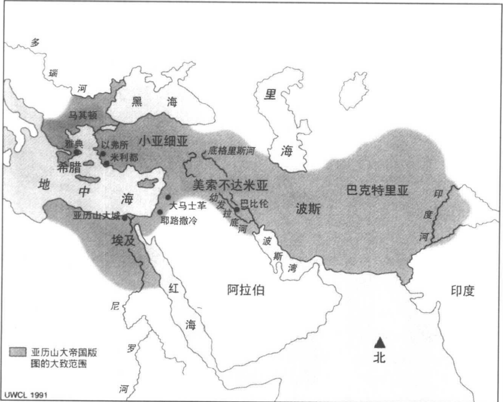
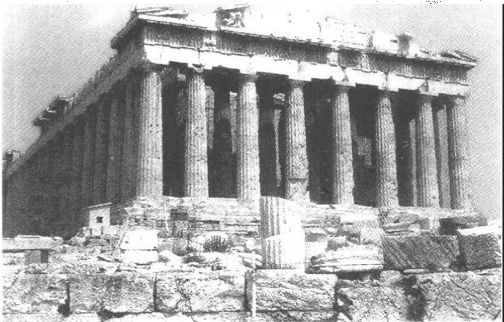
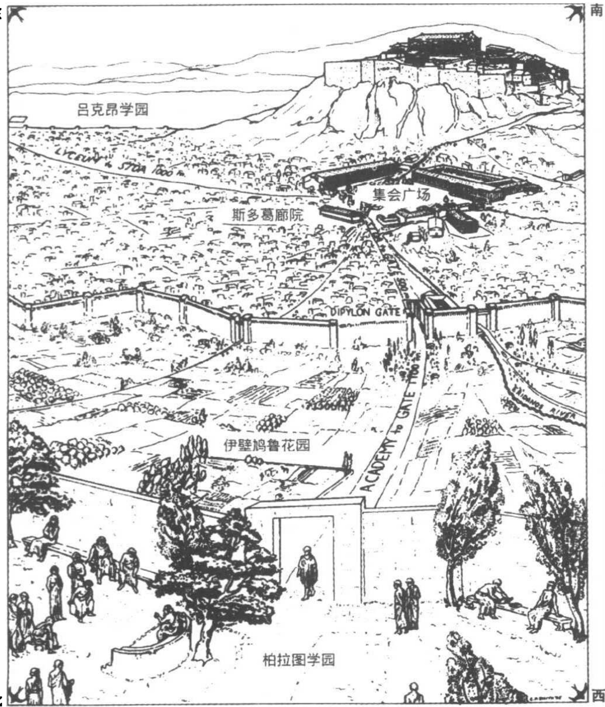

# 第四章 希腊化时期的自然哲学

亚里士多德于公元前322年辞世，这几乎恰好是亚历山大大帝（公元前334-323年）军事远征结束之时。亚历山大大帝建立了一个疆域广阔的希腊帝国，由此敲响了希腊自治城邦的丧钟。他极大地扩充了希腊的版图，把希腊人的语言和文化向东带到了巴克特里亚（Bactria，现为阿富汗的一部分）和印度河，向南带到了埃及（见地图2）。然而，亚历山大及其后继者也借助了被征服人民的成果，创造出一种希腊文化与外来成份的综合，它可以用形容词“希腊化时期的”（意指“接近希腊人的”）来指称。尽管希腊成份在其中占有绝对的主导地位，但创造这个词的史学家们用意在于把希腊化时期同更古老的、毫无掺杂的“希腊”时代的文化区别开来。所以，“希腊化时期的自然哲学”这一用词，就是表示整个希腊帝国内的学者和受过教育的人们关于自然的思想。从短期来看，文化的重心仍然在传统的希腊领土；然而最终，这个领导地位向南转移到了埃及的亚历山大城，向西转移到了罗马。

## 学校与教育

在探讨希腊化自然哲学的内容之前，我们需要考察它的社会基础——能传递一般性的学问和具体的自然哲学的社会机制与制度体

---

地图 2 亚历山大建立起的庞大帝国。

系。当然，知识可以被人们单独地传授，从父亲传授给儿子，从朋友传授给朋友，或者从师傅传授给徒弟。但随着知识的复杂性和思辨性的增加，可能会越来越需要一种更正式的、集体式的教育体系。这种情况发生在古希腊吗？如果是，由此产生的教育体系的本质是什么呢？

古代社会没有正规的教育，但能获得几年初级水平的指导，成为早期希腊贵族的一个理想。由于这种教育针对的是未成年儿童(paides)，它就被称为儿童体智训练(paideia)。它通常包括两部分：锻炼体质的gymnastike和陶冶精神的mousike。Gymnastike包括体育

---

和运动。Mousike 涵盖了缪斯掌管的所有艺术，特别是音乐与诗歌。然而，社会的需要最终战胜了这种二元体系，到公元前 5 世纪初，也有了培养阅读和写作的学校。

Gymnastike 的指导大多在运动场或角斗学校进行，也可能在公共体育馆。Mousike 和文学教育几乎可以在任何地方开展，包括公共场所或老师的家中。必须明白，这种教育与现代大众式义务教育没有丝毫相似之处。老师们自愿以私人身份加入这个教育事业；贵族们则根据个人需要和爱好来选择老师。

公元前5世纪时，随着智者(sophists)的出现，这种教育模式发生了重大变化。这时的教育已经是严格的初等教育，主要定位在体育和艺术。大约在公元前5世纪中叶，以智者著称的行游教师出现在雅典，他们为教育事业增添了新的内容。首先，他们提供了更高水平的教育。其次，他们的目的在于训练公民和政治家，这就要求教育的内容转向理智的、特别是政治的事务。智者提供了我们所谓的集体辅导，它没有固定的课程和普遍的模式，肯定也没有共同的哲学体系，辅导的期限由各方商定。(历史学家常常认为这种辅导大约为期三至四年，但最近又有人认为，在某些情况下，辅导期限可能短至“一周或一小时”。) $ ^{2} $为了招徕生意，作为老师的智者需要引起人们的注意，因此，他们常常在公共场所如集会场(公共市场)或某个大型公共体育馆(那时，雅典共有三个这样的体育馆)里授课。当生意枯竭或教师不再受欢迎时，他就离开这个地方。

在这一背景下，我们就可以去理解苏格拉底和柏拉图的教学活动了。毋庸置疑，苏格拉底和柏拉图在很多方面与智者不同——他们并不四处云游，而是一直生活在雅典，而且他们的教学方法也不同于智者，但这种区别或许并没有被当时的雅典人所看到，他们很可能把这两个人看成了智者派运动的典型代表。当公元前388年柏拉图结束他的意大利之行回到雅典时，他在学园这座刚好在城墙外、已长期被用于教育的大型公共体育馆，建立了他的学校。如果说这次创业有什么不同寻常的话，那就是柏拉图的学校具有了持久性，在他死后还持续了很长一段时期。 $ ^{3} $

---

图4.1 帕台农神庙（供奉雅典娜的主庙），位于雅典的卫城，建于公元前5世纪。

图 4.2 希腊化时期雅典的学校。© Candace H. Smith。首次发表于 A. A. Long 和 D. N. Sedley 著 The Hellenistic Philosophers，第 1 卷。

---

柏拉图的学校是一个哲学共同体，其中的学者们年龄和成就参差不齐，但相互都能平等共事。无疑，柏拉图是这里的主导力量，他用自己的榜样激励他的同事，用他的批判力帮助那些低水平的学者。但他并不总是批判，(像现代研究生讨论课上的老师一样)他可能也在教学中受益良多。 $ ^{4} $无疑，这个事业有一股宗教的潜流；学园致力于为缪斯服务，因而可能有一些在我们看来是宗教仪式的活动。然而，它肯定没有要求成员必须具有正统的教义，学园向怀着任何信仰的学者们敞开大门(至少原则上如此)。学者们不需缴纳任何费用，他们可以自由地参加学园的各种活动，直到厌倦这些活动或失去资助为止。后来，柏拉图在靠近学园的地方购置了一块土地，用于开展它的某些活动。拥有私人财产以及柏拉图为遴选学园的继承人而确立的规定，无疑都有助于学校的长期存在。

亚里士多德作为柏拉图学校中的成员长达20年，直到公元前348或347年柏拉图去世为止。公元前335年亚里士多德在马其顿人强行统治之后重返雅典，他本来完全可以再次成为柏拉图学园的成员，但他没有那样做，而是在雅典的另一个体育馆吕克昂，建立了一所竞争性的学校。吕克昂与学园一样，长期成为教育活动的舞台。亚里士多德及其追随者习惯于以一种在吕克昂的柱廊中散步的方式聚会，由此获得(或使用)了“逍遥学派”(Peripatetic)的称号，从这以后他们就以此著称于世。亚里士多德的吕克昂和柏拉图的学园在很多方面类似，但它们在方法和侧重点上并不相同。在方法上，亚里士多德开创了合作研究的实践，表现在他的博物学研究和对早期哲学文献的系统收集中。在侧重点上，亚里士多德对生物学的兴趣与柏拉图的数学兴趣形成了强烈对比；而且，亚里士多德的形而上学与柏拉图也有明显的分歧。 $ ^{5} $

此时的雅典已经在希腊世界获得了教育的领导地位，于是其他教师很快也来到这里寻找机会。基蒂翁的芝诺(Zeno of Citium)大约在公元前312年来到雅典，随后开始在位于雅典集会场一角的斯多葛廊院(stoa poikile)从事教学，从而建立一个被称为“斯多葛派”哲学的学校。伊壁鸠鲁(Epicurus)是一位生于萨摩斯岛的雅典公民，他大

---

约于公元前 307 年回到雅典，买下一所房子和一座花园，并在那里创建了一个 “伊壁鸠鲁” 哲学的学校，该学校一直保留到基督教时代。

学园、吕克昂、斯多葛和伊壁鸠鲁花园——雅典最杰出的四个学校——都发展出了制度体系，这使它们在其创始人死后还能够继续存在。学园和吕克昂似乎一直保持到公元前1世纪初(可能是到公元前86年雅典遭受罗马将军苏拉(Sulla)的洗劫为止)。人们常称，学园一直保存至公元529年被查士丁尼皇帝（Emperor Justinian）关闭为止。而实际的情况似乎是，新柏拉图主义者在5世纪时重建了学园，并尽力把它维持到大约560年或以后；然而，它与柏拉图的学园之间并没有体制上的连续性。斯多葛派的学校保存至2世纪，而伊壁鸠鲁学校则又保留了一个世纪。

同时，雅典的模式已经被输出到希腊世界的其他地方，特别是（埃及的）亚历山大城。亚历山大大帝死后，他的将军们瓜分了他的帝国，埃及和巴勒斯坦落入托勒密之手。亚历山大城成为托勒密的首都，通过他及其后继者的资助，亚历山大城的规模越来越大，也越发富丽堂皇，并且很快获得了教育上的优势地位。当德梅特留斯·法拉隆(Demetrius Phaleron)——以前是亚里士多德吕克昂学园的成员——作为雅典的独裁者于公元前307年被推翻以后，托勒密邀请他来到亚历山大城。或许正是在他的影响下，托勒密决定建立一所博物馆——不是一座展示艺术品的建筑，而是一座祭奉缪斯的庙宇，并因此既是宗教圣地也是做学问的场所。博物馆和吕克昂之间的联系可进一步用下面这个事实来说明：斯特拉托(Strato)这位吕克昂的第三任领导人，曾有一段时间在托勒密的宫廷里辅导皇室后代。博物馆似乎是由一些位于皇家区域的建筑物所组成，并（由于它是一座庙宇）由一位祭司来主持。由于它的相关图书馆（根据古代的估计数字，那时就几乎有藏书50万卷），以及托勒密王朝皇帝们的慷慨捐助，并考虑到雅典学校的最终衰落，博物馆成为希腊化时期的主要研究机构——早期希腊思想同罗马、中世纪时期的一个主要联系纽带。

业历山大博物馆的建立非常重要，不仅因为那里开展的研究具有重要意义，而且因为它是通过公众或皇家的赞助而支持高级学问

---

的一个先例。这种资助在公元140-180年间被罗马皇帝安东尼内·皮乌斯(Antoninus Pius)和马库斯·奥里利厄斯(Marcus Aurelius)进一步发展了，他们在雅典和其他地方为修辞学和哲学教师设立了皇家席位。马库斯·奥里利厄斯在雅典为每一主要哲学传统——柏拉图、逍遥学派斯多葛和伊壁鸠鲁——都设立了席位，这种模式很快得到希腊世界中其他地方的仿效。最终，这种模式对罗马和基督教的教育活动产生了强有力的影响。

## 亚里士多德之后的吕克昂

亚里士多德在游历小亚细亚期间结识了狄奥弗拉斯特(约公元前371-286年)，可能是公元前340年代他逗留莱斯博岛(狄奥弗拉斯特的出生地)期间结识的。他们成为了亲密伙伴，并且，当亚里士多德于公元前335年返回雅典时，狄奥弗拉斯特同他一道来到这里，并且在此后的30年间参与了吕克昂的活动。亚里士多德死后，狄奥弗拉斯特成为吕克昂的领导者，并担任这个职位达36年之久。

狄奥弗拉斯特似乎分享了亚里士多德的总的哲学看法、他的研究方法和兴趣范围。狄奥弗拉斯特继续从事教学，并开展亚里士多德生前已经开始的博物学和哲学史的合作研究计划。他将前苏格拉底哲学家的见解收集成册，这就产生了我们现在所说的“文献汇编”（或“意见”）传统——即收集和保存关于各种主题的哲学意见的一系列手册。狄奥弗拉斯特的大多数著作现已佚失，但幸存下来的作品中有两篇植物学著作和一篇矿物学论文，可以表明他高水平地实践了亚里士多德的研究计划。像亚里士多德的动物学著作一样，这些植物学著作包含了他对植物生命的一丝不苟的描述（提到了500多种植物）、深思熟虑的分类尝试和睿智的生理学理论研究。狄奥弗拉斯特接受了亚里士多德的许多解释原则（例如，将生命与生命热联系在一起），并强调了采用严格的经验方法的必要性。在他的著作《论岩石》(On Stones)中，他承继亚里士多德，把矿物分为金属（水元素在其中占主导地位）和“稀土”（土元素在其中占主导地位）。他系统地

---

描述了五花八门的岩石和矿物。

在实施亚里士多德研究计划的同时，狄奥弗拉斯特也乐于质疑和反对亚里士多德自然哲学的某些方面。这可以用三个例子来说明。狄奥弗拉斯特对亚里士多德的目的论持保留态度，他指出，并不是宇宙的所有特性都有明确的目的，世界之中还存在大量的随机成份。他重新审视了亚里士多德的四元素理论，并对火作为一种元素的地位提出了质疑。而且，他不同意亚里士多德关于光和视觉的见解，他怀疑亚里士多德的光是媒质的透明性的现实化的观点，并认为动物的眼睛中包含一种火，这种火的散发可解释夜视。 $ ^{8} $

狄奥弗拉斯特完全不同的另一类成就，是为吕克昂购置了财产。尽管不是雅典公民，但狄奥弗拉斯特得到了在体育馆旁购买一块土地的特别许可；学校的图书馆大概被安置在那里的几幢建筑里，并且这里也提供了工作的空间。狄奥弗拉斯特在遗嘱中把这些不动产赠给了与他共事的学者：“我将花园、长廊，以及沿花园的所有房子都给予我的那些朋友们，也就是所有希望在这里继续从事教学和哲学研究的人……；我的条件是，任何人都不能够转让这些财产或将其挪为私用，而是，所有人应该共同拥有它，好像它是一个圣所。” $ ^{9} $

逍遥学派的图书馆经历了更为复杂的命运。在遗嘱中，狄奥弗拉斯特将图书馆(不仅有他自己的藏书，还有亚里士多德的藏书)托付给了尼留斯(Neleus)，而后者可能有意继承他的职位。当这个共同体中的资深成员改而选择了斯特拉托时，尼留斯就带着这些书(至少是其中的许多书)回到了他在小亚细亚斯开普希斯(Skepsis)的家，从而夺走了吕克昂至关重要的文献资源。这个图书馆大约完整地保存到公元前1世纪的早期,(根据历史学家斯特拉博(Strabo)——勿与斯特拉托混淆)，这时，有人从尼留斯的后人那里将它收购回来，返还给雅典的逍遥学派学校。不久，雅典陷落于苏拉之手，苏拉将这些书装船运到了罗马。在那里，这些书落到了罗得岛的安得罗尼柯(Andronicus of Rhodes)手中，他整理和编辑了它们，使之得到更广泛的传播。 $ ^{10} $

在此期间，斯特拉托(来自小亚细亚的兰普萨库斯，Lampsacus）

---

接掌了吕克昂的领导权，他在此位置长达18年(公元前286-268年)之久。斯特拉托似乎与亚里士多德和狄奥弗拉斯特有几乎同样广泛的兴趣。然而，他的著作却没有一篇完整地保留下来，我们只能从散见于后世作家作品中的引文和解述重建其哲学和科学活动的残貌。似乎，斯特拉托想努力纠正、扩展亚里士多德和狄奥弗拉斯特关于各种主题的著作。一旦有好的理由，他就会毫不犹豫地对他们的观点提出质疑，或者去借鉴其他的哲学传统。

斯特拉托最显著的贡献(从我们对他的了解中发现)，是关于物理世界的运动和基本结构。斯特拉托对亚里士多德的运动理论提出了一个根本性的修正，他否认重的物体和轻的物体之间的区别，认为所有物体都具有不同程度的重量。气和火上升不是因为它们绝对地轻，而是因为它们被重的物体置换了位置。斯特拉托还反对亚里士多德的位置与空间的理论。而且，他提出经验证据证明，重物是加速下落的(这是亚里士多德未曾讨论的落体的一个特性)。斯特拉托指出，从高处下落的水流在顶端是连续的，而在接近底部时却成了不连续的——这个事实可以用不断增加的水流速度加以解释。为了支持他的同一结论，他指出，一个落体所造成的冲击不单是其重量的函数，还是其下落高度的函数。 $ ^{[1]} $

尽管斯特拉托对有形世界基本结构的看法基本上保留了亚里士多德的思想，这一点毫无疑问，但他把粒子观念引入逍遥学派的自然哲学也是显而易见的——这可能是来自于伊壁鸠鲁的影响，有一段时间他曾在斯特拉托的家乡兰普萨库斯教书，而且两人都同时生活在雅典。粒子观念最明显地反映在斯特拉托的这一信念中：光是一种物质的发散，而且，物体不是连续的，而是包含着粒子间的虚空。斯特拉托用虚空的概念解释物质的多种属性，包括浓缩、稀化和弹性。在承认存在着散布于物质中的细小虚空的同时，他否认连续的虚空的自然地在。我们必须小心，不要把斯特拉托看作一个十足的原子论者，因为他似乎仍然保留着对有形实体的无限可分性的信念，这就排斥了任何原子论哲学中一个绝对本质性的特征，即相信不可还原的原子的存在。

---

到公元前2世纪末，继任斯特拉托的吕克昂领导者们只留下了他们的名字。毫无疑问，这个学校常规性地讲授着逍遥派的哲学，并不断地努力澄清亚里士多德哲学和整理他留下的材料。然而，直到吕克昂学校寿终正寝为止，我们再没有记载可以表明他们对自然哲学有什么新的贡献，和对传统的逍遥学派的哲学提出了什么特别尖锐、有力的批判。然而，亚里士多德的著作仍然流传于世并得到评注，特别是在罗得斯岛的安得罗尼柯重新编辑了亚里士多德全集以后。我们发现了公元前1世纪中叶西顿的波埃修(Boethius of Sidon，安得罗尼柯的学生)和大马士革的尼古拉斯(Nicholas of Damascus，希律王宫廷中的历史学家)所作的评注。大约在公元200年，阿弗罗狄西亚的亚历山大(Alexander of Aphrodisias)在雅典讲授逍遥学派的哲学，并撰写了关于亚里士多德多种著作的重要而有影响的评注。最后，均为新柏拉图主义者的辛普里修斯(Simplicius)和约翰·菲洛普纳斯(John Philoponus)对亚里士多德著作的评注，证明亚里士多德传统一直持续到了6世纪。伊斯兰教和中世纪基督教世界对这一传统的重新关注将再次恢复亚里士多德哲学的领导地位。 $ ^{12} $

## 伊壁鸠鲁主义和斯多葛派

在希腊化时期，柏拉图和亚里士多德的追随者们继续讨论、澄清和修正柏拉图与亚里士多德的哲学。同时，其他的哲学体系也在发展之中，其中两种哲学成为了互不相让的对手。这两种哲学都包含我们已经熟识的内容，但它们又都是新的，因为它们把伦理问题放在了突出的位置。的确，这两种哲学最引人注目之处，在于它们决定哲学的所有其他方面都应让位于伦理关怀。

根据伊壁鸠鲁(公元前341-270年)的观点，哲学的目的在于保障快乐。伊壁鸠鲁在给曼诺伊修斯(Menoceus)的信中写到，“要说研究哲学的时期还未到来或已过去，就如同在说，快乐的时期还未到来或已不再有”。伊壁鸠鲁相信，实现快乐的途径，就是消除对未知现象与超自然现象的恐惧，对于这个目的，自然哲学是最合适不过

---

图 4.3 伊壁鸠鲁，藏于梵蒂冈城，梵蒂冈博物馆。Alinari / Art Resource N. Y.

的手段。伊壁鸠鲁的一个格言如下：“倘若我们从不为天上或大气中的警示所困扰，从不为死亡带给我们的某种疑惧所困扰，也不为痛苦和欲望的无边无际所困扰，那么我们就无需研究自然哲学。”自然哲学不仅是实现快乐的工具，那也是它惟一的功能。 $ ^{13} $

伊壁鸠鲁的自然哲学从古代原子论中借鉴了许多内容。宇宙被看成是永恒的，由无限的虚空构成，在这些虚空中，无数的原子永不停歇地运动，“好像在无休止的战斗中”被四处投掷，像明亮光线下的尘粒。我们世界中(以及存在着的无数其他世界中)的所有事物和现象都可以还原为原子和虚空；神本身必定也是由原子组成。事物的可感性质(我们现在称之为“第二属性”)，如滋味、颜色、冷暖，

---

不存在于单个原子中，原子仅有的真实属性是形状、大小和重量。这是一个被动的、机械的世界，其中万物都是机械的因果律的结果(有一个例外，下面将提到)；没有统治性的精神，没有神的佑助，没有命运，没有来世。而且，也没有目的因：正如卢克莱修(Lucretius，约卒于公元前55年)在描述伊壁鸠鲁哲学时所说，“(躯体的)所有部分……在它们的用途之前就已存在；如果是为了使用之目的，它们就不会长成。” $ ^{14} $

但伊壁鸠鲁及其追随者并不仅仅是传播了古代原子论者的哲学体系。他们还不得不改造原子论哲学，使其具有伦理的功能。他们修改了它的内容，以此来解决困难，反驳批评，并且，从总体上说，提高它的解释力。比如，伊壁鸠鲁反对德谟克利特的理性主义，认为所有的感觉从根本上说都是可信赖的。 $ ^{15} $从中似乎得出：可感的或第二属性在宏观的水平上具有实在性，即使(如德谟克利特已经论证的)它们在原子中并不存在。

伊壁鸠鲁的“偏离说”是对原子论的自然哲学内容所作的一个更重要的修改，不仅是为了将原子论者的宇宙论从致命的批判中拯救出来，也是为了消除来自伊壁鸠鲁伦理学中决定论的威胁。根据伊壁鸠鲁的观点，原子具有形状和大小（留基伯和德谟克利特就这样认为），还有重量。重量使它们落入到无尽的虚空中，就产生了所谓的原始时代的宇宙雨。因为没有原子遇到阻力，所以它们都以同样的速度下落，而且没有原子会被超过。这是一个完全不能令人满意的宇宙，因为它似乎排除了使原子论具有解释力的那种碰撞。伊壁鸠鲁通过假定一个极小的偏离来解决这个困难：一个原子以最小量偏离了下落的路线，这就引起了一系列的碰撞反应。这个理论最棘手的特征在于，这种偏离必定是个无原因事件，因为如果它是被引起的，那只能是被同其他原子的碰撞所引起；这种碰撞的不可能性恰恰是我们要尽力避开的困难。 $ ^{16} $

如果我们因其发明自为事件(这仍是哲学上的一个困窘，即使它们确实出现在现代量子力学的某些解释中)而苛责伊壁鸠鲁，我们就需要注意，这种偏离不仅解释了原子旋涡的起源，继而又解释了我

---

们生活的世界；它还使决定论的铁链发生了断裂，因为决定论排除人的责任并破坏了伊壁鸠鲁伦理体系。如果世界完全服从于严格的机械因果律，那么人的活动就不能是自由的；如果人不能自由地进行选择，他们就会失去责任。偏离把非决定论的成份引入宇宙；而且，即使这不能解释自由选择实际上是如何被运用的(这是一个我们仍然不知答案的问题)，但是，通过揭示出僵死的因果必然性的铁链的断裂，这就为人的自由意志的可能性留下了空间。毫无疑问，这不是一个令人十分满意的解决办法，但在一个机械的宇宙中能意识到自由意志的问题(伊壁鸠鲁是这样做的第一人)，这本身就是一个重大的成就。

斯多葛派哲学的创始人是来自于塞浦路斯岛上的基蒂翁的芝诺（约公元前333-262年）。不要把这个芝诺与巴门尼德的弟子混淆，他来到雅典，花了约10年的时间在雅典的各个学校学习，其中包括柏拉图学园，此后他于大约公元前300年在斯多葛廊院建立了自己的学校。阿索斯的克雷安德(Cleanthes of Assos，公元前331-232年)和索利的克里斯普(Chrysippus of Soli，约公元前280-207年)后来接替了芝诺，这是两位凭借自身能力而很有影响的思想家，在把斯多葛思想发展成为系统的哲学方面，他们的贡献可与芝诺媲美。作为活跃的学术传统，斯多葛派哲学存活到公元2世纪；然而，它的影响却一直持续到了17世纪。 $ ^{17} $

斯多葛派和伊壁鸠鲁主义在大多数主题上根本对立，但也在某些事情上意见一致。首先，他们都认为自然哲学低于伦理学；在这两个哲学派别中，追求快乐被视为人存在的目的。斯多葛派相信，快乐只能通过与自然和自然规律达成和谐才能实现；而与自然的和谐就需要一种自然哲学的知识。其次，这两个学派的成员都是唯物论者，他们都不厌其烦地证明，除物质性的质料以外，任何东西都不存在。

这种共同的唯物主义是重要的共同基础；这意味着，在反对任何非唯物论哲学，如柏拉图及其追随者的哲学的战斗中，斯多葛派和伊壁鸠鲁主义是同盟军。然而，一旦超出这个基本命题，我们就

---

会发现斯多葛派和伊壁鸠鲁主义有着根本不同的宇宙观。伊壁鸠鲁主义相信，物质是不连续的和被动的——由分立的、不可分的、无生命的原子组成，原子在无限虚空中漫无目的地运动着。他们的宇宙是一个机械的宇宙。相反，斯多葛派创造了一个有机的宇宙模型，其特征是连续性与主动性。让我们将这种对比(连续与不连续，主动性与被动性)作为考察斯多葛派自然哲学的切入点。 $ ^{18} $

斯多葛派相信，物质本身并不表现为原子的形式，每个物质都有其永恒的身份，以一种无限的、可分的连续体出现，没有自然的裂缝和虚空。因此，大小和形状并不是物质的永恒属性，因为物质可以按我们喜欢的任何尺寸和形状切割成块。尽管不允许宇宙存在任何虚空，斯多葛派却承认宇宙外的虚空，他们把宇宙看成是包围在无限虚空中的一个连续性物质的孤岛。

同伊壁鸠鲁主义一样，斯多葛派也承认物质有被动的一面，但他们确信这并不是全部。伊壁鸠鲁主义的观点容易遭受如下攻击：如果一个单个物体的所有属性都来源于细微的、无生命的物质块的偶然组合，那就不能令人信服地对整体的许多属性作出解释。伊壁鸠鲁主义的原子只有大小、形状和重量等属性，那么，他们如何解释如聚合性(岩石保持为岩石，抵制被分散成它的组成粒子)这种简单而基本的属性呢？既然冷不是冰块构成成份的一种属性，那么冰块的冷来自何方？颜色、味道和质地又如何解释？或者我们来看一个困难得多的情况，生物的特性——植物的生命周期、昆虫的再生行为，或人的个性——来自何方？如果这只家犬仅仅是惰性物质的偶然组合，那么我们如何解释它执意追逐邮递员的行为？看来，除了被动性的物质以外，必定还有一个主动原则，它能够将被动的物质组织成一个有机的统一体，并解释其行为特征。必定有某些事物是被作用的；但也必定有某些事物在施加作用，而在物质世界中，这种东西必定是物质的。

斯多葛派把这种主动原则等同于气息或精气，它是最精细的物质，完全渗透到每个东西之中，它将接受性的被动物质组织成统一的物体，并使这些物体具有了它们的特性。但记住这一点很重要：精

---

气不仅是一种精细的、可穿透任何东西的物质；它还是一种主动的、理性的物质，是宇宙中活力和理性的来源。事实上，斯多葛派把精气等同于神的理性和神本身。从现代的观点来看，精气 = 理性 = 神这个等式似乎非常怪异，从犹太教—基督教的观点来看肯定还是错误的，但它是斯多葛派宇宙论的基础。神已从天上落到人间，他们被物质化了，被用于解释宇宙中的活动和秩序。

让我们更仔细地考察这种精气，探究它的结构(如果它有的话)、它的组织能力的来源，以及它与被动的物质的关系。斯多葛派承认亚里士多德的四元素的存在，但以活动性为基础将它们分成了两组。他们把可感物质的主要组成成份土和水看作被动的元素，而把气和火看作主动的元素。气和火以各种比例混合(斯多葛派认为，这种混合是一种完全的、同质的混合物)能产生各种精气。这样，气和火能施加作用，而水和土是被作用的。

精气有各种等级。在最低水平上，那种解释了我们所说的无机体聚合——比如岩石和矿石——的精气被称为 hexis。植物和动物具有的、使它们获得了生命属性的精气是自然(Physis)。最高等级、为人类所有并解释了其理性的精气是精神(psyche)。斯多葛派把一个物体的精气等同于灵魂。由此得出，每一个体事物都充满了灵魂，而这种灵魂的作用就是它的组织原则。肯定存在着一种宇宙的精气，一种世界灵魂，因为宇宙也是一个有机的统一体，其物征也需要用活动性的原则来解释。斯多葛派自然哲学深深的活力论特征就因此显露无遗。

精气存在于一种张力或弹性状态之中。这种张力解释了所有物体最基本的属性——聚合性。在更高的水平上，不同的张力解释了世界上可观察到的各种属性和个性。最后，可能应该反复重申的是，精气与其宿主是完全混合或相互渗透的，两种物质占据同一空间。

像柏拉图和亚里士多德一样，斯多葛派的宇宙论也是地心论。然而，斯多葛派跟从原子论者而果断地放弃了亚里士多德，他们拒绝在天界与地界之间做任何截然的区分；在探讨如自然的组成和自然规律等基本问题时，斯多葛派的宇宙是同源的。斯多葛派同意亚里

---

士多德的宇宙永恒的观念，但受前苏格拉底哲学家们的启发，他们用轮回理论取代了亚里士多德所信仰的宇宙不变性。很多斯多葛派思想家认为，有一个永恒的膨胀和收缩、毁灭与再生的宇宙轮回。在膨胀阶段，世界被分散成火；在收缩阶段，火又变成其他元素，我们所知的世界被再生出来。这个轮回永恒往复，就产生了一个完全相同世界的无穷序列。 $ ^{19} $

最后，我们必须提到，斯多葛派的宇宙被看作是既有目的，又是决定论的。渗透着精神和神性，斯多葛派的宇宙就不可避免地充满了目的、理性和神佑。同时，它的过程是被严格地决定了的。斯多葛派哲学坚持认为，存在着一个不可违背和完全决定了事件顺序的因果链条(其本身是神的理性的产物)。如西塞罗(Cicero)在《论占卜》(On Divination)中所表达的那样：“不能发生的事一个都未曾发生，同样，自然解释不了的事也不会发生。于是，这一点将可以理解为：命运不是迷信的‘命运’，而是物理学的命运。” $ ^{20} $

我们已经看到，斯多葛派和伊壁鸠鲁主义的自然哲学在很多方面是相互对立的。伊壁鸠鲁哲学的一个主要目的是与柏拉图和亚里士多德的目的论作斗争，而斯多葛派哲学旨在发现目的和捍卫目的论。伊壁鸠鲁描述了一个机械论的宇宙，而斯多葛派发现了一个有机的宇宙。伊壁鸠鲁尽力把非决定论因素引入他那否则就是机械论的宇宙，而斯多葛派则满足于一个被严格的决定性所主宰的有机世界。从短期来看，斯多葛式的宇宙似乎是两者中更合理的，并且它在古代晚期成为哲学家们最重要的选择。而最终，斯多葛派和伊壁鸠鲁主义的哲学都在近代早期得到复兴，成为替代以柏拉图和亚里士多德式世界图景的其他选择；并且，它们都对17世纪新哲学的形成发挥了重要影响。