# 第五章 古代的数学科学

## 数学在自然中的应用

在西方科学传统中，关于数学在自然中的应用，一直存在着争论。争论的问题是：世界是否在本质上是数学的，在这种情况下，数学分析是更深入地理解世界的真正途径；还是数学仅适用于事物表面的、数量的方面，而丝毫未触及最终实在。毫无疑问，近代的自然科学家，越来越倾向于赞同用数学方法解决问题。然而，相反的观点也不是没有它的拥护者；在社会科学家和历史学家当中，争论仍很活跃。

古代毕达哥拉斯派似乎主张，自然彻头彻尾地是数学的。如果亚里士多德可以信任，那么毕达哥拉斯派曾走极端，宣称世界的最终实在是数（其余讨论参照第二章）。柏拉图在他的物质理论中致力于复兴毕达哥拉斯计划，认为四种基本元素可以还原为规则的几何体，几何体又可还原为三角形。因此，在柏拉图看来，构建可见世界的根本基石不是物质的，而是几何的；而且，柏拉图认为，将各种事物联接在一起形成一个统一宇宙的，不是物理的或机械的力量，而只不过是几何的比例。 $ ^{1} $

毫无疑问，亚里士多德具有广博的数学知识，他将数学证明作为其知识理论的基础。他将几何学应用于彩虹理论，并且将比例理

---

论应用于对运动的分析。但亚里士多德确信，数学和自然科学或物理学之间存在着差异。按照他的定义，物理学把所有自然事物都看作可感的、可变的物体。相比之下，数学家剥除事物的感性性质，而专注于剩余的数：

在数学家的研究活动中，他首先将可感事物抽象化，如重和轻、硬和软、以及热和冷等其他各种感性性质，只留下数量和连续性——有时是一维的，有时是二维的，有时是三维的…… $ ^{2} $

数学家考虑的仅仅是事物的几何性质，而这些几何性质根本没有穷尽实在。将重量、硬度、冷暖、颜色和其他性质重新引入真实的世界，我们就脱离了数学王国，而回到物理学的主题。

因此，关于数学在自然中的应用这个问题，亚里士多德走了一条中间道路。他确信，数学和物理学都有用，但是，数学和物理学显然不是同一种东西；数学家和物理学家的研究对象也许是一样的，但他们专注于事物的不同方面。然而，有些学科——天文学、光学以及乐声学——位于数学和物理学的交界处。这些学科，逐渐被称为“中间”科学或“交叉”科学，数学家或许能够为物理学家建立的事实提供解释或说明。

柏拉图和亚里士多德提供了两种关于数学和自然界之间相互关

图 5.1 正方形的边和对角线的不可通约性。

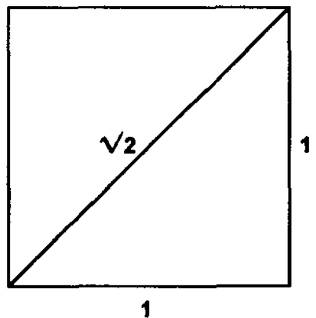

---

系的理论，这两种理论已成为从古至今的自然科学家们摇摆不定的两极。然而，我们不仅对数学理论在自然中的应用感兴趣，我们对这种理论被应用的方式也感兴趣。为考察希腊人事实上是如何将数学应用于自然的，我们将考察以下几门学科：天文学、光学、平衡原理或杠杆原理。为了给这一考察做些准备，我们有必要先浏览一下古希腊人在纯数学上取得的成就。

## 希腊的数学

对希腊数学的起源我们知之甚少。可以肯定的是，早期希腊数学家取得的成就已接近埃及人，尤其是巴比伦人所取得的数学成就(见第一章)。但是，从一开始，希腊数学同埃及、巴比伦的数学就有区别；这种区别主要在于希腊的几何学，这种几何学追求的目标是抽象的几何知识、规范的推理和证明方法。希腊人重视几何学，原因之一也许是他们发现（或许是毕达哥拉斯派），正方形的边与对角线的比率不能用任何一对整数来表达。用更专业的术语说，我们称之为边和对角线的不可通约性；表达同样结果的另一种方式就是，无理数✓2（边的长度为1时对角线的长度；见图5.1）。或许就是这个无理数使希腊的数学家们相信，数（在希腊人看来，指正整数）不适于代表实在，从而促进了几何学的发展。 $ ^{3} $

对欧几里得（约活跃于公元前300年）之前那段时期数学发展的详细情况，我们仅有一些零散证据，但人们普遍认为，这段时期数学发展的成就被欧几里得编入了自己的数学著作《几何原本》(Elements) $ ^{4} $。从中我们可以看出，数学已发展为一个高度公理化的演绎系统。《几何原本》以一系列定义开始：点（没有部分）、线（有长度，没有宽度）、直线、面、平面、平角、直角、锐角和钝角、各种平面图形、平行线等等。定义之后是五个公设：过不同两点可连一直线、直线可向两端无限延长、以任意一点为中心和任一线段之长为半径可作一圆、所有的直角皆相等，并陈述了直线相交的条件。公设后面是五个“常识”或公理——一般的正当思维和专门的数学所

---

需的自明性真理。这些公理包括：可迭合的量相等，等量加等量得等量，全体大于其一部分。这些预先设定的断言为随后那13篇中的命题提供了坚实的基础。典型的命题以一个说明开始，随后是一个例子，进一步对命题作出定义或详细设定，然后是构造；最后以一个证明和结论结束。需要着重提出的是，一个彻底的欧几里得证明的结论，是从定义、假设、公理和先前已被证明了的定理中必定可以得出的。欧几里得如此有效地运用这种方法，以致通过他的影响还有——亚里士多德的影响，他的方法在一些关键的地方与欧几里得的方法相似——这种方法成为科学证明的标准，一直到17世纪末。

我们不必过久地停留于欧几里得《几何原本》的内容，因为，它和现代初级学校教授的几何学非常相似。第1至第6篇逐步阐述了平面几何的基础；第10篇致力于对不可通约的数进行分类；第11至第13篇论述了立体几何。在第7至第9篇中，欧几里得着手处理代数问题，包括数论和数的比例理论。在《几何原本》所取得的众多成就中，有一成就由于对未来非常重要，我们必须提及，那就是“穷竭法”的发展，它可能是欧几里得从他的前辈欧多克索处借来的，并注定将影响许多后来者，包括阿基米德（Archimedes）。欧几里得展示了如何利用一个内接多边形无限逼近圆的面积（XII,2）；如果我们不断使多边形的边数加倍，我们最终将使多边形面积（已知）和圆面积（未知）之间的差值，减小到小于我们选定的任意数值（见图5.2）。这种方法使得计算圆的面积有可能精确到任何想要达到的精

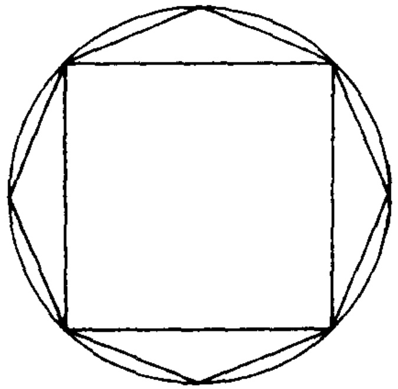

图 5.2 利用 “穷竭法” 测量圆的面积，在圆的内壁做内接正多边形，不断增加多边形的边数，则多边形的面积逐渐趋近圆的面积。

---

度；作进一步的发展，这种方法还可用于计算其他曲线之内（或之下）的面积。《几何原本》的另一个重要特征是，它研究了五种几何正多面体的性质，这五种正多面体有时被称作“柏拉图正多面体”，并证明除这五种之外，不存在别的正多面体（XIII,18）。 $ ^{5} $

欧几里得之后的希腊化时期，出现了一大批杰出的数学家，阿基米德（约公元前287-212年）无疑是其中最伟大的一位。阿基米德对理论数学和应用数学都有贡献，但他特别受人尊重是因为其完美的数学证明。在他的一些最重要的著作中，阿基米德发展了穷竭法，并将其应用于面积和体积的计算，包括被抛物线段所包围的面积、某些螺旋线所包围的面积、球的表面积和体积。他改进了 $ \pi $的计算值（圆的周长与直径之比），提出 $ \pi $的值必定在310/71和31/7之间。阿基米德对数学和数学物理学后来的发展产生了深远的影响，尤其是他的著作在文艺复兴时期被重新发现和发表之后。我们在下文中将考察他对物理学的贡献。 $ ^{6} $

必须提及希腊数学的最后一个成就，是佩加的阿波洛尼乌斯(Apollonius of Perga，活跃于公元前210年)讨论圆锥切面的著作。阿波洛尼乌斯研究了椭圆、抛物线和双曲线——当圆锥被不同角度的平面所切时形成的平面图形。并且，对于这些曲线的定义和产生方法，他阐述了一种新的见解。他的讨论圆锥切面的著作，像阿基米德的著作一样，注定要对近代早期产生重要影响。

## 希腊早期的天文学

希腊早期的天文学一直关注的似乎主要是天文观察、星图的绘制和历法的编写，以及编写一部满意的历法所必需的对太阳和月球运动的描绘。编写历法的主要困难来自这样一个事实：太阳年不是月球月的整数倍。也就是说，太阳绕黄道一周所需的时间，月球要绕地球12周再加上些零头。这样，基于一年12个月，每月29天或30天的历法，每年要少大约11天，历法和季节将不能同步。为了使历法和季节重新保持步调一致，人们提出了各种根据需要添加一个

---

月的方案。这种改进历法的努力以默冬（Meton，活跃于公元前425年）提出的默冬周期而达到高峰，它以一个非常接近准确值的个人看法为基础，即19年包含235个月。因此，在一个19年的周期中，12个月的年将有12个，13个月的年将有7个。默冬似乎打算将它作为天文学历法，而非民间历法；默冬周期被应用于天文学有好几个世纪。 $ ^{7} $

90 随着柏拉图（427-348/47年）和比他年轻的同时代人尼都斯（Cnidus）的欧多克索（约公元前390-337年）的出现，希腊天文学发生了一个决定性的转变。在他们的著作中，我们发现：（1）从关注恒

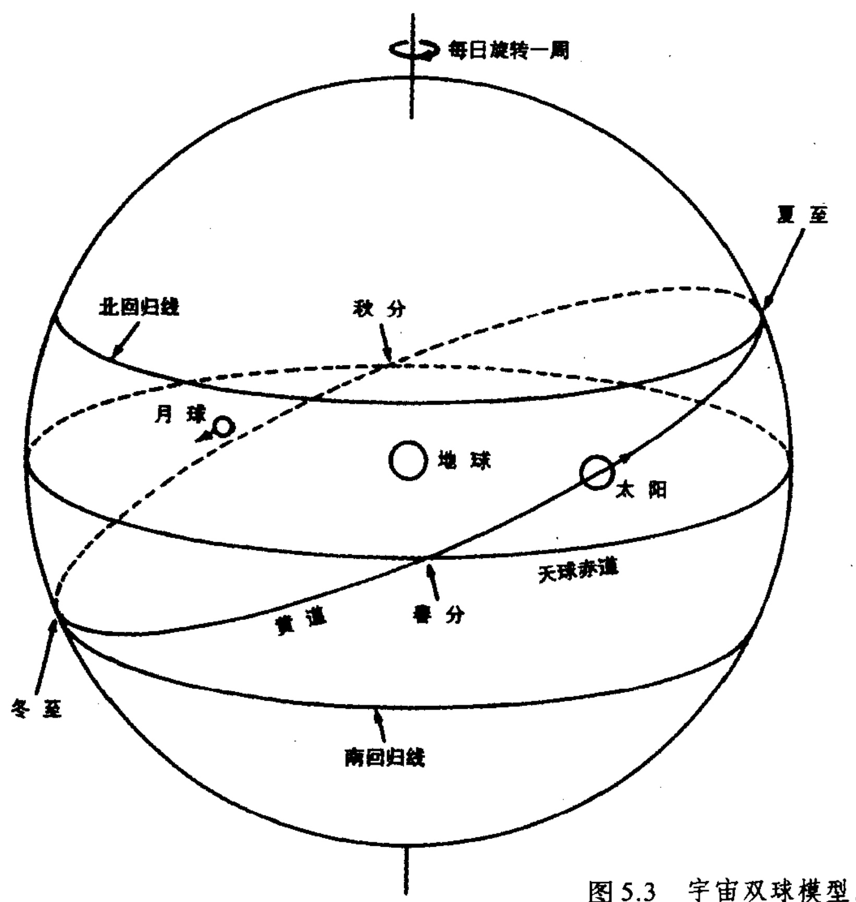

图 5.3 宇宙双球模型。

---

星到关注行星的转变,(2)一个用于表述恒星现象和行星现象的几何模型——“双球模型”——的创立，和(3)标准的设立：用于指导那些为解释行星观测材料而提出的理论。让我们较为详细地看看这些成就。

柏拉图和欧多克索设计的双球模型把天和地看作一对同心球。星被固定在天球上，太阳、月球及另外五个行星沿天球的表面运动。天球的自转，可解释每天看到的所有天体的上升和下落。在这两个球体上都有相应的圆将它们分成区，显示漫游星的运动。图5.3粗略阐明了柏拉图和欧多克索的想法。地球被固定在中心，同时，天球绕一垂直的轴自转。地球赤道在天球上的投影就是天球的赤道。太阳、月球和行星在其穿越天球的旅途中走过的那个圆——一个通过黄道带的中心并与赤道成 $ 23^{\circ} $斜角的圆——就是黄道。黄道和天球赤道在等分点（春分点和秋分点）相交；太阳每年沿黄道运行一周，运行到秋分点（大概是9月21日）时，秋天开始了；运行到春分点时，春天开始了。黄道上离赤道最远的点是至点（夏至点和冬至点）；当太阳运行到夏至点（大概是6月21日）时，夏天开始了。通过夏至点和冬至点且平行于赤道的圆分别是北回归线和南回归线。 $ ^{8} $

到 4 世纪，太阳、月球和其他行星的运动已经过人们仔细观察，并很好地绘制成表。在柏拉图和欧多克索的模型中，太阳绕黄道一年转一周，月球则是一个月转一周，它们都从西向东运动，速度几

图 5.4 1986 年在射手座附近观察到的火星的逆运动。资料由 Jeffrey W. Percival 提供。

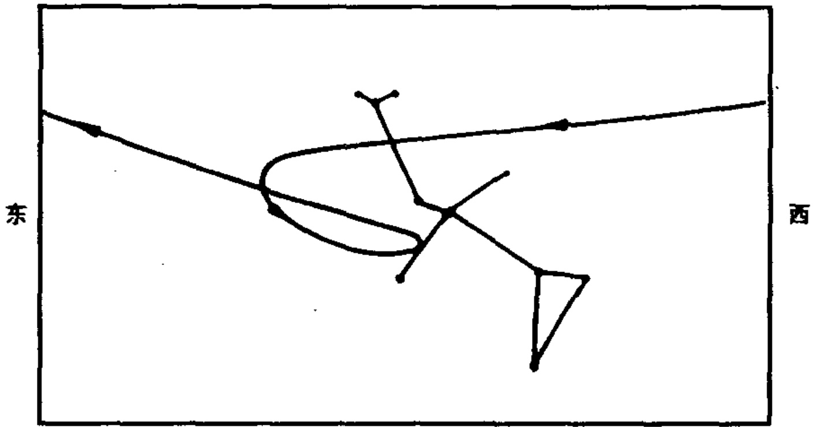

---

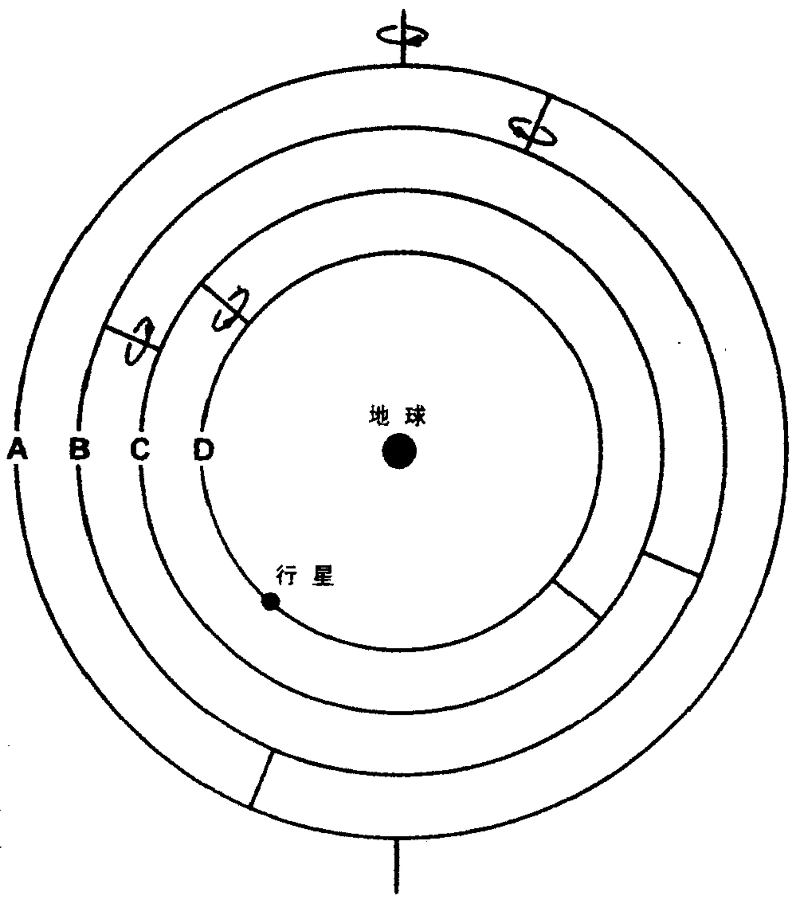

图 5.5 欧多克索为单个行星设计的层级球形结构。

乎不变。其他的行星——水星、火星、金星、木星和土星——也沿黄道（不会有较大的偏离）以太阳和月球同一方向运动，但速度变化很大。比如，火星沿黄道运行一周大约需22个月（687天）；一旦运行了大约26个月，它又逐渐慢下来，直至停止不动，又逆向运行一段时间（此时为从东到西运动），又停下来，然后继续通常由西向东的运动。这种方向上的倒转被称作“逆运动”，除了太阳和月球，所有其他行星均有逆运动。图5.4说明了观察到的火星的逆运动。

柏拉图和欧多克索已经知道行星运动的一个更为惊人的特征，即水星和金星从不远离太阳（水星的最大延伸率为  $ 23^{\circ} $，金星为  $ 44^{\circ} $）。就像拴在皮带上的狗，它们可以跑到太阳的前面或者落在太阳的后面，但它们从来不能跑到皮带所允许的固定长度之外。最后，

---

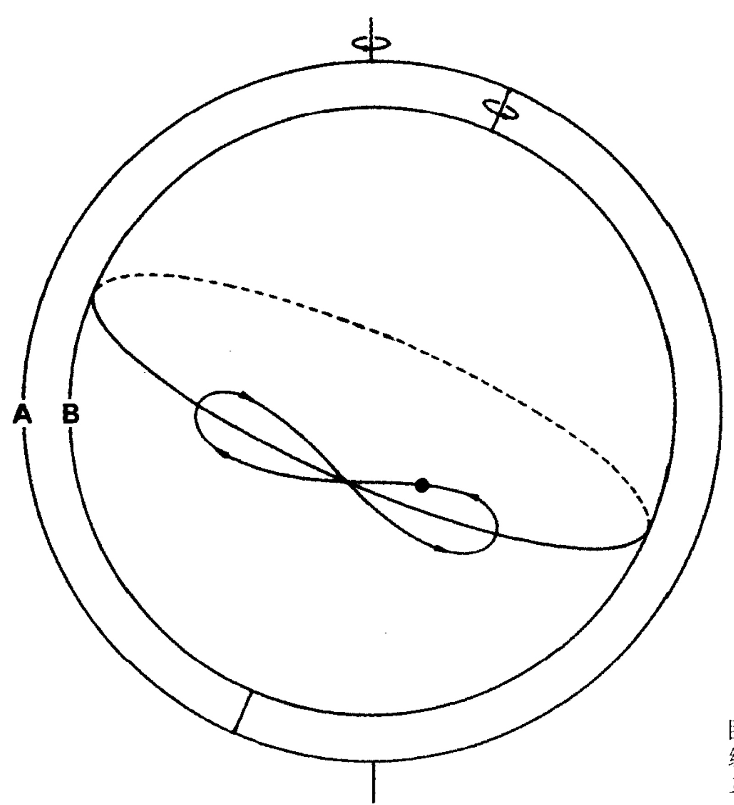

图 5.6 欧多克索层级球形结构和行星的马蹄运动。

为了评价双球模型所体现的成就，我们必须明白，所有这些运动都是在天球的表面发生，同时，天球每日绕地球自转。从固定的地球上观察到的最终运动，是行星在黄道上的不规则运动和天球匀速自转相结合的结果；人们企图由此把握行星那令人困惑的、复杂的视觉位置。因此，双球模型是一种理解和谈论行星现象的几何方式。

创造一种谈论行星运动的几何语言是件好事，对行星沿黄道的运动提供一个粗略的描述也值得称赞。但或许我们追求的目标更大：如果我们真想将秩序和可理解性带入天空中那“令人迷惑的复杂性”，我们必须把握每个行星错综复杂的、可变的运动，并将其还原为匀速运动的某种组合。也就是说，我们必须假定，混乱中隐含了秩序，不规则下潜存着规则，并且，这种潜在的规则或秩序的基础

---

是可以发现的。新近的一种解释或许不大可信，它认为是柏拉图提出了这种假设，并将其作为他的研究计划，从而向天文学家或数学家提出了挑战：用匀速圆周运动的何种组合解释明显不规则的行星运动。 $ ^{9} $

不管真否是柏拉图首先提出这个问题，但首先为此提供答案的显然是欧多克索。欧多克索的想法精巧，但从根本上讲非常简单。目的在于把每一不规则的行星运动看作一系列简单、匀速圆周运动的组合。为达到这个目标，欧多克索给每个行星设定一系列相互嵌套的同心球，每个球的匀速转动都是行星复杂运动的一个组成成份（见图5.5）。这样，最外层的球，例如，火星最外层球的匀速自转，解释了火星每天的上升和下落，球系列中的第二层球也绕其轴（与最外层那个球的轴成一斜角）匀速自转，但以相反的方向，且每687天转一周，由此，解释了火星沿着黄道由西向东的缓慢运动；最里层的两个球解释了火星速度和纬度的变化及其逆运动。而火星就位于最里层那个球的赤道上，它不仅参与了那个球特有的运动，还参与了从

## 欧多克索内球和逆运动

为简单起见，如果把相交的球 C 和 D（图 5.5）从系统中隔离出来，我们会发现，赋予这两个互相倾斜的球以相同的速度和不同的方向绕各自的轴旋转，行星（在球 D 的赤道上）运动的路径就像一只马蹄或 8 字形。因此，我们可以用一个固定在球 B 赤道上的马蹄代替球 C 和球 D，使产生于四个欧多克索球的运动结果形象化（图 5.6）。球 A 带着球 B 的轴每天匀速旋转一周；同时，在给定行星的恒星周期（行星绕天球完整地转一周所需的时间）内，球 B 带着那个沿黄道运行的马蹄绕其轴匀速旋转；在整个过程中，行星沿马蹄向箭头所示方向运动。 $ ^{11} $

---

上面三个球传下来的运动。类似的系统适用于水星、金星、木星和土星。太阳和月球没有逆运动，所以各自只需三个球。 $ ^{10} $

由此，欧多克索创立了第一个严谨的行星运动几何模型。有两个问题自然而然地随之出现。第一，欧多克索是否承认这个模型的物理实在？也就是说，他是否把这些球看作物质对象？答案显然是否定的。各方面的证据表明，欧多克索意图把那些同心球看作一个纯粹的数学模型，从未宣称它们阐述了物理实在。就我们所知，欧多克索并不把宇宙想象成由一些具有独特的物理性质、相互之间被机械地连接起来的球组成；而宁愿利用几何模型，致力于确定匀速运动的各种相互独立的组成成份，这些组成部分解释并构成了行星复杂运动基础。他寻求的不是物理的结构，而是数学上的秩序。

第二，这个模型是否有效？由于欧多克索的所有论文都没有幸存下来，我们并不知道他的系统的几何细节。然而，我们还是能够知道一些事情。欧多克索的模型显然是数学的，但它的设计不可能是为了给出定量的预测。实际上，精确、定量的预见这一概念在那时绝不可能进入希腊天文学或其他任何科学领域；人们满足于理论和观察之间粗略的、定性的一致。只要我们愿意，可以假定在每种情况下都选一个最佳值，我们将发现欧多克索模型的潜力。在这种情况下，这个系统（也会有一两次例外）能给出一个粗略的、定性的结果，虽然数量上达不到我们现在所知的天文学观测的那种数量上的精确。考虑到4世纪时天文学知识极为有限，以及天文学理论的目标很谦恭，欧多克索的同心球系统是个相当重要的成就。

比欧多克索晚一辈的库齐库斯的卡利普斯(Callippus of Cyzicus, 约公元前370年)对欧氏系统作了改进，他给太阳和月球添加了第四个球，并给水星、金星和火星添加了第五个球。给太阳和月球添加的那个球的作用是，用于解释这两个行星体沿黄道运动时速度的变化——比如，太阳从夏至点运行至秋分点所需时间和从秋分点运行至冬至点所需时间（见图5.3）也许要相差好几天。 $ ^{12} $

在亚里士多德（公元前384-322年）手中，同心球系统得到了进一步的发展。亚里士多德接受了经过卡利普斯改进的欧多克索模型，

---

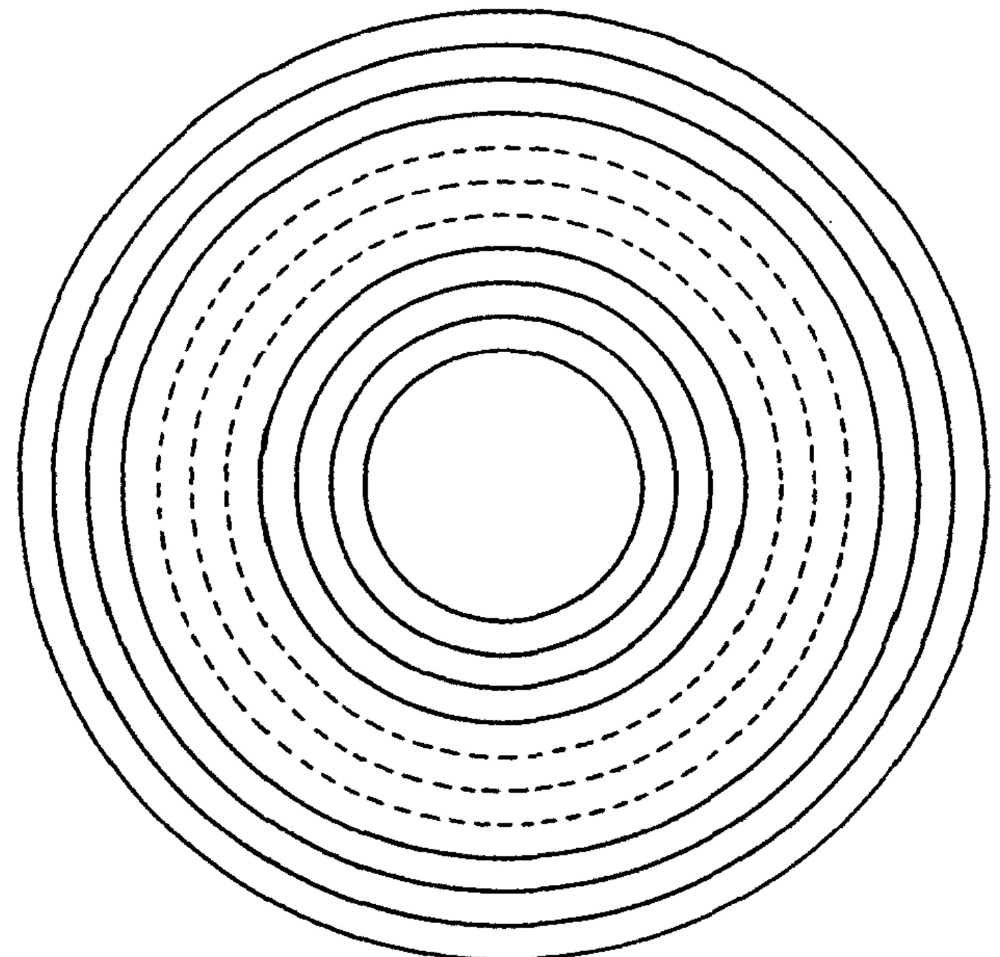

图5.7 亚里士多德设计的相互嵌套的球体。实线表示土星和木星的基本球（各占四层）。这两套基本球之间是三个起抵消作用的球（虚线），它们抵消或“展开”上面土星四层球体的运动，以便把简单的周日运动传递给下面木星最外层的球。

但有一个重要的不同：欧多克索似乎仅把同心球看作几何结构，而亚里士多德似乎把这个系统看作真实的物理实在，并由此导致他认真考虑运动如何从这个球传递给那个球。这迫使他考虑球与球之间的相互连接，并认识到：如果所有七个行星各自都带有一系列相互嵌套的同心球，那么，一个行星（如土星）的最内层球将不可避免地把它的复杂运动传递给系统中紧邻它的那个行星（如木星）的最外层球。当考虑对木星带有的球的这种附加影响时，系统的复杂性将变得难以忍受——而且，将与观察数据不符。亚里士多德通过在土星的最内层球和木星的最外层球之间，增加一系列起抵消作用的球

---

来解决这个问题，并且在每一对相互邻接的行星的基本球之间，都有一系列类似的起抵消作用的球。这些起抵消作用的球，在数量上比紧接其上的行星的基本球少一个，目的如亚里士多德所说，是为了“展开”系统，用于恢复系统中下一个行星的最外层球单独的自转（图 5.7）。亚里士多德留下很多细节问题没有回答；他对欧多克索系统的讨论和修正，在他的著作中仅占一两页篇幅，并以一个不确定的承诺而告终。重要的是，亚里士多德留给后人一部极为复杂的天体机器，这部机器由 55 个行星球和固定在球上的星组成。

他还留给后人一个重要问题：在天文学中，数学和物理学的平衡在何处？是否如欧多克索认为的那样，天文学主要是一种数学艺术？或如亚里士多德的天文学体系所暗示的，天文学家还必须关注宇宙的真实结构？其后两千年，天文学家一直在沉思这个问题。 $ ^{13} $

## 宇宙论的发展

在亚里士多德时代以及随后的一个世纪，在宇宙论方面出现了一些令天文学家感兴趣的发展。其中之一是作为柏拉图的继承者和学园一员的蓬塔斯的赫拉克利德斯（Heraclides of Pontus，约公元前390-339年）提出的建议：地球每24小时绕其轴旋转一周。这个观念逐渐广为人知（虽然很少有人真的接受它），解释了所有天体每天的升和落。通常认为，赫拉克利德斯提出了如下断言：水星和金星的运动以太阳为中心，但现代学者发现，这种解释毫无根据。 $ ^{14} $

晚赫拉克利德斯一两代的萨摩斯的阿里斯塔克（Aristarchus of Samos，约公元前310-230年）提出了一个日心系统，在他的系统中，太阳被固定在宇宙的中心，地球作为太阳的一颗行星绕太阳运转；人们通常认为，阿里斯塔克还给出了其他行星绕太阳运行的轨道，尽管没有历史根据。阿里斯塔克的观念十有八九是毕达哥拉斯宇宙论的发展，毕达哥拉斯的宇宙论已经使地球离开宇宙的中心，绕“中心火球” $ ^{15} $运动。阿里斯塔克已因其哥白尼式的预见而受到赞扬，他的后继者则因没有采用他的提议而受到轻视。然而，只要稍加反思，

---

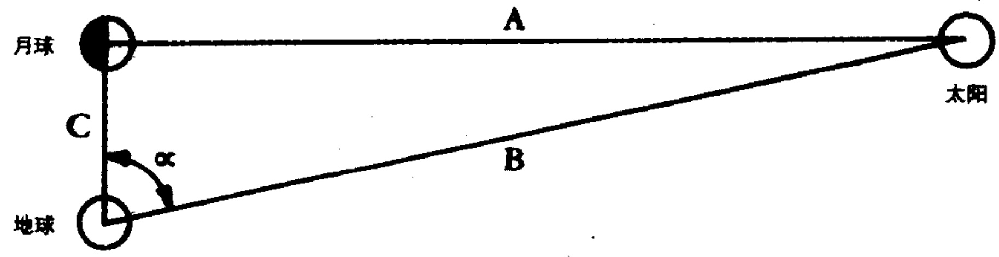

图 5.8 阿里斯塔克测量地球与太阳的距离和地球与月球的距离之比的方法。当月球运行到 “月球—地球” 和 “月球—太阳” 连线或直角时(即 A 边和 C 边成直角)，  $ \alpha $ 角就是从地球上观测月球和太阳的夹角。由此，边长 B 与边长 C 之间的比例是可以测算出来的。但这种方法也有几个缺陷。首先，A 边与 C 边成直角时，月球被照亮一半，呈半月状。此时月球的确切运动难以准确描述。第二， $ \alpha $ 角的微小出入都会导致 B 边与 C 边比例有很大的误差（阿里斯塔克测得的  $ \alpha $ 角是  $ 87^{\circ} $，实际值是  $ 89^{\circ} 52' $）。

我们就能认识到，按照20世纪的标准来评判公元前3世纪时阿里斯塔克的设想是不公平的。问题不在于我们是否拥有成为日心主义者的具有说服力的理由，而在于他们是否拥有这样的理由。答案显然是：他们没有。使地球运动，并给予它行星的地位，这冲撞了古代的权威、常识、宗教信仰和亚里士多德的物理学；而且，还预言了观测不到的恒星视差（当观察者接近、远离一对恒星或改变观测方向时，恒星对在几何关系上的变化）。同时，它所具有的观测上的所有优势（比如，它解释行星亮度变化的能力），其他与传统宇宙论不相矛盾的系统也同样具有。

计算各种宇宙常数的努力在希腊化早期就已存在。阿里斯塔克自己就曾将地球与太阳的距离和地球与月球的距离进行对比，计算出前者大约是后者的20倍（正确比率大约是400:1）。他的方法如图5.8所示。希帕恰斯（Hipparchus，卒于公元前127年之后）从太阳视差 $ ^{16} $的不存在和日食观测数据中算出了太阳和月球与地球的绝对距离。他假定太阳视差刚好在视域之下，并由此估计，地球到太阳的距离是地球半径的490倍。根据日月食的观测数据，他估计地球到月球的距离在59至67个地球半径之间。至于地球的周长，掌管亚历山大图书馆的地理学家和数学家埃拉托色尼（Eratosthenes，活跃于公元

---

前 235 年)，在一个世纪前就已经算出，大约为 252,000 斯塔（stades，不到现代值的 20%），这一结果广为人知，而且从未流失。 $ ^{17} $

## 希腊化时期的行星天文学

行星天文学在希腊化时期似乎得到蓬勃发展，但对其细节我们知之甚少，因为托勒密（Claudius Ptolemy）在希腊化晚期如此成功地总结了其前辈们所取得的成就，以致那些前辈们的著作已经绝版和消失。我们确实知道，因为托勒密告诉了我们，佩加的阿波洛尼乌斯在公元前3世纪提出了一个新的解释行星运动的数学模型。从托勒密的评论和其他保留下来的残篇中可以清楚地看出，希帕恰斯是古代最伟大的天文学家之一。希帕恰斯的主要成就在于观测天文学，他绘制了一幅新的高级星图，发现了分点岁差，发明了一种新的天文观测工具（屈光器），批判了当时的行星理论。我们还知道，希帕恰斯有接触巴比伦天文资料的机会，包括关于行星运动和月食的资料。而且，最重要的是，通过与巴比伦天文学的接触，他越来越欣赏精确的定量预测。是他首先提出了对几何模型赋值的方法；在他的影响下，理论和观察在数量上应该保持一致的要求被纳入天文学，并极大地改变了希腊的天文学。 $ ^{18} $ 要看到这种改变的结果，我们必须求助于托勒密的著作。

托勒密（活跃于公元150年）和亚历山大博物馆及其附属的图书馆密切相关。（“托勒密”这个名字容易造成混淆。它指的不是老托勒密统治王朝的后代，而可能代表亚历山大城的某个地理区域，被市民们当作一个“部落”的名字来使用。对我们来说，其重要性在于，它告诉我们，托勒密与很多亚历山大城早期的知识分子一样，不是新近的移民，而是亚历山大城某个市民的后裔。）如果我们还记得托勒密生活于希帕恰斯之后大约300年、欧多克索之后500年的话，将有助于我们谨防漠视时空的变换。这意味着，他不仅是这几个世纪以来所取得的理论进步的受益者，而且有机会接触这几个世纪的

---

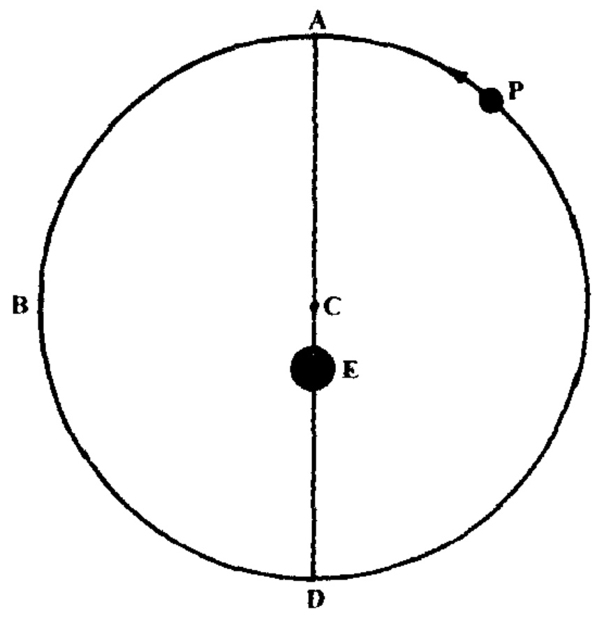

图 5.9 托勒密的偏心圆模型。

天文观测资料，包括希腊的和巴比伦的；这些时间跨度很长的观测数据相对来说即使比较粗糙，也能产生非常精确的理论结果。比如说，希帕恰斯利用公元前2世纪的资料，计算出太阴月的平均长度，与现代值相差不到一秒。 $ ^{19} $

希腊化时期数学的精妙若没有反映在那个时期的数学天文学中，将是令人惊讶的。生活在希腊化晚期的托勒密，将行星天文学的数学能力提高到500年前的欧多克索所无法想象的高度。托勒密模型和欧多克索模型的目标是一致的——寻求可解释行星视位置（即速度和方向上的明显变化）的匀速运动的某种组合。另外，托勒密的模型能对行星未来的位置作准确的定量预测。但他所采用的数学手段极为与众不同。

首先，他用圆代替球。让我们看看如何利用圆上的匀速运动产生非匀速运动。设圆 ABD（图 5.9）是行星的轨道，让行星 P 绕其匀速运动。如果 P 的运动是匀速的，那么它将在相同时间扫过相同的圆心（C）角。如果匀速旋转的中心点 C 与观察点相重合——即，如果地球位于 C 点——那么 P 的运动不仅是匀速的，而且看起来也是匀速的。然而，如果匀速旋转的中心与观察点不重合——比如说地球位于 E 点——那么行星的运动看起来将是非匀速的，越接近 A 点速度似

---

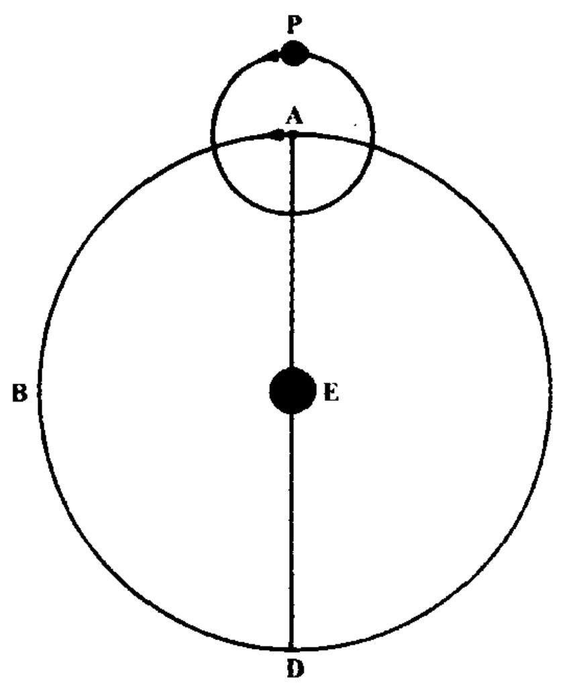

图 5.10 托勒密的本轮—均轮模型。

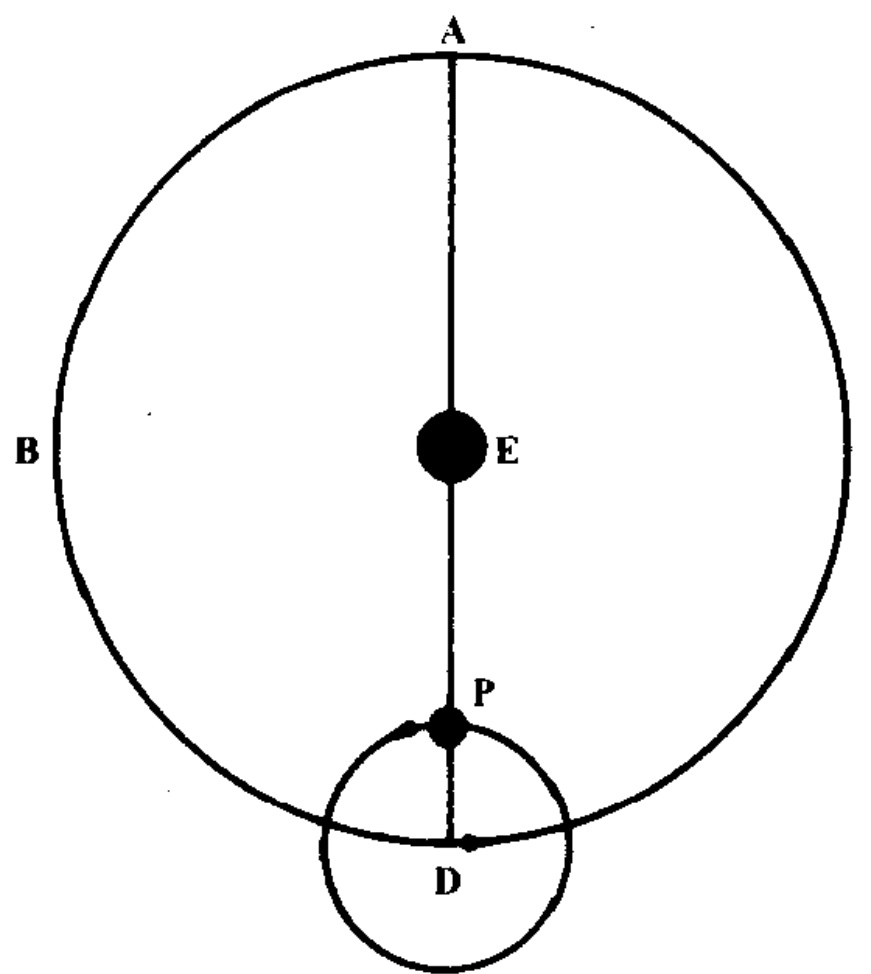

图 5.11 托勒密的本轮—均轮模型，行星运行在本轮的内侧。

图 5.12 利用本轮—均轮模型解释行星的逆运动现象。当本轮在均轮上沿逆时针方向运动时，行星在本轮上逆时针运动。行星的实际运行轨迹由粗线表示。

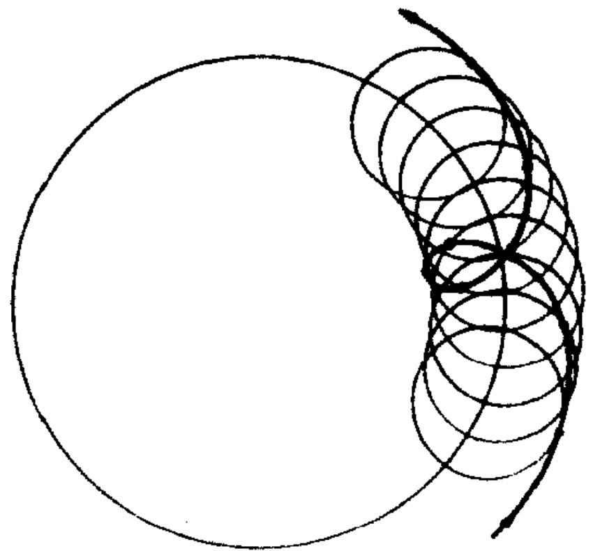

乎越慢，而越接近 D 点速度似乎越快。这就是偏心圆模型。

偏心圆模型足以处理一些简单的不均匀运动，诸如太阳绕黄道的非匀速运动以及由此导致的四季不等。至于更复杂的运动，托勒密发现有必要引入本轮-均轮（epicycle-on-deferent）模型（图5.10）。设圆ABD是一个均轮（携带轮），以均轮上的一点为圆心划一小圆（本轮）。行星P绕本轮匀速运动；同时，本轮的中心绕均轮匀速运动。站在E点的观察者看到的是这两种匀速运动的合成。这种合成运动的确

---

切特征取决于特定参数的选择——两个轮的相对尺寸、运动的速度和方向——但这个模型显然很有潜力。当 P 位于本轮的外侧时，如图 5.10 所示，（从地球上看）行星的视觉运动将是它绕本轮的运动和本轮绕均轮的运动的总和，在该点，行星的视速度最大。当 P 位于本轮的内侧时，如图 5.11 所示，（从地球上看时）其在本轮上的运动和本轮在均轮上的运动将相反，其视觉运动将取决于它们的差值；如果 P 的运动速度是两者中较快者，则该行星表现为向相反方向运动，经历一段时期的逆运动。这种逆运动如图 5.12 所示。

以上这些模型牢牢地建立在这样的基础上：真实的行星运动——即运动的组成成份——是匀速圆周运动。希腊的天文学家经常受到批判，因为他们以一个不合理的，至少是在科学家当中不受欢迎的事先的假设为基础，“教条式”地执着于匀速圆周运动，这样的批判合理吗？事实上：不论古代还是现代科学家，他的每项研究总是从对宇宙性质的一个强有力信念，以及关于可被合理用于描绘宇宙的模型的极为明确的观念开始的。在托勒密的模型中，研究的性质决定了匀速圆周运动这个要求是最恰当的；他的目的，不仅是为了描绘行星所有的复杂运动，而阐明相关的观测资料；而且为了将复杂的行星运动还原为最简单的运动——为了发现表面的无序之下真正的有

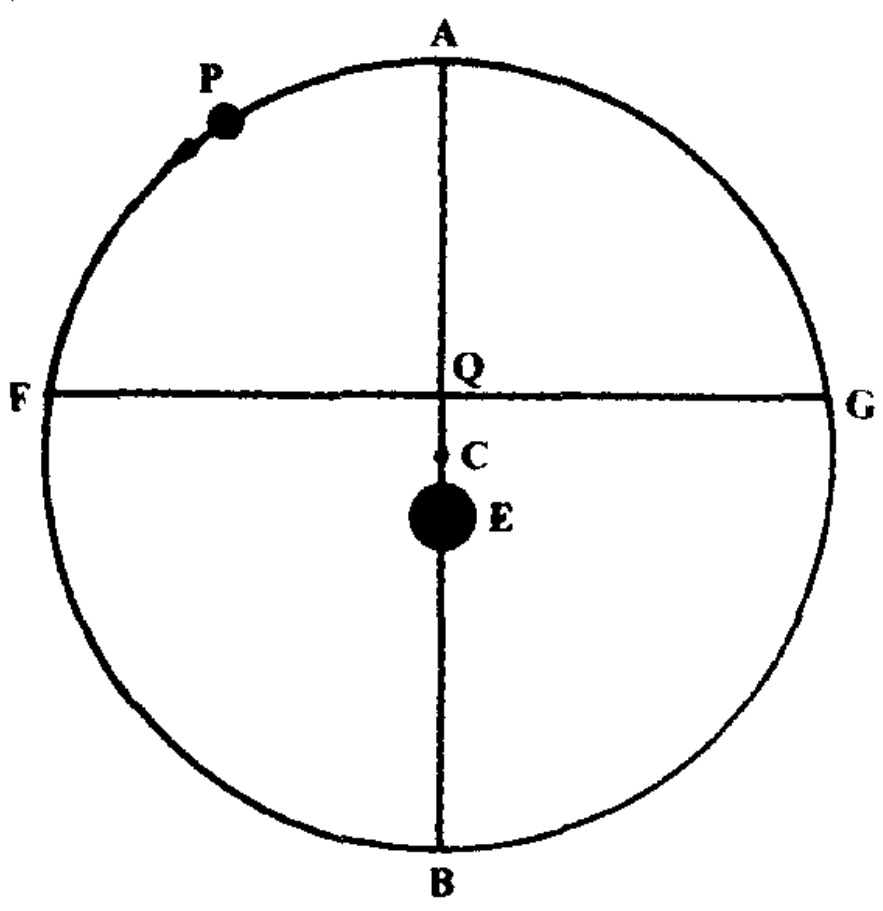

图 5.13 托勒密的对分圆模型。

---

序。代表最终秩序的最简单运动当然是匀速圆周运动。

但人们拘泥于这种以匀速圆周运动为基础的模型，还有很多其他方面的考虑。首先是传统的权威和常识的力量，因为天文现象的周期性、重复性总是预示着天文运动在本质上必定是匀速圆周运动。而且，没有匀速圆周运动的概念，定量预测是不可能的，因为适用于托勒密体系的“三角学”不能轻易地应用于其他任何一种运动。另外，还有美学、哲学和宗教方面的考虑：天空的独特性质要求天体具有最完美的运动和形状。最后，注意到如下这点具有启发意义，哥白尼（Copernicus）于1400年之后与托勒密分道扬镳，并不是因为他不同意匀速圆周运动的承诺，而是（部分）因为，他觉得托勒密没有真正履行这个承诺。

无论如何，基于匀速圆周运动的本轮—均轮模型和偏心圆模型非常强大。但也有局限性，它们无法解释某些行星的运动，这就需要建立另一种模型，即逐渐广为人知的对分圆模型(equant model)。设AFB（图5.13）是一个偏心圆，圆心为C；地球位于E点。当行星在圆上运动时，托勒密不是使行星在相等的时间扫过相等的圆心角（均匀运动的通常定义），而是使行星在相等的时间内扫过相等的相对于对分点——非中心点Q（选取Q点使得QC=CE）——的角。当行星穿过弧AF时，它扫过直角AQF。比如说，假定它扫过这个角和弧需要三年；那么，在另外三年中，行星必然扫过另一个直角FQB，因此也必然扫过相应的弧FB。在另一个三年里，行星从B运行到G，扫过另一个直角BQG，等等。如果我们比较扫过的这些弧，发现行星扫过FB的线速度显然大于扫过AF的线速度；当它从A向B运行时逐渐加速，从B向A运行时又逐渐减速。从位于圆心另一面的对分点，即E点看这个变化的运动时，只会扩大这种表面上的变化。请注意，托勒密在对分圆模型中保留了角速度的均匀——虽然不是关于圆心。但同时，非常干脆地放弃了圆周均匀的线运动。匀速运动的这种冲淡了的版本是否具有充分的解释能力，这个问题由哥白尼在16世纪提出；同时，这种冲淡了的版本使得托勒密成功地完成了他的行星模型。成功的预见胜过任何要求加强匀速运动的考虑。

---

图 5.14 托勒密为高位行星设计的模型。线段 QF 在相等的时间扫过相等的相对于对分点 Q 的角。

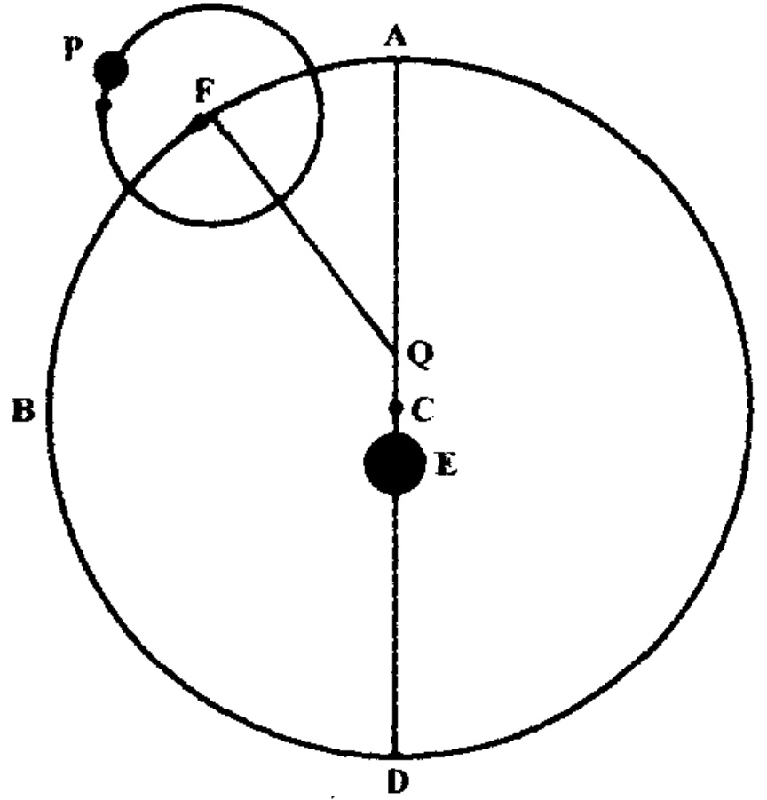

这三种模型——偏心圆模型、本轮—均轮模型和对分圆模型——都是采用匀速圆周运动（不论这种均匀性是否严格）来解释天空中天体运动表面不规则性的有效方式。但通过相互结合，这些模型获得了它们最大的解释能力。定义一个以地球为偏心的均圆，就可以轻易地将偏心圆和本轮—均轮模型结合起来。可以将对分点加进去，由此，本轮的圆心在相等时间内将扫过相等的相对于非中心点的角。甚至可以将偏心圆的圆心移到一个绕地球运动的小圆上——托勒密为了使其月球模型起作用，也只能这样做。 $ ^{20} $ 最典型的行星模型（适用于金星、火星、木星和土星）如图 5.14 所示，ABD 是一个偏心均轮，圆心为点 C；地球在 E 点，对分点为点 Q。行星匀速沿本轮运动；本轮的圆心（用其扫过的角度来衡量）绕对分点 Q 匀速运动；从地球（E）上看到的是最终的运动。事实证明，对余下的所有其他行星的类似模型作适当修改，可极其成功地预见行星的视位置。确实，正是它们惊人的成功使其如此长久地存留下来，并难以被替代。

托勒密从事的似乎是一种纯数学上的练习。他给阐述这些数学模型的论文命名为《至大论》(Mathematical Syntaxis)（或《数学系统》Mathematical System）。而且，他在这篇论文的前言中称：关于天体运动的神因说或对事物的物质本性的沉思只能导致“臆测”，而

---

且，如果目的是获得确定性，数学就是惟一的途径。他在其著作的好几处地方说过：天文模型的选取应以数学上的简单性为基础——显然，不关心物理上的可行性。

尽管如此，如果看得仔细些，我们将发现，实际上，托勒密的分析中也有非数学的考虑。托勒密为地球的中心性和固定性提供了物理证据——这对于他不仅是个数学上的假定，更是一个重要的物理信仰。他谈到天空的性质，认为它们与地面上的实体不同，它们不阻碍运动。在另一篇论文《行星假说》(Planetary Hypothesis)中，他尽力想使他的数学模型实体化。 $ ^{21} $因此，虽然托勒密拘泥于数学方法，但他的数学分析也没有排斥物理上的关注，但这种关注只能在传统自然哲学的框架下发挥作用。

尽管对宇宙物理学感兴趣，托勒密的天文学工作天平侧重于数学分析。而且正是作为一个宇宙数学家，忠实于用数学手段“拯救现象”，托勒密影响了整个中世纪和文艺复兴时代。实际上，亚里士多德和托勒密象征着天文学事业的两极——前者特别关注物理结构问题，后者是才华横溢的数学模型的建造者。

## 光 学

在古代，成功地应用数学的第二个学科是光学。光学包括对光和视觉的研究，很早以前，它就一直是人们研究和思考的对象。人们一直普遍认为，正是通过视觉，我们了解所生活的世界的绝大部分；世上最重要、最令人愉悦的实体就是光，它不仅是产生视觉的工具，而且以太阳光的形式与生命和热息息相关。

任何成熟的自然哲学都必须处理视觉问题。原子论者将视觉归结为：眼睛接受了从可见物体表面发射出的原子薄膜（影子）。根据柏拉图的说法（在《蒂迈欧篇》中），火从观察者的眼中发出，与太阳光结合形成从可见物质延伸到眼睛的媒质，通过这种媒质，产生于可见物体的“运动”被传递到眼睛，最终到达心灵。亚里士多德

---

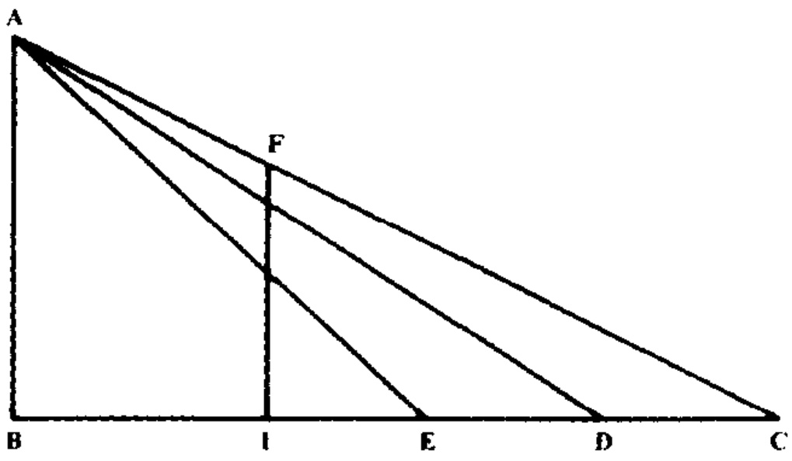

图 5.15 欧几里得的光学几何。A 点是观察者的眼睛，AEC 是从眼发去的视锥。C 点位于可观察视线内的最远点，可由光线 AC 表示。在视锥范围内，与藉此可以观察到 D 点的光线 AD 相比，AC 的位置更高（注意它透过挡板 FI）。

认为，潜存的透明媒质被发光体如太阳照亮时，就激活为实存的透明状态；光就是处于这种状态的媒质。随后，当五光十色的物体与这种处于实在状态的透明媒质接触时，媒质产生进一步的变化，这种变化传递到观察者的眼睛，便产生对这些物质的视觉。 $ ^{22} $

让我们首先来看看晚亚里士多德一辈的人们在视觉理论上的一次数学尝试。欧几里得（活跃于公元前300年）写了本《光学》(Optics)，在该书中，他定义了视觉行为，并逐渐形成一种视觉透视理论。他认为，从观察者的眼中发出许多射线，这些射线成锥形。眼睛位于锥顶，而可视物体位于锥的底边。光线落在其上的物体可被看见。定义了视锥之后，欧几里得利用这种几何实在，逐渐形成了一种几何透视学。《光学》的公设之一是：被观察到物体的外观尺寸是其视锥角的函数；另一个公设是：被观察到物体位置取决于落在物体上的光线在视锥中的位置（落在物体之上的光线在视锥中的位置越高，在观察者看来物体也就越高）。书中有大量定理继续分析了物体的轮廓，认为它与观察者的空间关系是函数关系。比如，图5.15表明，一个更远的物体如何与视锥内一个更高的光线相交，从而使其看起来似乎更高。这是一个饶有趣味、令人难忘的数学分析，并且影响深远。但我们不应仅仅惊讶于数学的成就；我们也应该注意到，这种理论忽略了看的过程的许多方面，而许多人如亚里士多德，认为这些方面是非常重要的——即媒质、物体和眼睛之间的物理联系和感觉动作。简言之，假如你心甘情愿局限于那些可用几何学描述的东西，

---

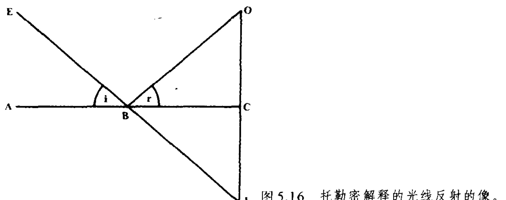

图 5.16 托勒密解释的光线反射的像。

欧几里得的理论是一个惊人的成就；如果你对视觉的任何非几何特性感兴趣的话，欧几里得的理论接近于无用。 $ ^{23} $

希腊化时期论述几何光学的最伟大著作写于欧几里得逝世450年之后，作者是托勒密。他作为天文学家闻名遐迩，当然，也是牛顿之前最重要的光学著作之一的作者。托勒密的《光学》(Optics)仅幸存一个残本，但这个残本已足以显示出托勒密的成就。 $ ^{24} $

对于光学，托勒密没有采用欧几里得那僵硬的几何方法。他宁愿尝试着去创立一种综合理论：将欧几里得的视觉几何理论与对视觉过程的物理和心理方面充分的分析相结合。托勒密由此提出了视锥理论（既适用于双眼的视觉，也适用于单眼的视觉）。除此之外，他还分析了发自眼睛的射线以及这些射线与可见物体的相互作用，从而丰富了视锥理论。尽管如此，托勒密理论的物理方面并没有减损其几何上的成就；事实证明，书中的几何学部分在教会人们如何用几何思考光和视觉方面尤为重要。

从几何的角度来看，托勒密的《光学》给人印象最深刻的可能是反射和折射理论。其他人，包括欧几里得和希罗(Hero)，都曾写过关于平面镜的书；而托勒密在他们的基础上建构了自己的理论。他提出了一个关于反射的全面解释，我们可参照图5.16很好地加以说明。设ABC为一反射平面，点O为观察点，E为眼睛。托勒密论证，

---

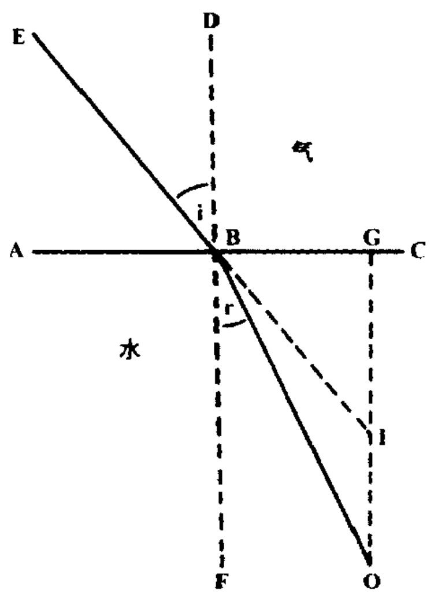

图 5.17 托勒密的折射理论。

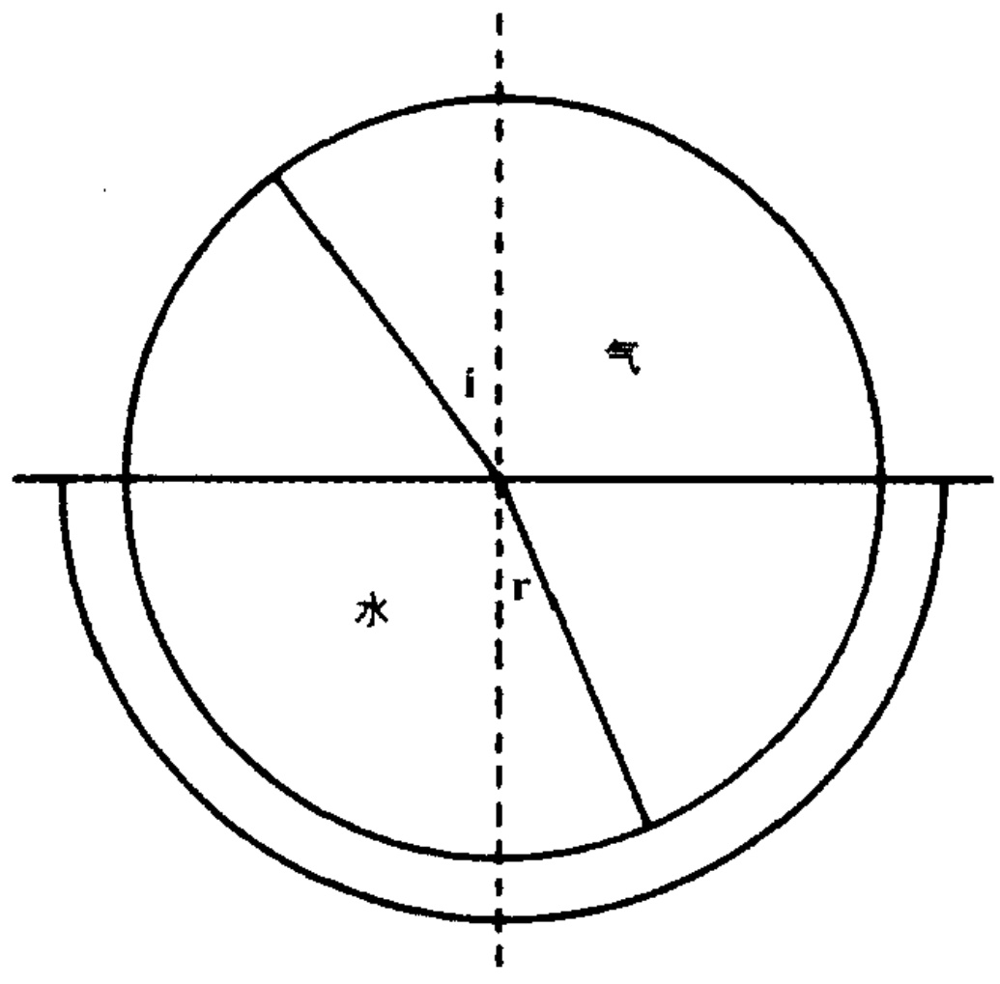

图 5.18 托勒密测量入射角和折射角的仪器。

首先，入射线 EB（记住，光线是从观察者的眼睛传向被观察点）和反射线 BO 确定了一个与反射平面垂直的平面；其次，入射角 i 等于反射角 r；第三，点 O 的像位于点 I，点 I 是从眼中发出的光线的延长线与从被观察点向下引出的垂直于反射面的直线的交点（实际上，观察者不“知道”他或她的视线由于镜面反射而改变了方向，却由此判断，物体在视线的延长线上）。托勒密将类似的规则应用于球面和柱面反射，包括凹面的和凸面的。他创立了一套深刻的处理反射像的位置、大小和形状的理论体系。有趣而且重要的是，他还设计了验证其理论的实验。

如果托勒密的反射理论是以欧几里得和希罗的工作为基础，他的折射理论则是从零开始。最基本的折射现象——比如半浸在水中的棍子“打折”的幻象——老早就为人们所知。但托勒密结合实验调查对折射现象做了彻底的数学分析。如果一条光线从这种媒质倾斜地进入另一种媒质——这两种媒质的光密度不同——光线在交界面改变方向以使其更靠近光密媒质的垂线。因此，如图5.17，如果ABC是

---

一平面交界面，上面是空气，下面是水，DBF 是一条垂直于交界面的直线，E 是观察者的眼睛，O 是被观察点，入射角 EBD 总是大于折射角 OBF。O 点的像将位于点 I，点 I 是入射线 EB 的延长线与从被观察点向折射面所引的垂线 OG 的交点。

在入射角和折射角之间是否存在固定的数学比率呢？托勒密认为一定有，为了把它找出来，托勒密做了个巧妙的实验。他用一个铜盘，在其圆周上刻上度数，测量三对不同媒质（气和水、气和玻璃、水和玻璃）相应的入射角和反射角的比率（见图 5.18）。他没有发现想要的比率，当然也没有发现现代的正弦定律，但他在数据中确实发现一个数学模式——或者，也许是对数据进行了选取或调整，以使它们符合一个合理的数学模式。 $ ^{25} $他还将传给后人对基本折射原理的充分理解、一个清晰易懂令人信服的实验研究范例和一大堆重要的数据。

## 重力学

重力学或平衡学，是希腊化时期屈从于数学分析的第三门学科。实际上，它比前两门学科更完全屈从于数学。在天文学和光学中，数

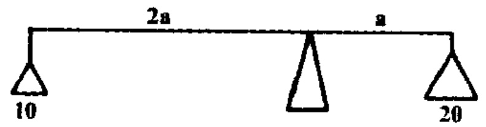

图 5.19 处于平衡状态的平衡杆。

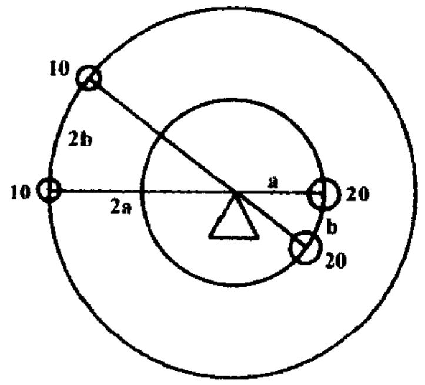

图 5.20 平衡杆的动力学解释。

---

图 5.21 阿基米德为杠杆原理找到的静力学证据。

109 学化的水平是惊人的；但在那两门学科中，还可找到一些数学无法回答的重要物理问题。相比之下，在杠杆平衡学中，物理学几乎可完全还原为数学。 $ ^{26} $

中心问题是，如何解释横梁或杠杆的平衡行为——即这样一个事实：梁的两端悬挂的重量与它们到支点的距离（只计算水平方向的距离）成反比时，梁处于平衡状态。因此，梁的一端的一个重量10（图5.19）将和梁的另一端的一个重量20平衡，如果杠杆的支点与前者的距离是后者的二倍。幸存下来的最早解释之一可在《力的问题》(Mechanical Problems)中找到，该书被归为亚里士多德所写，但实际上是逍遥学派后期的作品。在这里，我们发现一个对静态现象的“动态”解释：作者解释，如果杠杆处于运动之中，重物运动的速度将与其重量成反比。图5.20中，在一个重为20的物体移动距离b的时间内，一个重为10的物体将移动距离2b。这里要解释的概念是：一个运动物体的更大速度恰恰是对另一个物体更大重量的补充。

杠杆原理“静态的”证明出现于一篇据说是欧几里得所写的论文中，更为完美的证据出现于阿基米德的《论平面的平衡》(On the Equilibrium of Planes)中。阿基米德成功地将平衡问题还原为几何学问题。除了考虑重物的重量外，不考虑任何物理性质。杠杆成为一根没有重量的线；摩擦被忽略不计；重量作用于梁上的一点且垂直于它。更为重要的是，以这些假设为基础的证明是欧几里得式的。证明以两个前提为基础：等重的物体离杠杆支点的距离相等时（分别

---

在支点的两边)，杠杆处于平衡状态；位于杠杆臂任何一点上的等重物体都可用一个位于该点与支点的中点（即在它们的重心）但二倍重的重物来代替。这两个前提是借助几何的对称和直观建立起来的。在最简单的证明形式中，如图5.21a，杠杆支持三个重为10的重物，根据对称原理，杠杆处于平衡之中。可是，我们已经同意：其中的两个重物能用一个重为20且位于它们中点的重物来代替，如图5.21b。也就是说，当前者离支点的距离只有后者的一半时，一个重为20的重物将与一个重为10的重物平衡；这种结果很容易总结出来，并得出杠杆原理。

阿基米德的《论平面的平衡》谈到的不仅是这些；他的其他著作，如《论浮体》(On Floating Bodies)，也致力于解决机械问题。但通过考察他对杠杆原理的证明，可以看出他将自然几何化的巨大能力。许多科学问题仍不能用数学方法获得解决，但阿基米德仍然是数学分析能力的一个象征，以及那些相信数学能取得更大胜利的人的灵感源泉。他的著作在中世纪影响有限，但在文艺复兴时期，却成为一个强有力的数学传统的基础。 $ ^{27} $