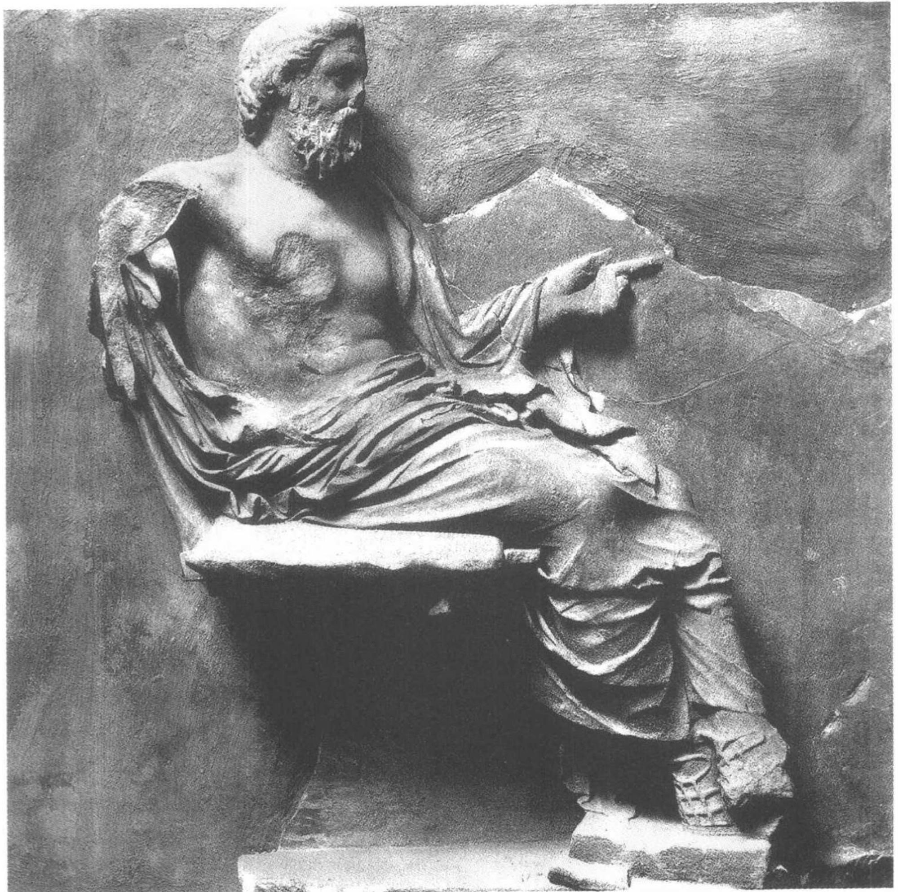
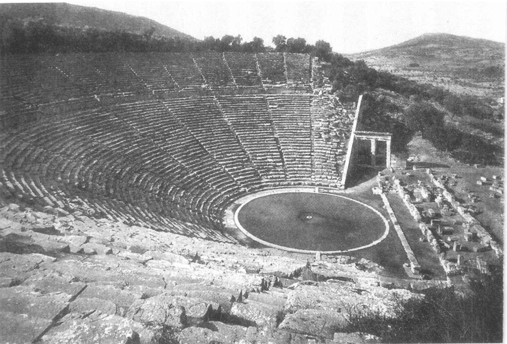
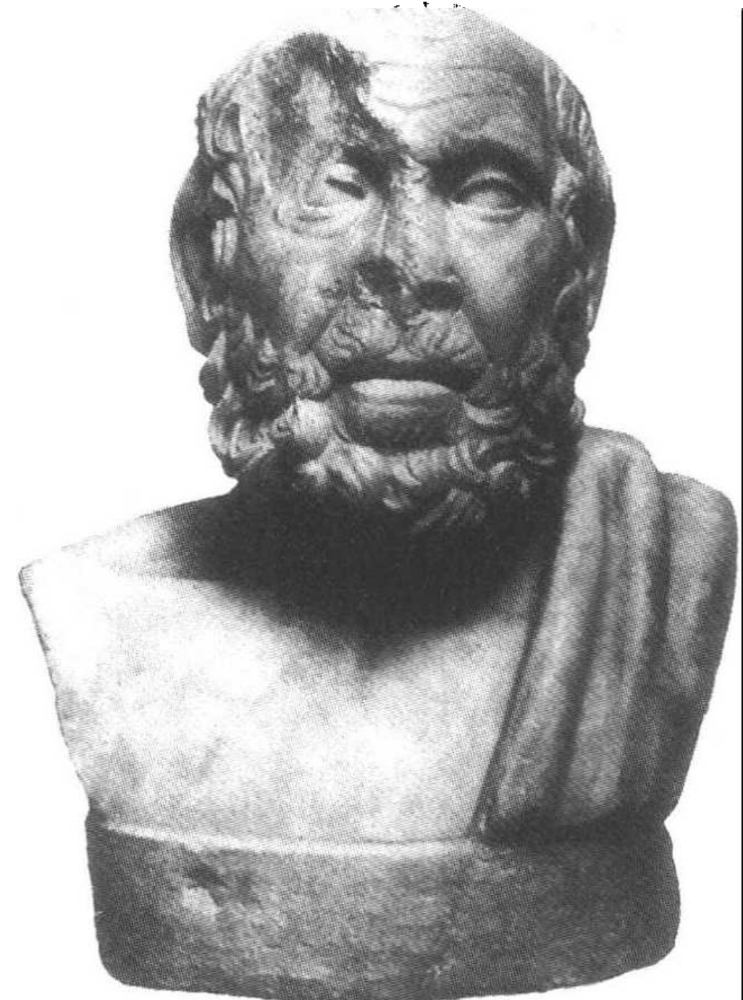
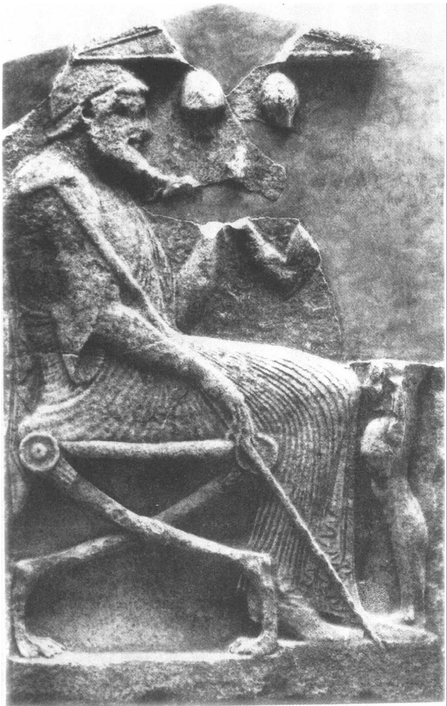

# 第六章 希腊和罗马的医学

## 希腊早期的医学

关于希腊医学的证据有很多残缺，并且希腊医疗实践的很多细节总是无法确定。我们仅仅有5世纪以前的文献资料。我们有几部显然是医学方面的著作，这些书告诉我们古典时期和希腊化时期医学理论和实践的一些情况，但它们也有严重的时间局限。显然，这些医学论著表达了学术医生的观点和看法，他们中许多人对诸如医学和哲学的联系等理论问题很感兴趣；但是，在很多地方它们也从侧面反映出当时流行的医学信仰和想必已经服务于大多数人的医学实践的深厚基础。在下面的叙述中，我们将同时考虑到医疗事业的这两端。

完全可以认为，我们在埃及和美索不达米亚（第一章）已经见到的医疗传统，也可以在同时代的希腊文明——即公元前3000年至1000年青铜时代的文化——中发现。毫无疑问，这些最早期的希腊人与他们在近东的邻居有过接触，并且我们掌握了埃及的医学信仰和实践对他们的影响的具体证据。于是，想必存在着多种多样的医疗活动，从基本的外科手术和内服药的使用，到宗教咒语和睡梦疗法。因此，针对形形色色的病人，各种各样行医者的医疗很可能是在许多层次上、针对形形色色的主顾开展的，他们利用了一切已有的疗

---

图6.1 医神阿斯克勒庇俄斯的浮雕。希腊雅典国家考古博物馆。Alinari / Art resource N.Y.

---

法和技法。 $ ^{7} $

从古希腊诗人荷马和赫希俄德那里，我们能无意中了解到这个时期末医学实践的一些性质。在荷马的史诗《伊利亚特》和《奥德赛》中，众神被看成是引起瘟疫的原因，人们可以通过祈祷他们求得治疗；赫希俄德也认为疾病起因于神。 $ ^{2} $荷马曾述及医疗咒语和药物疗法，其中一些明显来源于埃及。他描述了各种各样的创伤，有时也描述了对一些创伤的治疗方法。他清楚地表明，行医者被看作是一种明确的职业组织或专业团体中的成员——他们是这种意义上的专业人员，即有特殊的技能，并且运用这种技能是他们的全职。

医疗的宗教最清楚地表明在对医神阿斯克勒庇俄斯（Asclepius）的崇拜中。阿斯克勒庇俄斯已被荷马说成是一位伟大的内科医生，他后来被人们神化，并且在公元前4世纪和3世纪成为流行的医疗崇拜的中心。阿斯克勒庇俄斯的神庙比比皆是——已有数百个这样的地方被认定，生病的人们成群结队地来到这些地方接受治疗。治疗过程围绕着医疗幻象或梦，据说求治者睡在一个特殊房间时就会发生。治疗能够在睡梦中进行，或者睡梦中获得的建议可以在以后把病治愈。另外，阿斯克勒庇俄斯神庙的来访者可能要沐浴、祈祷和献祭，也可能会服用泻药、禁食、接受锻炼和娱乐。当然，这些人必然会用合适的祭品来感谢神。伊庇多斯（Epidaurus）是这种崇拜的中心，在那里发现了许多匾牌，这些匾牌意在见证所谓的痊愈曾在这里发生。根据其中一个匾牌的记载，某个名为尼多斯的安逃克拉特斯（Anticrates of Cnidos）的人被矛刺瞎了眼睛，来到伊庇多斯寻求治疗。“他睡着时，看到了一个幻景，好像看到神拔出了进入他眼睛里的投射物，接着又将所谓的瞳孔嵌入他的眼睑。天亮时他就完好地走了出来。” $ ^{3} $ 像这样的宗教活动到罗马时期还一直是古代医学中一个非常重要的部分。

## 希波克拉底派的医学

公元前5世纪和4世纪，一种新的、更世俗化和更学术性的医学，

---

图6.2 伊庇多斯大剧院(公元前4世纪)，信奉阿斯克勒庇俄斯医神的一个医疗中心。该剧院可容14,000人就座。Foto Marburg / Art Resource N. Y.

图6.3 希波克拉底(希腊原作的罗马复制品)。

---

与传统的医疗活动一起发展起来。这种医学传统受当时哲学的影响，并且与科斯岛的希波克拉底（Hippocrates of Cos，公元前460-370年）的名字联系在一起。不能肯定现在称为“希波克拉底著作”或“希波克拉底文集”的一些作品是否真为希波克拉底所著。我们仅能断言，这些作品是一些松散地组织在一起的医学论著，大部分是在大约公元前430年至330年间编撰而成的，后来由于它们似乎具有“希波克拉底的”特点，而将它们收集并归属到希波克拉底名下。那么这些著作的特点是什么呢？ $ ^{4} $

最突出的是，希波克拉底著作代表着学术性医学。它们是“著作”这一事实就已经说明了这一点。它们的作者是有文化的。他们的著作是寻求理解的最终产物。许多希波克拉底派作者捍卫的各种观点涉及医学的本质是艺术或科学、疾病的本质和原因、人体结构同整个宇宙的关系，以及关于疾病的治疗和治愈的原则。他们致力于那种我们必须宽泛地定义为自然哲学的事业——他们要么作为原创性思想家，也就是致力于研究健康与疾病的根本原因问题的哲学家，要么作为借鉴这种哲学传统的从业医生。他们站在医疗职业和哲学事业的交叉点上。希波克拉底派的医生或许对这些根本问题的看法并不一致，但是他们都决心以研究学问的方式来认识它们。甚至那些不满于哲学侵入医学的希波克拉底派作者也逃脱不了它的影响。 $ ^{5} $

希波克拉底著作对医学职业提出了一种什么样的观点呢？我们要记住，古代的医学活动是完全不规范的：各种类型的行医者为了获得认可和地位而竞争，当然也有为生意而竞争。医学知识不是在正规的医学院学习到的，一般都是通过学徒成为从业医生的过程学会的。希波克拉底著作的关注点之一，是要确立标准，剔除江湖郎中，以及形成对学术医学有利的氛围。希波克拉底著作重视成功的预后，这不仅仅是为了增加医生作为一个行医者的成功率，而且也是为了提高他的形象，进而促进他的事业。最后，希波克拉底誓词(the Hippocratic Oath）是从医者们试图自我约束的一种努力。

在许多希波克拉底著作中，关于健康和疾病的理论非常突出。从总体上看，最引人注目的是在理论上大大减少了巫术和超自然的成

---

份（但并非像有人主张的那样完全消失了）。当然，众神是存在的，而且自然本身可能也被看成是神性的，但是神的干预已被排除在疾病或健康的直接原因以外了。我们在各种希波克拉底作品中可以看到这一点，其中包括论著《论神病》(On the Sacred Disease)（这种病并不精确对应于任何一种现代疾病，但包括了癫痫、可能还有中风和脑瘫等病的症状），在该文中作者表达了这样的观点：

那些首先称这种病为“神病”的人，就是我们现在称为巫医、信仰治疗者、庸医和江湖郎中的那一类人。他们是那种假装很虔诚和特别智慧的人。通过乞灵于神，他们掩盖了自己不能作出适当治疗的失败，并通过把这种病称为“神圣的”疾病而掩盖了他们对它的本性的无知。

作者接着提出了自己的自然主义的解释，认为该病起因于大脑的粘质对“血管”的阻塞。在这里重要的是，自然被假想为是在始终如一地运行着；无论这些原因可能是什么，它不会是反复无常的，而是齐一的和普遍性的。

希波克拉底派的论著常常将疾病与身体的某种失衡或对它的自然状态的干扰联系在一起。在数篇论文中，疾病是与体液或流体相联系的。在《论人的本性》(On the Nature of Man)中，有这样一种理论，认为四种体液——血液、粘液、黄胆汁和黑胆汁——是人体的基本构成成份，并且这些体液的失衡就会引起疾病：

人体包含血液、粘液、黄胆汁和黑胆汁。它们就是构成人体和使之病痛和健康的东西。健康主要是这些成份相互间在强度和数量上均有正确的比例而且较好地混合在一起的一种状态。当一种物质或缺乏或过剩，或者在人体内被分离而不能与其他物质混合时，病痛便会产生。

每种体液都与下列基本性质中的一对相联系：热、冷、湿、干。

---

这种说法将疾病与暖和湿的过剩或不足联系在一起，并由此得出不同的季节往往是不同的体液占主导地位的结论。例如，粘液，其性冷，冬天时它的量就会增加；因此，在冬天，由粘液而引起的疾病特别普遍。春天，血液是主导；夏天是黄胆汁；秋天则是黑胆汁。当然，季节因素并非疾病的惟一原因：食物、水、空气和锻炼也影响人的健康状况。

如果疾病与失衡有关，那么疾病的治疗必须直接针对平衡的恢复。节食和锻炼（它们一起构成了所谓“养生术”）是一种最普遍的疗法。清泻身体——通过放血、催吐剂、轻泻剂、利尿剂和灌肠——是另一种恢复体液平衡的方法。对季节和气候因素以及对病人的自然禀性的细心关注也是成功疗法的一部分。因此，自始至终，医生认为大自然有其自身的治病能力，并且认为医生最基本的任务就是辅助自然的治病过程。医生相当大的责任是预防疾病，即建议人们如何调节饮食、锻炼、沐浴、性活动及其他影响病人健康的因素。

但是这些学术医生不只是提供建议。他们也从事我们可以看作是“临床”的医学活动。各种希波克拉底论文都提供了关于病情的检查程序、诊断和预后（预料疾病可能的未来过程）的指导。我们了解到他们要寻找什么样的症状以及怎样去解释它们；医生要考查病人的面容、眼睛、手掌、姿势、呼吸、睡眠、粪便、尿液、呕吐物和痰；留意病人咳嗽、打喷嚏、打嗝、肠胃气胀、发热、痉挛、脓疱、肿瘤和损伤。还提供了展示某种疾病的典型过程的病例史。许多病例的精确和清晰令人吃惊。例如，看看下面这段对想必是流行性腮腺炎的描述：

许多人患上了耳旁肿胀，这种肿胀有时只出现在耳朵的一侧，有时则是两侧都会出现。通常情况下病人不发热，并且不一定得卧床。在少数情况下会有轻度发烧。在所有病例中，这种肿胀消退后不会留下伤害，并且不会像在其他疾病中引起的肿胀那样出现化脓（即流出脓液）。这种肿胀大而柔软，并且会向周围扩散；它们并不带来发炎或疼

---

痛，而且消失后不会留下痕迹。男孩儿、青壮年男子是主要患者，并且……那些从事角力和运动的人特别容易染上这种病。 $ ^{8} $

在观察症状的基础上，医生作出诊断和预后。最后如果病是可以治疗的，他便提出治疗方案。我们已经提到，治疗常常是食疗或者是调节锻炼和睡眠；它也可能包括沐浴和按摩。但许多特殊的疾病被认为需要某种内服或外用药来医治；希波克拉底著作中提到数百种药物，大部分是草药：轻泻剂、泻药、催吐剂（引发呕吐）、麻醉剂、助咳药（促发咳嗽）、止痛药、膏药以及粉剂。最后，希波克拉底著作中也论及对创伤、骨折和脱臼的治疗——它们达到的技术水平令现代医生感到钦佩。

最后，我们一定要简单讨论一下这种医学文献中体现出的探究原则。除了致力于以批判的方式探究医疗事业，并决心运用自然主义的解释和治疗原则之外，这些文献中的一致性便消失了。某些论文展示了强烈的哲学思辨倾向。例如，《论人的本性》的作者提出了关于人的本质和关于健康与疾病的思辨性理论，并从这些理论中得出了几个治疗原则。然而，希波克拉底文集的其他文章则攻击了这种思辨方法。《论古代医学》(On Ancient Medicine)的作者对在医学中使用假说表示怀疑，特别是对疾病由四种性质不平衡引起的假说。他认为，这种理论导出的疗法与其他医生开出的治疗法并无重要的差别，仅仅是蒙上了一层“技术上胡言乱语”的迷雾而已。 $ ^{9} $他和其他有怀疑倾向的希波克拉底派作家，宁愿让医生在累积的经验基础之上谨慎行事，仅仅在那些关于因果的理论得到了压倒性证据的支持时才接受这些理论。正如我们已经看到的，这种立足于经验的告诫，在希波克拉底文集的仔细诊断程序及给人留下深刻印象的病例史方面产生了成效。有时我们甚至能发现为证实一个理论结论而去进行特定的观察——比如在《论神病》中，作者建议去解剖一只有病的山羊，以便说明疾病是由脑中粘液的积累而引起。 $ ^{10} $

在结束对希波克拉底派医学的讨论之前，我们必须以如下两点

---

提醒大家。首先，当学术医学出现时，它并没有赶走它的对手。学术医学从来不是惟一的医学类型，甚至也不是最流行的，而是与传统形式的医疗信念和实践共同发挥着作用。在整个希腊古代（从公元前5世纪开始），病人可能会求助于学术医生、阿斯克勒庇俄斯神庙的信仰治疗者、接生婆、草药采集者和接骨者的治疗。而且，划分这些不同类型行医者的界线很模糊——譬如，神庙中的治疗就可能与学术医学有密切的联系。而且，看来毫无疑问的是，病人有时会同时或先后接受几种类型的治疗。

其次，如果说传统医疗活动继续与学术医学并存的话，那么，它们也在某种程度上被融合到了学术医学之中。也就是说，我们绝不能将学术医学高估为一种早期的现代医学。希腊医学就是，怎么说，……希腊的。必须把它置于古希腊人的世界观和哲学框架之中；而这就意味着它并不排除现代西方医生认为是非常古怪的或极为反感的那些医学信念和实践。因此在整个古代，梦疗法一直就是医学（包括希波克拉底医学在内）的一部分。 $ ^{11} $尽管神的干预被排除了，但宗教因素并没有完全消失。这方面一个最简单的例子是，在希波克拉底誓词的开篇几行，医生向阿波罗和阿斯克勒庇俄斯发誓，并且请求众神见证他的誓词。如果我们认为它可能只代表了一种空洞的仪式（就像无神论者或不可知论者在法庭上把手搁在《圣经》上发誓那样）因而想放弃这个例子的话，那么，一个更令人信服的例子是，一位希波克拉底派的作者除了建议采用养生法外，还建议祈祷。 $ ^{12} $还可以考虑宗教存在的一个更微妙的例子，当《论神病》的作者否认疾病是神干预的结果时，他只是认为，每一种疾病都有自然的原因；他并不反对说这种自然原因本身是神的作用的一个方面或一个表现。大部分希波克拉底派医生无疑继续相信，自然事物具有神性，并且疾病既是自然的也是神性的。

## 希腊化时期的解剖学和生理学

我们掌握的关于希腊医学的原始文献奇怪地分成两部分。我们

---

有希波克拉底派的著作，反映的是早期希腊医学的情况；我们也有许多来自早期基督教时代的资料，为我们提供了罗马帝国统治下的医学的详尽情况。但是两者之间有一个四五百年的时期，我们对此只有零碎的医学文献。对此事的解释并不意味着(在这个时期中)医学实践停止了，或者人们不再撰写医学论著(尽管医学论著的产量无疑有起有落)；而是由于我们所不知道的缘由，这段时期的医学著作没有保存下来。所以，对这段时期的医学发展，我们必须通过后来作者们在其著作中的零碎描述而重构其概貌。 $ ^{13} $

希波克拉底派医生的人类解剖学和生理学知识似乎十分有限。在希波克拉底医学文献产生的那个时期或者在此之前，几乎没有什么证据可以表明曾进行过系统的人体解剖——这无疑与必须适当埋葬死者的传统禁忌有关，也可能与没有适当理由认为人体解剖能带来有益的知识有关。当时拥有的解剖学知识无疑是在外科手术或者处置伤口的过程中获得的，或者是从动物的解剖（理解的相当完整，这要归功于亚里士多德）中类推出来的。

因此，当人体解剖活动于公元前3世纪在亚历山大城开始时，它就是一个有重大意义的事件。 $ ^{14} $ 这一极不寻常的革新是怎样开始的，我们并不确切知晓。但它无疑与托勒密王朝的皇室资助有联系，因为这个王朝的强大使它完全有能力去打破传统的埋葬禁忌，只要它想那样做；或许也可能与医学的发展提高了解剖学知识的重要性有关；或许与希腊医学被移植到一种新的社会和宗教环境中有关；它看来好像发生于一种哲学的背景中，在其中脱颖而出的新问题可能需要新的探究方法。无论是什么理由，古代的证据实际上都一致坚持认为，是卡尔西登的希罗弗勒（Herophilus of Chalceton）和西俄斯的伊雷西斯垂都斯（Erasistratus of Ceos）最先开展了系统的人体解剖；倘若我们相信罗马百科全书编撰者塞尔苏斯（Celsus）和神父德尔图良（Turtullian）的话，他们甚至对囚犯进行过活体解剖。

他们学到了什么呢？希罗弗勒（约卒于公元前260年或250年）是一个土生土长的小亚细亚人，在徙居亚历山大城之前，曾师从科斯岛的普罗克萨格拉斯（Praxagoras of Cos）习医。在亚历山大城，他

---

的工作得到托勒密王朝最初两任统治者的资助。他的病理学理论和医疗实践，就我们所知，似乎具有希波克拉底派的特征；他是作为解剖学家才开辟了新的领域。 $ ^{15} $ 希罗弗勒研究了脑和神经系统的解剖学，确认了两类脑膜（硬脑脊膜和软脑脊膜），并且发现了神经、脊髓与脑的联结处。他对感觉神经和运动神经的区分说明他了解神经系统的功能。他非常仔细地考察了眼睛，辨认出了眼睛的几种主要液体和眼膜，而且创建了一种现在还使用的技术命名法；他发现了从眼睛到大脑的视神经，并且认为它充满了精细的精气。

希罗弗勒也探究了腹腔内的器官。他仔细描述了肝脏、胰脏、肠、生殖器官和心脏。他根据血管壁的厚度区分了静脉与动脉。他考察过心脏的瓣膜。他研究过脉搏——尽管他不理解它是对心脏泵血功能的一种机械反应——并且他将脉搏的节律变化作为诊断和预后的手段。他描述过卵巢和输卵管，并且写了一篇产科学方面的论文。即便是这种简单的概述，也展示了希罗弗勒作为一位人体解剖学和生理学学者的惊人成就。

他的工作由与他大致同时代的西俄斯的伊雷西斯垂都斯（约生于公元前304年）继承了下来，伊雷西斯垂都斯曾在雅典的逍遥学派和科斯岛学习过医学。 $ ^{16} $他继承并发展了希罗弗勒关于大脑和心脏结构的研究。他出色地描述了（盖伦为我们引述了他的描述）两尖瓣和三尖瓣以及它们在决定血液单向流经心脏方面的作用；根据伊雷西斯垂都斯的观点，心脏发挥了一个风箱的作用，它通过扩张将血液或精气抽进来；通过收缩将血液压入静脉血管以及将精气压入动脉血管。伊雷西斯垂都斯认为，心脏的扩张和收缩是它的一种天生能力的结果；他正确地认为，动脉脉搏跳动时动脉的扩张仅仅是对心脏扩张和收缩的一种被动反应。

尽管我们拥有希罗弗勒生理学理论的重要篇章（例如，他的脉搏理论），但他似乎对结构比对功能有更大的兴趣。而在伊雷西斯垂都斯的著作中，我们发现了多得多的的生理学知识。伊雷西斯垂都斯显然受逍遥学派、特别是斯特拉托的影响，认为物质由被细微的虚空分离的细小粒子构成；他将这种微粒说和精气理论结合起来，解

---

释了种种生理过程。我们以他关于消化、呼吸和血管系统（由于后来对盖伦的影响而特别重要）的解释为例来说明。

伊雷西斯垂都斯相信，人体内的所有组织都含有静脉、动脉和神经，并且这些脉管起了通道的作用，各种对人体发挥功能有根本意义的物质，就是通过这些通道输送到其各个器官的。食物进入胃，在胃中机械地还原为汁，这些汁液经过胃壁和肠壁上的微孔而到达肝脏，在这里转化成血液。然后血液经静脉输送到人体的所有部分，在这些地方它提供了营养并负责人体的成长。对比之下，动脉血管仅仅含有精气，它是在呼吸过程中从空气中吸入的，并且经过“静脉状动脉”（我们现在所说的肺静脉）传送到心脏的左侧；精气从心脏经动脉而分散到人体的所有部分，并赋予这些部分以生命力。最后，神经含有更精细的精气，即“心灵”精气，它是动脉精气在大脑中经改良而产生的，并负责感觉和运动的功能。为了解释整个身体中这些物质的运动，伊雷西斯垂都斯诉诸自然对真空的厌恶：心脏的泵血活动或者器官中物质的消费或消耗，要求立即吸取血液或精气去占据新产生或新空出的空间。

这是一个非常重要的理论，它的部分内容在西方生理学思想中保留了将近2000年。但是，甚至在伊雷西斯垂都斯时代，一种显然是具有决定意义的反对意见就已经提了出来——即当一条动脉（精气通过这种通道输送到身体的所有部分）被割断时，血液便会从中流出。伊雷西斯垂都斯针对这种反驳论辩道，在通常情况下，静脉和动脉是不连通的；然而，当一条动脉血管被割开时，逃逸的精气便产生或将要产生一个真空；这种潜在的真空打开了静脉和动脉之间的细微通道（网结），让血液暂时从静脉传输到动脉，并随着逸出的精气而从伤口流出。

伊雷西斯垂都斯有关营养和血液流动的理论容易引起一种疾病理论，它认为疾病主要是由于静脉过剩血液的泛滥而引起的，这归因于饮食过剩。例如，如果静脉血管过多地充入血液，静脉和动脉系统间通常关闭的通道就可能被迫开通；然后血液可以传输到动脉，接着通过动脉系统，送到四肢，在那里引起炎症和发热。根据这样

---

图 6.4 古希腊的内科医生，墓室中的浮雕，公元前 480 年。巴塞尔古典艺术博物馆，Inv. no. BS 236。

---

一种疾病理论可以得出，治疗方法必须针对减少血液的数量。这可以通过限制食物摄入或通过（较不普遍的）放血而完成。

## 希腊化时期的医学派别

希罗弗勒和伊雷西斯垂都斯在医学界引起了极大的关注，并且将先进的医生和医学理论家引入他们的轨道。这些学者和观察家无疑被这两个人的成功和他们的学说所鼓舞，但他们似乎并不认为应该把自己束缚在任何一个学术正统当中。毕竟，希罗弗勒和伊雷西斯垂都斯本人对许多问题的看法也不一致。希罗弗勒的学生、科斯岛的菲里纳斯（Philinus of Cos），写了一本反对希罗弗勒的某些教导和希罗弗勒派的书，引发了一轮攻击与反攻击。在后来的几个世纪中，希罗弗勒派及其批评者（以“经验论者”（empiricists）而著称）出产了相当数量的论辩文献。希腊化时期的医学开始分化成一些对立的医学门派，每一门派均有自己的医学理论和自己的方法论纲领。

最后，出现了几个群体。 $ ^{17} $ 其中的一族门派，部分地传继自希罗弗勒派和伊雷西斯垂都斯派，在古代已经聚集在“唯理论者”(rationalists)或者“唯教义论者”(dogmatists)的招牌之下。必须强调，“唯理论者”或者“唯教义论者”并没有构成一个统一或融贯的运动，而是在许多问题上意见相左；如果说有什么东西把他们统一在一起的话，那就是，总的来说他们致力于思辨的和理论的医学的承诺——一种试图将我们在主要的哲学学派中所见到的自然哲学方法应用于医学领域的努力。一些“唯理论者”继续捍卫人体解剖是一种有价值的方法论工具，能够有助于形成关于隐藏的疾病原因的假说；而他们所有人都能同意的是生理学理论对医学实践的价值。

他们的主要对手和攻击者“经验论者”，采取了一种根本对立的观点，他们认为，理论思辨，包括对生理学知识和隐藏的病因的探求，都是在浪费时间；特别是，他们认为人体解剖对医学知识没有任何有用的贡献，故应予以禁止。简而言之，“经验论者”坚持认为，由希罗弗勒和伊雷西斯垂都斯发展起来的解剖学和生理学传统，以

---

及根据他们的理论衍生而出的观点是医学上的一条死胡同，应该加以避免。成功的医生应该关注可见的症状和可见的原因，应该根据过去（自己和前人）对各种疗法的效力的经验来推荐治疗方法。

公元1世纪时，在罗马出现了第三个医学门派，名为“唯方法论者”(methodists)，它的基本主张是，“唯理论者”和“经验论者”已使医学变得不必要的繁琐——学术医学的精奥之处，包括解剖学、生理学以及对病因的（潜在的和明显的）探究，都是可以舍弃的。“唯方法论者”学说的核心是，疾病取决于身体的紧张和松弛，因此治疗方法也应直接地和“从方法上”基于这一前提。这种学说在罗马贵族中十分流行，他们的支持使得“唯方法论者”在罗马和整个希腊化世界中成为一股强大的医学势力。第四个门派是“精气论者”(pneumatists)，他们在斯多葛派原理的基础上创立了一种医学哲学。最后，我们必须提及毕悉尼亚的阿斯克列皮阿德（Asclepiades of Bithynia，活跃于公元前90-75年），他是一位有影响的罗马医生，主张原子论学说而拒斥体液理论。

## 盖伦和希腊化时期的医学顶峰

盖伦（Galen）16岁决定从医时，他所进入的医学界就是这样一个状况。盖伦于公元129年生于佩尔加蒙（小亚细亚和整个希腊化世界的先进学术中心之一）。在转而学医之前，他曾学习过哲学和数学。 $ ^{18} $他四处旅行，开始是为了获得教育，后来则是寻求资助，反映了古代世界学者的高度流动性。盖伦学医先是在佩尔加蒙和士麦那（两者均在小亚细亚），然后在希腊大陆的科林斯（Corinth），最后是在亚历山大城。从亚历山大城，他返回佩尔加蒙担任角斗士的医生，然后又到罗马寻求资助，回到佩尔加蒙，再到意大利，最终定居罗马。在那里他受到了礼遇，并且为有权势的富人提供医疗服务，其中包括马库斯·奥里利厄斯、康茂德（Commondus）和塞普蒂穆斯·塞维勒斯（Septimius Severus）三位皇帝。他卒于210年以后。盖伦著述极丰，其中流传后世的部分在19世纪的标准版本中汇编成22卷。

---

这些著作总结了古代学术医学传统的知识并评判了其中的主要争论，从而使盖伦成为古代最主要的医学权威——只有希波克拉底能与之匹敌——并且直到近代还有着无与伦比的影响。

盖伦是一位学养宽广的哲学家，他知晓古代的所有主要哲学论争，并致力于整合医学和哲学。他受到希波克拉底著作、柏拉图、亚里士多德和斯多葛派、希罗弗勒和伊雷西斯垂都斯的解剖学和生理学著作以及希腊化时期医学论争的有力影响。他被描述为一个折衷的唯理论者， $ ^{19} $对疾病比对病人更有兴趣，把后者看成是理解前者的媒介。他的医学目标的核心是对疾病进行分类——发现特殊背后的共相——以及寻找它们的潜在原因。他确信，解剖学和生理学知识是这种事业成功的核心。

希波克拉底的影响对盖伦医学哲学的形成至关重要（尽管他能自由地选择借鉴何人的思想并且宽泛地解释借鉴来的东西）。它为盖伦提供了关于人体结构和医生职责的看法，使他重视临床观察和病例史的重要性，关注诊断和预后，并形成了他对治疗的一般观念。从希波克拉底著作《论人的本性》中，盖伦吸取了四体液说的观念——认为人体的基本构成要素是血液、粘液、黄胆汁和黑胆汁，它们又可还原成基本性质：热、冷、湿、干。他认为，这四种体液共同形成了组织，组织结合成器官，器官联合构成了人体。

疾病或者与体液间和它们的成份性质间的失衡有关，或者与特定器官的特殊状态有联系；在诊断技能方面，盖伦的主要改进之一，是通过鉴定特定的病变器官来定位疾病。盖伦关于发热的讨论，说明了他的疾病理论的两个方面。他认为，全身性发烧的产生是由于正在化脓的体液的热量充满全身；局部性发烧源于某一特定器官内有害或有毒的体液，这种体液会导致硬化或肿胀之类的病变，也会导致疼痛。为了诊断之目的，盖伦尤其依靠诊脉和对尿液进行检查；但他也意识到需要考虑希波克拉底著作中强调过的所有其他方面的症候。他在《论治病的技能》(On the Art of Healing)一书中写道：

遇到病人，在研究最重要症状的同时，不要忘记最细

---

微之处。因为我们从最重要的症状得出的结论要由其他的这些症状加以确认。人们一般是从脉搏和尿液中获得发烧的迹象。但正如希波克拉底所教导的那样，将其他的病症与这些迹象结合起来是十分必要的，这些病症有：脸部出现的症状、病人卧床的姿势、呼吸、上下排泄物的性质，……是否头痛，……病人表现的虚弱或精神良好，……（以及）身体的外观。 $ ^{20} $

盖伦相信，关于单个器官结构和功能的知识是成功的医学实践所必不可少的。他宣扬解剖学知识的重要性，但也承认在他的时代，人体解剖不再可能。他力劝读者留意偶然得到解剖观察机会的可能性，诸如坍塌的墓穴或路旁尸骨；对那些有能力的人，他建议他们去亚历山大城，在那里还能够对骨骸进行第一手考察。但是，他承认大部分人体解剖学知识将不得不从那些结构类似人类的动物的解剖中通过类比而推论得到。盖伦解剖了许多动物，包括一类称为有须短尾猴的小猴子（猕猴）。从几本解剖学著作，包括一本指导解剖学的书《论解剖的步骤》（On Anatomical Procedures）中，可以清楚地看出他作为一个解剖学家的技能。他提供了关于骨骼、肌肉、大脑和神经系统、静脉和动脉以及心脏的精彩描述。当然，他从希罗弗勒和伊雷西斯垂都斯的著作中吸取了不少知识；但是，当他觉得他们有错时，也毫不犹豫地纠正这些先辈们的错误。不幸的是，盖伦的动物解剖导致将某些仅能在动物中才可发现的解剖学特征错误地归属到人体上；最著名的例子是微动脉网（rete mirabile）的错误，下面我们再去说它。然而，流传下来的是盖伦的解剖学著作，而不是希罗弗勒和伊雷西斯垂都斯的著作；因此，直到文艺复兴时期，一直是盖伦向欧洲提供了惟一的人体解剖的系统说明。

盖伦的生理学系统还有更复杂的根源。柏拉图曾经主张过灵魂三分说，这个三分灵魂由一个高等的（“理性的”）部分和两个低等的部分（与情感和欲望相联系）构成，它们分别位于大脑、胸部和腹腔内。盖伦采用了这个框架，并且将柏拉图确定的灵魂三种官能

---

与伊雷西斯垂都斯确定的三种基本生理学功能联系起来；结果是生理学的三分组成框架。在这种框架中，大脑（灵魂的理性官能居所）被确定为神经的源头。追随伊雷西斯垂都斯的说法，盖伦主张，神经包含心灵精气，负责感觉和运动功能。对盖伦来讲，心脏（情感的居所）成为动脉的源头，动脉将维持生命的动脉血（和生命精气）输送到身体的所有部分。而肝脏（愿望或欲望的居所）被认为是静脉的源头，用静脉血为身体供给营养。 $ ^{21} $

这三个生理学系统，如盖伦所阐发，不是完全独立而是相互有联系的。因此，倘若我们在它们之间从头到尾走一遍，也就是从食物的开始摄入到最后通过神经分布灵魂精气，可能是有帮助的。食物到达胃，在这里被还原成液汁（希腊术语是乳糜(chyle)），这个过程不仅像伊雷西斯垂都斯所相信的那样通过物理机械的作用，而是通过身体生命热的烧煮。乳糜经过胃和肠的内壁进入包围肠系膜的静脉，静脉再将它输送到肝脏。在肝脏中，乳糜进行进一步的精炼和烧煮，形成静脉血。这种对身体有营养作用的静脉血通过静脉血管慢慢流向各个组织和器官，并在此被消耗掉。因此，静脉系统起源于肝脏；是肝脏将静脉血输送到身体的所有部分；并担负营养的功能。 $ ^{22} $

128 静脉血通过腔静脉（vena cava）到达心脏的左侧。一个大血管（盖伦的动脉状静脉，我们现在所称的肺动脉）将这种静脉血的一部分输送到肺部，像所有别的器官一样，肺也需要营养。静脉血的余下部分慢慢通过将心脏的右心室同左心室分开的室间隔（室间的分隔膜）上的微孔。盖伦承认，这些微孔太小，肉眼看不见它们，但是他认为，因为输入的腔静脉大于输出的动脉状静脉，所以一些静脉血必定被送到了其他地方；而且，由于（这两种血管）尺寸相差太悬殊，因而无法用心脏（与其他每一器官一样）消耗了一定量的静脉血以营养自身这一点解释它；最后，大自然做一切都有其目的的原则，保证了室间隔表面的小孔必定通向某个地方。由此得出：

血液的最稀薄部分从右心室进入左心室，这是由于在

---

它们之间的隔膜上有孔状缝：这些（孔状缝）有一大部分（长度）可以看到；它们像一些张着大口的坑，越来越窄；实际上不可能观察到它们的最末端，这既是由于这些孔状缝的微小，也是由于动物死去后，它所有的部分都变冷并收缩。 $ ^{23} $

当静脉血到达心脏左侧时会怎样呢？这里我们必须要介绍盖伦的生命和呼吸理论。 $ ^{24} $ 盖伦与柏拉图、亚里士多德以及《论心脏》(On the Heart，以前认为是希波克拉底作品，但大概是希腊化时期的著作）的佚名作者一道把生命等同于内热；而且与他们一样也认为这种维持生命的热的主要居所是心脏。当然，保持适度的生命热是至关重要的，而且是肺和呼吸在执行这种功能。一方面，肺包围着心脏，减低或调和它的热。另一方面，肺通过静脉状动脉（我们现在所称的肺静脉）而将空气输送到心脏以给养心脏内的“火”。通过同样的机制，它们为心脏提供了一种释放燃烧废物的方式。心脏舒张时，空气从肺抽入到心脏的左心室；心脏收缩时，烟尘和烟状汽按相反方向被输送并呼出到大气中。在舒张阶段到达左心室的空气与已经通过室间隔的静脉血混合——这种血液也已被加热并因此被心脏中的内热活化了。由此产生的是一种更精细、更纯和更热的动脉血，现在已经带有了由动脉输送到全身的生命精神或精气。在为这个理论辩护的过程中，与伊雷西斯垂都斯相反，盖伦花了相当大的力气去证明动脉确实含有血液。这样，我们就有了盖伦第二个主要的生理系统——动脉系统，它植根于心脏，通过动脉输送动脉血，使身体的组织和器官都具有生命。

像所有其他器官一样，大脑是动脉血的接受者。这些动脉血的一部分流进了微动脉网——它是在某些有蹄动物中发现的一种小动脉网状系统（在这里它起冷却的作用），但被盖伦误归到人的身体中。动脉血在经过微动脉网的动脉时得到了精炼，并成为最精细的灵魂或精气——心灵精气。这种精气经过神经被输送到身体的所有部分，而且是感觉功能和运动功能的原因；这样，我们有了盖伦的第三种

---

主要的生理系统。

在离开盖伦的生理学之前，有必要去讨论另一个问题。盖伦发现伊雷西斯垂都斯使生理学机械化的企图是不能令人信服的。特别是，他不相信流体在身体中的运动能根据泵血活动或自然界厌恶真空而得到充分解释。他承认心脏起了类似风箱的作用，舒张时从肺中抽进空气，收缩时将动脉血压进动脉，并且认为动脉自身就具有使流体沿血管流动的积极运动。但除此之外，他相信所有器官都拥有非机械性的能力，凭借这种能力，它们可以根据需要去吸收、保留和排斥流体。因此，肝脏有能力得到它所需要的乳糜。同样，静脉血在身体中的运动并不是因为它被泵起，而是因为身体的器官能根据它们对营养的需要吸引、保留和排斥它。

盖伦的医学体系极有说服力，它统治了整个中世纪和近代早期的医学思想和教学。它令人信服的吸引力在某种程度上是由于它的包罗万象。盖伦论述了当时所有主要的医学问题。他既能从实践的角度论述，像他的药学那样，也能从理论的角度论述，像他的生理学那样。他有着深厚的哲学思想和精深的方法论。 $ ^{25} $他的工作体现了最好的希腊病理学和医疗理论，包含了对人体解剖学的一种极好描述和对希腊生理学思想的卓越综合。简言之，盖伦提出了一套完整的医学哲学，它出色地说明了健康、疾病和医疗现象。

但是，还有另外一个理由可以解释盖伦的声望。盖伦将大量目的论成份引入他的解剖学和生理学，这就使他得到了伊斯兰和基督教读者的喜爱。盖伦本人不是基督徒，他的目的论没有基督教的根源，而是受到柏拉图的《蒂迈欧篇》和亚里士多德的《动物的器官》(The Parts of Animals)以及斯多葛派思想的启发。像亚里士多德一样——其实，比亚里士多德更甚——盖伦在动物和人体结构中发现了智慧设计的证据，并且他的《论人体器官的有用性》(On the Usefulness of the Parts of the Body)是一篇赞扬造物主（显然是从柏拉图那里借用来的一个术语和概念）的智慧和远见的祈祷文。在这篇文章中，盖伦写道：

---

并且，我认为，我真正向他（造物主）表示敬畏时，不是在我向他奉上公牛（祭品）时和焚香时，而是当我自己第一次了解了他的智慧、力量和善，并继而让别人了解这些时。我认为他将按尽可能最好的方式安排每个事物，不吝惜使任何造物受益，这就是至善的证明，因此我们必须赞美他的善。但是，发现世界上每一事物该如何完美地安排，这是智慧的高峰；而在万物中实现他的意志，是他不可战胜的力量的明证。 $ ^{26} $

盖伦认为，大自然（或造物主）做一切都有其目的；人体的结构完满地对应于它的功能，甚至在想象中都不能再有改进。盖伦甚至提出了一种自然神学的雏形，即一种基于从自然界发现的证据之上的关于上帝或神的理论。在《论人体器官的有用性》的结论中，他提请人们注意那些能够从研究动物解剖学中获得的关键世界灵魂的教诲：

在泥土和软泥中，在沼泽里，以及在腐烂的植物和水果中，动物被产生出来并且神奇地表明创造了它们的智慧所在，此时我们对上面的物体（即天体）做何想法呢？……因此，如果以开放的态度去观察事实，人们就会看到在这种肉体与汁液的粘质物中仍有一种内在于其中的智慧，并看到任何（因为它们全都证明了一个智慧的造物主）动物的结构，他就会理解上天智慧是多么卓越。 $ ^{27} $

读者很容易想象，盖伦的目的论，以及他要使人及其疾病都适合于一种完整和令人满意的（当然，是古代的）世界观的理想，并非一贯得到现代学者的欢迎。的确，盖伦已成为医学史界诸多责骂的对象，人们因他不具有现代性而气愤。 $ ^{28} $其实，盖伦仅仅是公元2世纪时的希腊—罗马人；我们如果只集中审视他的那些不同于现代观点的缺陷，就容易错失机会，无法从他的生平和思想中了解在希

---

腊—罗马文明走向衰落的时代，做一个医生意味着什么。盖伦将几股古代思想融合到一起：他总结了600多年的希腊和罗马医学，同时将其置于一个古代哲学和神学的框架之中。盖伦著作中充斥着的目的论，对我们是一个有用的提醒：宇宙的秩序和结构仍然是最核心的问题，每一位大思想家都感到不得不去讨论它，并且，关于这个问题并没有形成最终的结论——到现在也没有定论。在盖伦的世界观、甚至在他的医学体系中，诸神的存在并非一个令人遗憾的特征，而应被理解成是古代医学和哲学的一个典型特征。在对神的看法方面，盖伦同希波克拉底派的著作家或他的那些主要的哲学导师们并无本质的不同。尽管像他承认阿斯克勒庇俄斯神的治病能力一样， $ ^{29} $他也承认神进入了医学领域，但是，他并不让这种信仰去扰乱对一种限定在自然范围之内的医学哲学的表述。盖伦肯定相信，在生物中发现的那种令人赞叹的设计背后存在一个设计者；但是，这种信仰对他分析疾病和他的诊断和治疗程序并没有大的影响。