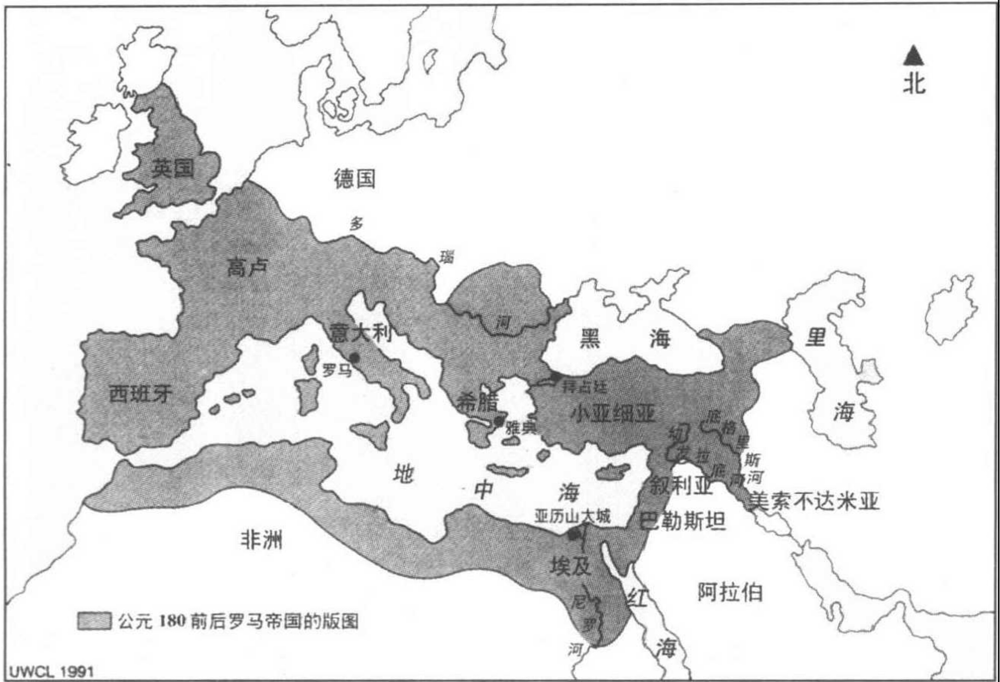
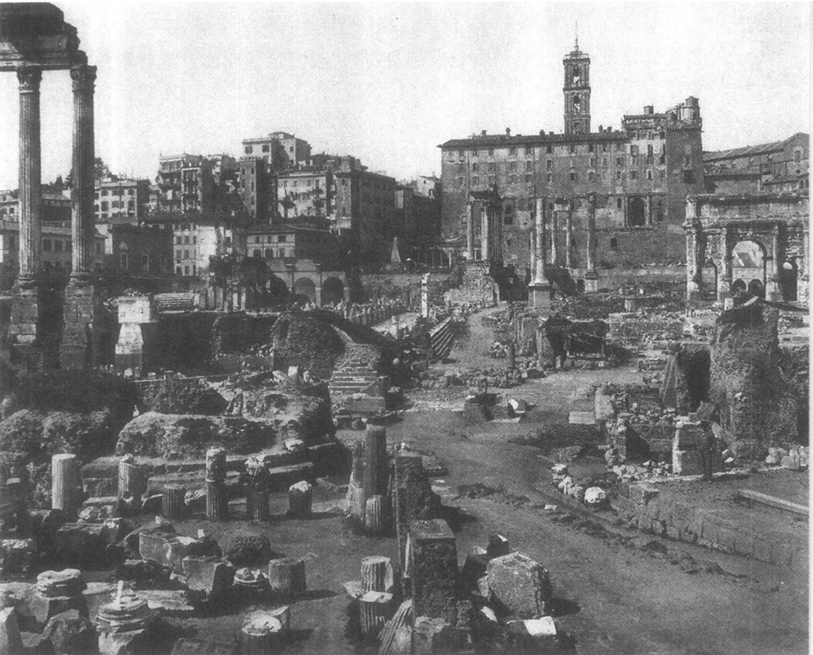
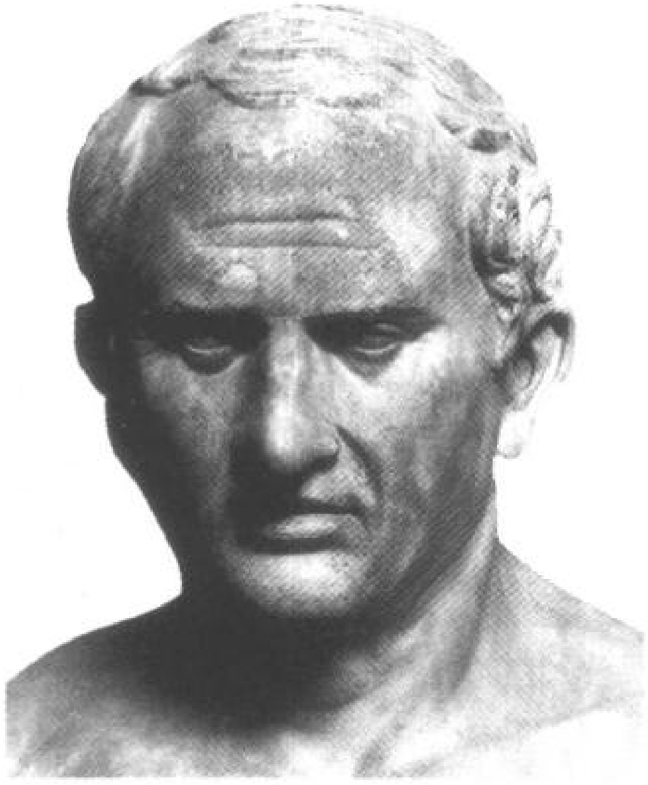
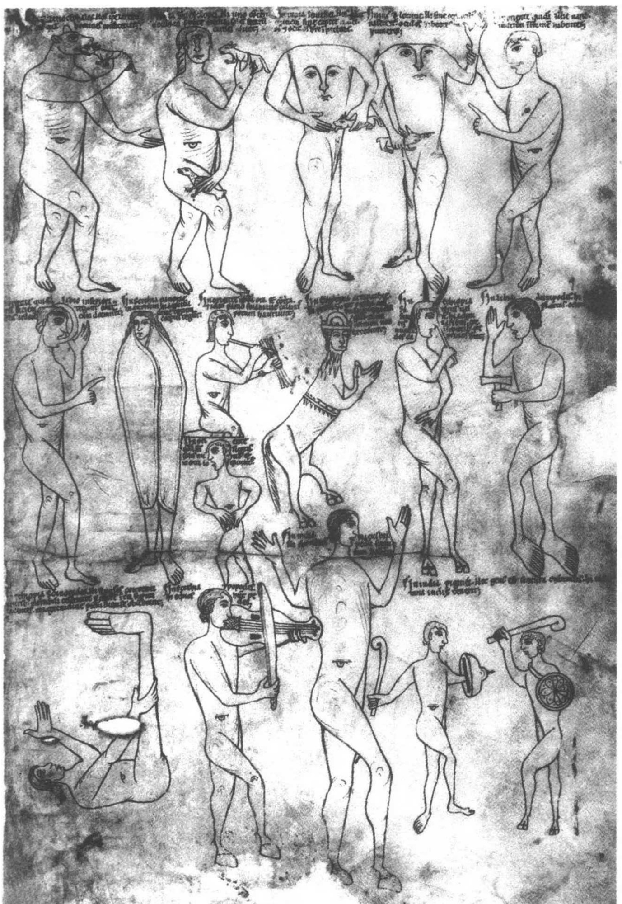
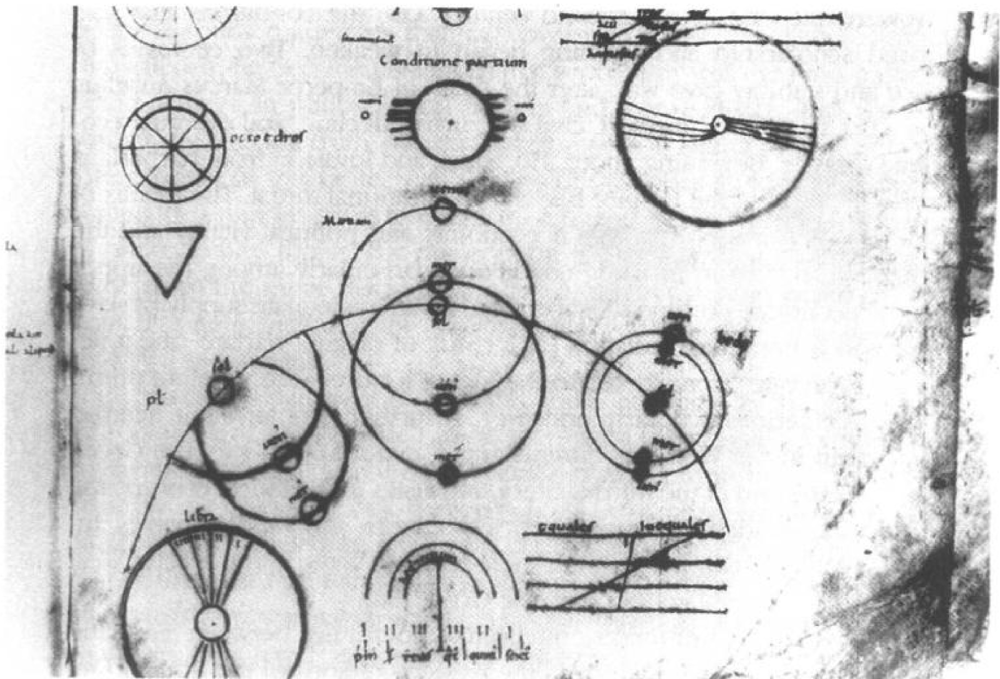
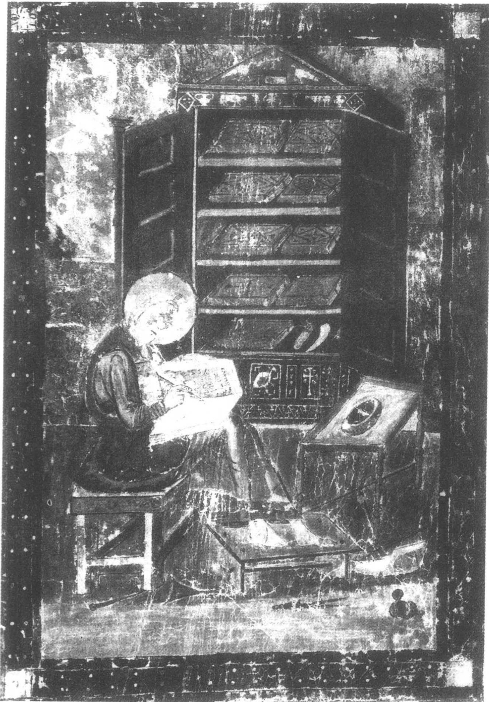
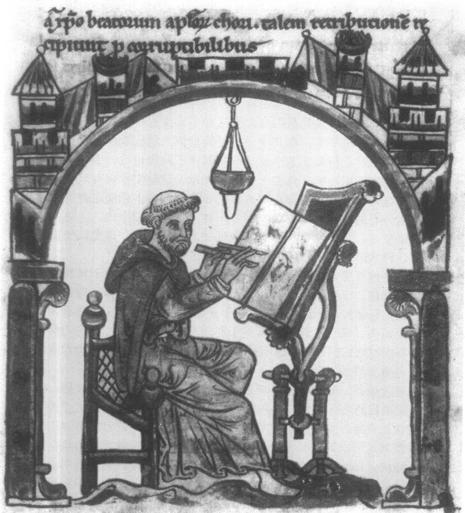

# 第七章 罗马和早期中世纪的科学

## 希腊和罗马人

盖伦的职业生涯（前一章已考察过）很好地反映了希腊与罗马理智生活的相互渗透。盖伦生长在小亚细亚的佩尔加蒙（可能位于罗马帝国疆域内，但仍是希腊文化的一个重镇），后来他到科林斯（位于希腊大陆）和亚历山大城继续接受教育。他所受的是一种希腊教育——用希腊文讲授并以希腊的古典著作为基础，因而他继承的是希腊的理智传统。然而盖伦却在罗马完成了他的职业生涯，他效力于罗马皇帝并给罗马的听众讲学。于是，他的生平就引出了本章开篇将要讨论的问题：希腊和罗马的政治、文化、学术、特别是科学之间的关系。

希腊各城邦独立自主和充满活力的政治生活随着亚历山大大帝（公元前334-323年）的军事征伐和希腊帝国的建立而结束。不过，在亚历山大建立的帝国被他的将军们瓜分以后，各继承国的理智生活仍然能获得零星、有时也是慷慨的资助，因而这种理智生活至少暂时还维持着繁荣。同时，罗马已经从公元前7世纪那个无足轻重的伊特拉斯坎（Etruscan）城镇发展成公元前5世纪和4世纪时的一个强盛的共和国。公元前265年，它控制了意大利半岛，而到公元前200年时，它的对外政策和强大的军事实力已经使它足以能够在第二次

---

地图3 罗马帝国的版图。

马其顿战争（公元前 200-197 年）期间干涉希腊的事务了。在随后的 150 年中，罗马的影响逐渐扩展到希腊大陆；到公元前 44 年朱利叶斯·恺撒（Julius Caesar）去世时，罗马实际上已经控制了整个地中海地区，包括希腊、小亚细亚和北非（见地图 3）。

在希腊各行省中，罗马人的统治没有导致文化和学术的颓败。相反，就像罗马作家贺拉斯（Horace，卒于公元前8年）如此著名地指出的一样，罗马在军事和政治上俘虏了希腊，而希腊人则是艺术和理智上的征服者。 $ ^{1} $随着罗马军事实力的增强和经济的繁荣，它的有闲阶层开始欣赏希腊人在文学、哲学、政治和艺术方面的成就。任何一个希望在这些方面获得精湛造诣的罗马人都只能去效仿希腊人的成就，也就是去借鉴在这些领域中有更高成就的一种文化。

人们原本以为，语言和地理上的屏障会阻碍这个借鉴的过程，但

---

图 7.1 古罗马广场。Alinari / Art Resource N. Y.

事实证明，这种障碍在早期的文化交流中并不是一个严重的问题。在意大利，人们普遍能读、说希腊文，因为意大利很多世纪以前就有希腊人的定居点：例如，自爱利亚城的巴门尼德和芝诺，以及柏拉图拜访过的意大利南部的毕达哥拉斯派。到公元前2世纪时，罗马本身也有了一个希腊人社区，并且罗马的上层社会中流行（在某种水平上）讲两种语言的风气。随着希腊学者越来越多地定居罗马（他

---

们或是自发而来，或是以奴隶的身份)，很容易找到愿意解释希腊文学和哲学内容的希腊老师。另一种学习方式是到罗马以外的希腊各省去学习，对于具有严肃学术抱负的罗马青年来说，这几乎变得不可或缺。通过这种机制，罗马及其周围就有了一个很大的希腊与罗马学者群——他们全都与希腊的学术传统保持着联系。最终，罗马学者开始将希腊人在学智方面的成就传授给拉丁读者。有时，甚至课本都是从希腊文翻译成拉丁文的。 $ ^{2} $

从西塞罗(Cicero，公元前106-43年)这位受过高等教育的罗马政治家和文人的职业生涯中，这种情况得到了大量的证明。西塞罗先在罗马，后又在雅典和罗得岛师从希腊老师；当然，他学会了希腊语，也掌握了希腊哲学的重要部分，并且受到斯多葛派思想和3世纪时在柏拉图学园发展起来的认识论理论的强烈影响。 $ ^{3} $ 西塞罗撰写了关于许多主题的拉丁文论文，并且将柏拉图的《蒂迈欧篇》译成了拉丁文（现已佚失）。

对学术研究的支持一开始完全是私人性质的。某个上层社会的成员可能将他的一部分闲暇时间用于读书和学术讨论；他也许会有一个图书馆，甚至可能是一个相当大的图书馆。但是，凡自己没有财产的人，则不得不寻找一位恩主来获得资助。实际上，各种各样的情况都有，既有依附于有钱人的著名学者，也有受过教育、能讲希腊语的奴隶。那些获得最好支持的学者，其责任可能是谏诫或辅助他的恩主，或者是照看恩主的图书馆；如果运气不佳或者能力差一点的话，他可能是去授教恩主的孩子，也可能还要去干一些佣人们的差事。

在这些背景下，探讨学问的水平有高有低。那些希望在最高水平上探讨学问的罗马学者将使用希腊语。因此，用拉丁语（不管是说还是写）进行的学术讨论就在某种程度上低于我们一直关注着的那种最高水平的希腊学术。当参加讨论的听众有语言能力上的限制时，即使用拉丁语；而吸引这些听众的，往往是希腊学问一种更易于接受、更大众化的版本。某些蔑视大众化学问的著名科学史家只重视阳春白雪式的研究，他们严厉批评希腊人发展了一种大众化水

---

平的学术，也批评了罗马人对这种学术的依赖。 $ ^{4} $ 但是，这反映了一种非常狭隘的看法。事实上，在任何学术传统中，都必定有多种层次的知识和专长。相对一个能用开创性方法解决错综复杂的哲学或科学问题的亚里士多德，就会出现成千上万有教养的希腊人和罗马人，他们的抱负仅限于而且只能限于去掌握亚里士多德已经取得的成就，或者将亚里士多德的观点与其他公认的权威的观点调和起来。在进行任何创造性研究的同时，都不可避免地会出现其他旨在保存、解释、教育、普及和传播运动，我们从自己的学校体系中能看到这一点。

在这些情况下，着手为罗马听众选取和解释希腊理智成就的学者，就自然而然把精力集中于那些使他们的罗马资助人感兴趣的地方——既非希腊形而上学和认识论的精妙处，也非希腊数学、天文学和解剖学上的细致点，而是那些有实用价值和内在吸引力的学科。或者出于实用的理由，或者作为对智力的训练，一定的数学知识被包含于其内。医学无需为自己争取，尽管罗马人最初对希腊医学的某些方面表示过怀疑。逻辑学和修辞学在法庭和政坛上有重要的作用。伊壁鸠鲁和斯多葛派的哲学论述了紧迫的伦理和宗教关怀。但是，在基础部分之外，除了作为娱乐以外，科学或自然哲学几乎毫不被人们所重视。这种情况生动地反映在下面的事实中：对罗马人来讲，最著名的天文学权威是索利的阿拉蒂（Aratus of Soli，卒于公元前240年），他描述星座和天气征兆的诗《现象》(The Phaenomena）至少四次被译成拉丁文，而欧多克索和希帕恰斯的专业性著作却无从寻觅或不为人知。 $ ^{5} $

于是，罗马人所知晓的这些科学或自然哲学往往是希腊成就的一种有限的、大众化的形式。数代历史学家曾企图用智力缺陷、道德弱点或性情缺点来解释罗马人何以未能掌握希腊学术中更抽象或更技术性的方面。人们常说罗马人完全没有理论头脑——尽管又很快补充说（由于每个人只能擅长于某些事情）他们的管理和工程才能弥补了这些缺陷。 $ ^{6} $事实上，关于罗马人理智成就的水平或程度并没有任何神秘之处，也没有理由对它表示诧异或批评。我们应该时刻

---

记住，除了有明显实用性的部分外，罗马贵族将学术看作一种消遣活动。于是，罗马人做的就是显而易见的事情：他们要借鉴那些看上去有趣或有用的东西。如果某些希腊人已经献身于研究抽象的、技术性的、不实用的以及（一些人无疑认为是）枯燥的问题，那么大部分罗马人就没理由再犯同样的错误。罗马的上层人物对希腊自然哲学精微之处的兴趣和一般美国政客对形而上学和认识论的兴趣并无二致。正如罗马剧作家恩尼斯（Ennius）所说，充其量，他们的愿望是“学习哲学，但得适度”。 $ ^{7} $惟一奇怪的是历史学家反而希望它是另外一种情形。

## 普及者与博学家

我已经描述了罗马上层社会从事科学和自然哲学研究的环境以及促进它们的因素。下面我必须具体说明由此产生的那种理智传统，我将考察讨论了科学主题或影响了科学研究的理智环境的几种具体的拉丁文献，并且概要介绍几本最有影响的著作。

斯多葛派的波斯多尼斯（Posidonius，约公元前135-51年）是早期最著名、可能也是最有影响的普及者之一。波斯多尼斯出生于叙利亚，父母是希腊人。他在雅典学习，后来成为罗得岛上斯多葛学派的领袖。通过他的许多学生（西塞罗是其中之一），他对罗马人的理智生活产生了强烈的间接影响。但他也在游历罗马时亲身给罗马人留下了深刻印象。波斯多尼斯最能称得上是公元前1世纪时那种多才多艺的学者。他对历史、地理、道德哲学和自然哲学充满兴趣，并且在所有这些方面都撰写了大部头著作。在他的著作（全部用希腊文写成）中，有对柏拉图《蒂迈欧篇》和亚里士多德《天象学》的注解。卢克莱修在写《物性论》（On the Nature of Things）时，曾大量引用他对《天象学》的注解。

波斯多尼斯的著作没有保存下来，因此，我们对这些著作的了解是第二手的；他最有影响的研究之一似乎是确定了地球的周长——他首先得出一个240,000斯塔的数值（略小于埃拉托色尼的估计值），

---

后来又得出180,000斯塔。这个较小数值的重要性在于它被托勒密所采用，并传给了他的《地理学》(Geography)一书的读者，并且15世纪时它是哥伦布计算西班牙和西印度群岛之间距离的基础。

波斯多尼斯对拉丁著作家，如瓦罗（Varro，公元前116-27年），产生了巨大影响，因此也大大影响了拉丁地区教育与学术的形式和内容。被罗马崇拜者称为伟大学者的瓦罗，在罗马和雅典从事研究；他是一个多产作者，其拉丁文著作（大约75部，现在几乎全部佚失）涉及的主题多种多样。其中最重要的是一部百科全书——《教育九卷》(Nine Books of Disciplines)，该书后来成为罗马百科全书编撰者的范本和知识源。它的一个显著特点是用人文艺学（the liberal arts，被认为是适合罗马上等人的教育学科）来组织全书。瓦罗确立并简单描述了九种这样的艺学：文法、修辞、逻辑、算数、几何、天文、音乐理论、医学和建筑学。瓦罗列出来的名单，被后来的作者略去了最后两个学科，逐渐确定为中世纪学校的古典人文七艺，前三门称为三艺（trivium），后四门称为四艺（quadrivium）。 $ ^{8} $

瓦罗的同时代人和他的朋友西塞罗，在希腊哲学方面造诣极高，他曾师从斯多葛派的波斯多尼斯、伊壁鸠鲁学派的菲得洛斯(Phaedrus)，以及柏拉图主义者拉里萨的菲洛（Philo of Larissa）和阿什凯隆的安逊克斯（Antiochus of Ascalon）。 $ ^{9} $在理智思考方法上，西塞罗深受在柏拉图学校中发展起来的怀疑论倾向的影响；尤其是，他深信任何人在哲学问题上至多只能得到某种或然，因而，发现真理的最好方法是对过去的观点进行批评性审查。他在这种信念指引下写出了一系列对话录。在这些对话录中，西塞罗记录了他的老师、朋友及更早的作者关于各种主题的观点。为了借鉴先人、尤其是那些更久远的古人的看法，西塞罗阅读了当时的手册文献，包括由狄奥弗拉斯特开创的文献汇编（doxographic）（或“评价”）类书籍。

这样，西塞罗既受益于这个普及运动，同时也促进了它的发展。他向读者介绍了不久前和当时有关主要哲学问题的争论，其中包括我们在前面各章中所关注的一些问题——基本实在的本质、宇宙秩序的根源、众神的地位、灵魂的本质和认知过程。他自己的世界观来

---

图 7.2 西塞罗。梵蒂冈城，梵蒂冈博物馆。Alinari / Art Resource N. Y.

自于对一些柏拉图和斯多葛派思想的综合，并且在中世纪和近代早期，西塞罗成为斯多葛派哲学的一个主要来源。他将上帝等同于自然，自然等同于火，并且把三者（上帝、自然和火）都等同于能使宇宙存在、活动和具有合理性的活力。他描述了斯多葛派有关连续的大火和再生的宇宙循环思想。他提倡在大宇宙（神和宇宙）和小宇宙（单个的人）之间有一种紧密对应关系的思想，认为神与宇宙中物质的关系就如同人的灵魂与人的肉体的关系一样。大宇宙与小宇宙的类比后来成为中世纪和文艺复兴时期的思想主题以及占星术著作的中心论题。西塞罗并不很注重数学科学，他认为数学科学的主要价值在于它们能够增强年轻人的智力；然而，他讨论了天空中的行星运动，并翻译了阿拉蒂的天文学诗《现象》，这反映出他对这些内容并非全然不感兴趣或毫无了解。

卢克莱修（卒于公元前55年）是与瓦罗和西塞罗同时代的人，他写了一篇哲学长诗——《物性论》。在一定程度上，这部著作是对伊壁

---

鸠鲁自然哲学的辩护，它的目的是通过赞扬原子和虚空的解释力而克服对死亡的恐惧。然而，在这一基本的伊壁鸠鲁哲学框架内，《物性论》涉及的范围非常广博，它在表述和细节的选择上则很通俗。卢克莱修讨论了世界的无限性、它们的产生和毁灭，以及一些基本的天文学数据，例如，太阳沿黄道运转的轨道和由此产生的白昼长短不等，另外还有月相；他还讨论了灵魂的不朽、感觉，包括错觉、睡眠、梦和爱、镜子和光的反射、动植物生命的起源、包括对生物学中目的论解释的揭露、人种的起源和历史，以及诸如闪电、雷鸣、地震、虹、火山爆发和磁吸引等特殊的气象学和地质学现象。最后，卢克莱修描述了雅典的大瘟疫。 $ ^{10} $

瓦罗、西塞罗和卢克莱修代表了罗马共和国后期罗马理智生活的繁荣。对这种理智事业作出贡献的其他人有维特鲁维亚斯（Vitruvius，卒于公元前25年，是当时一位建筑学方面的著作家）和几位帝国早期的作者：塞尔苏斯（活跃于公元25年），他是一部有影响的医学百科全书的作者；以及斯多葛派的塞内加（Seneca，卒于公元65年），他写了自然哲学方面的著作，包括气象学（他这部分著作与波斯多尼斯有重要的联系）。 $ ^{11} $

然而，人们普遍认为，普及化运动中的巅峰人物是老普林尼(Pliny the Elder, 23/24-79年)。在大多数对罗马科学的描述中，普林尼都是一个核心人物，我们必须简要考查一下他的工作。他出生在意大利北部一个外省贵族之家，在罗马接受教育。在成功的军事生涯（它提高了普林尼作为男子的社会地位）结束以后，他转而从事文学创作，最后效力于韦斯巴芗（Vespasian）和提图斯（Titus）两位皇帝。他写了几部关于罗马及其战争的历史书、一部语法书，和奠定今日其名声的那部献给提图斯皇帝的著作——《自然史》(Natural History)。

《自然史》是一部名著，其特点很难简单加以概括，必须真正读过，才能欣赏它的特点。 $ ^{12} $普林尼对知识如饥似渴，在《自然史》的序言中，他写道，他和助手仔细查阅了由大约100位作者所著的2000部书籍，从中摘录出20,000条内容。看来普林尼开发出了一个作笔

---

图 7.3 老普林尼记录的人类中的怪类。大英图书馆，MS Harley 2799, fol, 243r (12 世纪)。承蒙大英图书馆惠准。

---

图 7.4 麦克罗比乌斯论降雨。13世纪的一位抄写员试图说明麦克罗比乌斯的论点。麦克罗比乌斯认为，如果我们放弃雨沿着地球半径的方向落向地球中心这一假设，则必须接受一个荒唐的结论：有一部分雨点不会落到地球表面，而是落向另一半球，在另一半球上看，这些雨点不是在下落，而是在上升。大英图书馆，MS Egerton 2976, fol, 49 r (13世纪)。承蒙大英图书馆惠准。关于这幅插图及附带观点的讨论，见 John E. Murdoch 著 Album of Science: Antiquity and the Middle Ages，第 282-283 页。

---

记的卡片系统，所以他才能以手工方式对这20,000条知识进行分类；这些卡片是按学科组织起来的，经整理后成为《自然史》。 $ ^{13} $普林尼工作起来精力惊人。他的侄子告诉我们说，他会半夜起床，几乎夜以继日地工作，或者阅读，或者听别人阅读，或者笔录，或者口授注释。对我们而言，若要理解普林尼的成就，重要的是要抓住他对事实材料的迷恋。尽管在《自然史》中，普林尼有时会提出对自然现象的解释，但他的目标并不是要建构一个综合性的、推理严密的自然哲学，而是要创建一个使人感兴趣、令人愉悦的巨大知识库——正如他的侄子告诉我们的，这样一本书的“丰富性不下于自然界本身。” $ ^{14} $

普林尼的目的是考察宇宙和其中的自然对象。他用（现代英译本中）72页的篇幅列出了《自然史》的内容以及所查阅的权威典籍。在他讨论过的学科中，有宇宙论、天文学、地理学、人类学、动物学、植物学和矿物学。普林尼具有一种能力，能够挑选出特别有趣的事物，他常常被人们描绘成奇迹的提供者；确实，自然界的奇迹在《自然史》一书中屡见不鲜：普林尼记录了一系列天上奇观（包括多个太阳和月亮）、由祈祷者和祈祷仪式唤起的雷电、人类记忆中最大的一次地震（它毁灭了亚洲的12个城市）、阿尔卑斯山北部落中的祭人活动，一个坐在海豚背上定期往返学校的男孩和各种异兽（包括前额中央有一只眼睛的Arimaspi、用恶毒目光杀人的Illyrians和只有一条腿但能快速单腿跳跃的Monocoli）。 $ ^{15} $

如同忽视普林尼《自然史》中神话成份是一个错误一样，否认其较实际和普遍性的一面也是错误的。普林尼在天文学和宇宙论方面的描述就是后者的一个范例。 $ ^{16} $他描述了天球和地球以及用于表示它们的圆。他知道行星自西向东经过黄道带，他也知道它们经过黄道带的大致时期；他描述了行星的逆运动，记录了水星和金星分别与太阳保持在22度和46度之内。他讨论了月球的运动、月相和月食；并且知道日食和月食是有关天体和所投射阴影的相对大小的函数。关于地球的周长，普林尼报告了埃拉托色尼的估测值：252,000斯塔。就这样，普林尼传播了大量的宇宙论和天文学知识，尽管它们并不

---

总是可靠，而且他也肯定达不到数学天文学家的水平。他既不是在借鉴数学天文学的传统（例如，《自然史》中的天文学章节没有反映出希帕恰斯的影响），也不是在为天文学专家这样的读者写作。他仅仅是致力于向那些对复杂的观测或数学不感兴趣或不具备能力应用它们的大众，传播没有任何掩饰的基本精华。

普林尼并不是一位典型的罗马学者。最明显的是，没有人能像他那样把巨大的精力和热诚投入到收集知识的工作中。而且，其知识的广博胜过以前任何一位罗马人（包括研究九种艺学的瓦罗）。在《自然史》的序言中，普林尼恰如其分地指出，他是第一个试图在单独一部著作中讨论整个自然界的人。最后一点，普林尼的讨论比他的大多数先辈和同时代人都更浅显。然而，他确实提供了一个有价值的尺度，使我们可以了解到那些有教养的罗马人（在普林尼以后，如果不是在他以前的话）可能期待去了解些什么。另外，在其他许多普及著作佚失的情况下，《自然史》流传了下来，这一事实有助于我们确认早期中世纪时学术的水平和内容。

至此，我们一直把注意力集中于一种百科全书性质的罗马文献，它们试图将大量来自于许多不同文献的知识收集在单独一部著作中。但是，在罗马也出现了一种评注传统，其中，叙述所采用的结构和相当一部分内容源于某一权威性文本。这种传统反映出古代人倾向于把某些令人肃然起敬或有特殊地位的文本作为知识库，并根据阅读及解释那些文本的能力来衡量人的学问。罗马评注传统的一个重要典范是麦克罗比乌斯（Macrobius，活跃于5世纪前半叶，约比普林尼晚350年）所著的《西比奥之梦评注》(Commentary on the Dream of Scipio)。这本书将西塞罗的《西比奥之梦》(Dream of Scipio)作为对新柏拉图主义哲学的一种解释依据，它在早期中世纪广为流传。我们并不打算探究它的内容，除了要提到这一点：麦克罗比乌斯在这部著作中建立了一个综合的自然哲学，它主要是受柏拉图主义的启发，包括了大量论述算术、天文学和宇宙学的部分。 $ ^{17} $

还有最后一位罗马编撰者我们必须予以考虑，这不仅因为他为我们提供了一个窗口，使我们能够考察在后期罗马帝国学校中处于

---

巅峰状态的数学艺学，而且因为他的著作是中世纪最受欢迎的学校教科书之一。马蒂纳斯·卡佩拉（Martianus Capella）可能是来自迦太基城的一个北非人；因此，他也使我们想起了罗马帝国晚期在罗马的各行省，特别是北非行省中学术传统的强大。人们通常认为马蒂纳斯活跃于公元410-439年，但证据并不充分。他非常有影响的著作是一个寓言故事《默丘利与论学术的联系》(The Marriage of Philology and Mercury)。这本书描写了在一个神圣的结婚庆典中七位女傧相向参加婚礼的客人介绍她们各自的人文艺学的概貌。 $ ^{18} $

书中介绍的第一个数学艺学是几何学。借女傧相几何学之口，马蒂纳斯简短概述了欧几里得《几何原本》中的精华部分，包括大部分定义，所有的公设和这本书开篇提出的五个公理中的三个（参看上文第五章）。他讨论了平面和立方体图形，并对它们进行分类，其中包括柏拉图的五种规则立方体；他定义了直角、锐角和钝角；并且讨论了比例、可通约性和不可通约性。但是这一章的大部分内容讨论的是普林尼和其他人的地理学。马蒂纳斯先给出了大地是球形的证据；记录了埃拉托色尼估算的地球圆周的数值，但对埃拉托色尼估算方法作出了一个错误的解释；他还论述了地球是宇宙的中心。他讨论了五个气候带，并将地球上可居住的地方划分成三块大陆（欧洲、亚洲和非洲），然后迅速巡视了一遍已知的世界（基本上是普林尼类似讨论的一个简略本）。

接下来是算术。马蒂纳斯首先以极像毕达哥拉斯派的口吻描述了头十个数字，他解释了每个数字的优点和结合、与它们相关的神性及它们之间的相互关系。例如，

三是第一个奇数(马蒂纳斯认为，一不是奇数)，必须看作是完美的。它是第一个可以包含一个开始、一个中间和一个结束的数字，它将居中的中点与始端和终端联系起来，与等分联系起来。数字三代表命运三女神和姐妹般的仁爱；并且据说某位“作为天堂和地狱统治者”的圣母就等同于这个数字。其完美性的进一步证据是，该数字产生

---

图 7.5 马蒂纳斯·卡佩拉论金星和水星的运动。这是为了把握马蒂纳斯理论的几种尝试。马蒂纳斯认为，金星和水星的运动与太阳的运动有关。图的中右部位画的是以太阳为中心的金星和水星的运动轨道。本图摘自马蒂纳斯的著作《默丘利与论学术的联系》在公元9世纪的一个抄本。巴黎，国家图书馆，MS Lat 8671, fol, 84r。

出完美的数字六和九。它值得尊重的另一标志是进行三次祈祷和祭酒。时间的概念有三个方面，所以，占卜就是以三来表现的。数字三也代表着宇宙的完美。……19

马蒂纳斯接着考察了数的分类，并且讨论了那些我们看作是纯粹数学属性的东西。他将数定义为素数（除1以外不能被任何其他数

---

字整除的数）和合数；偶数和奇数；平面的数和立体的数；完美的数、不足的数和过剩的数。例如，完美的数是那些其因子之和等于它本身的数（例如6， $ 1+2+3=6 $）；不足的数是那些其因子之和小于它本身的数（例如14， $ 1+2+7<14 $）。马蒂纳斯也对各种比率和比例进行了定义和分类。例如，8和6的比率是超三（supertertius），因为第一个数比第二个数大三分之一；根据类似的推理，6与8的比率是欠三（subtertius）。

马蒂纳斯在开始叙述天文学时，提到了埃拉托色尼、希帕恰斯和托勒密——他知道这些人的名气，但毫无疑问他从未看过他们的著作。他在天文学一章阐述了基本的宇宙论和天文学知识，这些知识很可能出自瓦罗、普林尼和其他人。 $ ^{20} $ 他定义了天球及其主要的轨道。他描述了黄道带，将其划分成为12天宫，每宫为30度。他命名了主要的星座，并将它们进行了编目。他确定了传统的七行星；并且比典型的手册文献更精细地描述了它们主要的运动。例如，他表现出对行星自西向东沿黄道运动的大致周期的准确知识，以及对这些高位行星逆运动的谙熟。这一章最有趣也最有影响的部分之一，是马蒂纳斯对低位行星——水星和金星——的讨论，他认为它们沿着以太阳为中心的轨道运动（见图7.5）。1100年后，哥白尼将引用马蒂纳斯支持自己的天文学体系的这个特征。 $ ^{21} $

## 翻译

在罗马与其希腊邻邦（它们不久就成为了罗马的征服地）进行文化交流的早期，学术接触没有出现任何问题。人们普遍能操两种语言，有很多机会去境外旅行或学习，容易找到希腊教师，这些都为有教养的罗马人提供了融入希腊理智传统的途径。对那些语言能力较差或志向平庸的人，可以阅读拉丁文的普及著作和几本翻译过来的书籍。在后者当中，我们曾提到西塞罗翻译的柏拉图《蒂迈欧篇》和阿拉蒂的《现象》。

公元 2 世纪末，有利于学术和学问的环境开始恶化。在皇帝马库

---

斯·奥里利厄斯死后（公元180年），长达两个世纪的和平和稳定被政治骚乱、内战、城市衰落和最终的经济灾难所替代。大约始于250年，来自帝国边境野蛮民族的进攻与入侵成为另一个威胁。这些事件的后果是经济和政治活力的丧失以及生活条件的普遍恶化，在上等阶层中尤其如此。奴隶劳动力供给不足，（作为瘟疫、战争和出生率下降的后果）人口普遍减少，由此引起的经济问题造成了空闲时间的丧失，而闲暇是严肃学术活动得以开展的绝对先决条件。影响西方学术的另一个问题是减少了同讲希腊语的东方的往来。在3世纪末和4世纪，帝国的统治被分为东西两部分，随着东西两半壁的分裂日渐加剧，拉丁西方逐渐丧失了同希腊东方的极其重要的文化交流。

在这种情况下，东西方理智生活的联系中断了。在罗马帝国的西部地区，使用两种语言的风气逐渐消失，基本的读书识字教育也是如此，因此，怎样接近希腊学术开始成为问题。这并不意味着东西方交流完全断绝，只是说这种联系变得较为微弱和不稳定。几位罗马帝国晚期人士意识到了这种日益增长的威胁，他们试图通过将一些更重要的希腊哲学文献翻译成拉丁文而减少这种威胁的冲击。这些人中，有两位在科学史上特别重要。 $ ^{22} $

关于这两人中的头一位卡奥西蒂乌斯（Calcidius），我们实际上一无所知。甚至连他在世的时间都不能确知，尽管有几条论证表明他可能生活在4世纪的晚期。 $ ^{23} $无论如何，他将柏拉图的《蒂迈欧篇》从希腊文译成了拉丁文；并且，是他而不是西塞罗对这本书的译文，一直沿用到了中世纪，并与中世纪的柏拉图主义有很大关系。译文还附有很长的注解，卡奥西蒂乌斯在注解中吸收了文献汇编的传统和许多古代晚期哲学家的思想，解释和阐发了柏拉图的宇宙论思想。

另一位翻译家波埃修（公元480-524年），可能生活在一个世纪以后，这时罗马已经为野蛮民族所统治。生为罗马贵族，波埃修积极参与国事，并且在东哥特的狄奥多里克（Theodoric the Ostrogoth）统治时担任高级政治职位；后来他被指控叛国并被处死。关于波埃修的教育情况我们全然不知，但是，他的职业生涯证明，在罗马议政阶层内，至少还有残留的希腊理智传统继续存在。正如波埃修所

---

告诉我们的，他开始尽可能地把他了解的柏拉图和亚里士多德哲学介绍给拉丁人，并把这些哲学思想调和起来。他成功地翻译了多部亚里士多德的逻辑学著作（这些被笼统称为“旧逻辑”）、欧几里得的《几何原本》和波菲利的《亚里士多德逻辑学导论》（Introduction to Aristotle's Logic）。另外，波埃修根据希腊原始文献编写了关于几门人文艺学（包括算术和音乐）的手册。 $ ^{24} $

到 524 年波埃修被处死时，西方几乎已完全断绝了同原始希腊科学和自然哲学的联系。它只有柏拉图的《蒂迈欧篇》、一些亚里士多德逻辑学著作和其他少数人著作的残篇——很可能，它们都没有广泛地流传。除此以外，西方对希腊成就的了解就限于注解、手册、摘编和百科全书了。罗马仅仅传承了非常微弱的希腊理智传统。

## 基督教的作用

迄今为止，有一个方面我们一直没有去考虑，即基督教从罗马帝国一个偏远角落的犹太人小教派，发展成为3世纪时主要的宗教势力和4世纪末的国教。本书并不适于去探究那一奇特发展的细节。对我们而言，重要的是这样一个事实——在罗马帝国晚期，基督教最终发挥了强有力的宗教作用。从这个事实，就推出了我们现在必须要探讨的问题，即基督教的统治如何影响了人们有关自然的知识及其对自然的态度。在18、19世纪发展起来并广泛传播于20世纪的标准答案坚持认为，基督教严重阻碍了科学的进步，而且确实使科学事业进入了一种混乱状态，历经千年之久它也没有从这种混乱中恢复过来。然而，我们将会看到，事实远非如此，并且要复杂得多。 $ ^{25} $

有一个常常被用来反对教会的指责，即它广泛反对理智生活，教会的领袖只要信仰而不要理性，宁愿无知也不愿接受教育。事实上，这是一个相当大的歪曲。尽管基督教起初似乎吸引的是穷人和被剥夺了公民权的人，但它很快就进入上等阶级，包括那些受过教育的人。基督徒很快就清楚地认识到，想普及《圣经》，就一定要鼓励读书识字的教育；而且从长远来看，基督教后来成为欧洲教育的主要

---

资助者和古典理智传统的主要借鉴者。当然，神父们所认同的教育种类和层次以及学术工作，都是他们认为会支持教会使命的东西。

正如在2世纪和3世纪时一样，当教会发展出一个严肃的理智传统时，推动力来自于针对有学问的反对者捍卫基督教信仰（这种事业被称为“辩惑学”）和发展基督教教义。为实现这样的目的，在希腊哲学中发展起来的逻辑工具证明是不可或缺的。此外，柏拉图哲学的许多方面似乎与基督教义有很好的联系，并因此支持了它们。例如，柏拉图坚定地捍卫神的佑助和灵魂不朽；更重要的是，柏拉图的造物主看来很像是针对异教多神论中众神的一个一神论解决办法；而且这个造物主略经调整就可以看成是基督教的造物主——上帝。因此，在2世纪和3世纪，出现了一批辩惑学者，他们将希腊哲学，特别是柏拉图主义应用于基督教中。 $ ^{26} $

但是这种发展并不能使每个基督徒都感到满意。一些基督徒认为希腊哲学传统是谬误而非真理之源。有一个柏拉图这样与基督教神学和谐一致的哲学作者，就有一个亚里士多德和伊壁鸠鲁，他们的世界观与基督教学说最重要的观点截然相反。德尔图良（约1552-230年）这位在罗马帝国的非洲土生土长的迦太基人，就将哲学贬斥为异端邪说的根源，并警告那些试图根据斯多葛派和柏拉图思想来建构基督教义的人。然而，另一个北非人奥古斯丁（Augustine，354-430年）的态度却更为典型。他承认希腊哲学是有用的工具，即使它并不完全可靠。按照奥古斯丁颇具影响的观点，哲学将成为宗教的婢女——它不是要被扑灭，而是要得到扶植、改造和应用。

自然哲学不能同哲学的其他部分相分离，因此，它与它所属的整个哲学有相同的命运。就像整个哲学一样，它受到了早期教会思想领袖褒贬不一的评论：从怀疑、厌恶到欣赏到迷恋——我们同样可以在其他宗教那里发现这些相同的看法。对确立中世纪思想有重要影响的奥古斯丁，劝诫他的读者要留意天上和永恒的东西，而不要关心地上和暂时的东西。然而，他承认，通过补充那些有助于正确解释《圣经》和发展基督教学说的自然知识，暂时的东西也能为永恒的东西服务。奥古斯丁本人的著作，包括神学著作，展示了他对

---

希腊自然哲学的精湛造诣。自然哲学，像整个哲学一样，也扮演着婢女的角色。 $ ^{27} $

这是对科学事业的打击，还是对它的一种有限的但持欢迎态度的支持？答案主要取决于人们对这个问题的态度和期望。如果我们将早期教会与现代的研究性大学或国家科学基金会作比较的话，教会就绝对不是一个对科学和自然哲学的支持者。但是这种比较明显是不公平的。如果我们换一种方式，把早期教会对研究自然的支持与同时代其他社会团体对它的支持相比较的话，就会很明显地看出，教会是科学学问的一个主要资助者——也许就是最主要资助者。它的资助可能是有限和有选择的，但是有限和有选择的资助总要好于一点资助也没有。

但是，一位决定把早期教会看作科学进步之障碍的批评家可能会认为，自然哲学的婢女地位与自然科学的真实状况是不一致的。这位批评家会坚持说，真正的自然科学不能是任何东西的婢女，而必须拥有完全的自主性；因此，奥古斯丁追求的这种“被改造了的”科学根本不是科学。正确的回答是，完全自主的科学是一种富有吸引力的理想，然而我们并不生活在一个理想的世界中。科学史上许多最重要的发展是由这样一些人创造的，他们并不相信科学是自主的，而是信奉科学要为一些意识形态、社会纲领或实践目的服务；就其历史的大部分情况而言，问题并不在于科学的婢女角色，而是在于她为哪一位女主人服务。

## 罗马和早期中世纪的教育

教会成为学问的赞助者，所采用的手段之一是创办和扶持学校。我们已经简要论述过罗马的教育；现在让我们更密切地关注罗马的学校，然后再关注替代它们的早期中世纪学校。 $ ^{28} $

罗马的初级教育一般是家庭的职能，由一位家长或家庭教师主持，他们教孩子（大约在七岁时开始）读、写和计算。同时也存在初等学校，是为那些需要或喜欢它们的人而办的。女孩的教育就止

---

于这一阶段；男孩如果要继续接受教育，则在大约12岁时被送到文法学家那里学习拉丁文法和文学（特别是诗）。文学的学习不仅传递了写作技能和文学形式的知识，而且通过研究原著的内容，传递了一种宽广的文化教育。接下来，在大约15岁时，他需要到修辞学校去学习修辞家的技能。在那里，学生通过掌握公众演讲的理论和技巧，为从事政治或法律方面的职业作准备。更高水平的教育是师从某位哲学家，从事更高深的研究；那些特别富有或志向远大的人可能会追求这种水平的教育，但这种学习只能用希腊语。在这样的教育背景下，自然哲学和数学科学只得到人们很有限的注意：它们可能只是在文法学家和修辞学家的教学中得到一些肤浅的介绍；在哲学家的教学中，它们可能会突出一些。教学很少超过马蒂纳斯·卡佩拉的《默丘利与论学术的联系》一书所达到的水平。

罗马的教育开始是一种私人事业，依靠的是父母和家庭教师的主动精神。学校可以设在许多地方，包括家、租用的店铺、公共建筑和露天场所。最后，建立了一种得到地方和帝国支持的体系，在大多数大城市设立了有薪酬的教师职位——不仅在意大利，也在西班牙、高卢和北非等行省，向文法学家和修辞学家，偶尔也向哲学家提供这种有薪酬的职位。鼎盛时期的罗马很自豪地拥有一个能为整个罗马帝国上等阶层提供极好教育机会的教育体系。

随着罗马帝国的衰落，它的教育体系也衰落了。入侵、内乱和经济崩溃致使曾经有利于学校和教育的环境恶化。特别关键的是城市的活力丧失，城市的规模缩小，一直资助学校的上层阶级的财富减少，影响力下降。在4世纪和5世纪征服了罗马帝国的日耳曼部落对教育的冷漠和忽视也是一个重要因素。然而，恶化是逐渐而不是急促的，特别是在那些邻近地中海的地区。罗马的不列颠和北高卢很快与古典传统失去了联系，但是在罗马、意大利北部、高卢南部、西班牙和北非，学校和理智生活还继续存在（即使并不繁荣）。

基督教与古典教育泯灭的关系是一个极其困难和复杂的问题。我们已经看到，许多教会领袖对古典教育的异端内容深表担忧，并宣布这种学校是一种威胁。在学校中学习的文学通常是多神论的，并

---

图 7.6 书房中的僧侣。佛罗伦萨，美第奇·劳伦扎纳图书馆。手抄本（7-8 世纪）。

---

且，按照基督教的标准，也是邪恶的；当然它没有赞美诗或耶稣布道的那种开导性。因此，我们的预料可能是，教会会很快建立另外一种基督教的教育体系；即使不出现这种情况，当基督教成为国教时，我们估计这些异教学校会从根本上被改造成基督教学校。然而，以上两种情况都没有出现。实际情形是，大多数早期神父都看重他们自己所受的古典教育，并且，当意识到它的缺点和危险时，他们并没有想出任何实际可以替代它的教育体系；因此，他们不是否认这些学校的古典文化，而是努力利用它并发展它。大批基督徒继续将孩子送到罗马学校；而且一些有教养的基督教徒作为文法、修辞和哲学教师加入到那些学校之中（很像宗教人士参加到现代的世俗教育中），这无疑使他们的基督教信念和情感从一定程度上影响了学校的课程，但是从根本上并没有脱离古典传统。至于教士，则是从那些已经完成了文法可能还有修辞学习的人们中选拔出来的；他们在神学和教义方面所受的教育并不正规，要通过一个学徒过程，如果可能是在由主教主持的培养皈依者和未来教士的主教学校中完成。

但是，参与到学校中，并不等同于无限的热情和全心全意的支持。关于古典教育的价值和适用性，教会陷入重重矛盾和分裂之中，尽管教会愿意利用学校，但它不可能花过多的力量，把学校从促使其走向灭亡的各种势力中拯救出来——特别是如果出现了另外一种令人能够接受的教育。于是，在5世纪时出现了一种另外的教育体系，它是修道生活的副产品。

基督教的修道生活出现于4世纪的西方。修道院发展得很快，它们为那些希望远离尘世、追求神圣的基督徒提供了隐避所。公元6世纪时，圣本笃（St. Benedict，约卒于550年）在罗马南面的蒙特卡夏罗（Monte Cassino）建立了一座修道院，并制定了戒律，约束那里修士们的生活——这些戒律后来被西方修道生活广泛采纳。本笃会的戒律管理着僧侣和修女们生活的方方面面，强制他们将睡眠以外的大部分时间用于礼拜、沉思和手工劳作。礼拜包括阅读《圣经》和祈祷文献以及必要的读书识字活动。本笃会的制度也为所有修士和修女规定了书籍、刻写板和书写工具。既然修道院接收（由父母托付

---

给修道生活的）幼童，它们就有义务教他们读书——尽管在修道生活的早期，这种情况很少发生在正规的僧侣学校中。修道院也建造了图书馆和缮写室（抄写员抄写僧侣们所需书籍的房间）。 $ ^{29} $

最初，在修道院中进行教育，目的仅仅是满足僧侣团体内部的需要。它由男修道院院长或女修道院院长、或者一个受过教育的僧侣或修女负责，用来提供宗教生活所需的读写能力，以致最终提高精神境界。经常有这样一种说法：随着古典学校的消亡，修道院感到来自乡绅和贵族们的压力越来越大，他们要求为自己的孩子——即那些将来不去做僧侣或修女的孩子们——提供教育，因此，修道院创办了“外部学校”(external school)。事实上，没有证据表明9世纪之前在修道院中存在着这种外部学校；而且此后这种做法似乎也非常罕见。假如我们发现有受过修道院教育的人在教会和国家中任职，那并不是因为修道院开始通过外部学校来教育一般公众，而是因为世俗学生有时候进入修道院的内部学校，但更重要的是因为修道院蓄积了大批（为修道目的而受过教育的）人才，能被利用于修道院以外的事务。 $ ^{30} $

历史学家还就古典学问进入修道院的程度存在争论——这种争论可能来源于修道院之间的差异，或那些曾讨论过修道院学问这一论题的中世纪作者之间的差异。显然，重点在于精神的升华，以及所有被认为有助于这种升华的东西。《圣经》是这种教育纲领的核心；对《圣经》的注解和祈祷文本补充了《圣经》文本的不足。古典异教文献被广泛认定为不重要的或危险的，它们的地位并不突出。但是也有许多例外；确实，我们经常发现，恰恰是那些谴责异教文献的人在使用这些文献。奥古斯丁劝诫基督徒要借鉴异教文献中那些真实有用的东西，这似乎经常为人们所注意；并且，对源于修道院的著作进行考察揭示出，它们对古代思想来源有非常广博的（即使是有选择的）了解。四艺中数学学科的学习或研究极少超过最基本的水平，但这种概括也有例外的情况。

有关古典学术渗入修道院的一个很好例证出现在6世纪以后的爱尔兰（对此，我们没有合适的历史解释）。在这里，我们发现古典异

---

图 7.7 一位中世纪的抄写员。牛津，波德莱恩图书馆，MS Bodley，fol, 36r (13 世纪)。

---

教作者受到了极大的关注。一些希腊人广为人知，并且四艺的数学学科（特别是能应用于历法的学科）得到很好的发展。 $ ^{31} $

修道院漠视古典教育的另一个使人印象深刻的例外是威瓦里姆（Vivarium）修道院，它是由罗马参议阶级的成员之一卡西多勒斯（Cassiodorus，约480-575年）退出公职生活后建立的。卡西多勒斯在他的修道院中建了一个文书房，布置将一些希腊文著作翻译成拉丁文，他也使学习成为僧侣日常生活必不可少的一部分。他还编写了一本僧侣学习手册，在其中介绍了数量惊人的异教作者。在这本手册中，他对七门人文艺学的每一门都作了简短讨论。卡西多勒斯生前在威瓦里姆写的一篇关于历法的文章（这篇文章保存至今）可以表明这并没有仅仅停留在口头上。显然，卡西多勒斯也持有僧侣们普遍持有的观点，即仅仅在服务于神圣目的的范围内，才可以进行世俗学习。但他与僧侣运动其他领袖有不同之处，即他认为能够作出这样贡献的世俗学习的范围要大得多。 $ ^{32} $

这些例外很重要，但它们丝毫不能推翻修道院致力于精神目的的一般规律。学问得到了扶植，但这仅仅是因为它们为宗教目的作了贡献。科学和自然哲学处于这项事业极其边缘的位置——尽管并没有完全消失。那么，修道生活对于科学史的意义何在？我们为何要在本书中讨论它？当时难道不是科学史上的黑暗时代——一个没有产生任何重要性的时代？

毫无疑问，希腊自然哲学和数学科学的知识已经急剧衰落，在中世纪最初的几百年中（约400-1000年），西欧对这种知识几乎没有原创性的贡献。如果我们是要寻找新的观察材料，或对已有理论的有力批判，那么我们几乎会是一无所获。当时并不缺乏创造性，但被引导向其他任务，那就是生存、在一个野蛮而冷漠的世界中追求宗教价值、甚至（偶尔）会在一定程度上把关于自然的知识应用于《圣经》研究和宗教生活。因而，早期中世纪的宗教文化对科学运动的贡献是保存和传播。在平民教育和学术受到严重威胁的时期，修道院充当了平民教育和微弱的古典传统（包括科学和自然哲学）的传播者的角色。没有它们，西欧拥有的科学不会更多，只能更少。

---

## 早期中世纪的两种自然哲学

也许值得举两个例子来结束本章，这两个例子能反映早期中世纪对科学或自然哲学的贡献。更具体地说，我们应该注意两个人，他们的名字已成为早期中世纪自然哲学和中世纪世界观的代名词。

塞维尔的伊西多尔（Isidore of Seville，约560-636年）在西班牙长大，当时正值西哥特人统治时期，他在兄长的指导下接受教育（可能在一个修道院学校或者一个主教学校），后在公元600年接替其兄，成为塞维尔的大主教。他是6世纪晚期和7世纪早期杰出的学者，反映了西哥特人统治的西班牙在他生活的时代有较高水准的学问和文化。伊西多尔的著作广泛涉及《圣经》研究、神学、礼拜仪式和历史。他写了两部科学史家特别感兴趣的著作：《物性论》（On the Nature of Things）和《语源学》（Etymologies）。这些著作既取材于异教文献又取材于基督教文献（包括卢克莱修、马蒂纳斯和卡西多勒斯），它们传播了一种简单浅显的希腊自然哲学。《语源学》（它是整个中世纪最流行的书籍之一）存在于一千多份手抄本中，通过对各种事物的名称进行辞源学分析，对这些事物提供了一个百科全书式的描述。它包括人文七艺、医学、法律、计时和历法、神学、人类学（包括奇异种族）、地理学、宇宙论、矿物学和农学。伊西多尔的宇宙以地球为中心，由四种元素组成。他相信大地是球形的，并表现出对行星运动有一个基本的了解。他描述了天球的环带、季节、太阳和月亮的本性、大小及食的原因。他的自然哲学的一个显著特征，是他对占星术进行了有力的抨击。 $ ^{33} $

如果说我们在阐述伊西多尔的思想时有某种含糊不清，那么我们对尊敬的比德（the Venerable Bede，卒于735年）在这方面则了解得非常详细。比德七岁进入诺森伯兰郡（Northumbria）的韦尔茅斯（Wearmouth）修道院（位于英格兰东北部，靠近现在的纽卡斯尔），在那里毕生专于研究和教学。他先是这个修道院学校里的学生，最后成为一位僧侣校长。诺森伯兰郡的修道院是爱尔兰修道生活的直

---

接产物，因此继承了爱尔兰人对四艺研究和古典学术的关怀，但是这些修道院也与当时最好的大陆学术保持着接触。比德毫无疑问是8世纪最有成就的学者，他写的著作涉及僧侣们关心的方方面面，包括一系列僧侣教科书。他因为《英格兰人教会史》(Ecclesiastical History of the English People)一书而最负盛名。他还写了一本《物性论》(On the Nature of Things)（主要依据普林尼和伊西多尔）及两本计时和历法方面的教科书。后一本书用来规范修道士日常生活和指导他们如何确定宗教历法。在该书中，比德充分运用他所掌握的有限的天文学知识和有关历法的论文，为后来的“计算”科学奠定了坚实的基础，建立了计时和历法管理的原则，它们最后为整个基督教世界所采用。 $ ^{34} $

伊西多尔和比德代表了我们在本章追溯的那种学术普及和保存传统——他们努力保存了残存的古典学术，并以可以运用的形式将它们传播到中世纪基督教世界。但这种传统是否值得我们如此关注？在一部有关早期科学史的著作中，是否值得用一章的篇幅来讨论它？如果科学史仅仅是伟大的科学发现或重大科学思想的编年史，那么，伊西多尔和比德的名字在这种历史中就不会有任何位置。然而，如果科学史是要对那些汇集在一起把我们引向今天的科学潮流进行考察——若要了解我们来自何方以及如何到达此处，这些线索就是必不可少的——那么，伊西多尔和比德从事的事业就是这种历史中的一个重要部分。伊西多尔和比德两人都不是新科学知识的创造者，但他们都在一个自然研究处于边缘的时代中重建了当时的科学知识。他们为学术能够渡过艰难危险时期提供了一种连续性；因此，他们在几个世纪中有力地影响了欧洲人对自然的了解以及他们思考自然的方式。这样一种成就可能缺乏发现万有引力或发明自然选择理论的那种戏剧性，但是它对欧洲历史后来进程的影响不容低估。