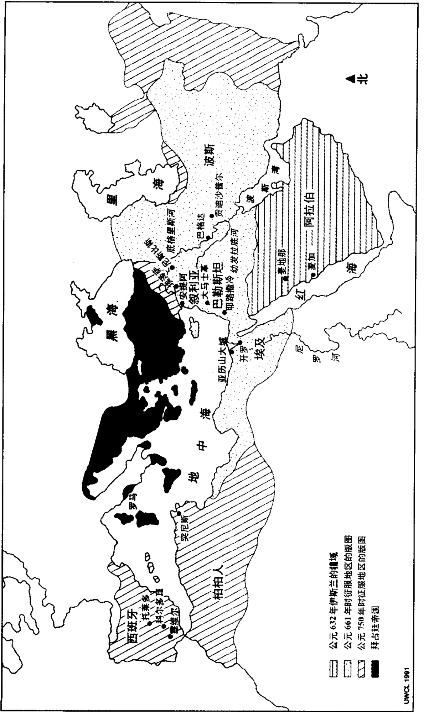
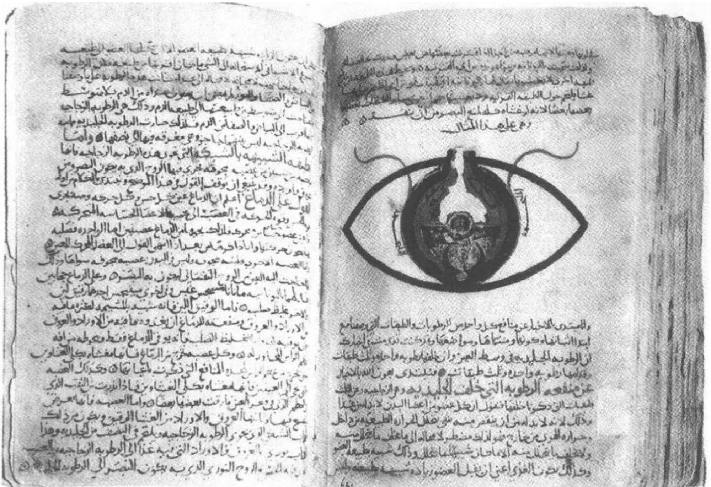
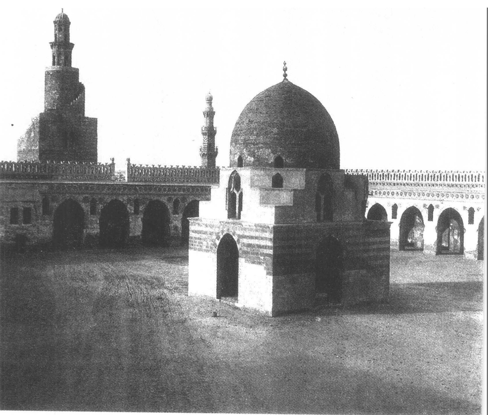
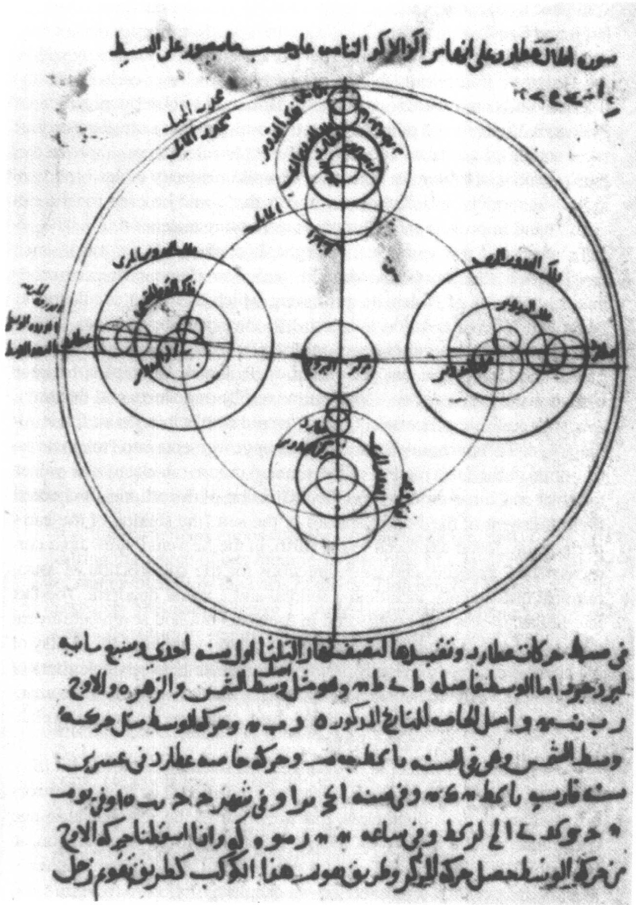
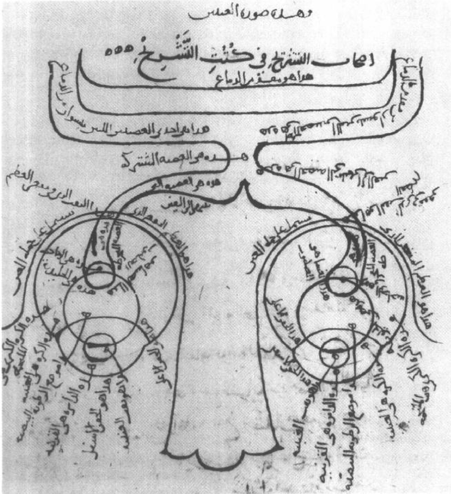
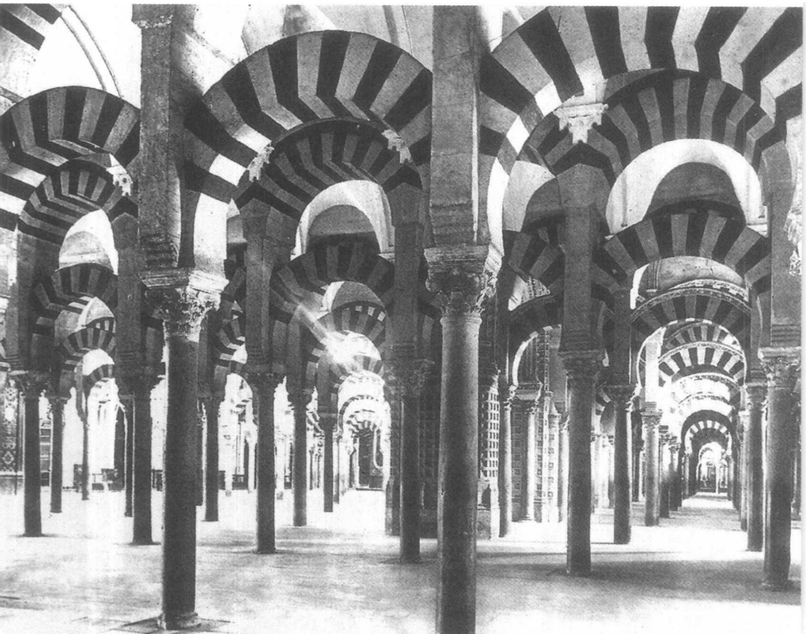

# 第八章 伊斯兰的科学

## 拜占廷的学问与科学

正当古典传统在拉丁西方日渐式微、自然哲学被改造为神学和宗教的婢女之时，讲希腊语的东方世界又是一种什么情况呢？尽管东方也像西方一样饱经灾祸——异邦侵略、经济衰退、社会动荡，然而后果却没有那么严重。随着老罗马帝国的东半壁逐渐同西方分离，产生了定都于君士坦丁堡（现在的伊斯坦布尔）的我们现在所谓的拜占廷或者拜占廷帝国，一种更大程度的政治稳定得以维持。君士坦丁堡这座城市直到1203年才陷落于入侵者之手，而罗马却早在公元5世纪就遭受了洗劫，这一事实反映出东西方相对的稳定程度。更稳定的社会和政治意味着学术上更大的连续性，因此，在拜占廷，古典研究传统的衰落之势更趋缓和，而且它从未销声匿迹。当然，东方也从未因语言上的障碍而与希腊学术的始源相分离。

但是，这并不表明自然哲学和数学科学枝繁叶茂。在东方，研究自然和在西方一样是不现实的，希腊教会的神父与他们的西方同事一样，对此怀有一种矛盾心理，并且他们也同样决心使之从属于神学和宗教生活。在东方，学术兴趣一般在于神学和文学，作者们被迫把自己局限在古典时期的遣词用字和词汇上面，这就导致了一种模仿的趋势，（人们经常说）它窒息了创造力。就哲学研究的开展

---

162 而论，它们多为对古典作家的评注，这些评注中不可避免地包含着一小部分自然哲学、数学科学和医学。

当然，这些是笼统的概括，我们必须注意不要留下印象，认为学术成就是贫乏或有限的。一批著名的学者代表着柏拉图的传统（更精确地说，应称之为新柏拉图传统，因其在许多重要的方面背离了柏拉图），尽管一个生机勃勃的逍遥学派的传统已不复存在，但是仍有人企图把亚里士多德的思想吸收到柏拉图哲学中来。拜占廷时代的一些哲学家撰写了关于亚里士多德的重要评注，在这些评注中，他们解释、润饰或批判了他的自然哲学。他们关于亚里士多德文本的论述，其精致程度在拉丁世界的同时代人中无人能及。

忒米斯蒂乌斯（Themistius，约卒于385年）在君士坦丁堡讲授哲学，并担任了帝国王室后嗣的老师。他为亚里士多德的许多著作，包括《物理学》、《论天》和《论灵魂》（On the Soul），撰写了有影响的释义和摘要。辛普里修斯（卒于533年以后），是一位决心调和柏拉图和亚里士多德思想的雅典新柏拉图主义者，也为这三部书作了出色的评注。约翰·菲洛普纳斯（约卒于570年）是基督徒和新柏拉图主义者，执教于亚历山大，他评注了亚里士多德的《物理学》、《天象学》、《论生与朽》以及《论灵魂》。在这些评注中他有意与辛普里修斯相对立，试图表明亚里士多德宣扬的那些深刻的错误，包括天界与地界的对立划分和永恒宇宙的观念。他还对亚里士多德的运动理论提出了系统和有创见的反驳，否定了亚里士多德对抛物体运动的解释以及重物以正比于其重量的速度穿过媒质下落的主张。由于他们的著作最终被译成阿拉伯文和拉丁文，这三个人——忒米斯蒂乌斯、辛普里修斯和菲洛普纳斯——对亚里士多德哲学后来的发展进程起了相当大的作用。 $ ^{2} $

那么，这里的观点就是：尽管同西方一样，拜占廷的理智生活也在衰落，然而这种颓势并不那么急促。在拜占廷帝国，我们可以发现在拉丁世界的任何地方都无以匹敌的精湛学术。但这并非惟一的区别。东方还参与了一个至关重要的文化传播过程，由此希腊学术得以传播到亚洲和北非的辽阔疆域，它又在那些地方被非希腊人

---

所吸收。这个传播和吸收的过程才是本章的真正主题。

## 希腊科学之东渐

尽管希腊人的影响早已超出希腊本土，但是文化传播作为一个明确的政策，却是随着亚历山大大帝的军事征伐才开始的。 $ ^{3} $ 当亚历山大征服了亚洲和北非时（公元前334-323年），他不仅获得了疆土，而且建立了希腊文明的桥头堡。他的征战南至埃及，东及巴克特里亚（位于中亚地区，现在阿富汗的一部分），并且越过了印度河而达到了印度的西北角（见地图2）。所经之处，他留下了军事要塞和一批命名为亚历山大的城市（至少有11个）。殖民的成功扩大了希腊的版图，并且这些希腊城市最终成为了希腊文化的中心，希腊精神由此辐射到周边地区。这样建立起来的最著名的希腊文化中心，是埃及的亚历山大城和中亚的巴克特里亚王国。

征伐和殖民并非是惟一途径，宗教也对希腊学术的传播起了决定性作用。尽管许多细节已经难以辨别，但就我们的目的而言，勾画出一幅草图就足够了。在亚历山大征服后的1000年里，他的亚洲疆域（特别是今天的叙利亚、伊拉克和伊朗）成为各大宗教运动的沃土。沃教（拜火教）、基督教和摩尼教相互间为了争夺教徒而争斗不休。这三个宗教都是以各自的圣典为基础的，因此必然培养出一定程度的学问。特别是基督教和摩尼教已经把希腊哲学作为理据，因此有助于该地区的希腊化。我们先来关注一下基督教的贡献。

叙利亚从一开始就存在着强大的基督教势力，在基督教时代的头几个世纪，传教活动导致了基督教会在西亚广大地区的建立。5世纪和6世纪，由于那些持异见的基督教派别来到这里躲避迫害，基督教在这里的势力更加强大。14世纪时，拜占廷帝国受到了基督教的同化，这引发了一系列激烈的神学争论和拜占廷教会的内部分裂。就我们的目的而言，最关键的争论涉及基督之本性——具体地说，就是基督的神性与人性的关系。极端的观点——包括景教徒的观点（他们强调基督的人性超出他的神性）以及相反倾向的一性说派教徒的观

---

164 点——在 431 和 451 年的教会大公会上受到了谴责。 $ ^{4} $ 在后来的冲突中，景教的领导人安身于叙利亚埃泽萨（Edessa，那时，这里是拜占廷帝国的东界）的一所学校。与一性说派（它在叙利亚势力强大）的斗争以及这所学校在 489 年最终被皇帝敕令关闭，使得景教徒向东到尼斯比斯城（Nisibis，位于波斯的边界）寻求庇护。在地方主教的鼓励下，他们在那里创建了景教的一个高等教育中心。当然，《圣经》研究和神学是关注的焦点，但亚里士多德的逻辑学（严肃神学所必需的东西之一）和希腊哲学的其他理论也一起得到讲授。尼斯比斯可能也设立了医学训练的课程。

此后一个世纪，从在波斯的这一立足点，景教徒不仅建立了波斯的基督教，而且也对波斯的理智生活发挥了广泛的影响。我们现在只能模糊地理解当时他们所采用的那些措施，正是通过这些措施，景教徒以巧妙的方式渐渐获得了权力和影响，并且使波斯的统治阶层领略到希腊文化。大约531年，波斯国王胡斯娄一世（Khusraw I）邀请了雅典学园的哲学家们（被拜占廷皇帝查士丁尼的敕令所驱逐）定居波斯，从中我们可以看到这些结果。这个胡斯娄还因掌握了柏拉图和亚里士多德哲学并命人翻译了希腊哲学著作而闻名于世。他同景教的联系反映在他曾接受过一个景教医生的治疗。胡斯娄二世（590-628年）有两个基督徒妻子——她们当中至少有一位在皈依一性说教派之前曾是景教徒——和一个很有势力、并在景教和一性说教之间摇摆不定的健康顾问。 $ ^{5} $

围绕着景教徒在波斯西南部贡迪沙普尔城（Jundishapur）的活动，产生了一个很有影响的传说。根据这个人们津津乐道的传说，到6世纪末时，景教徒已经把贡迪沙普尔城变成了一个庞大的学术中心，建立了被一些人称为大学的学校，在这里学生可以获得所有希腊学科的教育。据说这里曾有过一个医学院，它有一套以亚历山大的教科书为主要教材的课程，还有一所医院是仿照拜占廷帝国的医院建立的，该医院为受希腊医学训练的医生们保留了一块阵地。而且，在将希腊文记载的学问移译为近东语言的过程中，贡迪沙普尔城扮演了至关重要的角色，并且它也确实成为希腊科学通向阿拉伯世界的

---

最重要通道。 $ ^{6} $

最近的研究所揭示出的事实却不那么富有戏剧性。缺乏有说服力的证据来证明在贡迪沙普尔城确曾有过一所医学院或一所医院，尽管这里似乎曾有过一个神学院，并可能有一所附属的医务所。无疑，贡迪沙普尔是严肃的学术研究和大量医学活动的舞台，它在8世纪为巴格达的伊斯兰宫廷配备了几名医生，但它曾经是医科教育和翻译活动的主要中心这一点却令人怀疑。如果说贡迪沙普尔的故事在细节上不甚可靠，但它的意向却是合理的。景教徒的影响，尽管不是集中在贡迪沙普尔，但确实对希腊学术向波斯并最终向阿拉伯世界的传播起了关键作用。景教徒站在了早期翻译家的最前列，这一点毫无疑问。而且，迟至9世纪，当波斯早已落入伊斯兰军队之手后，巴格达的医学活动似乎还是由基督教（很可能是景教）的医生垄断的。 $ ^{7} $

但是这里有一个语言上的变换我们必须要考虑到。尽管在尼斯比斯和贡迪沙普尔，以及其他景教中心的教育中，占主导地位的是希腊的内容，然而教学中使用的却不是希腊语。教学时使用的是古叙利亚语，这是一种在近东广为流传的闪族语言（一种阿拉米语的方言）。这种语言连同希腊语一起，是波斯的文化语言，它被景教徒用来作为其文学和仪式的语言。既然如此，教学计划就要求将希腊文本翻译成古叙利亚语。这种翻译活动出现在尼斯比斯和其他地方，最早始于450年。尽管我们又一次缺少细节，但是亚里士多德和波菲利（Porphyry）的逻辑学著作似乎已经出现在最早翻译的著作当中。医学文献、数学和天文学著作以及各种哲学论述最终也被翻译出来。

有几点需要特别强调。一、我们必须明确这是一个关于学问传播的历史。我们要研究的主题（在本章的前几节）不是对自然哲学的原创性贡献，而是希腊遗产的保存和向亚洲的东渐，在那里继而它将被吸收到阿拉伯文化之中。二、这一文化传播的过程十分缓慢，但也有相当长的持久性——从亚历山大大帝征服亚洲（约公元前325年）到7世纪伊斯兰教的建立，前后持续了将近1000年。三、对待这一历史绝对不能过于简单化，以致只把希腊学术的传播悬挂在景

---

教徒在贡迪沙普尔或别的某个具体地点的活动这根细线上。相反，我们必须把它看成一个广泛的文化传播运动，通过这场运动以及其他各种机制，西亚的贵族广泛而深入地汲取了希腊文化的成果。我们现在必须要关注这些成果向伊斯兰世界的进一步转移。

## 伊斯兰教的诞生、扩张和希腊化

阿拉伯半岛，由于夹在东北面的波斯和西面的埃及之间，没有受到亚历山大军事征伐的蹂躏，也没有被拜占廷觊觎领土的野心所影响。犹太人和基督徒的社会曾在其南部兴盛过一段时期，但是到7世纪末，他们的影响已经减小到一个相当有限的程度，除了南部和北部的边缘地带以外，人口主要是游牧民族，尽管城市已经在圣地周围和主要的商道沿线建立起来。正是在这些城市之一的麦加城，穆罕默德于6世纪晚期诞生，并从这里开始了他的伊斯兰新宗教的传教活动。穆罕默德获得了一系列启示，在这些启示中，天使加百列将《古兰经》（伊斯兰的圣经）口授给他。这些启示的中心主题是存在一个惟一全能全知的上帝——阿拉，他是宇宙的造物主，忠实信徒（称为穆斯林或穆罕默德信徒）必要服从于他。这部书限定了伊斯兰教信仰和活动的所有方面，它是伊斯兰教神学、伦理、法律和宇宙论的来源，因此在伊斯兰教育中占据了核心位置，它将阿拉伯语编码为一种书面语言，并且现在仍然是阿拉伯文字风格的主要榜样。 $ ^{8} $

穆罕默德不仅极力宣扬发动圣战和迫使异教徒皈依的必要性，而且身体力行。在632年他去世之前，他的追随者已经蔓布于整个阿拉伯半岛并成功地袭击了北部。他死后，穆斯林军队越出本土，迅速击溃了拜占廷和波斯的军队，从而获得了近东大部分地区的控制权。在涉时25年的巨大军事成功中，伊斯兰教征服了亚历山大在亚洲和北非的几乎全部领土，包括叙利亚、巴勒斯坦、波斯和埃及。在一个世纪内，北非的其余部分和几乎整个西班牙也落入穆斯林军队手中。

穆罕默德没有留下男嗣或指定的继承人，结果，发展中的伊斯

---

地图4 伊斯兰的扩张。

---

兰帝国的领导权演变成一场血腥争斗。第一任“哈里发”（穆罕默德的继承人）选自穆罕默德早期的追随者。644年乌马亚家族的奥斯曼（Uthman of the Umayyad）成为哈里发，661年他的堂弟、曾为叙利亚总督的穆阿维耶（Muawiyah）当上了哈里发。出于安全的考虑，穆阿维耶和他的几个继任者在叙利亚的大马士革统治着阿拉伯帝国，在那里乌马亚家族的力量比较集中。也正是在那里，统治了大约一个世纪的乌马亚王朝与受过教育的叙利亚人和波斯人发生了接触，任用这些人为秘书或官吏，从而在一个小范围内开始了伊斯兰的希腊化。

希腊化的进程在749年后加速发展。那一年，一个新的王朝——阿拔斯王朝（阿拔斯家族是穆罕默德的叔父阿拔斯（al-Abbas）的后裔），开始了对阿拉伯的统治。阿拔斯王朝的哈里发们无意留在大马士革；像一个世纪前的乌马亚家族一样，他们也希望定国都于对他们友好的地方。762年曼苏尔（al-Mansur，754-775年在位）在底格里斯河上建立了一座新的国都——巴格达城。曼苏尔在巴格达的宫廷并不是以虔诚，而是以培养了相对学术化、世俗化和宽容的宗教氛围闻名于世。更重要的是，伊斯兰帝国正在从穷兵黩武的贵族统治转向中央集权的国家，这样的国家需要比穆罕默德、他的早期继承人或早期的乌马亚哈里发所想象的庞大得多的行政机构。这个行政机构的人员是不可能从军队的武士当中遴选的。哈里发除了选用有教养的波斯人（这些波斯人一般都是新近归附伊斯兰教的，尽管我们不清楚对基督徒的任用情况）以外，再没有其他更合理的选择了。

从来自巴尔马克家族（早先在巴克特里亚省，不久前皈依了伊斯兰教）的强有力的皇室顾问身上，波斯人的影响反映得尤其明显。哈立德·伊本·巴尔马克（Khalid ibn Barmak）曾效力于曼苏尔，他的儿子叶赫亚（Yahya）曾是曼苏尔的孙子哈伦·拉西德（Harun ar-Rashid，786-809年任哈里发）的大臣。基督教的影响最清楚不过地体现在宫廷的医学活动之中。765年，曼苏尔接受了一个来自贡迪沙普尔城的景教医生茹尔吉斯·伊本·巴克蒂舒（Jurjis ibn Bakhtishu）的治疗。茹尔吉斯显然获得了成功，因为他留在了巴格达并担任这位

---

哈里发的私人医生，成为宫廷中权势显赫的人物。他的儿子继承了他，并且巴克蒂舒家族几代都担任着宫廷医生的职务。最后，注意到这一点是很重要的：也有来自于东方印度的影响，这些影响的一部分是更早发生的印度希腊化的长期结果。

## 希腊科学向阿拉伯文的移译

将希腊文和古叙利亚文著作翻译成阿拉伯文的活动始于曼苏尔治下，但它成为一项严肃的工作却是在哈伦·拉西德统治时期，后者曾派使团到拜占廷去寻求手稿。马蒙（al-Mamun，813-833年在位）是哈伦的儿子，他在巴格达建立了一个研究机构——智慧所（the House of Wisdom），在此翻译活动达到了顶峰。智慧所最早的成员是胡那恩·伊本·伊萨克（Hunayn ibn Ishaq，808-873年），他是景教基督徒、阿拉伯人，是在伊斯兰教产生之前就早已皈依基督教的一个阿拉伯部落的后裔，他曾跟随著名医生伊本·马萨沃（Ibn Masawaih）习医，并从孩提时代就掌握了阿拉伯文和古叙利亚语。青年时期他曾到过“希腊的土地”（可能是亚历山大城），在那里他对希腊语已经无所不通。回到巴格达以后，他受到巴克蒂舒家族的一个成员和一帮富有的阿哥们（穆萨的儿子们）的注意，通过这些人的帮助被引荐给马蒙，曾随同一个远征队到拜占廷去寻求手稿。他在几任哈里发时期担任翻译，并最终取代巴克蒂舒家族的成员而成为皇家首席医生。 $ ^{9} $

胡那恩的翻译活动极其重要，值得我们给予认真关注。胡那恩得到了他的儿子伊萨克·伊本·胡那恩（Ishaq ibn Hunayn）、侄子胡贝斯（Hubaysh）和其他人的帮助，他们的许多翻译是集体工作的成果。例如，胡那恩可能将一本希腊文著作翻译成古叙利亚文，接着他的侄子又将这个古叙利亚文的文本译成阿拉伯文。胡那恩的儿子伊萨克把希腊文和古叙利亚文译成阿拉伯文，并要校对其他同事的译文。另外，胡那恩除了自己要做将希腊文译成古叙利亚文或阿拉伯文的工作之外，似乎还坚持要检查他所委派的人的译稿。在方法

---

图 8.1 胡那恩·伊本·伊萨克关于眼体解剖学的论述，来自胡那恩著《眼论十篇》的一个13世纪摹本。开罗，国家图书馆。

上胡那恩及其合作者极尽精巧之能事。他们懂得，为了剔除错误，就要尽可能去核对手稿。胡那恩没有因袭传统的那种机械式的逐字对应的翻译方式（这种方式弊端很大，因为不是每一个希腊词在阿拉伯语和古叙利亚语中都有一个对应的词，同时也没有考虑到语言间语法的差异），而是先去领会某个句子在希腊文中的原意，然后用阿拉伯语或古叙利亚语中具有同样意义的句子来代替它。

胡那恩翻译了大量的医学著作，尤其集中于盖伦和希波克拉底的著作。他把盖伦的大约90本著作从希腊文译成了古叙利亚语，大约40本从希腊文译成阿拉伯文。他译出了希波克拉底的15部作品。胡那恩还翻译了柏拉图的三篇对话，其中包括《蒂迈欧篇》；翻译了亚里士多德的各种著作（绝大多数是从希腊文译成古叙利亚文），包括《形而上学》、《论灵魂》、《论生与朽》以及《物理学》的一部分；

---

还翻译了其他许多关于逻辑学、数学和占星术著作，并译成了一个古叙利亚文版本的《旧约》。胡那恩的儿子伊萨克翻译了更多的亚里士多德著作，以及欧几里得的《几何原本》和托勒密的《至大论》。他们在巴格达的同事以及其他地方的一些同时代人翻译了更多的著作。例如，萨比特·伊本·库拉（Thabit ibn Qurra，836-901年）是一个精通三种语言的异教徒（指既非基督徒也非穆斯林），他在巴格达度过了大半生，翻译了数学和天文学论著，其中包括阿基米德的作品。在胡那恩和萨比特之后，这种高水平的翻译活动持续了一个多世纪。到公元1000年时，几乎全部的希腊医学、自然哲学以及数学科学著作都已经被译成可供使用的阿拉伯文版本了。

## 伊斯兰对希腊科学的反应

但是问题产生了：这些翻译有何用途？心甘情愿去承担翻译费用并支持希腊科学的穆斯林统治阶层从这些希腊科学中发现了什么？这些翻译过来的著作在多大程度上得到那些赞助人和一般有文化的穆斯林的接受？希腊科学在伊斯兰世界中发挥了何种作用？它与伊斯兰文化其他方面的融和程度如何？特别是，接受希腊科学是否就一定要付出一种宗教上的代价？

我们大体知道翻译了哪些东西，很多时候我们也知道这些翻译应归功于谁。但是我们很少能够完全掌握一次特定的翻译活动背后的动机。一个可能的最普遍的因素是：翻译活动的资助人是有文化的，或者他们渴望有文化，或者至少他们希望同文化沾点边（即使仅仅是为了它所赋予的声望），他们是希望以某种方式参与当时最先进学术文化的人。但是，根据赞助人和受赞助人的文化水平作出的解释似乎并不充分。这些有文化的穆斯林之所以愿意向希腊科学投资，是因为他们相信它确有价值——有助于实现一些有价值的目的。为知识本身而追求知识，这从来就没有被伊斯兰宗教的意识形态所认可，也没有被这一文化的其他方面所认可。正如中世纪的基督教世界一样，科学以它的实用性为自己辩护。 $ ^{10} $

---

图8.2 伊本·图伦清真寺（9世纪），开罗。Foto Marburg / Art Resource N. Y.

---

医学是一门有明显实用价值的科学，并且很有可能，医学最早得到了穆斯林的资助，医学著作也最早得到了翻译。其次，医学要求用哲学来武装，或者说盖伦著作的读者如此认为。确实，盖伦自己也写过关于逻辑学的著作，并在他的医学著作中运用了自然哲学。那些翻译家和赞助人一定非常清楚：要想完全掌握盖伦的医学哲学，就需要对希腊思想，包括柏拉图和亚里士多德的哲学有广博的知识。 $ ^{11} $天文学、占星术、数学、炼金术和一些自然史的实用性也已经很明显。而且最终，伊斯兰世界在吸收希腊逻辑学和形而上学、创建一种经院神学方面进行了成功的尝试。几乎任何一部希腊医学、数学或哲学著作的翻译都可以用（仅有一点点过分的）实用理由为自己辩护：其中一些著作至关重要，其余的至少也有一点含糊的用途。

一本书被翻译成阿拉伯文与它在伊斯兰世界广为流传或其内容被伊斯兰文化所吸收，这两者间并无必然联系。毕竟，翻译仅仅需要一个翻译家和一个可能的资助人，而普及和吸收则是大的文化现象。语言障碍已经通过翻译得到克服，而巨大的阻挠依然存在。其中之一就是挥之不去的用途问题，对于一种文化，不能像对一个资助人那样轻而易举地给这个问题作出回答。对于严谨的穆斯林，知识总是一种手段而非目的，它必须服从于实现个人拯救、获取智慧（宗教意义上的）、有助于整个伊斯兰世界的统治或其他一些明确的实际目的。

希腊科学不得不去克服的另一个障碍，是它的异邦来源和理性特征。穆斯林把学问划分为两个范畴：一方面是传统的学问，另一方面是外来或理性的学问。传统学科是那些以《古兰经》为基础的学科：语法、诗歌、历史、神学和法律，它们依赖于神的权威，并常常是口头传授的（这反映了穆罕默德启示及其教义口口相传的特点）。学习这些学科的人有义务去完整、忠诚地传递这些知识。相反，从希腊人那里获得的外来文化，其始源是人而非神，它们要通过思考被理解，而不是在权威或传统的基础上被接受。它们的传播主要是通过书面文字，并且要经受批判性的评论和修正。任何将这种外来科学的方法运用于传统学科的尝试，都要冒显而易见的风险。因

---

此，这些外来科学必然要被那些持保守倾向的人看作是一种威胁。

那么，这些外来科学在伊斯兰的命运如何呢？想要简单地作出一个适用于任何时间和地点的回答是不可能的。的确，历史的情况是如此错综复杂，以致于那些专门研究伊斯兰的历史学家也不能在怎样界定其特征的问题上达成一致。学术界当前流传两种完全不同的解释。按照其中一种观点，这些外来科学始终都被绝大多数穆斯林看作是无用的、异质的，并可能带来危险，它们与正统思想格格不入，不能满足任何基本的需要，并且被排斥于正在发展中的教育体系之外。结果是，这些外来科学从未深入整合到伊斯兰文化当中，而是苟延于它的边缘。因此，伊斯兰科学家和自然哲学家取得的那些不可否认的伟大成就，一定是来自于一些孤立无援的学者，他们或者因得到一些保护而免遭正统派的压迫（例如在皇家宫廷中有一段异乎寻常的宽容时期），或者，出于一些只有他们自己才清楚的理由，他们甘愿在文化潮流中逆水而行。这种理论被称为“边缘说”，因为它声称科学在伊斯兰世界从来就不过是一种边缘性的追求。 $ ^{12} $

另一种理论则以完全不同的眼光来看待伊斯兰与希腊科学的遭遇。在承认存在怀疑和敌视的同时，这一理论坚持认为，从整体上看，希腊科学和自然哲学在伊斯兰受到了异乎寻常的礼遇。毕竟，伊斯兰并不拒绝外来学术的成果，而是尽管有保守的抵制，却开始非常出色地恢复和扶植它。而且，可以找到很多例子，证明希腊科学整合到了传统学问之中，而且更广泛地说，是整合到了伊斯兰文化当中。逻辑学被吸收到神学和法律当中；对决定当地每天祈祷时辰的天文学仪器穆瓦奇（muwaqqit）而言，天文学成为不可或缺的工具；就大量商业、法律和政府的目的而言，数学是必不可少的。在最先进的穆斯林学校，即所谓的法学院中，有时教授数学和天文学，这一事实证明了接受和整合的程度是很高的。按照这种解释，尽管存在抵制，伊斯兰还是成功地利用了外来学术中的大部分。让我们把这种观点称为“融合说”。据此观点，外来科学并没有征服传统学科，而是同意作为他们的婢女而与之和平共处。 $ ^{13} $

这两种解释之间存在着巨大的鸿沟，根据当前对伊斯兰科学史

---

的研究情况，这一争论似乎不可能很快得到解决。但是有几点还是可以加以说明，它们有助于调解这两种观点：其一，我们必须承认貌似强大的“边缘说”是站不住脚的。希腊自然哲学和数学科学的培育得到广泛传播，而且相当成功，绝不能仅仅看作是伊斯兰文化的一个周边产物。但是，尽管在这方面承认“融合说”，我们又必须进一步指出：科学远非伊斯兰文化的中心，在其内部，有些势力将这些外来科学边缘化了——这就是说，“边缘论者”注意到了伊斯兰文化的一些真实特征。具体来说，希腊学问在伊斯兰从未像它最终在中世纪基督教世界的学校中那样，从体制上建立或找到一个庇护所。之所以如此，一个原因就在于伊斯兰学校缺乏西方学校中的组织和统一性，较高水平的学校尤其如此。 $ ^{14} $这种组织上的不足使单个学者可以自由地追求他所希望的任何专业，自由保证了多样性，并为研究希腊科学和哲学的人开辟了空间，但是它也使伊斯兰学校永远不会发展出一套系统传授这些外来科学的课程。简而言之，伊斯兰教育没有对这些外来科学加以阻止，然而也没有给予多大程度的支持。这一事实或许有助于我们理解伊斯兰科学在13、14世纪衰落的原因。

## 伊斯兰的科学成就

20 世纪早期，著名物理学家、哲学家和历史学家皮埃尔·迪昂（Pierre Duhem）写道：“根本不存在阿拉伯（称为‘伊斯兰’）科学。穆罕默德主义的智者或多或少总是希腊人虔诚的信徒，而他们本身毫无首创精神。” $ ^{15} $这是他向研究伊斯兰科学的历史学家发出了挑战。迪昂显然是错误的，但他的这段话有助于我们去关注这样一个至关重要的事实：通过发现迪昂观点中的确切错误，我们可以了解伊斯兰科学成就特点中的一些重要之处。

从事希腊科学工作的穆斯林缺乏任何首创性，这种说法完全不是事实。因此，对迪昂的一个可能的回答，是通过枚举伊斯兰医生、数学家和自然哲学家的许多原创性贡献来证明这一点。仅举一个例

---

子：11世纪的穆斯林伊本·海塞姆（Ibn al-Haytham）对几乎全部希腊科学的成就显示了他的批判力，并且他对天文学、数学和光学作出了最为重要和最有创造性的贡献。遗憾的是，要描述穆斯林对各种科学的贡献需要巨大的篇幅，因此我们只能满足于一些更有限的目标，尽管在下文和后面几章中，我们将讨论伊斯兰对某些具体科学领域所作的贡献。 $ ^{16} $

然而，迪昂的观点为我们提供了这个问题的另外一个切入点，从而把我们引向核心问题。迪昂坚持认为：对这些外来科学感兴趣的穆斯林学者“或多或少总是希腊人的虔诚信徒”，他这样说是带有贬损之意的，想以此证明穆斯林并非真正的科学家。也就是说，他把学徒身份同非科学的态度联在一起（这反映出他是怎样定义科学的）。然而，我们可以把迪昂的观点反过来看并论证说，正是由于成为希腊人的门徒，穆斯林才得以进入西方科学的传统，并成为科学家或自然哲学家。用这种眼光看，学徒对于科学事业而言是根本性的，而非不相容的。穆斯林成为科学家的途径不是摒弃现存的科学传统，而是加入到这个传统当中——成为历史上曾经存在过的最先进科学传统的信徒。

做一个门徒意味着什么呢？对于那些要成为科学家的穆斯林来说，它意味着要将希腊科学的内容和方法论兼收并蓄。大体上，伊斯兰科学是基于希腊的基础并按照希腊的体系原理来实现的。穆斯林并不试图推翻希腊人构建的大厦而从平地开始，而是致力于完成希腊人的计划。这并不意味着创造与革新的匮乏，它表明的是：穆斯林科学家是在对现有框架的修正、拓展、阐释和应用中，而不是在创造一个新框架中，表现了他们的创造与革新。如果这一承认似乎带有贬损意义的话，那么，我们应当理解：近代科学的大部分构成正是对前人留下的科学原理的修正、拓展和应用。与过去发生根本性断裂，在今天如同在中世纪的伊斯兰世界一样，是非同寻常的。

穆斯林科学家意识到了同过去的这种关系。金迪（al-Kindi，约卒于866年），是阿拔斯哈里发时期的早期在巴格达研究数学的一位穆斯林科学家，他表达了对古代先人的感激之情，并承认他正置身

---

于一个发展的传统之中。金迪写道，

“倘若没有古人，那么即使倾尽全力、耗费一生，我们也不可能整理出这些真理，它们构成了我们最终研究结论的基础。整理这些基本原理受到了一个又一个世纪的影响，从过去的时代直到我们现在。”

金迪设想他的责任就是要去完成、修正和传播这些古代的学术。他继续写道：

“应该对我们在所有著作中遵循的原则保持忠诚，这个原则是，首先用完整的引述记录古人对这一主题所作的全部论述，其次是完成古人未能充分阐述的东西，这要根据我们阿拉伯语的用法、我们时代的习俗以及我们自己的能力。”

200年后，比鲁尼（al-Biruni，卒于1050年后）仍然能够断言：穆斯林科学家所面临的任务，是“投身于古人已经研究过的学问并致力于完善那些有待完善的工作”。 $ ^{17} $

伊斯兰天文学是伊斯兰与希腊科学二者间关系的明证。穆斯林天文学家完成了大量非常精密的天文学工作。这些工作主要是在托勒密体系的框架内完成的（尽管我们必须承认早期印度的影响，然而这种影响后来由于接触托勒密《至大论》和其他希腊天文学著作而被取代了）。穆斯林天文学家试图阐明和修正托勒密体系，改进托勒密常量的测算，制作基于托勒密模型的行星表，设计能用于拓展和改善托勒密天文学的仪器。

仅举一些例子。法加尼（al-Farghani，卒于861年后）是一位受聘于马蒙宫廷的天文学家，他写了一本初级的、非数学的托勒密天文学教科书，这本书在伊斯兰和中世纪基督教世界（译成拉丁文后）广为流传。另一位巴格达天文学家萨比特·伊本·库拉（卒于901年）

---

---

图8.3 伊本·阿什沙提尔所描绘的水星运动（14世纪）。牛津，波德莱恩图书馆，MS Marsh 139, fol. 29r。Marsh 139, fol. 29r。

图8.4 伊本·海塞姆描绘的眼睛和视觉系统。源自伊本·海塞姆的著作《光学》的一个1083年摹本，伊斯坦布尔，苏莱曼图书馆，MS Fatih 3212，vol. 1，fol. 81v。

---

根据托勒密原理研究了太阳和月球的视运动，他总结出二分点的进动是不均匀的，并设计出一套可变进动（称为“抖动”）的理论去解释它。巴塔尼（al-Battani，卒于929年）对托勒密天文学作了数学上的改进，他研究了太阳与月球的运动，计算出日月运动和黄道倾角的新数值，发现了太阳近地点（在天空中与太阳的远地点相对应，离地球最近）的运动路线，绘制出一幅校正过的星表，并指出了构造一些天文学仪器的方向，这些仪器包括一个日规和一个壁挂式的四分仪。法加尼在16、17世纪仍然被人（哥白尼和开普勒及其他人）引据，这一事实证明了他的天文学工作的质量。最后，伊斯兰世界目睹了在物理学取向的亚里士多德同心球理论捍卫者和数学取向的托勒密体系捍卫者之间爆发的一场争论，这场争论主要发端于12世纪的西班牙，如何结束则不得而知。 $ ^{18} $

光学是伊斯兰最杰出科学成就的另一反映。这里我们发现了与天文学中同样的根本性革新——然而，这些革新来自对各种古代传统的调和与合并。具体说来，伊本·海塞姆（卒于约1040年）这位受聘于开罗宫廷（一个分离分子的穆斯林王朝在此确立了自己的哈里发）的穆斯林，在托勒密的指引下，把在希腊一开始就相互分离的对光学现象的研究方法——数学方法、物理学方法和医学方法——结合起来。对于海塞姆，这种综合产生的是一种新的视觉理论，基于光从视觉对象传递到眼的思想。它首先盛行于伊斯兰世界，其后一直在西方大行其道（见下文第十二章），直到17世纪开普勒提出视网膜成像理论为止。 $ ^{19} $

## 伊斯兰科学的没落

伊斯兰科学运动既是杰出的也是持久的。希腊文著作向阿拉伯的移译肇始于8世纪后半叶，到9世纪晚期翻译活动已臻于顶峰，严肃的学术方兴未艾。从9世纪中期直到13世纪，在希腊科学所有的主要分支上，都有使人印象深刻的科学工作正在整个伊斯兰世界开展着。穆斯林在科学上处于领先地位的时期持续了500年，它超过从

---

图 8.5 科尔多瓦大清真寺内部，建于公元 8 世纪中叶，Foto Marburg / Art Resource N. Y.

哥白尼时代到我们这一时代的时间间隔。

这一科学运动出于实用的目的始自巴格达的阿拔斯王朝时期，尽管在近东也还有其他许多倡导科学的中心。11世纪早期，开罗在法蒂玛王朝（Fatimids）时期逐渐成为巴格达的竞争对手。同时，这些外来科学已经传向西班牙，在近东被阿拔斯家族取而代之的乌马亚家族于科尔多瓦（Cordoba）建立了一个宏大的宫廷。在乌马亚的

---

支持下，这些科学在11和12世纪出现了繁荣。在这一发展中的重要人物是哈尔姆（al-Hakam，卒于976年），他在科尔多瓦创建并发展起一座引人注目的图书馆。科学书籍的另一大汇集地是托莱多（Toledo）。但是在13和14世纪，伊斯兰科学开始走向没落。到15世纪时它已经丧失殆尽。这一切是如何发生的呢？尚没有足够的研究使我们能够十分肯定地追溯这一发展过程，或为我们提供一个令人满意的解释。但是可以看到有几个原因：一、保守宗教势力的阻挠日益增强。有时这种阻挠采取了公开反对的形式，比如10世纪时，科尔多瓦发生了一起臭名昭著的焚毁外来科学书籍的事件。然而，更经常的情况是，这种阻挠产生的影响令人难以察觉——不是让科学活动彻底绝灭，而是通过强加非常狭隘的实用性定义而改变科学的特点。可以这样重新表述这个观点：科学在伊斯兰世界由于接受了一个非常严格的婢女角色而被同化了——它丧失了自己的外来品质，最终变成了伊斯兰科学，而不是在伊斯兰土壤上生长的希腊科学。

二、欣欣向荣的科学事业需要和平、繁荣和物质资助。但是由于无休止的灾难性内部宗派斗争和城邦战争以及外来攻击，这三种要素在中世纪晚期的伊斯兰都不复存在。在西方，大约1065年后，基督徒开始了旷日持久的重新征服西班牙的战争，这场激烈的战争一直持续到两个世纪后整个半岛被基督徒的军队所控制为止。1085年，托莱多落入基督徒军队之手，科尔多瓦于1236年陷落，塞维尔也于1248年失陷。在东方，蒙古人早在13世纪就开始对伊斯兰边境施加压力，1258年他们攻占了巴格达，阿拔斯哈里发的统治就此终结。在消耗巨大的战争面前，经济崩溃了，由此造成资助的丧失，这使得科学无力维持自身。在评价这种衰落时，我们必须记住：高水平的外来科学从未在伊斯兰世界找到稳定的制度上的庇护所，它们一直经受宗教保守派怀疑的目光，它们的实用性（特别是作为先进的学科）似乎并非强大无比。幸而，伊斯兰科学的成果在丧失之前有了同基督教世界的接触，文化传播的过程重新开始了。