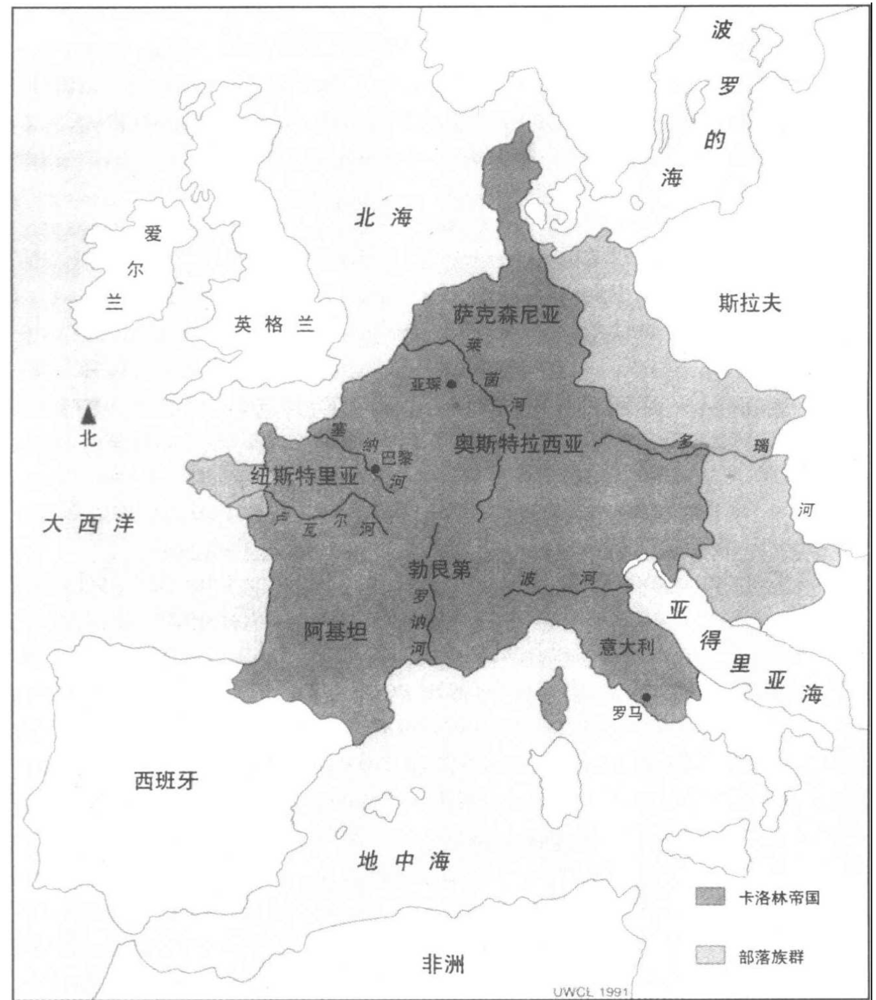
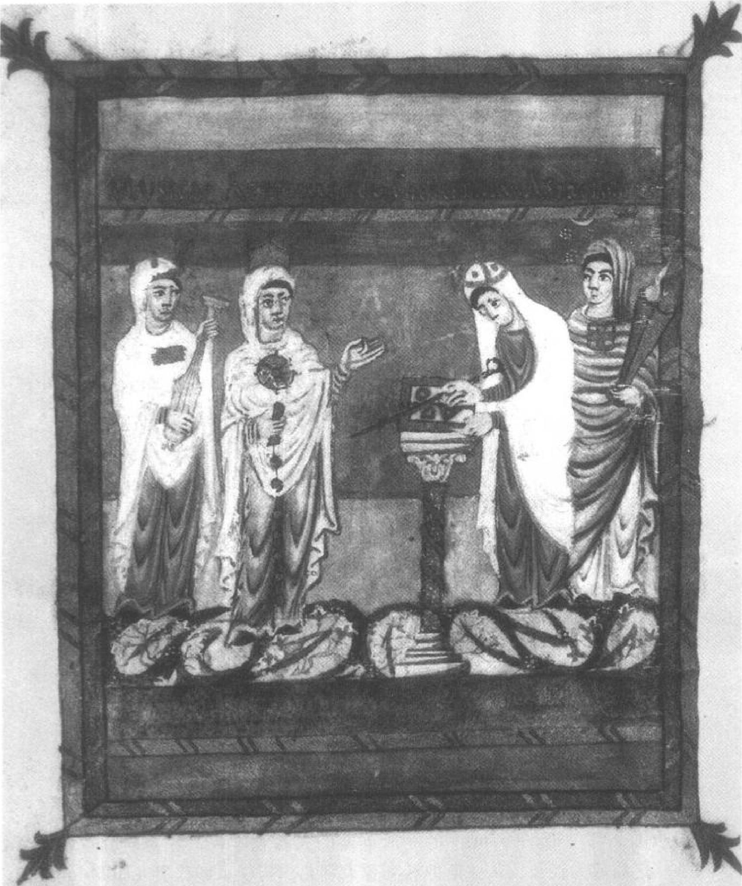
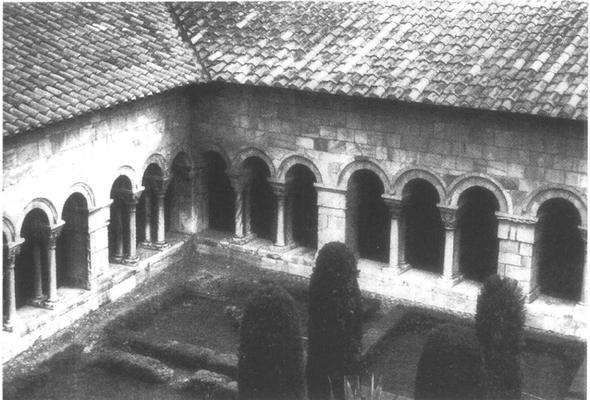
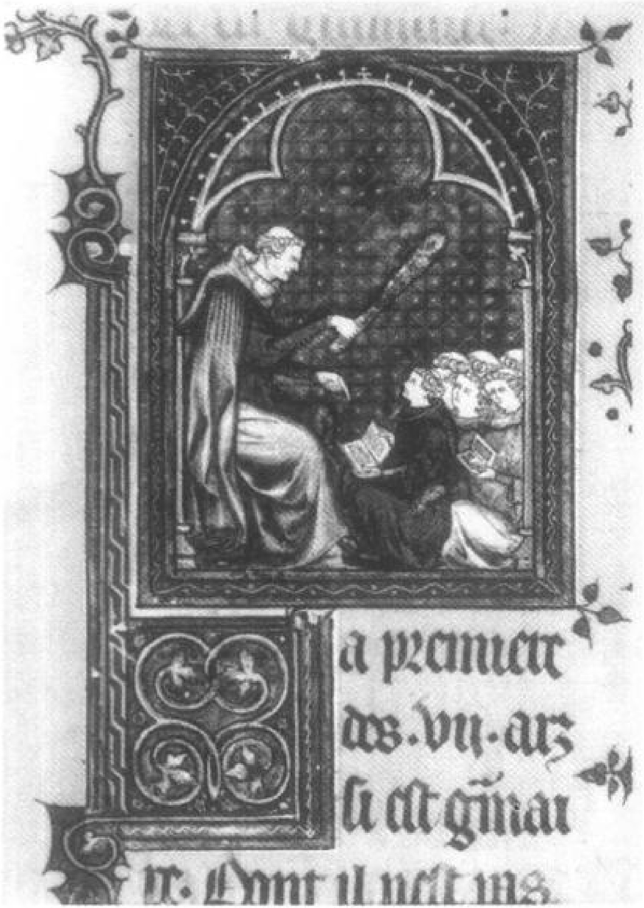
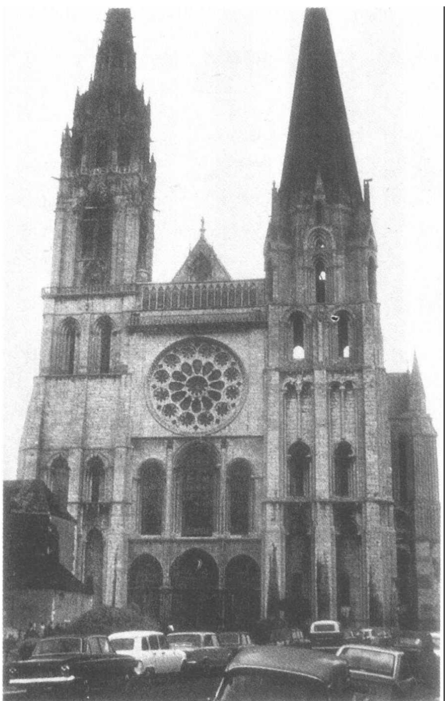
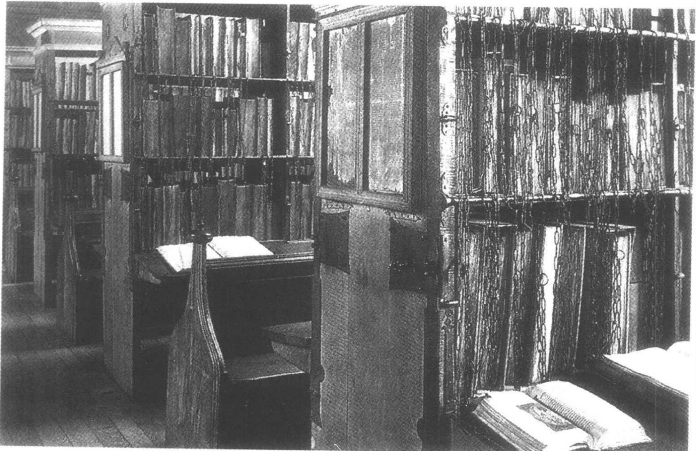
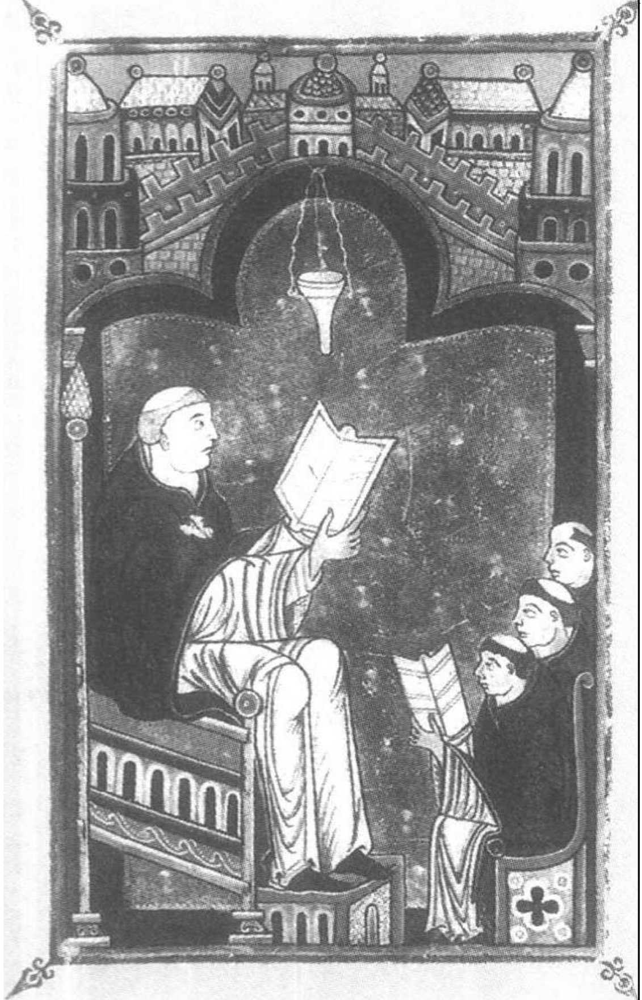
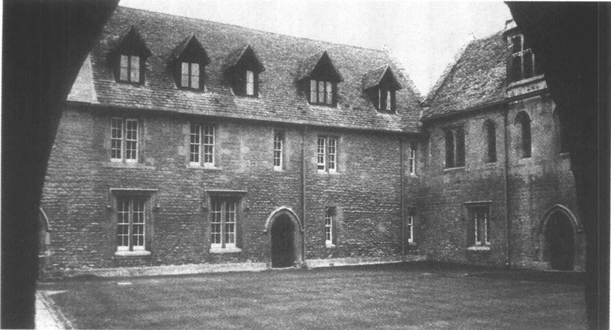
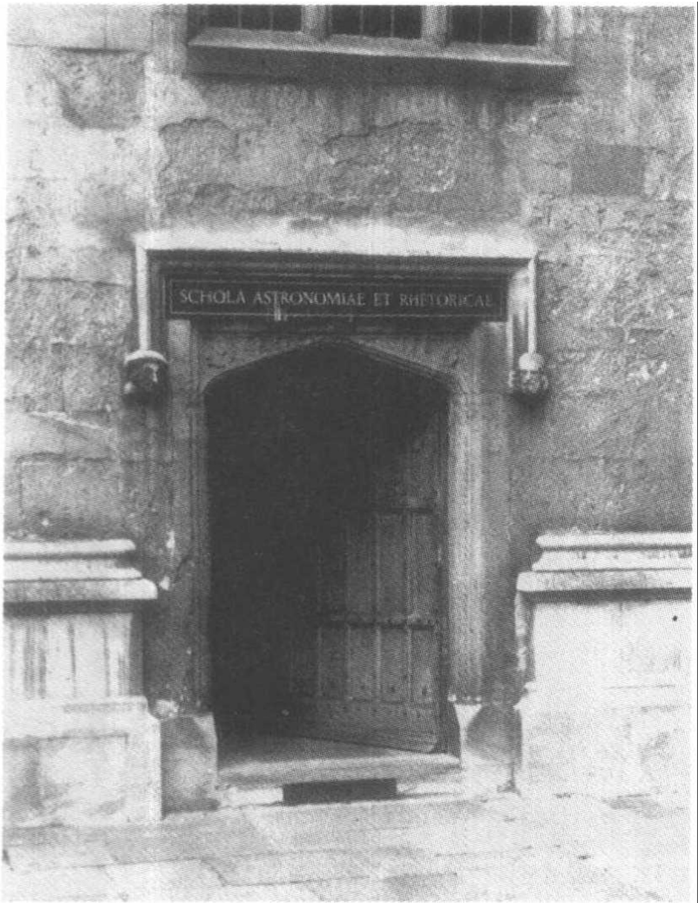

# 第九章 西方的学术复兴

## 中世纪

至此，我一直在使用“中世纪”这一表述而没有加以定义，也没有具体指出它在年代学上确切的界期。不确切有时也是一种优点，这里就是一例，因为历史学家本身也没有在这一表述的意义问题上达成一致。但是这段时期现在还是逐渐明确了一些。“中世纪”这一概念首先是在14、15世纪的意大利人文主义学者中产生的，这些学者在灿烂的古代成就和他们自身所处的启蒙时代之间看到了一个黑暗的中间期。现在，这种贬抑的观念（它集中反映于“黑暗时期”这一人所熟知的绰号）已经被赞同中立观点的专业历史学家所彻底摒弃，他们把“中世纪”仅仅看作西方历史中一段时期的名称，该时期对西方文化作出了独特而重要的贡献——这种贡献应当得到公正而无偏见的考察和评价。

中世纪在年代学上的界限必然会模糊，因为中世纪文化（无论我们确切地把它看成是什么）的产生和消失都是渐进的，而且在不同地区，它出现和消失的时间也有所不同。如果一定要指明具体时期，那么我们可以把中世纪看成是覆盖了从罗马文明在拉丁西方的终结（约为公元500年），到通常被称为“文艺复兴”的艺术与文学的复兴确实已经开始的1450年之间的一段时期。就我们的意图而言，

---

为了方便起见，我们可以进一步把这一时期细分为中世纪早期（约500-1000年）、过渡时期（1000-1200年）和中世纪晚期或高峰期（1200-1450年）。这并不完全是标准的细分（中世纪“高峰期”与“晚期”常常被区别开来），但这种划分将有助于实现我们的意图。

## 卡洛林王朝的改革

（在第七章）我们已经看到了罗马帝国在拉丁西方没落的命运，以及那种在我们看来具有典型中世纪特征的社会宗教组织的出现，如修道生活。西欧经历了一个逆城市化过程，古典学校没落了，推动平民教育和学术活动的领导力量转移到了修道院，在此，一小部分古典传统作为宗教和神学的婢女而得以保全。但这并不意味着僧侣教育一枝独秀。一些城市学校仍然存在，特别是在意大利；宫廷和教会的学校从未销声匿迹；而且，一些名门望族总是想方设法求取私学。这里仅仅是表明，修道院成为了占统治地位的教育力量。

这是否意味着严肃的学术已走到了尽头？有些人是这样认为的，因为他们把“学问”看成是希腊和罗马学问的延续。但这似乎是个严重的错误。无疑，学术的数量和质量都下降了，但要说它作为一个多产的事业已不复存在，却是由于没有看到正确的东西或没有在适当的地方看到它而造成的错觉。事实上，学术仍在发展，但已经采取了一种新的形式，并且其焦点也不同了。

学术的新焦点是宗教或教会：占据了那些最出色学术头脑的是诠释《圣经》、研究教史、促进教会统治和发展基督教教义。我们已经看到，波埃修（480-524年）不仅翻译了亚里士多德逻辑学的若干篇章、编写了人文艺学手册，而且还撰写了论述当时神学争论的一组小论文。塞维尔的伊西多尔（约560-636年）不仅撰写了包含其自然哲学思想的百科全书式著作《语源学》和《物性论》，而且编写了指导教士研习历史学、神学、《圣经》解释和仪式等内容的小册子。图尔的格列高利（Gregory of Tours，卒于595年）撰写了一部《法兰克人的历史》（History of the Franks），该书记录了基督教在法兰克人

---

领地的传播。公元590年当上教皇的大格列高利（Gregory the Great，约550-604年）写成了一部很有影响的关于布道、演讲、对话和《圣经》评注的文集。比德(卒于735年)除了在计时术和历法方面的著作外，还为我们留下了《圣经》评注、布道术和圣徒言行录（圣徒生平）。

在这些宗教和神学著作中几乎没有科学或自然哲学，但确实存在着希腊的逻辑学和形而上学。波埃修开创了先河，他决心在亚里士多德逻辑学以及柏拉图和亚里士多德形而上学的帮助下，参透诸如神的先知和三位一体之本性等等问题。伊西多尔试图以哲学传统中的对应情况来解释基督教中各种异端邪说的起源。甚至大格列高利这个对异派学说直言不讳的批评家，也在许多方面或明或暗地表现出其神学的哲学基础。

8世纪晚期有一个学术活动的大爆炸，它与查理曼（查理大帝）的宫廷有关。公元768年，查理曼继承了包括现在一部分德国、大部分法国、以及比利时和荷兰的法兰克王国。到辞世时的814年，查理曼已将他的王国扩展到包括更多的德国领土、瑞士、一部分奥地利和大半个意大利——这是自罗马帝国消亡以来西欧出现的第一个建立中央集权政府的重要尝试（见图5）。作为强化教会和国家的整个计划的一部分，查理曼开始了教育改革，他从海外引进学者来充实一座宫廷学校，并下令在全国范围内兴建修道院和大教堂学校（cathedral school）。查理曼说服了英格兰北部约克郡大教堂学校的校长阿尔昆来领导这一教育事业。

阿尔昆（Alcuin，约730-804年）是爱尔兰学术传统的一个受益者，他的思想渊源可以直接追溯到比德。阿尔昆创造出一个生气勃勃的宫廷学校，这所学校专门用来培养皇室成员，并为这方面补充受过教育的宗教和政界从业人员。我们几乎对这所学校的课程一无所知，但有一点是清楚的：七种人文艺学包含在课程之内，甚至天文学也在一些级别的课程中得到讲授。阿尔昆本人写了关于三艺的教科书。阿尔昆的学生被任命为主教或修道院院长。在他和他们的努力下，教士们的平均受教育程度提高了。以阿尔昆为核心形成了一个学术圈子，其成员热衷于当时的神学争论并参与了这些争论。在

---

地图 5 814 年前后的卡洛林帝国。

他的领导下，这些人收集、校对和誊写了许多书籍——其中包括神父们的著作，间或还有古典作家的作品。最后，查理曼和阿尔昆最重要也最持久的举措之一，是颁布了兴建大教堂学校和修道院学校的

---

图9.1 四艺的化身。从左至右依次为：音乐，算术，几何和天文。来自波埃修著作《算术》的一个9世纪摹本，班贝格，MS Class. 5（HJ. IV. 12），fol. 9v。

---

敕令，这使教育在拉丁西方比前几个世纪更广泛地传播开来（当然直接面向的是教士），并为将来的学术奠定了基础。 $ ^{2} $

从两位学者的职业生涯可以看出这些教育改革所带来的益处，他们一位来自9世纪，一位来自10世纪。约翰·司各脱·爱留根纳（John Scotus Eriugena，活跃于850-875年）是查理曼之孙秃头查理（Charles the Bald）宫廷中的一位爱尔兰人，他无疑是9世纪拉丁西方中最博学的学者。爱留根纳有许多天赋，其中包括敏锐而富有创造性的头脑和罕见的语言才能。他精通希腊文，这种才能可能首先是在一些爱尔兰僧侣学校中获得的，到达大陆以后得以提高，他运用这一才能将几篇希腊神学论著翻译成了拉丁文：首先，在秃头查理的要求下，他翻译了伪狄奥尼修斯（Pseudo-Dionysius，约公元500年时一位匿名的新柏拉图主义基督徒）的作品，后来他又翻译了几位希腊神父的著作。爱留根纳还创作了几篇富有新意而又构思缜密的神学论文，在其中他发展了伪狄奥尼修斯的新柏拉图主义，并试图将（带有希腊倾向的）基督教神学与新柏拉图哲学加以综合。他的《论自然》（On Nature）是解释被造之物的一个尝试，其中包含着一种表述清晰的（当然，完全是基督徒式的）自然哲学。最后，他为马蒂纳斯·卡佩拉有广泛影响的人文艺学教科书《默丘利与论学术的联系》撰写了一本集注，这可能与他的教学工作有关。爱留根纳对他身边的门徒有着直接的影响，并且通过他们持续地影响着西方思想。 $ ^{3} $

卡洛林王朝教育改革的另一位受益者出现在一个世纪后法国中南部欧里亚克（Aurillac）的僧侣学校。吉尔伯特（Gerbert，约945-1003年）经历了令人眼花缭乱职业生涯，这是其智力天赋同政治机会主义相结合的产物。尽管出身于卑微，他却先后在欧里亚克和西班牙北部受到良好教育，他曾在西班牙学习过一段时期，然后来到法国北部兰斯（Reims）的一所重要的大教堂学校，先是研究逻辑学，之后成为校长。从兰斯他转到意大利北部担任了博比奥（Bobbio）修道院的院长，回到兰斯后担任了大主教，后来他又以拉韦纳（Ravenna）大主教的身份回到意大利。公元999年，支持他的奥托三

---

图9.2 西班牙东北部里波尔的圣玛利亚修道院。承蒙 William J. Courtenay 惠准。

世（Otto III，萨克森王朝皇帝）帮助他当选为教皇西尔维斯特二世（Pope Sylvester II）。

人们总是习惯性地强调吉尔伯特在伊斯兰和拉丁基督教世界富有成果的思想交流中所扮演的先驱角色。然而在考察他那一方面的成就之前，我们必须指出：他也对一个更古老的学术传统作出了贡献——他重新发现和传播了古典人文艺学，特别是通过波埃修和其他拉丁作者的文献传递下来的亚里士多德逻辑学。在兰斯，吉尔伯特传授亚里士多德、西塞罗、波菲利以及波埃修等人五花八门的逻辑学著作，他还编写了至少一本属于他自己的逻辑学著作。然而，吉

---

尔伯特的成名却在于他对数学四艺所作的贡献，在这一点上与伊斯兰的联系至关重要。当吉尔伯特于967年穿越比利牛斯山到达西班牙东北角师从比克（Vich）主教阿托（Atto）时，毫无疑问，他的目的是要掌握数学科学，这些科学在那里（由于接近伊斯兰的缘故）明显比在比利牛斯以北任何地方都得到了更高度的培育。

对吉尔伯特学习的细节我们一无所知，但他后来的职业生涯为他在数学科学上的精湛造诣——这种造诣几个世纪在拉丁世界中无出其右，尽管同最杰出的希腊数学相比还很有限——和他对伊斯兰数学和天文学成就的谙熟提供了雄辩的证明。他的书信尽管大多充斥着混乱的政治和宗教内容，但不时也提到数学、天文学、要誊抄或修正的手稿（包括老普林尼的《自然史》）、待翻译的书籍以及他希望获得的那些著作（包括波埃修和西塞罗的作品）。在一封信中，吉尔伯特想要获得西班牙人约瑟夫（Joseph the Spaniard，一位讲阿拉伯语的基督徒）的一本关于乘除法的书籍；另一封信中，他请求能得到卢皮图斯（Lupitus，巴塞罗那大教堂的执事长）从阿拉伯文翻译而来的一本天文学著作；还有一封信，他在信中宣称自己发现了一本在他看来是由波埃修所著的天文学著作。吉尔伯特赞扬了他的支持者奥托三世对数的兴趣。他指导他的朋友并与之一道研究怎样才能解决各种算术和几何问题。他还指导说明如何制作一种天文学模型（一个标有主要天体运行轨道和星座的半圆球），以及用算盘进行乘除运算的方法（使用阿拉伯数字）。

最后一点，吉尔伯特在比克师从阿托的三年间，可能同附近里波尔的圣玛利亚修道院（Santa Maria de Ripoll）有一定的往来。这种交往有多密切，我们并不清楚，然而在那时，里波尔似乎已经成为基于阿拉伯文献来源的四艺研究中心。在这个修道院的图书馆幸存下来的一部拉丁文手抄本（标明的时间大致就是吉尔伯特造访西班牙之时）中，包含了翻译过来的大量关于数学和星盘（一种用于天文观测和计算的仪器）的重要阿拉伯文论文。可能，在他穿越比利牛斯的归途中，吉尔伯特带上了这些论文中的一篇或若干篇的摹本。我们知道，50年后在德国南部赖歇瑙（Reichenau）的修道院发现了

---

其中一篇论文。吉尔伯特自己也可能撰写了关于星盘的论文。显然，吉尔伯特利用他作为教师和教会要员这些富有影响的职位促进了西方数学科学的发展。

## 11 和 12 世纪的学校

1003年吉尔伯特去世时，西欧正处于政治、社会和经济复兴的前夜。这一复兴的原因纷繁复杂，其中之一是出现了一些实力强大的君主，他们能够维持安定、减少内乱和暴力。同时，继9世纪和10世纪维京人（Viking）和马扎尔人（Magyar）的入侵之后，边境又恢复了安宁。在饱经数百年的侵略之后，欧洲人正要转而成为侵略者，他们将把穆斯林赶出西班牙，并且派遣十字军光复圣地。

政治稳定带来了商业的发展和更多的富裕。货币经济向农村扩展，促进了农产品贸易。技术发展在供应必需品和创造财富方面扮演了关键性角色。例如，水车的改进和推广引起了一场小小的工业革命。农业上的革新，如作物的轮耕以及马轭和轮式犁的发明（可能与气候条件改善结合在一起），是食物供给大幅增长的主要原因。 $ ^{5} $在这些变化中最引人注目的是人口爆炸。尽管没有确切的数字，但是在公元1000-1200年间，欧洲人口已经达到了原来的两倍、三倍甚至四倍，而其中城市居住人口甚至增长得更快。 $ ^{6} $反过来，城市化为经济的发展提供了更多的机会，它使财富得以集中，并鼓励了学校和理智文化的发展。

人们普遍认为，在教育和城市化之间存在着密切关系。古代学校的消失是与古代城市的败落联系在一起的，教育的恢复则紧随11、12世纪欧洲的重新城市化。中世纪早期学校的样板是僧侣学校，它们是田园式的，与尘世隔离，并致力于狭窄的教育目标（即使那些目标有时在外部的压力下变得有所扩展）。随着11、12世纪人口向城市转移，此前曾对教育事业产生过较小贡献的各种各样的城市学校走出了僧侣学校的阴影，成为主要的教育力量。这种发展也得益于僧侣制度内部的改革运动，该改革旨在减少僧侣对世俗事务的干预，

---

图9.3 一幅表现语法学校场景的绘图：老师正举着手杖斥责学生。巴黎，国家图书馆，MS Fr. 574, fol. 27r（14世纪）。

并重新强调修道生活的精神性。在当时已经出类拔萃的城市学校中，有教堂学校，还有由教区牧师们经营的学校和五花八门的公立学校，其中既有小学也有中学。它们并不直接与教会的需要相连，而是向着任何能够担负其费用的人敞开大门。

这些新城市学校的教育目标比僧侣学校要宽泛得多。由于领导学校的学者们在观念和专业特长上有差别，教育计划的侧重点会因学校而异。但是从总体上看，城市学校拓宽了课程范围，并对其重新作了定位，以满足各种雄心勃勃的主顾们的实际需要，这些人将

---

要开始在教会和国家中占据领导地位。甚至那些和僧侣学校一样仅仅具有宗教目的的大教堂学校，也会在确定课程时更宽泛地理解哪些研究会有助于实现宗教目的。如果一位学者或学生在教育上的雄心已经超出大教堂学校的体系所能维持的范围，他们就可能脱离教堂而独立于其权威自行运作。很可能“学校”是流动的而不是地理上固定的，它追随一个无论在何处传道授业都能吸引学生的富有魅力的学者。 $ ^{8} $这种新格局的产物就是课程内容的迅速拓展：逻辑学、四艺、神学、法律和医学在城市学校中发展到了在僧侣传统中前所未闻的程度。新学校在数量上和规模上都成倍增长，鼎盛之时，它们在学术领域中大放异彩，把那些最博学的学者和学生都吸引在其周围。

在法国，最有生命力的一些学校都依附于受到9世纪加洛林王朝改革影响的那些地区的教堂（或在这些教堂的控制下运作）。劳恩（Laon）是一个早期的代表，它在公元850年时已经拥有一所重要的大教堂学校，并直到11和12世纪时还在神学上享有盛誉。10世纪中，吉尔伯特先后担任了兰斯大教堂学校的学者和校长。12世纪时，沙特尔（Chartres）、奥尔良和巴黎的学校兴起，成为人文艺学的领导中心。12世纪最著名的学校是沙特尔的大教堂学校——尽管它的卓越程度和持久性最近受到了怀疑。 $ ^{9} $同一时期，离它不远的巴黎的学校一定也很繁荣，它们在广大的学科范围内提供了教育，其中包括人文艺学。而在法国以外，第一流的学校则较少与教堂有所瓜葛：波伦亚（Bologna）在12世纪早期以先进的法律教育（通过私人教师）闻名于世，到该世纪末，牛津（该地没有大教堂）已经赢得了在法律、神学和人文艺学方面的声誉。

这些学校的若干特点对于我们的意图很重要。首先，它们体现了一种旨在恢复和掌握拉丁文经典（或已有古代拉丁文译著的希腊经典）的不懈努力，它超过了中世纪早期在这方面所作出的一切。沙特尔的贝尔纳（Bernard of Chartres）把他那一代人描绘成站在巨人肩膀上的侏儒，他们之所以能够看得更远，并不是由于个人的聪明才智，而是由于掌握了经典著作。他的话代表了他那个时代。在最受

---

欢迎的罗马作家中有诗人维吉尔（Virgil）、奥维德（Ovid）、卢坎（Lucan）和贺拉斯。西塞罗和塞内加是公认的道学家，并且西塞罗和昆体良（Quintilian）被看作是雄辩的典范。亚里士多德及其评注者（特别是波埃修）的逻辑学著作得到了认真的研究并被应用于各种科目。法律研究主要依赖于《查士丁尼法典》（Digest）的重新发现，该法典集罗马法律思想之大成。马蒂纳斯·卡佩拉、麦克罗比乌斯和柏拉图（通过卡奥西蒂乌斯的《蒂迈欧篇》译本和附带的集注）是宇宙论和自然哲学主要的思想来源。这绝非表明这些异教经典取代了已经成为僧侣教育核心的基督教文献，而是说，这些新发现的资料在《圣经》和神父们的著作旁边找到了自己的位置。人们认为所有这些文献是相互谐调的，重新发现那些古代经典只是拓展了人们可以合法研习的资料。 $ ^{10} $

其次，城市学校与更广泛意义上的欧洲社会一样，发生了显著的“理性主义”转向，那就是，一种将理智和推理应用于人类事业许多领域的努力。例如，人们尝试通过记录档案、发展统计和审核程序而使商业活动和教会与国家的管理合理化。一位历史学家将之描述为一次“管理上的革命”。 $ ^{11} $ 对人类理智能力的同样信心遍及于学校之中，在此，哲学方法以日益增长的热情应用到整个课程体系当中，其中包括《圣经》研究和神学。

将理性应用于神学，这并非第一次。正如我们已经看到的，基督教最早的辩护士就是用理性来捍卫这种信仰的；早期中世纪的学者们（受到波埃修事例的启发）也坚持不懈地致力于将亚里士多德的逻辑学应用于那些棘手的神学问题。11、12世纪与以往的不同之处，在于神学家对运用哲学方法所投入的努力程度。柏克和坎特伯雷的安瑟伦（Anselm of Bec and Canterbury，1033-1109年）就是极好的一个例证。 $ ^{12} $ 尽管其神学信仰是彻底的正统思想，但安瑟伦打算突破神学方法论的局限：他要探索纯粹理性在神学王国究竟能够有何作为，他要询问某些基本的神学教义在理性或哲学标准面前是否还能成立。他最著名的一篇神学论证是对上帝存在的证明（被称为“本体论证明”，ontological proof），在这个论证中他并未依赖于《圣经》

---

图 9.4 沙特尔大教堂的正西面（12 世纪）。

的权威。安瑟伦的意图完全是建设性的，显然，他将哲学方法应用于关于上帝存在和上帝品性的教义，不是因为他怀疑这些教义，而是为了支持它们，并且使之在非信仰者面前确定无疑。乍一看，这似乎并不怎么大胆，然而事实上却很危险：倘若能够用理性来验证神学主张，可想而知它也可能推翻它们。只要理性得出的答案是“正确的”，这就不会是一个问题，但倘若我们把理性视为真理的仲裁

---

图 9.5 赫里弗大教堂中用锁链锁住的图书馆。

人，之后却发现理性和信仰相对立，那又如何是好呢？ $ ^{13} $

比安瑟伦晚一代人的彼得·阿伯拉尔（Peter Abelard，约1079-1142年）是法国北部（包括巴黎和劳恩）学校中一位才华横溢、不知疲倦而又时常引起麻烦的学者和老师，他发展了始自安瑟伦的这一理性主义纲领。在各种著作中，他捍卫了那些在同时代人看来是危险的神学观点，因此两次受到宗教权威的谴责。阿伯拉尔最著名的作品是《如是而非》(Sic et non，也可大致译为《是与非》或《赞同与反对》)，在这本作为学生学习资料的书中，他收集整理了神父们在一系列神学问题上的冲突意见。他从冲突的观点提出问题，这些问题是哲学所必须要考察的对象。在他看来，通向信仰之路需经过怀疑。毫无疑问，阿伯拉尔的用意是以理性推断并支持信仰。有

---

图9.6 圣维克托的于格在巴黎执教。牛津，波德莱恩图书馆，MS Laud. Misc. 409, fol. 3v（12世纪晚期）。

一次他写道，他并不“希望成为一位哲学家，如果这意味着背叛（圣徒）保罗；也无意成为亚里士多德，如果这意味着（使自己）同基督断绝关系。” $ ^{14} $无疑，他被那些持有更保守观点的人，例如曾经对他表示震怒的僧侣改革家克莱尔沃的贝尔纳（Bernard of Clairvaux），看作是哲学方法的一个危险的卫道士。阿伯拉尔吸引了一批狂热的学生，这一事实一定证实了贝尔纳最大的担心。

从安瑟伦、阿伯拉尔及其同时代那些志同道合者的著作中，我们能够发现信仰与理性之间相互冲突的因素。安瑟伦和阿伯拉尔以一种人们无法回避的方式提出了这样的问题：人在神学王国中如何

---

能 “知”？学校中其他科目（逻辑学、自然哲学和法律学）所运用的理性方法是否也适用于神学？或者说是神学要臣服于其他一些主人？如何才能解决理性（希腊哲学）与启示（《圣经》中揭示的真理）之间的冲突？对诸如此类问题的担心妨害了学术的复兴，也设定了13、14世纪哲学家和神学家奋斗的方向。即将开始的对希腊和伊斯兰哲学、科学文献的大规模移译仅仅会使这一问题变得更加尖锐。下面（在第十章中）我们将回到这一主题上来。

## 12 世纪学校中的自然哲学

自然哲学在12世纪的学校中并没有占据中心舞台，但它的确受益于普遍的学术热潮。学者们掌握拉丁文经典的决心拓展到自然哲学的经典著作，它们是：带有卡奥西蒂乌斯注解的柏拉图《蒂迈欧篇》、马蒂纳斯·卡佩拉的《默丘利与论学术的联系》、麦克罗比乌斯的《西比奥之梦评注》、塞内加的《自然的问题》（Natural Questions）、西塞罗的《论神性》（On the Nature of the Gods）以及奥古斯丁、波埃修和约翰·司各脱·爱留根纳的著作。这些文献绝大多数都带有一种柏拉图倾向，阅读和分析了它们的学者立刻被引向柏拉图的宇宙观。《蒂迈欧篇》作为最有条理地讨论宇宙论和物理学问题的可得文献以及柏拉图本人的语料库，成为了核心文献。这种中心地位又转而使之能够塑造12世纪自然哲学的进程和内涵。这并不是说12世纪的柏拉图主义非常纯粹，也不意味着它惟我独尊：斯多葛派的某些思想楔入了柏拉图主义的大环境。该世纪末，亚里士多德的物理学和形而上学著作开始显露头角，而到13世纪时，柏拉图哲学将在亚里士多德哲学的猛攻下步步退却。然而此时，占据领导地位的是柏拉图。 $ ^{15} $

但是柏拉图是一个善变的向导，柏拉图的领导可以有很多不同的意义。《蒂迈欧篇》是最早关于神创造宇宙的记述。因此，显然而且也最迫切的任务，是将柏拉图宇宙论（或宇宙论中讨论宇宙起源的部分——“宇宙进化论”）和几个世纪以来神父们所解释的《创世

---

图9.7 作为宇宙建构者的上帝。维也纳,奥地利国家图书馆,MS 2554, fol. Iv (13世纪)。

---

《记》中对创世的描述加以调和。或者稍稍变换一种说法，这个任务就是要把从柏拉图和其他古人那里学来的宇宙论和物理学用于阐明《创世记》对创世的描述。应当指出，科学仍然被看作是一个婢女。

12 世纪中许多杰出的学者投身于这一事业。沙特尔的梯埃里（Thierry of Chartres，卒于 1156 年后）即为其中之一，他在沙特尔和巴黎是一位享有国际声望的老师。梯埃里写了一部关于六天创世说的注释，书中他给《圣经》的原文加上了柏拉图主义宇宙论的内容（以及亚里士多德和斯多葛派自然哲学的一些部分）。首要的一个任务是说明《创世记》中所描述的上帝创世活动的具体顺序。按照梯埃里的观点，上帝首先在第一时间创造了四元素，其后每一事物都是那种原初创造行为所内在的秩序的自然展开。一旦被创造出来，火立即开始旋转（因为它的轻盈不允许静止），同时也照亮了气，这样就解释了昼与夜（创世的第一天）。在燃烧的天空的第二个轮回，火加热了下面的水，使它们作为蒸气上升，直到悬浮于气的上方，形成《圣经》中所谓的“穹天上的水”（第二天）。由于蒸发导致下界水的数量减少，就使海洋中出现了干燥的陆地（第三天）。天空中水的进一步受热形成了由水构成的天体（第四天）。最后，土和较低的水受热产生了植物、动物和人（第五、第六天）。 $ ^{16} $

这只是对梯埃里译注的一个非常简短和不完全的考察，但它足以揭示他及其同时代各种人在柏拉图的启发下所开创的那一哲学纲领的实质。如果用现代标准来衡量，梯埃里的宇宙论可能算不上精致。但重要的是在柏拉图的领导下，它将神的直接干预限制于创世的原初一刻。此后发生的事件都是自然原因的结果，是随着元素以适于它们的方式运动和相互作用，以及随着植入被造之物的种子（通过奥古斯丁借用的斯多葛派哲学中的“种因”）开始的一个自然发展过程而产生的。甚至亚当、夏娃及其后人的出现，也无需奇迹般的干预。

这种自然主义是 12 世纪自然哲学一个最鲜明的特征。它体现在对创世的若干天所作的注释（这可能是一个自然哲学家展现其自然主义倾向最好的用武之地），也体现在学者们更一般性的自然哲学论

---

著中。如孔什的威廉（William of Conches）、巴斯的阿得拉尔（Adelard of Bath）、欧坦的奥诺留斯（Honorius of Autun）、贝尔纳·西尔维斯特（Bernard Sylvester）和阿拉斯的克拉里伯德（Clarembald of Arras）（他们当中大多数人都与法国北部的学校有联系）。当然，这些学者在宇宙论和物理学的细节上观点不尽相同，但他们都把自然看作一个自主和理性的实体，在不受干预的情况下按照自身的原则运行。他们日益关注于自然秩序或自然规律，决心弄清用自然的因果原则解释世界究竟能够获得一个多么令人满意的结果。 $ ^{17} $

这种自然主义的一位坦率的倡言人是孔什的威廉（卒于1154年后），他在进入杰福瑞安茹（Geoffrey Plantagenet）家族、担任未来的英格兰国王亨利二世的私人教师之前，曾在沙特尔、巴黎或这两地研究和任教。威廉在柏拉图原理（包括从一些新译文献资料中得到的重要补充）的基础上发展出一门严密的宇宙论和物理学。在其《世界的哲学》（Philosophy of the World）一书中，威廉抨击了那些动辄从神那里寻找原因的人：

因为他们自己对自然力一无所知并希望所有人同他们一样无知，他们就不情愿让任何人研究它们，而是希望我们像乡下人一样轻信，并且不去探寻事物的自然原因。然而，我们说每个事物的原因都要去寻求……但这些人……如果他们知道有人这样研究，就将之指责为异端。

威廉的意图，正如他在其他地方讲明的那样，不是要否认神的力量，而是声明神总是习惯通过自然力来行事，哲学家的任务是尽可能充分发挥这些自然力的解释能力。巴斯的阿得拉尔（活跃于1116-1142年）在大致相同的时间也表达了同样的观点，他极力主张只有在自然解释“完全失败的时候才应求助于上帝”。不久以后，圣维克多的安德鲁（Andrew of St. Victor）也在讨论对《圣经》事件的解释时建议道：“在诠释经典时，当被描述的事件不接受任何自然原因的解释时，我们才能而且仅仅能求助于神迹。” $ ^{18} $

---

这可能是一个明智的观点，但它也是一个危险的主张。寻求自然因（这是12世纪自然哲学家们的观点）的强烈使命感怎样才不致于滑向对神迹的彻底否定（这对于信仰基督的学者而言是完全无法接受的结果）呢？学者们能够在这种观点所提出的信仰和不信仰之间保持一种微妙的平衡吗？孔什的威廉直接论述了这一问题，他指出，承认上帝有足够的能力去完成一些行动和坚持上帝实际已经完成这种行动，两者是不同的。上帝肯定并没有做他能做的每一件事。他补充道，他（以及他那些“自然主义者”的同伴们）的哲学观并没有贬低神的力量和神的威严，因为无论什么最终都源于神：“我没有从上帝那里拿走任何东西，世上万物除魔鬼以外都是上帝造就的，然而他是通过作为神的工具的自然运作来造就其他事物的。”的确，对物理世界的研究使我们可以真正欣赏到“神的力量、智慧和善。” $ ^{19} $寻求第二因不是否认而是确证了第一因的存在和至高无上。

其他的几种哲学观也有助于缓解这种紧张。如果承认神迹代表了常规自然法则真正的失效，而同时坚持这种失效是上帝从最初的创造中计划好的并已将之构建于宇宙机器之中，从而在更大的意义上说它们保持了完全的自然性，这样就可能调和神迹与自然秩序的不变性。而且，通过如下论证就可以谈论不变的自然秩序而不会冒犯神的全能和自由：(a)上帝有无限自由去创造他所希望的任何一种世界，但是(b)事实上他选择了创造这个世界并且在完成了创造的行动之后再不干涉这一产物。后面的这种区分对于13、14世纪关于该主题的观念的发展将是至关重要的。 $ ^{20} $

一些现代读者可能会把所有这些看作是神学向科学王国的一种令人无法容忍的侵犯，因而会对此嗤之以鼻。然而，如果我们希望理解12世纪的话，很重要的一点就是要意识到，12世纪的那些局外人会以截然不同的眼光来看待这些发展——他们会将之视为哲学向神学领域的一种危险的侵犯。新的威胁并不是神学出现在它所十分熟悉的哲学的管界，而是哲学在神学一直未曾受到挑战地统治着的领地内展示了其力量。在12世纪那些反对自然哲学的人看来，哲学似乎是想要摆脱她的婢女身份。

---

让我们简要概括一下12世纪自然哲学的若干其他方面。《蒂迈欧篇》和一些辅助性文献不仅促进了一种不变的自然秩序的观念，它们也使人成为那一秩序的一部分，人要受到同样法则和原理的支配，因此对人的本性的探索就被理解成是更普遍性的对宇宙探索的延续。通过大宇宙－小宇宙的类比（人不仅属于这个宇宙而且事实上也是它的缩影），这种观点常常变得更加有力了。由此得出，宇宙和单个的人由结构和功能上的相似性联系在一起，这些相似性把它们结成一个紧密的统一体。例如，正如四元素构成的宇宙是由世界灵魂（它的确切本性在12世纪时引起了相当大的争论）所激活的一样，人也是一个身体（四元素）和灵魂的复合体。

在使人成为自然秩序的一部分以后，12世纪的学者们越来越对“自然的人”——也就是独立于神的荣耀而存在的人——及其能力产生了兴趣（因此历史学家有时把12世纪写成是“人本主义”时期）。在这种联系中，对理性价值的肯定成为一种强烈的倾向。由于理性作为自然秩序的一部分而与之同节奏相谐和，所以它被认为是探究宇宙的一种再适合不过的工具。 $ ^{2} $

与这种大宇宙一小宇宙的类比紧密相关的是占星术。在中世纪早期占星术已经变得声名狼藉，这要归因于神父们的抵制。奥古斯丁攻击它是一种偶像崇拜（因其传统上与对行星的神性的崇拜联系在一起），认为它的趋势是导致一种宿命论并否认自由意志。但是12世纪，在柏拉图主义和大量涌入的阿拉伯天文学及占星术翻译文献的影响下，占星术至少已恢复到了一种半体面的地位。在《蒂迈欧篇》中，造物主创造了行星和天上的众神，但又授与它们在更低的区域产生以后的各种生命形式。这种启发性解释，与宇宙一体的观念、大宇宙一小宇宙的类比以及天地现象间某些早已为人熟知的关联（季节和潮汐）结合在一起，并且在新翻译过来的阿拉伯占星术著作的促进下，使人们对占星术的兴趣和信仰重新高涨起来。这里并不能对占星术的理论和实践活动作细致的分析（这是本书第十一章的任务）。对我们的意图而言，重要的是，12世纪的占星术丝毫没有借助于超自然，恰恰相反，它之所以在12世纪自然主义者中间盛

---

行起来，正是因为它需要去探求联系着天与地的自然原因。 $ ^{22} $

最后，像我们也许会设想的那样，柏拉图哲学的数学倾向是否影响了12世纪的思想？答案是肯定的，但这种影响是以令现代读者感到诧异的一种方式来实现的。在12世纪上半叶，数学并未被用来将自然法则定量化，或对自然现象提供几何表征，而是被用于回答我们认为是形而上学或神学的那些问题。这是我们难以深入研究的一个极其深奥的主题，但一个例子可以帮助我们指明道路。12世纪学者追随着波埃修，把数的理论（具体地说，就是1这个数与其他数的关系）看成是理解神的一体性和被造之物的多样性之间关系的一个工具。这正是沙特尔的梯埃里后来所表达的观点，他写道，“数的创造就是物的创造。”数学在12世纪也是公理化证明方法的一种模式。将数学运用于科学这种更广泛的观念，却不得不等到该世纪晚期希腊和阿拉伯数学科学被翻译和吸收之后才能产生。 $ ^{23} $

## 翻译运动

学问的复兴始自一种掌握和开发传统拉丁文献的努力。然而，在12世纪结束之前，它发生了改观。这种改观来自于新书籍的大量涌现，它们包含着新思想，是新近从希腊和阿拉伯资源中翻译而来的。这些新材料，由涓涓细流转变成最终的一股洪流，它极大地改变了西方的学术生活。在那以前，西欧一直在致力于减少学术思想的损失，而此后，它将面临着如何吸收新思想的洪流这样一个完全不同的问题。 $ ^{24} $

其实，东西方从来就没有完全分裂。总有旅行者或商人（穿梭于东西方之间），而边境附近懂两种语言（甚至多种语言）的人也相当多。在拜占廷、穆斯林和拉丁宫廷之间也有外交上的接触：早期的一个重要例子是法兰克福的奥托大帝宫廷和科尔多瓦的阿卜杜勒·拉赫曼曾在大约950年时互派使者（他们都是学者）。另一种接触可以体现为10世纪60年代中期吉尔伯特游历西班牙北部学习阿拉伯数学科学的事例。单个来考虑的话，这些事件似乎都微不足道，然而

---

合在一起，它们就逐渐在西方人头脑中产生了一幅图景：伊斯兰和（在较小程度上）拜占廷是理智财富的巨大宝藏。很明显，对于那些希望拓展拉丁基督教世界知识体系的西方学者而言，他们所能做的最好事情就是同这些在智力上更加优越的文化进行接触。

最早从阿拉伯文移译的著作——几篇关于数学和星盘的论著——是10世纪晚期在西班牙完成的。一个世纪后，一位北非人成为本笃会僧侣，取名为君士坦丁（Constantine，活跃于1065-1085年）。他在意大利南部蒙特卡夏罗的修道院中成名，在那里他开始将一些阿拉伯文论著翻译成拉丁文，其中包括盖伦和希波克拉底的著作，它们将成为几个世纪以来西方医学文献的基础。 $ ^{25} $

这些早期的翻译刺激了欧洲人更大的胃口。从13世纪上半叶开始，翻译变成了一种主要的学术活动，其地理中心在西班牙。(十字军东征带来的同中东的接触对翻译活动影响微小。) 西班牙对灿烂的阿拉伯文化有近水楼台的便利，它有丰富的阿拉伯书籍，还有在穆斯林统治下被允许进行宗教仪式的基督徒社区（称为穆萨拉伯，Mozarabs），现在他们能有助于调和这两种文化。基督徒重新征服西班牙的后果之一就是，阿拉伯文化中心和阿拉伯藏书落入了基督徒手中，最重要的中心托莱多于1085年陷落，在12世纪期间其图书馆中的财富开始得到严肃的开发，这在某种意义上要感谢那些地方主教的慷慨资助。

一些翻译家是土生土长的西班牙人，他们从孩提时代起就已经精通阿拉伯文：塞维尔的约翰（John of Seville，活跃于1133-1142年）即是其中之一，他可能是一个穆萨拉伯，曾翻译了大量占星术著作。另一位是桑塔拉的休（Hugh of Santalla，活跃于1145年），他来自西班牙北部一个基督教城邦，曾翻译了占星术和占卜术文献。而另外也是最博学的一位翻译家是托莱多的马克（Mark of Toledo，活跃于1191-1216年），他翻译了几本盖伦的著作。其他人则来自海外：切斯特的罗伯特（Robert of Chester，活跃于1141-1150年）来自威尔士；达马提亚的赫尔曼（Hermann the Dalmatian，活跃于1138-1143年）是斯拉夫人；蒂沃里的普拉托（Plato of Tivoli，活跃于1132-1146年）则

---

是意大利人。可想而知这些人在来到西班牙之前并不懂阿拉伯文。一到这里他们就找到一位老师，学习阿拉伯文并开始从事翻译。有时他们也联合一位懂两种语言的当地人（可能是一个穆萨拉伯或懂阿拉伯文和本地语的犹太人），合作开展翻译。

将阿拉伯文移译成拉丁文的最伟大翻译家无疑是克里莫纳的杰拉尔德（Gerard of Cremona，约1114-1187年）。 $ ^{26} $在12世纪30年代后期或40年代早期，杰拉尔德从意大利北部来到西班牙，寻找托勒密的《至大论》，这本书他在其他地方都无法找到。在托莱多，杰拉尔德发现了它的一个摹本，于是就在那里学习阿拉伯文，并最终将这本书翻译成了拉丁文。他也发现了各种其他学科的著作，并在此后的30到40年间（可能在一群助手的帮助下）翻译了其中的许多本书。 $ ^{27} $他的翻译产量绝对惊人：至少12部天文学文献，包括《至大论》；17部数学和光学著作，包括欧几里得的《几何原本》和花剌子模的《代数》；14部逻辑学和自然哲学著作，包括亚里士多德的《物理学》、《论天》、《天象学》和《论生与朽》；以及24篇医学著作，包括阿维森那（Avicenna）伟大的《医典》（Canon of Medicine）和盖伦的9篇论著。他翻译的书籍总数达到了70至80部，所有这些书都是由一个对这些语言和学科都非常有造诣的人认真而精确地翻译出来的。

从希腊文的翻译也从来没有完全停止过：可以回想一下波埃修在6世纪和爱留根纳在9世纪时的工作。但是在12世纪，翻译希腊文的工作重新开始并急剧加速。意大利是一个主要的地点，特别是在其南部（包括西西里），那里总是有讲希腊语的社区和藏有希腊文书籍的图书馆。意大利也受益于发展中的同拜占廷帝国的交流。重要的早期翻译家威尼斯的詹姆斯（James of Venice）是一位同拜占廷哲学家有来往的法学学者，他翻译了一批亚里士多德的著作。一系列重要的数学和数学科学的著作大约出现于该世纪中期的希腊文拉丁文译本中，它们是：托勒密的《至大论》（是早于还是晚于吉拉从阿拉伯文翻译的译本则无法断定）和欧几里得的《几何原本》、《光学》、《光的反射》。

从希腊文到拉丁文的翻译活动延续到13世纪，最著名的是穆尔

---

贝克的威廉（William of Moerbeke，活跃于1260-1286年）的工作。他打算为拉丁基督教世界提供一部完整可靠的亚里士多德文集，他尽其所能修正了已有的译本，并在必要时重新从希腊文作了翻译。他也翻译了亚里士多德的一些主要集注者、许多新柏拉图主义作家的著作以及阿基米德的一些数学著作。 $ ^{28} $

最后简单谈一谈翻译活动的动机和翻译材料的选择。翻译的目的显然是宽泛意义上的应用，医学和天文学在10和11世纪的翻译活动中走在了最前沿，而到12世纪早期，翻译的重点似乎转移到了占星术著作以及成功地实践天文学和占星术所必需的数学论著上来。医学和占星术都是建立在哲学基础之上的，至少部分为了恢复并评价那些基础，从12世纪后半叶延续到13世纪，人们的注意力被引向了亚里士多德及其评注者们（包括穆斯林阿维森那和阿维洛伊，Averroes）的物理学和形而上学著作。当然，一旦足够规模的亚里士多德著作为人所知，他的哲学体系能适用于学校中极其广泛的学术问题这一点就是显然的了。 $ ^{29} $

到 12 世纪末，拉丁基督教世界已经恢复了希腊和阿拉伯哲学、科学成就中的主要部分，在 13 世纪的进程中，剩下的许多缺口将被填补。这些书籍迅速传播到主要的教育中心，在那里它们对教育革命作出了贡献。在下一章中，我们将考察由这些新翻译的材料所引发的一些斗争。

## 大学的兴起

1100年时，典型的城市学校规模很小，仅仅由一位学者或老师以及可能10或20位学生组成。但是到1200年时，这些学校在数量和规模上都已急剧增长。我们几乎没有任何数据，但是在前沿的教育中心，像巴黎、波伦亚和牛津，学生人数无疑要以百计。学校人数的爆炸可以体现在这个事实中：1190-1209年间，在牛津任教的学者超过了70名。 $ ^{30} $一场教育革命方兴未艾，它的驱动因素主要是：欧洲的富裕、为受过教育者提供的大量职业机会，以及像彼得·阿伯

---

地图6 中世纪的大学。

---

拉尔这样的老师所激发的学术热情。从这场革命中产生出一种新的建制，即欧洲的大学，它将对促进自然科学起到至关重要的作用。让我们简要考察一下这个过程。

由于缺乏文献证据，我们不可能细致地追溯大学产生的过程。但显然，初级教育（开设了拉丁文法、唱诗和初级算术课程）机会的大量增长，使一些在学术上富有雄心壮志的人产生了进一步学习的需要。某些城市，诸如波伦亚、巴黎和牛津，获得了在人文艺学、医学、神学或法律上具有先进研究水平的声誉，大量老师和学生被吸引到这些城市来。一来到这些地方，老师们就会在一所现有学校的支持下或作为独立的、自由职业者开设课程——通过广告招收学生然后单独或集体授课，从中获得一定学费（这非常相似于现代的音乐或舞蹈教师）。教学一般在老师安排的学期中进行。

随着数量的扩张，接踵而来的是建立组织的需要——这是为了保障权利、利益和提供法律保护（因为许多老师和学生是外来者，没有当地居民的权利），为了赢得对教育事业的控制权，更宽泛地说，是为了促进相互间的安宁。幸运的是，与此同时在各种行业和手工业中发展起来的行会组织中有一种组织模式可供借鉴，因此，自然而然地，老师和学生就把他们自己组织成类似的志愿性社团或行会。这样的一个行会被称为一个“大学”——这个词起初并没有学术或教育的涵义，而仅仅指代由那些追求共同目的的人组成的团体。那么，重要的就是要指出这样一点；一个大学不是一块土地、一群建筑甚至一个章程，而是老师（被称为“学者”）和学生的社团或协会。大学在开办时没有真正的地产，这一事实使得大学极富流动性，早期的大学因此能够以停办或迁址到其他城市作为交涉手段，而使地方当局作出某些让步。

由于这些大学不是一下子建立起来的，而是逐渐从先前的学校演变而来的（它们的章程是在大学形成之后才制定的），因此不可能为任何一所早期大学指定一个确切的创建时间。然而习惯上可以看作：波伦亚大学的学者们在1150年时已经获得了大学的身份，巴黎大学的学者们大约在1200年、牛津大学的学者们在1220年也具有了

---

这种身份。后来的大学一般都仿效这三个大学中的一个。 $ ^{31} $

这些协会的目标是自我管理和垄断——两者合起来就是要控制教育事业。渐渐地，大学对外来干预获得了不同程度的摆脱，并因此有权确立教学标准和计划、安排课程、规定学费和授予学位以及任免学生和老师。它们是在教皇、君主和国王等支持者的大力扶植下获得这些权利的，这些居高位者对大学提供了保护，向它们颁发了特许权，豁免对它们的地方管辖和征税，并且往往在大量的权力斗争中站在大学一方。大学被看成是一种活财富，它需要细心的扶植和明智的惩戒（如果形势要求的话）。令人惊异的是这种扶植是多么富有成效，而这种惩戒功能又运用得多么少而仁慈。正如我们将要看到的，有一些情节明确反映出教会的干预，但绝大多数时候，大学得到了异乎寻常的支持和保护，而没有受到什么干涉。 $ ^{32} $

随着大学规模的增长，就需要建立内部的组织机构了。当然，不同的大学间存在着差异，但巴黎大学（欧洲北部杰出的大学）仍可以作为一个例子。在巴黎大学中形成了四个学部或行会：一个人文艺学的本科生艺学部（它大概是四个学部中规模最大的）和三个研究生机构——法律、医学和神学。人文艺学被看成是在研究生部学习前所做的准备，学生通常都要完成艺学课程才被允许进入研究生部。因为艺学院的教师人数远远超过其他学部的教师人数，因此他们逐渐控制了这所大学。

一个男孩大约在14岁时进入大学，此前他可能已经在一所语法学校中学习了拉丁文。在欧洲北部，大学中的入学典礼一般要授予（入学新生）教士身份，这并不意味着学生就变成了教士或僧侣，而仅仅表明他们处于教会的管理和保护之下，并享有教会中的某些特权。学生被编入一个特定的学者名下（应当记住，这仍是一种学徒模式），他跟随该学者学习三到四年，直到参加学士（年轻男子的）学位考试为止。他若通过了这个考试，就成为一个艺学学士，获得了熟练学徒的身份，并被允许在一位学者的指导下讲授一些课程，同时继续学业（这非常类似于现代的助教）。大约21岁时，他已经听过了所有的必修课，可以参加艺学硕士的学位考试。通过这一考试，他

---

图9.8 众议庭，默顿学院，牛津。14世纪以来牛津最古老、保存最完整的方庭。

图9.9 一所中世纪晚期学校的门洞，目前是牛津大学波德莱恩图书馆的一部分。

---

就能在艺学院获得完全的教员资格，有权讲授任何一门艺学课程。

比起希腊、罗马或中世纪早期的学校，这些大学的规模相当大，但它们同今天庞大的公立大学相比则相去甚远。当然，中世纪的大学之间有很大的差异，但一所典型的中世纪大学在规模上可以相当于一所小型的美国文科学院（学生人数介于200-800名）。那些主要的大学是相当大的：牛津大学在14世纪时可能有1000-1500名学生，波伦亚大学的规模与之相当，而巴黎大学最多时曾有2500-2700名学生。 $ ^{33} $显然，从这些数字中可以看出，受过大学教育的人仅仅是欧洲人口中微乎其微的一小部分，然而他们长期积聚起来的影响不容低估。例如，德国文化就是受到了1377至1500年间德国大学培养出的20万学生的深远影响，这一点看来无可置疑。 $ ^{34} $

如果认为大部分学生都能在大学中获得学位，这将是一个错误，大多数学生在一两年后就辍学了，因为他们已经获得了足够的教育。211 以满足其需要，或者已经学资告罄或发现自己并不适应学院的生活。大批学生在完成学业前就死去了——这令人回想起中世纪时的高死亡率。 $ ^{35} $ 真正获得人文艺学硕士学位的学生经常会被要求执教一至两年（这是由于艺学部的教师长期短缺），他可以同时攻读一个研究生部的学位，这使他能够获得更有利可图的工作。几乎没有哪个艺学学者在艺学院执教一生。医学研究的培养计划（通向硕士学位或博士头衔，两者之间并无区别）要求在艺学硕士学位之外还要有五六年的学习。学习法律大约另外要七八年，而进一步学习神学有时则要求8到16年的时间。这是个长期而严格的培养计划，因此那些在任何一个研究生部完成了硕士学位的学生都属于人数稀少的学术精英。

最后我们来看看课程。当然，它们随着中世纪的推进而演变，但对它们做某些概括还是可能的。 $ ^{36} $ 第一，人们逐渐看到，七艺已不再是一个能充分体现学校使命的体系了。文法的重要性下降，它在课程中让位于迅速增长的对逻辑学的强调。从未在中世纪学校中占据过突出地位的四艺中的数学学科，仍旧保持着它们次要的面貌（有一些例外，下面将会涉及）。艺学课程中补充了三种哲学：伦理哲学、自然哲学和形而上学。当然，医学、法律和神学被看作是高级学科，

---

它们占据了研究生部，并且要求以艺学部的学习作为学习它们的先决条件。

第二，那些在我们看来是科学的学科安放到哪里去了呢？我们会在后面的章节中讨论各种科学的内容，这里的问题是它们在整个课程体系中的地位。一般都会把四艺讲授给学生，但很少把它们当作重点。在典型的中世纪本科生课程中，算数和几何可能占了八到十周，但那些希望在这方面学到更多知识的人也经常可以如愿以偿，至少在较大的大学中是这样。天文学得到了更高度的扶植，它或者用作计时术和用来确定宗教历法（特别是用来确定变动不居的复活节的日期），或者作为占星术活动（常常与医学联系在一起）的理论基础。教科书有的是翻译过来的希腊和阿拉伯书籍（有时包括托勒密的《至大论》），有的则是一些专门编写的新书。天文学知识的一般水平一定很低，但有时该学科也会在某些地方得到高明而精致的讲授。无疑，大学中产生了一些极有造诣的天文学家（见第十一章）。

如果说数学科学一直处于不彰显的地位，而亚里士多德的自然哲学却成为课程体系的核心。亚里士多德的影响从12世纪晚期开始显露，以后越来越大，到13世纪下半叶时，他的形而上学、宇宙论、物理学、天象学、心理学和自然史著作已成为学习中的必修课程。大学教育出的学生无不具备亚里士多德自然哲学的全面功底。最后我们必须提到，医学很幸运地在它自己的学部中得到了培育。 $ ^{37} $

第三，这一课程体系的一个最显著的特征，是大学间高度的统一性。在此之前，不同的学校代表着不同的思想流派。例如，在古代雅典，（柏拉图）学园、吕克昂（学园）、斯多葛（廊院）和伊壁鸠鲁花园都致力于传播某种与其他几种相竞争的、（某种程度上）互不相容的哲学。但是中世纪的大学，尽管在侧重点和专业上多少有所区别，却发展出了一套共同的课程，这一课程体系包含着讲授相同书籍的相同学科。 $ ^{38} $ 在某种程度上，这是对12世纪通过翻译活动而突然涌入的希腊和阿拉伯学问的反应，这些学问为欧洲学者提供了一批标准的教科书和一套共同的问题。它也与中世纪时学生和职业教师的高度流动性有关，既是其原因又是其结果。由于完成研习

---

过程后被授予普教资格（ius ubique docendi，在任何地方教课的权利），职业教师的流动更加便利了。这样，一个在巴黎大学获得了学位的学者就能够在牛津大学教书而不会受到任何干涉，而且可能更重要的是，他的讲课不会使学生们感到难以接受。这种情况之所以可能仅仅是因为，在一所大学讲授的学科同另一所大学的同一学科在形式和内容上都没有显著区别。在历史上，第一次出现了一种国际范围的教育事业，它的承担者就是那些自觉意识到学术和职业的统一性的学者们，它为整整一代学生提供了标准化的高等教育。

第四，这种标准化的教育表达了一种方法论和世界观，它们主要建基于本书前面章节回顾的理智传统。从方法论角度看，大学致力于运用亚里士多德逻辑学对学术主张作批判性审查。从这种方法的应用中产生出的信仰体系，将希腊和阿拉伯学问的内容同基督教神学的主张整合在一起。以下（特别是第十章）我们将讨论围绕着接受新学问所展开的斗争，以及最终形成的思想综合的形式和内容。当前，指出这一点就足够了：在这些斗争中自由派赢得了胜利，他们希望通过吸收希腊和阿拉伯学问的成果，来扩大欧洲学问的贮备。这样，在中世纪的大学中，希腊和阿拉伯科学（几乎是它们的整体）最终找到了一个制度上的庇护所。

最后，必须强调指出：在这种教育体系内，中世纪学者有大量的自由。描述中世纪的陈词滥调把教授刻划得毫无骨气、充满奴性，把他们描绘成亚里士多德和神父们的卑屈追随者（至于一位教授怎样才能卑屈地追随这两者，那些老一套的说法却没有作出解释），丝毫不敢偏离权威的指挥。当然，的确是有很多神学上的限制，但是在这些限制的范围内，中世纪学者有相当大的思想自由和言论自由。几乎没有一项教条，不论是哲学的还是神学的，不曾受到中世纪大学学者们细致的审查和批判。可以肯定地说，中世纪的学者，特别是那些专门研究自然科学的学者，并不认为自己受到了古代或宗教权威的限制和压迫。