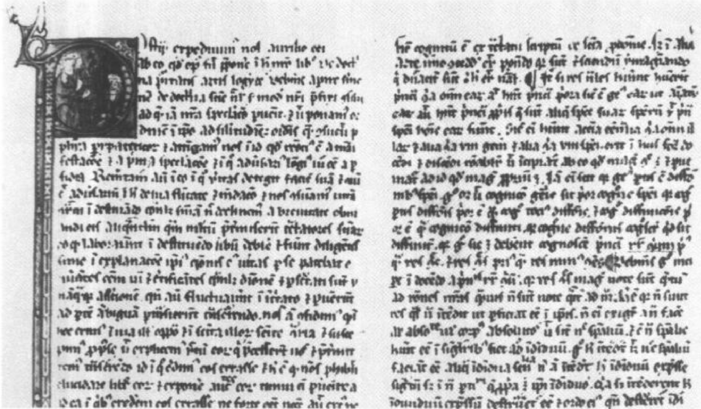
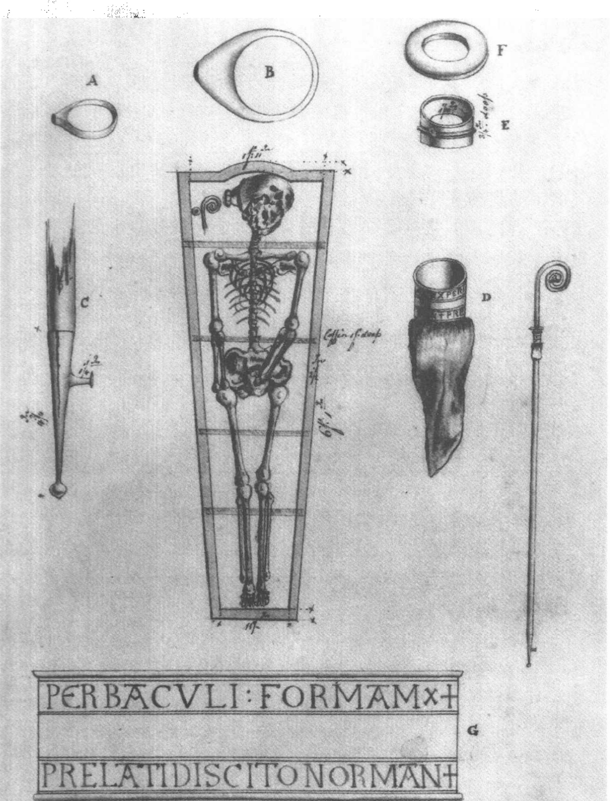
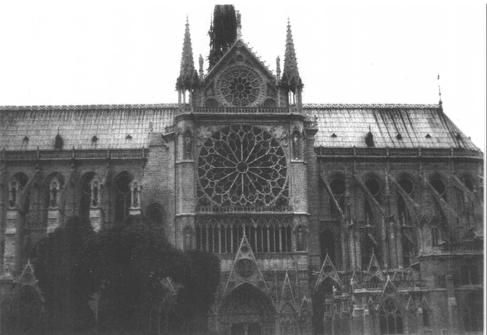

# 第十章 希腊、伊斯兰科学的恢复与吸收

## 新学问

在 12 世纪期间，由于获得了新的文献资源，11、12 世纪的教育复兴得以深化和改观。1100 年时，这一复兴还仍旧可以看作是努力去恢复和掌握那些拉丁文经典著作：罗马和早期中世纪的著作家包括拉丁神父们的著作，以及一些早期译本中的希腊文献（例如柏拉图的《蒂迈欧篇》和亚里士多德的部分逻辑学著作）。移译希腊和阿拉伯文献的新翻译活动已经形成涓涓细流，不过它们的影响是有限的。然而 100 年后，这一涓涓细流却转变为一股洪流，学者们无畏地整理和吸收着整个新学问，它们在规模和重要性上都是空前的。

这种新学问的存在是13世纪理智生活的核心特征，该世纪最好的学者都将全身心地关注于它们的发展。学者们的任务是妥善处理新翻译的文献的内容：掌握新知识，整理它们，评价它们的意义，发现它们的分支，解决它们的内在矛盾，并将它们应用于当前（任何可能）的学术关怀。这些新文献以其博大、理智上的强大有力和实用性而极富吸引力。然而它们也有着异教的起源。并且，正如学者们逐渐发现的那样，它们包含了一些遭受神学质疑的资料。因此，13世纪的学者面临的就是一个重大的理智挑战，他们运用这些新资料的方法和应对它们的技巧将对西方的思想产生深远的影响。

---

翻译的著作大部分都是温和的；某个文献得到翻译这一事实告216诉我们：有些人认为它的实用性压倒了潜在的危险。事实上，人们毫无保留地热情接受了那些关于各种学科（数学、天文学、静力学、光学、天象学和医学）的专著：它们在各自的学科中明显优于先前任何已有的东西；在许多地方，它们填补了理智生活中的空白；而且它们并不包含任何在哲学或神学上令人不快的奇异之处。这样，欧几里得的《几何原本》、托勒密的《至大论》、花喇子模的《代数》、伊本·海塞姆的《光学》以及阿维森那的《医典》就安然补充进了西方知识的整体中。将在后面的几章中讨论掌握并吸收这些和其他专著的过程。

至于麻烦，它出现在触及世界观或神学的那些更广泛的学科领域，如宇宙论、物理学、形而上学、认识论和心理学。亚里士多德及其注释者们的著作位于这些学科的中心，它们成功地论述了大量关键的哲学问题，同时含蓄地向人们保证，正确运用其方法会使他们从中受益。亚里士多德体系的解释力是显而易见的，它对西方学者产生了极大的吸引力。然而，它也使那些好处具有一定代价，因为亚里士多德的哲学不可避免地要触及许多问题，而对这些问题的论述业经在过去千年里逐渐巩固起来的柏拉图哲学和基督教神学的糅合。不像那些更具体、更专业性的论著，亚里士多德哲学并非填补了学术的真空，而是闯进了那些已被占领的领地，这就导致了各种各样的摩擦，（我们将看到）这些摩擦最终以协商的方式得以解决。让我们对这个过程作一回顾。

## 大学课程中的亚里士多德

亚里士多德的大部分著作以及关于它们的一些评注（特别是11世纪穆斯林阿维森那的评注）到1200年时已有了译本。对于它们早期的传播或是在学校中的使用情况，我们几乎毫无所知，然而它们在13世纪头十年中似乎已出现于巴黎和牛津。在牛津，接下来的几十年中，亚里士多德的影响缓慢然而稳定地扩大，没有遇到任何阻

---

碍。'然而在巴黎，亚里士多德早就遇到了麻烦：有人指控说，在亚里士多德思想的煽动下，艺学院的教师讲授了泛神论（大致说来，该理论将上帝等同于宇宙）。这些指控导致了一个在1210年的巴黎主教大公会上颁布的命令，反映了神学院中的保守态度。它禁止在艺学院中教授亚里士多德哲学。该命令于1215年被教廷使节罗伯特·库尔松（Robert De Courcon）重新颁布，但它仍然仅适用于巴黎。 $ ^{2} $

1231年，在推行控制巴黎大学的规章过程中，教皇格列高利九世直接卷入进来。格列高利承认1210年禁令的合法性，并且重新颁布了该禁令，它明确规定：亚里士多德的自然哲学著作除非已“经检查并剔除了所有的疑误”，否则不得在艺学院中传阅。十年以后，格列高利在任命一个专门委员会来执行这个规定的一封信中自己解释道：“既然其他科学应当侍奉《圣经》的智慧，它们就要为忠实信徒所掌握，因为它们服从于造物主的善意。”然而，格列高利也注意到，“被巴黎的一个地方大公会禁止的自然哲学书籍……既包含有用的东西又包含无用的东西”，因此，“为了使有用的东西免受无用的东西的污染”，格列高利告诫他新任命的委员会，“要剔除所有错误的、可能招致诽谤或可能冒犯读者的东西，这样，在可疑的东西被去除以后，人们便可以毫不拖延、毫无冒犯地研究那些剩下的东西了”。 $ ^{3} $

值得一提的是，格列高利既承认亚里士多德自然哲学的实用性，也承认它的危险性。在剔除错误之前，亚里士多德一直遭受封禁，然而，一旦错误剔除以后，便鼓励学者们去运用它。注意到下面这一点也很重要：格列高利所任命的委员会似乎从未开过会，这可能是因为其中的一位主要成员、神学家奥歇里的威廉（William of Auxerre），死于这一年。而且，从未发现经删改的亚里士多德著作。因此，人们后来接受的亚里士多德思想就是建立在其完整、未经审查的著作的基础之上。

各种各样的文献都谈到亚里士多德著作在其后25年间的遭遇。它们表明，1210、1215和1231年的禁令在一段时间内获得了部分成功，但它们在1240年前后开始失去效力。造成这种情况的一个原因，

---

可能是1241年格列高利九世过世，此后，他在十年前颁布的法规便失去了一些强制力；另一个原因可能是，巴黎大学的艺学学者们越来越意识到，相对牛津和其他大学的同事而言，他们正在逐渐丧失自己的阵地（和声望）。我们也应估计到会有这种可能，亚里士多德的逻辑学思想（它没有包含在禁令中）、随处可见的亚里士多德自然哲学著作（尽管禁令中禁止讲授它们），以及大量涌现出的新亚里士多德注释者（特别是阿维洛伊），都抬高了亚里士多德的声望，他的哲学的巨大影响力变得难以遏制了。当然，我们要记住：对于神学家来说，按他们认为合适的方式运用亚里士多德学说，总是合法的。

无论是什么原因，亚里士多德自然哲学著作似乎在13世纪40年代或略早时就已成为艺学院讲座的主题；最早讲授它们的学者是罗吉尔·培根(Roger Bacon)。 $ ^{4} $人们越来越相信，可以用亚里士多德哲学改造神学的玄思和观念，从这样一种日益增长的趋势中我们看到，大约在同时期，更自由运用亚里士多德学说的态度正逐渐渗透巴黎大学的神学院。到1255年时，情况已经完全逆转，因为在这一年，艺学院通过了新的规定，它将一个明显的事实——也就是说，讲授所有已知的亚里士多德著作——变成了规章制度。亚里士多德自然哲学并不只是为自己在艺学课程中开辟了一席之地，它成为该课程体系最重要的组成部分之一。

## 冲突点

现在，我们要仔细查明亚里士多德哲学中那些确实令人担心或者会引起争斗的方面。但首先我们必须注意，亚里士多德哲学的内容，正如它的西方读者们所认为的那样，处于一个不断变迁的状态中。由于亚里士多德的思想非常难于理解，读者们自然要求助于任何可得的解释上的帮助；幸运的是，古代晚期和中世纪伊斯兰的评注家已经意译了亚里士多德著作或解释了亚里士多德各种文本中的难点，并且，这些评注家们的著作日益连同亚里士多德原作一起被翻译出来，并被用来认真研究亚里士多德。在12世纪最后几十年和

---

图 10.1 阿维森那《物理学》（第二部分）的开篇，格拉茨，大学图书馆，MS II. 482, fol. 111r（13 世纪）。

13 世纪的头几十年中，最重要的注释家是穆斯林阿维森那（伊本·西那，980-1037 年），他给出了一个柏拉图化的亚里士多德哲学。 $ ^{5} $ 1210 年对巴黎大学讲授泛神论的指控，无疑是对阿维森那的柏拉图主义化的亚里士多德学说的攻击。然而，大约从 1230 年起，阿维森那的注释开始被西班牙的穆斯林阿维洛伊（伊本·拉西德，1126-1198 年）所取代。 $ ^{6} $ 无疑，阿维洛伊也能发挥或曲解亚里士多德的原意，并且他有时也这么做了，但是总的来看，从阿维森那的指引转换到阿维洛伊，意味着向一个更真实、更少柏拉图化的亚里士多德哲学的回归。阿维洛伊在西方的影响是如此之大，以致于他干脆被人们称为“注释家”。

在阿维洛伊理解（或说更忠实于原著）的亚里士多德思想中，有 219 什么东西引起了麻烦？一些具体的主张（不同程度地）违背了正统

---

的基督教教义；并且在这些主张背后，有一个总的带有理性主义和自然主义色彩的世界观，它深深打动了那些已经对传统基督教思想生厌的评论家。讨论这些问题的最简单方式，就是从这些具体主张入手。

在亚里士多德那里，宇宙的一个突出特征是它的永恒性，在各种亚里士多德的著作中，有各式各样的论证为之辩护。由于与基督教的创世说有关，这种主张是阅读亚里士多德的基督徒们几乎无法回避的。亚里士多德的观点是，宇宙既不是生成的也不会消亡。他认为，元素总是按照它们的本性去运行；因而，就没有在哪个瞬间生成了现在这个宇宙，也没有某个瞬间它将不复存在。由此得出，宇宙是永恒的。亚里士多德就这样驳斥了前苏格拉底哲学家们提出的进化的宇宙论。

然而，从一个基督徒的观点来看，这是一个不可容忍的结论。不仅《圣经》在其开篇《创世记》中包含了一个对创世的描述，而且，对于基督徒关于上帝和世界的观念而言，被造之宇宙对造物主的绝对依赖是根本性的。因而，我们发现，在13世纪亚里士多德的注释者中，试图解决这一问题的努力就像一根始终绷紧的弦。下面我们将讨论其中的一些观点。 $ ^{8} $

另一个问题也影响着造物主与创造的关系，这就是决定论。亚里士多德自然哲学中的决定论倾向是一个非常棘手的问题。在这里需要说明的是，他所描述的宇宙具有始终不变的本性，它们是一个有规律的因果秩序的基础。这在天上特别明显，在那里，存在的将总是存在着。而且，亚里士多德认为上帝是第一推动者，是永恒不变的，因而他不能干预宇宙的运行；因此，宇宙机器就必然和始终如一地向前运行，它发动的因果链条传递到并遍布于月下区。这里的危险是，在亚里士多德的体系内没有任何空间能留给神迹。 $ ^{9} $ 并且，占星术理论最终依附于亚里士多德哲学，如果天的影响能作用于意志，它就威胁了人的选择的自由（这对于基督教关于原罪和救赎的教义至关重要）。

在 13 世纪，所有这些决定论倾向或成份都被看作是对基督教教

---

义，特别是神的自由与全能、神佑以及神迹的挑战。亚里士多德的第一推动者甚至不知道某个人的存在，当然也不会干预他的行为，这与基督教的那个能知道何时麻雀落地和我们有多少头发的上帝大相径庭。 $ ^{10} $

作为棘手的亚里士多德思想的最后一个例子，我们转到灵魂的本性上来。亚里士多德认为灵魂是身体的形式或组织原则，是单个人的质料所固有的潜能的完全现实化。由此推出，灵魂不能独立自存，因为即使形式能与质料区别开来，它也不能独立于质料而存在。设想灵魂能够同肉体分离，就如同设想一把斧子的形状能够同斧子的质料分离一样愚蠢。因此，人在死亡时，即当个体消融时，他的形式或灵魂就将完全不复存在。 $ ^{11} $ 这样的一个结论显然与基督教灵魂不朽的教义相矛盾。

个体灵魂的不朽也受到阿维洛伊发展的另一个心理学学说的质疑，该学说是他在试图解决亚里士多德认识论当中的某些困难时建立起来的。阿维洛伊的整个理论——“单灵论”——极为复杂。对我们而言，重要的是他的这一主张：人的灵魂中非物质的、不朽的部分，即“智灵”，并非个体性的或个人的，而是所有人共有的一种统一精神。由此似乎得出，人死后留存下来的不是个体性的而是整体性的；这样，不朽得以保留，但并非个人的不朽。这又是对基督教教义一个明显的冒犯。 $ ^{12} $

类似这样的主张并非哲学中孤立的部分，而是对理性及其与信仰和神学间恰当关系的一个基本态度的宣言；它们作为一种态度和方法论的具体表现来到了西欧。新亚里士多德主义的倡导者倾向于扩展理性活动、自然主义解释和亚里士多德式证明的适用范围；哲学就是他们的运动，他们希望在每一个理智的竞技场上展现它的优点。当哲学进入神学院并开始影响神学方法、逐渐使《圣经》研究作为神学教育的核心地位受到挑战的时候，保守派当然会感到愤怒或沮丧。于是，将之指控为学术上的傲慢和无实在意义的好奇心就屡见不鲜了。难道信仰要受异教哲学的内容和方法的检验？难道基督、使徒保罗以及神父们的教导要服从于亚里士多德的教导？

---

图 10.2 阿西西的圣方济各大教堂。始建于 1226 年方济各去世后的若干年，内有他的墓地，该教堂成为方济各会的“发祥地”和一个重要的朝圣场所。承蒙 Christopher Kleinhenz 惠准。

在自然哲学领域中，这种看法的一个特别尖锐的例子是这样一种倾向，它把分析仅仅看成是去运用那些通过人的观察和推理而发现的因果原则，而不考虑《圣经》启示或教会传统的教义。神的或超自然的原因从未被否认，然而它被（这种新方法论的大胆拥护者）搁置到自然哲学领域以外的地方。这一自然主义的萌芽可以在12世纪的一些思想家如孔什的威廉等人身上看到（见上文第九章），而它在亚里士多德及其注释者们的促进下繁荣起来。也许这些自然主义倾向的最危险表现就是，一些哲学家往往要区分“从哲学上讲”和

---

“从神学上讲”，而且，更为严重的是，他们承认哲学方法和神学方法可能导向不可调和的结论。

新方法的倡导者无疑认为将哲学的严格性引入神学争论是前进了一大步。但是在那些保守的人看来，这似乎是对哲学事业和神学事业间传统区别的一个严重的反叛和侵犯。最严重的看法认为，这就是要求耶路撒冷拜服于雅典的权威。

在讨论13世纪为解决这些困难所作的努力之前，我们必须先对这些努力所处的制度体系作一简要考察。关于新亚里士多德思想的论战本质上是学术性的，论战中所有的参与者都出自于大学。许多人是活跃的老师；其他人则是升为教会领导和当权者的大学毕业生。如果我们能理解大学学者的职业模式，它将有助于我们理解为什么中世纪人总是坚持不懈地要糅和哲学与神学，这一职业模式就是：几乎所有的神学家，在他们开始从事神学研究之前，都已经在艺学院学习了哲学；而且，为了谋生，神学院的学生常常同时要在艺学院执教。因此，中世纪一些最有影响的哲学论文，是由那些教授哲学同时研究神学的学者写成的。 $ ^{13} $

到该世纪中叶，一些领头人物是方济各会或多明我会教士——也就是成立于13世纪早期的托钵僧修道会的成员。托钵僧是“正规教士”，因为他们受一个教规或制度(包括守贫的誓愿)的约束，在这方面，他们不同于“在俗教士”(如教区牧师)。与那些强调从俗世中隐退而追求个人纯洁的修道会相反，托钵僧们致力于在城市中的一种积极责任；这最终把他们推上了包括大学在内的教育大舞台，在这里，他们活跃于所有重要的哲学和神学冲突当中。

这种体制上的细微之处以一种微妙的方式促进了我们所关注的那种学术的发展。围绕着新学问的斗争并不纯粹是意识形态的，而是因学科与体制上的联系与对立而错综复杂。哲学家和神学家因艺学院的教育经历而联系在一起，但这并不能使他们避免在学科分界问题上的长期摩擦。在神学内部，托钵僧在一段时期内陷于同巴黎大学的世俗神学家争夺教席权的激烈斗争。并且，在托钵僧修道会内部，方济各会和多明我会发展了有所不同的哲学信念以及解决信

---

仰与理性问题的独特方法。我们倘若打算对事件的过程有个细致的认识，就要敏锐地意识到这些学科上和体制上的暗流。

## 解决之道：科学作为婢女

尽管存在我们谈到的那些危险，但亚里士多德哲学巨大的吸引力使它无法长期被忽视和压制。自6世纪早期波埃修的翻译以来，亚里士多德的名字已经成为逻辑学的代名词，并且那种逻辑学已经巧妙地深入到几乎每一个学术领域；现在，人们已经可以掌握并运用一个扩展了的亚里士多德逻辑学文集了。亚里士多德的形而上学也已从早期中世纪的文献中过滤出来，并且现在，在接触了完整的亚里士多德文本之后，西方学者手中已经掌握了认识和分析宇宙的有力武器。形式、质料与实体、现实与潜在、四因、四元素、对立面、本性、变化、目的、数量、质量、时间和空间——亚里士多德对于所有这些以及更多主题的讨论，都具有一个富有说服力的观念体系，他通过该体系去体验和讨论这个世界。在他的各种心理学著作中，亚里士多德探讨了灵魂及其能力，包括感觉、记忆、想象和认知。他也提出了一个宇宙论，在其中令人信服地描绘了宇宙并且解释了它的运行，从最外层的天一直到位于中心的地。亚里士多德解释了运动、我们所说的物质理论，以及远远超乎以往的大量天象学现象。最后，他完成了一个在篇幅上和描绘与说明的细节上都无与伦比的生物学文集。无法想象这些论著会一概遭到拒绝；而且从未有过哪个严肃的运动以此为目的。问题不是如何抵制亚里士多德的影响，而是如何教化它——如何处理冲突点以及如何商定界限，从而使亚里士多德哲学能为基督教世界的利益服务。

调和的过程自打一接触到亚里士多德及其注释者的著作就开始了。作为一位了不起的牛津大学学者和该大学的第一任校长，罗伯特·格罗斯代特（Robert Grosseteste，约1168-1253年）在这方面作了早期尝试。尽管格罗斯代特不是方济各会修士，但他却是牛津方济各会学校的第一位讲师，对这个修道会的理智生活发挥了重要的影响。

---

图 10.3 格罗斯代特的遗骸。绘于 1782 年林肯大教堂格罗斯代特的墓穴开棺之时，这是有关中世纪学者的极为罕见的所谓“写生”画之一。画中同遗骸在一起的，是在棺椁中发现的其他物品，包括主教戒指和牧杖的残存部分。关于更完整的描述，见 D.A.Callus 编 Robert Grosseteste : Scholar and Bishop，第 246-250 页。承蒙伦敦自然历史博物馆惠准。

---

响。格罗斯代特对亚里士多德《分析后篇》(Posterior Analytics)的注释可能作于13世纪20年代，这是严肃对待亚里士多德科学方法的最早尝试之一。 $ ^{14} $格罗斯代特也谙熟亚里士多德的《物理学》、《形而上学》、《天象学》以及他的生物学著作；它们的影响在他对《物理学》的注释和一系列关于各种物理学主题的小论文中反映出来。然而，格罗斯代特思想的形成受到了柏拉图和新柏拉图主义、同时还有一些新近翻译的数学科学著作的强烈影响，并且，在他的物理学著作中，我们看到了一个令人相当不安的亚里士多德和非亚里士多德成分的并置。例如，格罗斯代特的宇宙进化论（他对宇宙起源的解释），尽管设定在一个宽泛的亚里士多德框架内，但应主要看作是试图调和新柏拉图主义的“流射说”（该思想认为被创生的宇宙是从上帝流射出来的，恰如光从太阳中流射而出）与《圣经》中从无中创世的描述。 $ ^{15} $

格罗斯代特纲领的重要方面由一位更年轻的英国人罗吉尔·培根（约1220-1292年）继承下来。作为格罗斯代特的崇拜者（但可能从未成为他的学生），培根被格罗斯代特的学者风范特别是其在数学科学上的造诣所鼓舞。培根受教育经历的细节我们不得而知，但他既在牛津大学也在巴黎大学学习过这一点是清楚的。13世纪40年代他开始在巴黎大学的艺学院执教，在那里他是最早讲授亚里士多德自然哲学著作的人之一，具体说来，这些著作有：《形而上学》、《物理学》、《论感觉与可感物》(On Sense and the Sensible)，可能还有《论生与朽》(它研究物质理论)、《论灵魂》和《论动物》(On Animals)；也许还有《论天》。 $ ^{16} $ 后来，他加入了方济各会，将后半生投入于研究和写作。

在后面的章节里，我们将讨论培根科学思想的各个方面；这里重要的是，他为拯救这一新学问而同它的批判者展开的斗争。培根主要的科学著述并非“纯粹的”哲学或科学文章，而是满怀激情对教会统治阶层的游说，他要努力使他们相信新学问的实用性（这些著作是献给教皇的），这些新学问并不仅仅是亚里士多德哲学，而是整个自然科学、数学科学和医学的新文献。培根认为：这种新哲学

---

是神的赐予，它能证明信仰的正确性，并规劝那些不相信上帝的人；科学知识对于解释经典至关重要；天文学是建立宗教历法的根本；占星术能使人们预知未来；“实验科学”教给人们如何延长生命；光学使人们制造出的仪器能震动不信仰上帝的人并使之皈依。培根的奋斗目标是沿用奥古斯丁的婢女模式，并将之运用于新的环境，在这种新环境下，成为婢女的知识较之以往将多得多而且更加复杂。 $ ^{17} $ 由于其对宗教的实用性，自然科学被认为是正当的。培根在他的《大著作》(Opus maius) 马其顿战争有“一个完美的智慧”，

它含于作为所有真理之土壤的《圣经》之中，因此我说，一个学科是其他学科的女主人——这一学科就是神学，而其他所有学科都是这一学科必需的，没有它们，它就无法实现自己的目的。它声称它们都为它服务，并使它们听从于它的许可和命令。 $ ^{18} $

在培根看来，神学并不压制科学，而是要发挥它们的作用，把它们引向恰当的目的。

至于所谓的同基督教信仰的冲突点，培根将它们看成是由翻译的错误或无知的解释所引起的问题，从而毫不理会它们；倘若哲学果真是上帝所赐，那么它与信仰就没有真正的冲突。为了强化这一观点，培根引据了奥古斯丁和其他的神父著作家，他们都敦促基督徒去恢复掌握在异教徒手中的哲学。为了防止这些论证失败，他高歌科学的奇迹，用华丽辞藻来压倒那些批评者。

尽管有培根的热衷，但审慎对待新哲学，特别是新的亚里士多德思想，成为该世纪中叶方济各会的典型态度。一位最有助于形成这种态度的人，是意大利方济各会教士波那文特里（Bonaventure，约1217-1274年）。波那文特里在巴黎大学学习了人文艺学和神学，随后于1254至1257年留校讲授神学。此后，他辞去教师职务，担任了方济各会的教长。波那文特里无疑敬重亚里士多德哲学，从中他形成了自己的逻辑学和许多形而上学思想。但是，同格罗斯代特和培

---

根一样，他也深受奥古斯丁和新柏拉图主义的影响，在他的思想中，我们发现了亚里士多德和非亚里士多德成分的大量综合。

对奥古斯丁的婢女模式——异教哲学是一个工具，可用来帮助神学和宗教——的正确性和适用性的看法，波那文特里肯定同培根是一致的，但他对哲学的实用性的看法比培根更为谨慎，也比他更加清楚地认识到倡导哲学将要承担的风险。对于理性在没有神启的情况下单独发现真理的能力，他持悲观态度；因此，他倾向于把哲学紧紧地束缚住，主张放弃亚里士多德及其注释者们的任何违背启示教义的主张。这样，他断然拒绝了永恒世界的可能性；他捍卫个体灵魂的不朽，摒弃单灵论并认为每个灵魂本身就是身体消亡后仍然存留的实体（一个由精神形式和精神质料构成的复合体）；并且，他不知疲倦地反对所有占星术决定论的观念。最后，在反对亚里士多德自然主义的同时，波那文特里强调上帝的佑助体现在每个因果事件中。 $ ^{19} $

从格罗斯代特、培根和波那文特里的生涯中，我们能够看到13世纪早期和中期的几个重要趋势：对亚里士多德文集的了解日益增多，对它的内容抱有尊敬和怀疑的混杂态度，以及往往用奥古斯丁和柏拉图的各种思想解读亚里士多德的原著。而活跃在该世纪中期和晚期的两位多明我会修士——大阿尔伯特(Albert the Great)和托马斯·阿奎那(Thomas Aquinas)——为更完全地掌握亚里士多德哲学和更开放地看待其观点作出了贡献。

生于德国的大阿尔伯特（约1200-1280年）先后在帕多瓦大学和科隆的多明我会学校接受了教育。13世纪40年代早期，他被送到巴黎学习神学，1245年成为神学教授。巴黎大学有两个多明我会教授职位，此后三年间，他占据了其中之一。在这个时期，托马斯·阿奎那跟随他学习。1248年，大阿尔伯特被召回科隆，并在那里重新组建多明我会学校，托马斯一直陪伴着他。阿尔伯特对亚里士多德著作所作的绝大部分评注是在他离开巴黎后完成的；它们并非阿尔伯特讲课时的成果（他对亚里士多德《伦理学》的评注除外），而是他在课余时间为多明我会修士所写。 $ ^{20} $

---

图 10.4 大阿尔伯特。托马索·德莫代纳所作的壁画（1352年），位于特雷维索的圣尼科洛修道院。Alinari / Art Resource N. Y.

阿尔伯特是西方基督教世界中第一个对亚里士多德哲学作出全面综合解释的人；出于这一理由，他经常被看作是基督教亚里士多德主义的创建者。然而，这并不意味着阿尔伯特实现了一种纯粹的哲学，早期他也曾为新柏拉图主义著作家作过一些评注，并且直到晚年，他仍然对一部分柏拉图哲学笃信不移；而且，他总是愿意纠

---

正或抛弃他认为错误的那些亚里士多德教义，并将从别处发现的真理引入进来。然而，阿尔伯特洞察了亚里士多德哲学的深远意义，并将其全部翻译给了多明我会的修士。他在对亚里士多德《物理学》的评注的序言解释道：

我们的目的……是尽我们所能，满足我们会中那些兄弟们的要求，多年以来他们一直要求我们为他们编写一部物理学书籍，他们希望能从中发现自然科学的全貌，并正确理解亚里士多德的著作。 $ ^{21} $

阿尔伯特不仅为他们写了《物理学》的注释，而且也评注或解释了所有可得的亚里士多德书籍——这个成果在19世纪汇编的阿尔伯特著作中长达12大卷（超过了8000页）。在这些评注中，许多内容远远脱离了原主题，从中阿尔伯特展示了自己研究和沉思的结果。在阿尔伯特之前，没有人在亚里士多德文集上投入如此艰苦的努力，此后也几乎没有。

他的目的就是展示亚里士多德哲学的解释力，并使之在实际中体现出来，他认为这种哲学是神学研究前的必要准备。他并无意使亚里士多德哲学摆脱婢女的身份，但他确实想充分给予它更大的责任。在阿尔伯特的同时代人中，只有罗吉尔·培根真正看到了这种新学问对于神学活动的重要性；但是除了年轻时在巴黎所作关于亚里士多德的讲演以外，培根把最大的精力投入到研究数学科学（特别是光学）和倡导整个新学问的写作之上，而阿尔伯特则致力于掌握和解释亚里士多德文集的工作。历史学家往往把荣誉授予那些打破亚里士多德传统的人；而阿尔伯特作为把西方基督教世界与亚里士多德传统联系在一起的人，也应当受到我们的关注和尊敬。

同时，阿尔伯特认识到他有责任去补充亚里士多德关于某些主题的文本，亚里士多德忽视了对这些主题的研究或者其研究流于肤浅，阿尔伯特也感到自己有责任去纠正亚里士多德的任何错误；尽管他深为亚里士多德的成就所折服，但他从未成为亚里士多德的奴

---

隶。为了这一目的，阿尔伯特阅读了他能获得的每一本书：他在很大程度上依赖阿维森那；他了解柏拉图、欧几里得、盖伦（程度有限）、金迪、阿维洛伊、非洲人君士坦丁以及其他许多希腊、阿拉伯和拉丁作家的著作。只要它们有用，他就用这些文献来解决他在解释亚里士多德原著时遇到的问题。 $ ^{22} $

阿尔伯特也是一位相当敏锐和最直接的动植物观察家。例如，他以亲身的观察结果纠正了阿维森那关于鹌鹑交配的观点，并说他已经连续六年观察了某一鹰巢；他可能是整个中世纪最好的实地植物学家。 $ ^{23} $ 在学术上，他有着无穷的能量，他的非神学著作（几近总数的一半）包括了关于物理学、天文学、占星术、炼金术、矿物学、生理学、心理学、医学、自然史、逻辑学和数学的著作。阿尔伯特在论述各种主题时所带有的权威性，可以说明为什么他在生前就已经被看作是“伟大的”，这也有助于解释为什么罗吉尔·培根（他不能容忍学术上的竞争对手）以那么敌意的眼光看待他。

对于那些敏感的亚里士多德教义，阿尔伯特说了些什么呢？这些教义导致了该世纪早期对亚里士多德的禁令，并仍然不利于它为人们所接受。关于世界的永恒性这一关键问题，阿尔伯特在他的评注中从未动摇过对基督教创世教义的忠诚。他早期的观点是：哲学不能给这个问题作出定论，所以，人的责任就是要接受启示的教导。后来，他确信永恒宇宙的观念在哲学上也是荒谬的，因此哲学能够在没有神学帮助的情况下解决这一问题。无论在哪种情况下，（得到正确运用的）哲学同神学都不会相互冲突。

阿尔伯特对人的灵魂的本性和能力给予了充分的关注。他的技巧是把灵魂解释成一种独立的不朽实体，独立于身体并能在身体死后存留，同时他也把灵魂与身体的统一性解释为感知和生命力的动因。阿尔伯特看到，若不否认亚里士多德关于灵魂是身体之形式的主张，就无法捍卫灵魂的不朽；当那种主张出现时，他就以柏拉图和阿维森那的观点取而代之，这就是，灵魂是一个精神性的不朽的实体，可以与身体分离。但是，也无需完全摒弃亚里士多德；阿尔伯特认为，尽管灵魂实际上不是身体的形式，但它发挥着形式的功

---

能。 $ ^{24} $

最后，阿尔伯特对亚里士多德哲学的理性主义——即把哲学方法应用于人类所有事业的主张——有什么样的反应呢？在努力向同事们展现如何以亚里士多德的眼光审视世界时，阿尔伯特致力于一种相当强的理性主义纲领。他建议在方法论的背景下区分哲学和神学，并且要发现在没有任何神学帮助的情况下哲学能独立作出的对实在的证明。而且，阿尔伯特并没有削弱或废除亚里士多德传统的自然主义倾向。他（和其他每个中世纪思想家一样）承认上帝是每一事物的终极因，但他认为上帝习惯于通过自然因而工作，自然哲学家的责任就是最大限度地发挥后者的作用。非常引人注目的是，阿尔伯特甚至愿意将这种方法论运用于《圣经》中的一个神迹——诺亚洪水——的讨论。在留意到有些人希望把对洪水（包括诺亚洪水）的讨论限制在神意的范围之内以后，阿尔伯特指出，上帝运用自然因实现其目的；哲学家的任务不是去考察上帝意志的原因，而是去探求上帝意志得以体现的自然因。因此，将神的原因引入对诺亚洪水的哲学讨论，就是对哲学和神学间恰当分界的冒犯。 $ ^{25} $

阿尔伯特在尊重亚里士多德哲学对于神学和宗教的实用性的同时，理解和传播了这一哲学。他的这一纲领由他的学生托马斯·阿奎那（约1224-1274年）所继承。托马斯出生于意大利中南部的一个小贵族家庭，在蒙特卡夏罗一个古老的本笃派修道院（6世纪时由努西亚的本笃创建）中开始接受教育；他在那不勒斯大学的艺学院继续学习，在那里他认识了亚里士多德哲学。加入多明我会之后，托马斯被送到巴黎大学，于1215年获得神学博士学位。他将后半生投入教学和写作，期间包括1257-1259年和1269-1272年两次在巴黎大学短期讲授神学。

如阿尔伯特一样，托马斯·阿奎那也希望通过确定那些异教学问与基督教神学间的适当关系，解决信仰与理性的问题。 $ ^{26} $ 在反对那些把哲学视作信仰的对立物而摒弃它的人时，他论证道：

即使人心灵中的自然之光（例如哲学）对我们认识信

---

仰所揭示的东西是不充分的，但通过信仰获得的神的教导并不会与自然的赋予相违背。倘若必定非此即彼，那么，因为我们都是从上帝那里得到它们，上帝就成了我们犯错误的原因，而这是不可能的。 $ ^{27} $

亚里士多德的哲学和基督教神学是通向真理的两条和谐的路，尽管它们存在着方法论上的区别。哲学运用人的感觉和推理的自然能力，从而达到它能够达到的那些真理。而神学使人获得启示给予的真理，那是人的自然发现力和理解力所不能把握的。这两条道路有时导向了不同的真理，但它们从未导向相悖的真理。

这是否意味着哲学和神学是平等的？绝对不是。托马斯指出神学与哲学的关系是完整的与不完整的，完美的与不完美的关系。既然如此，这样，为什么还要那样费力地研究哲学呢？因为它为信仰作出了重要的贡献。首先，它能证明托马斯所谓的“信仰的导言”，即某些命题，例如上帝的存在或他的单一性，信仰理所当然地把这些命题当作它的出发点。第二，通过运用来自于自然界的类比，哲学能清楚地阐明信仰的真理，托马斯把三位一体的教义看成是这样一个的例子。第三，哲学能驳斥那些反对信仰的主张。 $ ^{28} $

这看上去好似奥古斯丁的婢女模式的一个简单翻版，但事实上，托马斯已经微妙而重要地改变了它的内涵。名为“哲学”的婢女仍然要服从于神学事业，并因此仍然是一个婢女，但是，在托马斯看来，她已经充分证明了她的实用性和可靠性，因此他给予了她更大的责任和更高的地位。托马斯还认为，如果去除了过于严密的神学监督，她会把她的工作做得更好。他认为，哲学和神学都有各自胜任的领域，它们都能在其适当的领域受到信任；例如，倘若我们希望知道行星运行的细节或原因，我们就必须向哲学家请教；而另一方面，倘若我们希望理解神的品性或救世的计划，我们就必须要进入神学的管界。在托马斯这里，有一种对哲学事业的尊敬，和一种希望在任何可能的地方运用它的决心，这就使他超越了奥古斯丁的观点，并使他站在了13世纪下半叶神学家中自由进步一翼的前沿。

---

尽管哲学和神学有着方法论上的差别，但它们也有相互重叠的区域。例如，造物主的存在既可以通过推理也可以通过启示来认识。它能由哲学家证明出来，也能像神学家所阐明的那样，通过经典传达给我们。在这种情况下，什么样的法则支配着哲学与神学之间的关系呢？基本的原则就是：神学和哲学间可以没有任何真正的冲突，因为启示和我们的推理能力都是上帝所赋予的，因此任何冲突必定是表面而不是真正的冲突，是由糟糕的哲学或糟糕的神学造成的，在这种情况下，解决问题的良方就是重新考虑这些哲学和神学的论证。

在托马斯的实践中，这一处方是如何付诸实施的呢？当它应用于本章前面部分所列举的那些棘手的亚里士多德观点时，能获得什么样的成功呢？一个简短的回答是，托马斯讨论了亚里士多德哲学提出的所有问题，而且他是以格外严格的态度来讨论这些问题的。他在两本书中直接论述了关于亚里士多德的争论：《论世界的永恒性》（On the Eternity of the World）和《论精神的一体性——反对阿维洛伊主义者》（On the Unicity of the Intellect, against the Averroists）（关注于单灵论和灵魂本性的问题）。他对世界永恒性的观点是：感谢启示，使我们知道世界是在某一时刻被创造出来的，而哲学却无法解决这一问题。那些认为世界的永恒性是荒谬哲学的人（例如波那文特里）是错误的，因为它并不与坚持宇宙是被创造出来的相矛盾（即它的存在依赖于神的创造力），也不与坚持它永远的存在相矛盾。论及灵魂之本性，托马斯赞同亚里士多德关于灵魂是身体的实体形式的观点（它与身体的质料合起来产生了单个的人），但是他认为这是一种特殊的形式，它能够独立于身体存在，因而是不朽的。他也声称这种解决方法与亚里士多德本人的思想可以相容。 $ ^{29} $

这就是托马斯对信仰和理性问题的解决之道。他已经为两者都留下了余地，巧妙地将基督教神学和亚里士多德哲学融合成我们可以称之为的“基督教亚里士多德主义”。在此过程中，当他正视并解决那些似乎与启示教义相冲突的亚里士多德思想并修正亚里士多德的错误时，托马斯必然将亚里士多德基督教化了。然而同时，他也将基督教“亚里士多德化”了，他把亚里士多德形而上学和自然哲

---

学的主要部分注入基督教神学之中。从长远来讲，托马斯主义（在19世纪）代表了天主教会的官方观点。而眼下，正如我们将要看到的，托马斯被更保守的神学家看作是危险的激进分子。

## 激进的亚里士多德主义与 1270、1277 年大谴责

大阿尔伯特和托马斯·阿奎那领导了一场拥护强大哲学的开明运动。然而无论哲学能够变得多么强大，在他们看来，她永远只是一个婢女。理性永远不能压倒启示。阿尔伯特和托马斯极大地推动了哲学的发展，但在理性和信仰达成和谐之前，他们从未放弃解决一个哲学的问题。

但是，在她开始思考反抗和抵制之前，一个婢女能变得多么强大呢？ $ ^{30} $ 当《圣经》中的神迹被还原成它们的自然因时，如阿尔伯特对诺亚洪水的讨论，事情是否已经失去了控制？这是保守的神学家在观察巴黎大学的发展时所具有的担心。事实证明，他们的害怕并非完全没有根据。我们的证据支离破碎，但有一点却很清楚：正当阿尔伯特和阿奎那努力调和神学和哲学时，一些艺学学者们开始讲授危险的哲学思想，而未考虑会在神学上造成什么后果。这些人是死心塌地的哲学家，雄心勃勃地从事着他们的职业，并认为无须屈服于甚至无须注意任何外来权威，哲学和神学的调和不是他们的问题。

在这个激烈的派别里，最著名的人物和它的领袖是布拉邦的西格尔（Siger of Brabant，约1240-1284年）。西格尔是一个年轻、莽撞的人文学者，他在执教生涯中捍卫了世界的永恒性和对个人的不朽问题带着危险涵义的阿维洛伊单灵论。他的目标是研究哲学而毫不理会与这些被触及的主题有关的神学教义，他坚持认为，他得出的结论是正确运用哲学的必然和不可避免的结果。在托马斯的论文《论精神的一体性》问世之后（该文专门针对他的思想），西格尔调整了他对灵魂本性的看法，使之符合基督教的正统教义。 $ ^{31} $在同神学家的这次交手之后，他更加成熟更加聪明了。因此西格尔小心地澄清说：尽管他的哲学结论不是错误的，而是事实上必然的哲学结论，

---

然而它们不一定是真的。当论及真理时，他就肯定了信仰。是相信这种信仰表白的表面价值，还是得出结论说西格尔仅仅试图安抚教会权力机构，历史学家们在这里产生了分歧，无论是哪一种，西格尔公开的观点都有着显而易见的危险涵义，即正确引导的哲学探求能得出与神学相矛盾的结论。

这些激进分子的观点在达西亚的波埃修（Boethius of Dacia，活跃于1270年）的一篇小论文《论世界的永恒性》（On the Eternity of the World）中得到了很好的体现。波埃修是西格尔小团体的一名成员，他这篇论著的一个最突出特征，是它严格区分了哲学和神学的论证。波埃修系统地整理并驳斥了那些曾被用来捍卫基督教创世教义而反对亚里士多德思想的哲学论证。他接着证明，哲学家，作为哲学家来讲话，除了捍卫世界的永恒性之外别无选择。然而，他澄清说，正如任何基督徒所必须的那样，他本人按照神学和信仰承认创世的教义。

这样，波埃修最终屈服于信仰，但同时表现了一种强烈的理性主义取向，他认为，在理性能够考察的问题中，没有一个是哲学家无权去研究和解决的。他写道，只有哲学家，

能够决定每个能被理性反驳的问题，因为每一个能被理性论证所反驳的问题不过是存在的一部分，而哲学家考察所有的存在——自然的、数学的和神的。因此，决定每一个能被理性论证反驳的问题的任务属于哲学家。

波埃修继续论证道，自然哲学家甚至不能思考创造的可能性，因为这样做就要引入哲学领域之外的超自然原因。同样，哲学家否认死人能够复活，因为按照自然原因（自然哲学家把自己限定在这个范围内），这样的一件事是不可能的。 $ ^{32} $

这是一种试图用哲学推论达到其逻辑结论的努力，它不考虑信仰，而同时仍然承认神学至上的权威性，其严格性令人印象深刻。然而，没有人会对以下结果表示惊奇：神学院或宗教当局既不信服也

---

图 10.5 巴黎圣母院大教堂，建于公元 12、13 世纪。

不高兴，而是认为西格尔、波埃修和他们的团体是一个越来越大的威胁。如果哲学总是要得出与信仰相冲突的结论，它就不再是信仰的婢女，而是开始表现为一种敌对的力量和一种需要当机立断加以遏制的威胁。

这种果断的行动就是巴黎主教丹皮尔（Etienne Tempier）于1270和1277年颁布的两次谴责书，前者谴责了西格尔及其艺学院中激进的追随者们所公然讲授的13条哲学命题。这个谴责显然受到了波那文特里和托马斯·阿奎那的鼓励，它代表了神学机构对艺学院中激

---

进派的一次反动。到1277年时，那种威胁似乎更广泛、更严重了。这时已很清楚，前一次谴责并没有扑灭激进的亚里士多德派。神学院中的保守派以更加警惕的态度对付他们感到日益增长的危险。的确，在保守派中有这样一种倾向，就是把每一个比他们自己更自由的人都看成是危险的。结果是（在托马斯去世三周年时）提出了一个大为扩展了的被禁命题的清单，共219条，宣布讲授这些命题可作为逐出教会的根据。事实上，包含在这个清单中的15或20条是阿奎那思想中的命题。让我们暂且来考察一下被谴责观点的内容和丹皮尔行动的内涵。 $ ^{33} $

亚里士多德派哲学中明显的危险成分都反映在丹皮尔的两个被禁命题的清单中：世界的永恒性、单灵论、否认个人的不朽、决定论、否认神的佑助和否认意志自由。西格尔和激进主义者的理性主义倾向也被明确列为谴责的对象。例如1277年后，禁止再宣称哲学家有权解决关于理性方法所适用的主题的所有争论，禁止再坚持认为依赖权威不会获得确定性。亚里士多德传统的自然主义也醒目地出现在1277年谴责书中，丹皮尔谴责了以下观点，即第二因是自主的，所以即使第一因（上帝）不再参与，它们也将继续发挥作用。他也谴责了这种主张：上帝不能创造出一个人（显然是指亚当），除非通过另一个人的中介作用。他还谴责了这样的方法论原则：自然哲学家，由于他们只关注自然因，因此有权否认世界是被创造出来的。

这是那些我们可能已经估计到了的受谴责命题，但是1277年大谴责中另外也包括了以各种方式与自然哲学发生碰撞的来源不同的一类命题。以下几个占星术命题遭到了谴责：天除了影响身体外也影响灵魂；事件每隔36,000年、当天体回到它们当前的位置时重现一次；天球由灵魂推动的观点也同样被禁止了。一套特别重要的命题——之所以重要是因为它们对14世纪争论的涵义——受到了谴责，它们讨论的是所谓上帝不可能做的事情，因为亚里士多德哲学已经证明了这种不可能性。显然，哲学家们论证了上帝不能创造另外的宇宙（亚里士多德已经论证过多个宇宙是不可能的）；上帝不能沿直线移动这个宇宙的最外层天（因为这样一来，被亚里士多德哲学排

---

除在外的真空就会在空出的空间产生）； $ ^{34} $ 以及上帝不能在没有一个主体的情况下创造一个属性（例如，在没有红色事物的情况下创造出红色）。所有这些命题都在1277年受到谴责，理由是它们公然冒犯了神的自由与全能。丹皮尔或那些代表他制订出这些命题清单的人认为，绝不能允许亚里士多德和哲学家们限制上帝行动的自由和权力，上帝能做任何事而不涉及逻辑矛盾，其中包括创造多个世界或无主体的属性。

我们从这些事件中能了解什么？这两次谴责已经得到大量讨论，并且其重要性常常被人夸大或误解。皮埃尔·迪昂在20世纪早期的作品中，把1277年大谴责说成是向已经根深蒂固的亚里士多德思想、特别是亚里士多德物理学发起的攻击，并因此是现代科学的出生证明书。这是一个聪明的解释，它并不完全错误，无疑（下面我们将看到）大谴责鼓励学者们寻求其他非亚里士多德式的物理学和宇宙论。 $ ^{35} $但是，把重点放在这里就错失了这次大谴责的主要意义。迪昂把大谴责看成是粉碎亚里士多德正统地位的一个关键事件，但在1277年，这个正统并不存在。亚里士多德哲学和基督教神学之间的分界和权力关系仍然悬而未决，并且亚里士多德哲学将在多大程度上获得正统地位还并不清楚。

或者稍稍变化一下来表达同样的观点，这两次谴责的重要性，主要不在于它们对自然哲学后来的发展进程有何影响，而在于它们告诉我们已经发生了什么。这两个谴责出现在将近一个世纪围绕新学术的斗争结束之时，它们代表了保守派对拓展哲学特别是亚里士多德哲学适用范围并保障其自主性的自由和激进努力的一次反击。它们反映了那种适用范围和反动势力的大小——即它们反映了这样一个事实：一个相当大而且有影响的保守集团还不打算接受自由的特别是激进的亚里士多德派所提出的那个勇敢的新世界。因此，对这一事件的正确看法是，大谴责代表的不是近代科学、而是13世纪保守神学的一次胜利。大谴责是哲学附属于神学的一个断然的宣言。

它们也是对亚里士多德决定论的攻击和对神的自由与全能的宣言。我们已经提到，在1277年受到谴责的一些命题讨论的是上帝无

---

力实现的那些事情，例如，（上帝不能）赋予天以直线运动（因为在亚里士多德哲学中禁止出现的真空将因此在被空出的空间中产生）。谴责这个命题时，丹皮尔肯定不是要同亚里士多德就自然哲学中的某一点进行争论，而是要宣称，无论事物的自然状态可能如何（并且我们可以假定他已接受了亚里士多德对此的描述），上帝都有能力去干预它，只要他愿意。真空不可能自然地存在，但它肯定可以超自然地存在；它不可能存在于这个宇宙，但自由和全能的上帝能创造出另一个不同的世界。 $ ^{36} $亚里士多德试图不仅仅把世界描绘成它现在的样子，而是要把它描绘成它必然的样子。于是1277年丹皮尔在反对亚里士多德时声称，这个世界只是其全能的造物主选择创造出的某一种。 $ ^{37} $

这些神学观点对实践自然哲学有何涵义？首先，大谴责中的某些条目提出了紧迫的新问题，它们需要得到进一步分析。例如，上帝能超自然地创造没有主体的属性（之所以重要是因为它与圣餐变体说发生了碰撞）， $ ^{38} $这一观点引发了关于亚里士多德形而上学中一个基本点——属性及其主体的本性和相互关系——的激烈争论。反占星术的条目谴责了历史每隔36,000年在行星天体回归到其原来图景时重复一次的观念，它促使尼古拉·奥里斯梅（Nicole Oresme，约1320-1382年）写了一整篇数学论文，在这篇论文中，他研究了全等与不全等的问题，并证明了在一个有限的时期内，所有行星体不可能都回到原初状态。关于天的推动者的条目引发了关于宇宙的运行这一重要问题的激烈争论。强调上帝无限创造力的条目允许对各种可能世界进行沉思和对上帝肯定能创造出来的事件进行想象。这导致了14世纪思辨的或假设性的自然哲学汹涌而来，在这一进程中，亚里士多德自然哲学的各种原则得到了澄清、批判或遭到拒绝。 $ ^{39} $

其次，大谴责中许多条目的产生都是因为担心亚里士多德在自然哲学中附加的必然性成分，即事物只能是其现在的样子。当亚里士多德的必然性被迫在神之全能的主张面前低头时，亚里士多德的其他原理也立刻容易受到攻击。例如，上帝能在我们的世界之外创造另一个宇宙，这种可能性就需要一个有关外在于我们宇宙的空间

---

的观念与之相对应。结果，在大谴责的余波中，许多学者逐渐同意，一定有一个虚空甚至是一个无限虚空来容纳那些可能的宇宙。同样，如果宇宙的最外层天或整个宇宙能超自然地沿着一条直线被移动，那么，运动就一定能被应用于最外层天或整个宇宙。但是亚里士多德是用周围天体来定义运动的，而在最外层天之外没有什么包围着它。因此，显然就需要去修改或纠正亚里士多德对运动的定义。 $ ^{40} $

## 1277 年后哲学与神学的关系

作为中世纪基督教世界逐渐吸收亚里士多德哲学过程中的基准，大谴责是重要的。它们反映了13世纪70年代保守思想的势力，标志着保守派暂时的胜利，但我们暂停下来考虑一下它胜在哪里。

首先，在参与颁布谴责书的那些人中，即使最保守的分子也并不想消灭亚里士多德的哲学，他们的目的仅仅是掌握一剂使学科保持健康发展的良方，能时刻向哲学提醒她的婢女身份，而同时又能够解决某些冲突点。第二，尽管严格地说，这是一次地方性胜利（因丹皮尔的法令只在巴黎有正式的约束力），然而它的影响事实上却相当广泛，一是因为巴黎大学是欧洲首屈一指的神学研究中心（是当时欧洲大陆惟一的大学），并且这样的一个法令将不可避免地会在整个基督教世界中产生反响。其二，我们知道，教皇一向就同巴黎大学的发展有着联系，他关心激进的亚里士多德派所带来的危险，并有可能愿意为了保守派的利益而施加干预。而且，在丹皮尔颁布了谴责书的11天后，坎特伯雷大主教罗伯特·科尔瓦比（Robert Kilwardby）也推出了一个范围较小但在许多方面与之十分相似的谴责书，它适用于整个英格兰。1284年科尔瓦比法令由继任的坎特伯雷大主教、方济各会的约翰·佩尚（John Pecham）重新予以颁布，他是阿奎那的老对手并且是保守派的领导人之一。

我们不完全清楚大谴责在 13 世纪晚期和 14 世纪早期的力度有多大，但我们可以认为它们在强迫人服从方面与影响哲学思想的程度方面有着很大的差别。1323 年时托马斯·阿奎那的声望已经恢复，以

---

致教皇约翰二十二世把他奉为了圣徒。1325年，巴黎主教废除了1277年大谴责中针对托马斯教义的所有条目。然而，在这两次谴责颁布了一个世纪之后，我们仍然可以看到它们的阴影。约翰·布里丹（John Buridan）这位巴黎大学人文学者和两任校长，主要活跃于14世纪中叶，他是许多继续解决大谴责提出的难题的人之一。事实上，在几个地方，当他的学术研究将他带入神学领域时，布里丹表现出对神学审查的威胁的敏锐意识。在《亚里士多德物理学中的问题》（Questions to Aristotle's Physics）一书中，他认为必须要对天球的推动者作出解释，最后他声明愿意服从神学权威：“对此我不能断定只能（尝试性地）讨论，因此我要向神学学者请教在该问题上他们可以教给我的那些东西。”1377年，在大谴责颁布整整一个世纪之后，著名的巴黎大学神学家尼古拉·奥里斯梅还这样维护他的宇宙由无限虚空包围的观念：他向可能批评他的人暗示，“如果坚持相反的观点，就是在坚持巴黎大谴责中的一个被禁条目。” $ ^{41} $

同时，亚里士多德哲学已经站住了脚，它在艺学院课程中的地位得到确立，并日趋在本科教育中占据了主导地位。1341年，巴黎大学新的艺学院学者被要求去起誓，他们将讲授“亚里士多德及其评注者阿维洛伊以及其他古代评论家和解释者们的体系，除了那些与信仰相矛盾的地方”。同时，亚里士多德哲学正在成为医学、法律和神学这些高级学科的研究者所不可或缺的工具，并日益成为各种严肃学术研究的基础。 $ ^{42} $

然而，这并不表明人们已经发现了一个解决信仰与理性问题的持久方案。对14世纪的发展，一直没有作出充分的历史分析，现在甚至还不能勾画出一幅完整的草图。然而，一些适度的概括还是可能的：

首先，在13世纪，认识论的严密性有了迅速提高，而且，人们普遍放弃了（自由激进的亚里士多德主义分子）弘扬哲学的那些雄心勃勃的主张。当怀疑之风盛行时，哲学是否有能力符合传统的亚里士多德的确定性标准，或成功地论述某些主题这一点日益受到了人们的质疑。特别是，哲学讨论神学教义的能力被大大地削减了。例

---

如，约翰·邓·司各脱（John Duns Scotus，约1266-1308年）和奥卡姆的威廉（William of Ockham，约1285-1347年）尽管不追求哲学与神学的彻底决裂，却通过质疑哲学是否有能力以证明的确定性来论述神学信条而减少了两者间相互重叠的领域。在被褫夺了获得确定性的能力之后，哲学就不再威胁神学了，至少在一定程度上如此。各种信条不再向哲学证明敞开大门，而仅仅必须被信仰所接受。简言之，通过把哲学和神学分离开来，——承认它们方法论上的差别，并在此基础上承认它们有各自不同的影响区域，可行的和平得以实现；至于自然哲学，它所影响的显然是一块较小的领域。 $ ^{43} $

其次，14 世纪的神学家和自然哲学家深深迷恋于神的全能说，它是基督教神学中传统的主题，而其重要性在大谴责中重新得到了强调。如果上帝是绝对自由和全能的，由此就会得出物理世界是偶然而非必然的结论，即它并不必然是现在的样子，因为它的形式、它的运作方式和它本身的存在都仅仅依赖于上帝的意念。人们观察到的因果秩序并不必然，而仅仅是由神的意愿自由施加的。例如，一团火所以有能力发热，不是因为火与热有必然的联系，而是因为上帝选择了把它们联系在一起，赋予火这种能力并持续地使火在展现发热功能时让热与之同时出现。然而上帝也可以自由地引入例外：正如《圣经·但以理书》（第 3 章）所描述的那样，沙得拉（Shadrach）、米煞（Meshach）和亚伯尼歌（Abednego）被投入熊熊燃烧的火窑中，却毫发无损，这一神迹代表上帝完全可以决定使通常的秩序失效。 $ ^{14} $

这已经得到历史学家的广泛接受，但从中却发展出两条不同的推论路线。按照其中之一，倘若自然本身不具有被赋予的永久性能力，而把它在每一时刻的运行都交付（可能反复无常的）神的意志，那么一种固定的自然秩序的观念就会受到严重损害，严肃的自然哲学就变得不可能了。按照另一种观点，承认上帝本来可以创造出他所希望的另一世界，使14世纪自然哲学家们感到，发现他究竟创造了哪一个宇宙的惟一途径就是走出去看，也就是说，去发展一种经验的自然哲学，而它将把我们引向近代科学。这两种观点都需要简短的评述。

---

前者把神的全能的教义视为对自然哲学的破坏性影响，它夸大了中世纪自然哲学家所想象的神的干预程度——他们当中没有人相信上帝会频繁而武断地搅入他创造的宇宙当中。人们经常引据的一个公式区分了上帝的绝对能力与注定能力。当我们认为上帝的力量是绝对或抽象时，我们承认上帝是全能的，能做他希望的任何事，在创世的时候，除了非矛盾性法则以外没有别的因素限制他可能创造出哪一种世界。但事实上，我们发现上帝从他所面对的无限种可能性中选择并创造了这个世界，而且，因为他是一个一以贯之的上帝，我们可以相信他会遵守确立起来的秩序（但也有极少的例外）， $ ^{45} $我们无需担心上帝会进行不断的修补工作。简言之，在实际中，神的全能（上帝的绝对能力）教义所保证了的上帝无限的活动范围被限定于他创世的原初行动之中，此后，争论的问题就是在现存秩序中上帝的活动（他的注定能力）。这个公式之所以有吸引力，正是因为它维护了绝对的神的万能，而没有牺牲严肃的自然哲学所要求的规律性。 $ ^{46} $

后一个观点，在神的全能教义中看到了实验科学的起源，它似乎是完全说得通的。我们可以认为，中世纪自然哲学家已经发现：一个偶然世界的行为不能从任何已知的第一原理中确定地推出，因此，他们开始去发展一套经验的方法。这个结论的惟一麻烦在于历史文献似乎并没有证实它，无论谴责书中还是哲学家或神学家的著作中关于神的全能和自然的偶性的响亮宣称，都没有伴随着或很快带来观察和实验频率的急剧增长。自然哲学家和神学家们继续相信：世界和探索它的适当方法，两者都或多或少就是亚里士多德所描述的那种样子——尽管他们和以前一样，准备用批判的眼光去解读亚里士多德，并对他的自然哲学或方法论中这样那样的细节提出质疑。距近代实验科学的出现仍然有几个世纪之遥，当它最终出现时，它无疑会将一部分功劳归之于神的全能的神学教义，但是，宣称一种简单的因果联系将是极端鲁莽的。 $ ^{47} $ 这是一个需要进一步分析的问题，而这种分析若想有用，就一定要考虑历史实在的微妙性和复杂性。