# 第十一章 中世纪的宇宙

在前面几章里，我们已经考察了新学问所受的待遇，以及13、14世纪围绕着对它的吸收而展开的斗争。在本章和下面两章，我们必须对在这些斗争中出现的自然哲学作一番系统考察。在此过程中，我们将采取一种自上而下的方式，从宇宙的最外围回到位于它中心的地球。我们也将运用有机界和无机界的区分（这是亚里士多德及其在中世纪的追随者所熟悉的）。在本章，我们首先考察宇宙的基本构造，重点讨论天，但也会触及地界的构造。在下一章里，我们将研究月下区非生命体的行为。再下面一章我们将转向生物界。

## 宇宙结构

我们已经触及了中世纪早期和12世纪的宇宙论。 $ ^{2} $ 我们看到，中世纪早期那些渊博的著作家传播了一定的基本宇宙论知识，它们来自于各种各样的古代思想，尤其有着柏拉图和斯多葛派的渊源。这些作家宣称地是一个球体，他们讨论了它的周长，规定了它的气候带，并且将它划分为几个洲。他们描述了天球和用以表示它的圆。许多人都表现出对太阳、月球和其他行星的运动至少具有基本的了解。他们讨论了太阳和月球的本性与大小、食的成

---

因和大量的天象学现象。

在 12 世纪，由于重新关注了柏拉图《蒂迈欧篇》（以及卡奥西蒂乌斯的有关注释）的内容，以及在翻译过程中同希腊和阿拉伯书籍的早期接触，这一幅图景更加充实了。由此而产生的一个变化，是更加重视调和柏拉图宇宙论和《圣经》中关于创世的描述（超过了早期神父们）。另一个新情况是，12 世纪的作家常常认为上帝将其创造活动限于创世的一瞬间，因此，他们认为，他创造的自然因引导着事物的进程。12 世纪的宇宙论者强调宇宙是统一和有机的，它受一种世界灵魂的支配，并且为占星术的法力和大宇宙与小宇宙的关系所约束。与中世纪早期思想的一个重要承接之处是，12 世纪的学者描述了一个本质上同一的，自上而下都是由相同元素构成的宇宙，而亚里士多德的第五元素或者称为以太，以及他在天与地之间作出的彻底的对立划分，尚未显露头角。

在第九章中，我介绍了沙特尔的梯埃里，通过他反映出12世纪宇宙论的一部分这些特征。在同一传统中，另一位有代表性、而且因著述丰厚更有助于我们研究的学者是罗伯特·格罗斯代特（约1168-1253年），他是中世纪科学最著名的人物之一。从格罗斯代特身上，也反映出柏拉图主义思潮在13世纪的重要影响，因为，尽管他接受的是12世纪的教育，但他的主要著作都是在13世纪的上半叶完成的。

在格罗斯代特的宇宙论中，光处于核心位置，宇宙的形成始于上帝创造出一个不可度量的、包含着质料及其形式的点，这是一个不可度量的光点，它在瞬间拓展成一个巨大的球，获得质料后生成为有形的宇宙，然后，通过放射（从宇宙的最外层向中心）和分化，产生出天球及月下区的各种典型事物。在早期的著作中，格罗斯代特似乎已经承认了一种世界灵魂的思想——这是他后来放弃了的一种思想。大宇宙一小宇宙说在格罗斯代特著作中具有根本性的位置：人类代表了上帝创造力的顶峰，同时也映射出神的本性和被造宇宙的构建原则。最后，格罗斯代特也怀有早期中世纪和12世纪的宇宙同源信仰：在他的宇宙论里，天是由比地界的物质更精细（具体地说

---

是更纯净）的物料构成的，不过这两类物料之间的差别是量而非质的差别。 $ ^{6} $

宇宙论，像许多其他学科一样，是通过12、13世纪大规模移译希腊文和阿拉伯文文献而发生改观的。具体来说，在13世纪，亚里士多德的传统占据了宇宙论舞台的中心，并逐渐取代了柏拉图和早期中世纪的宇宙观。这并不是说亚里士多德和柏拉图在所有重要的问题上都不一致，他们的观点在许多基本的地方其实是完全一致的。同信仰柏拉图主义的人一样，亚里士多德主义者也把宇宙设想为一个巨大的（但绝对是有限的）球体，天位于顶部而地在其中心；他们也都认为宇宙有一个时间上的开端——尽管我们看到，13世纪的一些亚里士多德主义者开始认为这个问题并不能由哲学来论证；并且，在这些代表着各自思想门派的人中，没有谁会怀疑这个宇宙是独一无二的：尽管几乎每个人都承认上帝可以创造出多样的世界，但是没有谁真正相信他已经这样做了。

但是，在亚里士多德和柏拉图发生分歧的地方，亚里士多德的世界图景逐渐取代了柏拉图。主要分歧之一是宇宙同源的问题。亚里士多德把宇宙划分为两个截然不同的区域，它们分别由不同的物质构成，并按照不同的原则运行。在月球下面的是由四元素构成的地界，它是一幅充满着生与朽、生与死以及短暂运动（典型的是直线运动）的图景。月球上面是各个天球，那些位置恒定不动的星、太阳以及其他行星都处于其中。这个由以太或第五元素构成的天界，其特征是永恒不变的完满和匀速圆周运动。亚里士多德主义对宇宙论的另一贡献，在于其精致的行星球体系和因果原则，按照这种原则，天的运动就在地界产生了生与朽。

此后，亚里士多德主义的各种特征同传统的宇宙论信仰融合在一起，确立了中世纪晚期宇宙论的核心——在整个13世纪，这种宇宙论成为受过教育的欧洲人共同的精神财富。之所以能够形成如此普遍的认同，不是因为受过教育的人感到不得不服从亚里士多德的权威，而是在于，他们认为他的宇宙论对他们所认识的世界作出了一个富有说服力和令人满意的解释。尽管如此，亚里士多德宇宙论

---

中的一些成份还是很快成为了批判和争论的对象。正是在这里，在他们努力补充和调整亚里士多德宇宙论并使之能同其他权威性观念以及《圣经》的训导相调和方面，中世纪学者作出了他们对宇宙论的贡献。要想在一章，或哪怕单独一本书中充分展示中世纪的宇宙论是不可能的（迪昂用了10卷的篇幅阐述这个主题），因此我们必须把视线集中于那些最重要和争论最激烈的问题。

## 天

在进入宇宙内部之前，我们暂且停留在它的外面：如果有这个外面的话，那里存在着什么呢？所有人都认为，在宇宙之外找不到任何物质性实体——倘若宇宙包含着上帝创造出的所有物质性实体，这个结论就是不可避免的。但是，有没有一个不含有形实体的虚空呢？亚里士多德已经明确否认了在这个世界以外存在任何位置、空间和真空的可能性，并且，他的这一结论得到了广泛认同，直到1277年的大谴责才引发了对它的重新评价。在那次谴责中，有两条是直接针对该问题的，其中之一宣称上帝有能力去创造多样的世界，另一条则指出上帝能够使最外层天作直线运动。如果另外的一个宇宙可以被安放在我们的宇宙之外，在那里就一定要有可以容纳它的空间。同样，一个作直线运动的天球必然要空出一个空间而移到另一空间。大多数著作家仅仅满足于接受上帝在这个宇宙以外创造空间的可能性，而一些人，如托马斯·布拉德沃丁（Thomas Bradwardine，卒于1349年）和尼古拉·奥里斯梅（约1320-1382年）则认为上帝也确实这样做了。布拉德沃丁以上帝的无所不在来确证这个虚空的存在，并且他论证说，既然上帝是无限的，宇宙之外的虚空也一定是无限的。

在对亚里士多德宇宙论的改造过程中，对基督教教义的考虑似乎高于一切，但斯多葛派的影响显而易见。宇宙外虚空的观念在西方出现就有斯多葛派的渊源。西方学者甚至借用了斯多葛派的具体推论，比如人们经常要重复这样一个思想实验：如果一个人正好处

---

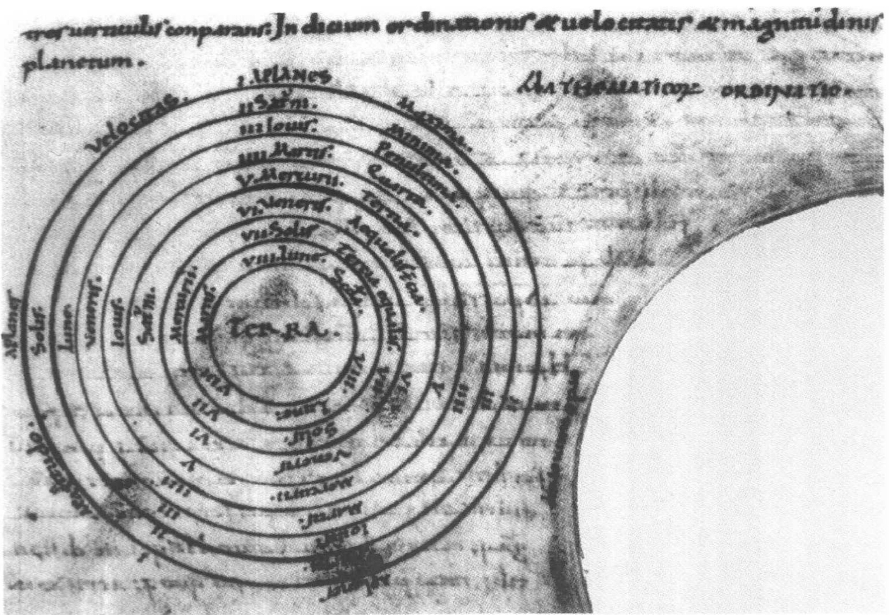

图 11.1 盛行于中世纪的简化的亚里士多德宇宙论。巴黎，国家图书馆，MS Lat., 6280, fol. 20r (12 世纪)。

于这一物质宇宙的边缘，处于把所有物质性实体都包含于其内的最外层边界之上，那么，当他伸出手臂越过了那个边界时会发生什么呢？看起来很明显，一定要有一个此前一直空出的空间来容纳他的手臂。这样，在基督教教义和斯多葛派的共同影响下，亚里士多德宇宙论被强加了重要的调整——这种调整鲜明地显现在17世纪晚期和其后对宇宙论的沉思中。 $ ^{8} $

一进入宇宙，我们立刻就遇到了天球。有多少这样的天球存在？它们的本性是什么？以及它们发挥着什么作用？有七个已知的行星

---

——它们是月球、水星、金星、太阳、火星、木星和土星，人们一般认为它们就是按照这个顺序排列的。中世纪著作家提出的简化的宇宙图景忽略了天文学方面大部分的细节，在这种图景中，每个行星都需要一个单独的球来解释它的运动。另外，根据亚里士多德，在行星天球以外，即规定了宇宙外边界的地方，是恒定不动的星或第十层天所处的天球。当中世纪学者们思考这个最外层的天球时，几个问题就产生了。

一个问题是确定它的位置。根据亚里士多德的说法，物体的位置决定于包容它的实体，但是，如果恒星的天球本身就是最外层的实体，那就没有什么外在于它而作为它的容纳者了。这样，该推论自然的结论——第十层天并不处在一个位置上——就过于矛盾而无法为人接受，除非是那些最粗笨的头脑。于是，提出了各种解决方案，其中有一种方案试图重新定义位置的概念，使之由被包含的，而不是包含的实体所决定。 $ ^{9} $

关于亚里士多德最外层天球的另一问题来自《创世记》中关于创世的描述，这种描述对第一天创造出的天（heaven）和第二天创造出的空气（firmament）作了区分——显然（在《圣经》中）两者是不同的，因为它们并不在同一天产生。而且《圣经》中宣称空气将其下的水同其上的水分隔开来；空气下面的水等同于地界中的水层，但是在空气上面的水显然还要构成另外一个天球。在讨论这一问题时，一部分信仰基督教教义的注释家在七行星的天球之外设立了另外三个球：其中，位于最外层的是不可见的、不动的火天（empyreum），这是天使的居所；接下来是水天或水晶天（aqueous or crystalline heaven），它完全透明，由水组成（可能是一种固态的或结晶状的形式，但更可能是流体，并且水可能仅仅是一种比喻的说法）；然后是空气，它容纳着恒星。于是，对于接受了这条论证的人而言，天球的数目就达到了10个。所有三个外层天球都被赋予了宇宙论和天文学上的功能；为了解释星体的其他运动，一些学者又设定了第11个天球。重要的是要指出在这些讨论中宇宙论和神学的相互作用：对亚里士多德的宇宙论作了调整，以迎合诠释《圣经》的需要，同时，

---

《圣经》解释也吸收了经过中世纪调整的亚里士多德宇宙论的基本原理，它的大量涵义都取自于当时的宇宙论理论。 $ ^{10} $

当然，中世纪宇宙论的兴趣在于天界中的物质因或质料因。早期中世纪的许多著作家受斯多葛传统的影响，猜想天是由炽热物质构成。在亚里士多德著作被发现以后，亚里士多德关于天由第五元素或者说以太（一种完美的透明物质，不发生任何变化）构成的思想得到了普遍的认同。关于这种以太的本性存在着很多争论——例如，它是否是一个形式和质料的组合？在那些承认天界存在着形式和质料的人中，有些人认为，天的质料同地的质料在种类上是相似的，而其他人则坚持认为，这两种质料完全不同。不论以太的本性可能如何，每个人都相信它被分成了不同的球，这些球相互完满地接触着（否则就会出现真空），并且各自以它们适当的方向和特定的速度无摩擦地转动。单个的球被假设为连续的——就是说，它没有空隙和缺口。学者们很少会质询它是流动的还是坚硬的；这两种意见只在很少数讨论过该问题的人中间得到支持。行星被看成是在清澈透明的以太中一种具有更大致密性和透明度的小的球状区域。 $ ^{1} $

争论更为激烈的一个问题，是关于天的推动者的本性。亚里士多德设立了一些不动的推动者作为天的运动的原因——它们是行星天球仰慕的对象，后者尽其所能通过永恒的匀速圆周运动而模仿它们不变的完美性。这样，不动的推动者就是目的因而不是动力因。最外层可运动天球的不动的推动者（第一推动者）就被习惯性地看成是基督教的上帝。但是设定其他不动的推动者却是一个更棘手的问题。本来，可以比较容易地将它们等同于柏拉图《蒂迈欧篇》中所描述的行星神，但是，承认除创世主之外还有任何别的神存在，这在基督教传统中是显而易见的异端事件。因此，对信仰基督的学者而言，重要的是赋予不动的推动者一个无神性特征，这样才能使他们自己远离那种(容易被看成是异端思想的)观念。常见的一个解决办法，是把它们看成天使或其他一些独立的智灵（无身体的精神）。然而也有另外一种解决之道，它完全无需什么天使和智灵：罗伯特·科尔瓦比（约1215-1279年）使天球具有一种进行圆周运动的活性或

---

本能趋势；约翰·布里丹（约1295-1358年）也认为，并不需要假定天上智灵的存在，因为这种说法在《圣经》中找不到任何基础。因此，天运动的原因可能是一种冲力或动力，它类似于推动一个抛射物的那种外力（见下文第十二章的讨论），是由上帝在创世之初施加于每个天球的。 $ ^{12} $

此前的分析一直假定天是由简单的一组紧密嵌套着的同心球组成。这似乎就是亚里士多德的观点，它得到了西班牙穆斯林伊本·拉西德（阿维洛伊）清晰的阐述和热情的捍卫，而且它在西方有一批重要的追随者。但是，一些中世纪的宇宙论著作家调整了他们的宇宙论思想，这是因为他们考虑到了托勒密天文学中的偏心均轮和本轮——显然，这是一种试图调和宇宙论和行星天文学的努力。我们将在本章的后面部分更充分地讨论这些发展。这里只要指出这样一点就足够了：学者们对该问题的解决方法是使亚里士多德的每个行星天球具有一定的厚度，从而能够充分包容托勒密提出的行星运行的均轮和本轮（见图11.10）。给定的一个行星天球的内半径将等于托勒密模型中地球与该行星的最短距离；其外半径则等于该行星到地球的最大距离。

在这一体系中，随之而来的包裹原则——厚厚的行星天球依次紧252密包裹着，无任何多余的空间——使计算各种行星轨道的大小并最终计算宇宙的大小成为可能。要做这种计算，就需要知道最内层天球，即月球所在天球的大小。几位穆斯林天文学家，包括9世纪的法加尼、萨比特·伊本·库拉，以及或者9世纪或10世纪的巴塔尼，借用托勒密《至大论》中有关数据，并在加以修正后进行了这种计算。在西方，诺瓦拉的卡帕努斯（Campanus of Novara，卒于1296年）也完成了他的计算：他算出的月球所在天球的内表面半径（月球最接近地球时）为107,936英里，外表面半径（月球离地球的最远距离）为209,198英里。他也对金星和水星作了类似的计算。在此基础上他得出了太阳的“理论”距离，其结果与古代天文学家计算出的太阳视差大致相符。对高位行星连续计算下去，就得出了土星天球的外半径和恒星天球的内半径为73,387,747英里。这些数据或与之近似的数

---

据一直沿用到 16 世纪哥白尼对其进行修改之前。 $ ^{13} $

## 地界

下一章将对地界中的自然运作进行细致的分析。但这里我们必须对这个月下区的各种宏观特征作一简要论述，它们关系着本章要讨论的那些更大的宇宙论问题。

从月球的天球往下，就进入了地界。这是四元素的区域，它们（在一个理想化的模型中）分布在一些同心的球层中，各居其所：首先是火，然后是气，接着是水，最后是位于中心的土。其中，两种元素——火和气——天生是轻的，于是要自然上升，而另外两种元素——水和土——本性是重的，于是要自然下落。在太阳和其他天体的影响下，这四种元素不断相互转化。例如，水可以在我们所说的蒸发过程中变成汽，相反，汽也能变成水而产生雨。

炽热的气态球体被看成是各种各样其他天象学现象的舞台，如彗星、流星、虹和雷电。彗星被认为是大气现象，是一种从土升至火的球层中干热散发物的燃烧。人们一般把虹的出现看成是太阳光受到云层中水滴的反射，各种著作家还把光的折射引入了这一过程。14世纪早期，弗雷堡的狄奥多里克（Theodoric of Freiberg，约卒于1310年）提出了一种和现代思想非常相似的解释，他把单个水滴对光的反射和折射结合起来（见图11.2）。 $ ^{14} $

万物的中心是土的球层，这个时期的每一位中世纪学者都同意它是球形的，并且人们熟知而且也都接受了古代人对其周长的估算值（约为252,000斯塔）。 $ ^{15} $ 地上的陆块一般被分为处于海洋包围中的三个大陆——欧洲、亚洲和非洲，有时还加上第四个大陆。除了这些基本的东西以外，人们对地表面貌及其空间关系的认识就随着时间、地点和个人情况的不同而差别很大了。让我们对中世纪的地理知识作个大致的描述。

在中世纪，地理知识以很多种形式存在，此外我们必须小心，不要沉湎于那种现代倾向，即只把它与地图或类似地图的心理图像等

---

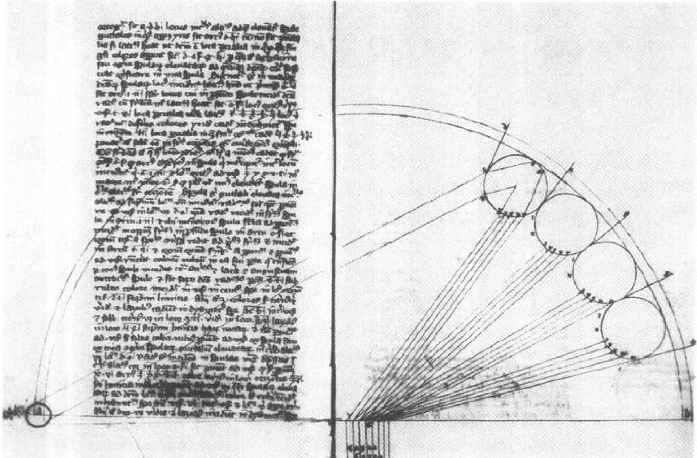

图 11.2 弗雷堡的狄奥多里克的虹理论。太阳被显示在左下角，一组雨滴在右上角，观察者位于下方中央。该图意欲证明单个水滴中的两次折射和内部反射是如何产生出人们所见到的彩色图案。巴塞尔，大学公共图书馆，MS F. IV. 30, 33v-34r (14 世纪)。

同起来。 $ ^{16} $ 显然，中世纪人对他们土生土长的地区有着第一手的经验知识，而关于远方地区的知识，可以从形形色色的旅行者身上获得，这些旅行者是商人、手艺人、劳工、朝圣者、传教士、武士、游吟诗人、云游学者、市政和教会官员，甚至那些逃亡者和无家可归的人。对于有幸能接触到古代藏书的极少数人而言，普林尼的《自然史》和塞维尔的伊西多尔的《语源学》等书籍就提供了更多外来和更大规模书面描述的地理知识。普林尼和伊西多尔用沿海航行表(periplus)——即记录城市、河流、山脉以及沿海岸航行时所见到其他地形特征的一个顺序列表——记述了一大批地理知识（其中一些是神

---

话）。这些知识通常都附带有趣的历史、文化和人类学细节。通过一些更早的编纂物，普林尼和伊西多尔让他们的读者领略了欧洲和非洲大陆外围的景象。 $ ^{17} $ 中世纪快要结束的时候，新的旅行文献开始丰富这些知识的积累。

传统的文献资料也研究了气候，它们将地球划分为若干气候带或气候区。在一个有代表性的体系里，有五个这样的气候带：两极附近的两个寒带（北极带和南极带）、分别与之相邻的两个温带和一

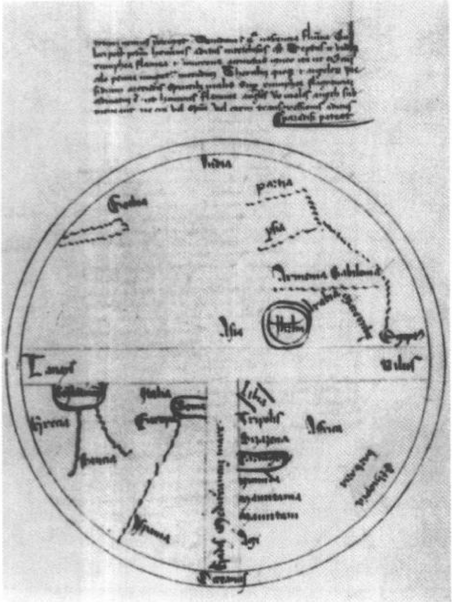

图 11.3 T-O 图。巴黎，国家图书馆，MS Lat, 7676, fol. 161r (15 世纪)。

---

个位于赤道之上并（根据一些人的观点）被一个大的赤道洋分为两个不同环带的热带。热带被认为过于炎热而无人居住——尽管一些学者驳斥了这种观点。当然，中世纪的欧洲人发现他们是生活在北温带的。地球的另一面（南温带）是对地，至于那里是否居住着人（即头朝下脚朝上走路的人），则是一个有争议的问题。

我们当中那些熟悉现代地图的人，会自然而然用地图中的对应部分把地理知识从空间上组织起来，从而把地理学还原成为几何学，然而中世纪的人们却并非如此。他们中绝大多数人从未见过任何一种地图，更不要说那种在几何原理上构建出的地图了。中世纪人所作的地图并不一定要用精确的几何术语来描绘图中标明的各种地形特征之间的空间关系，比例这个概念几乎也不存在。它们的作用可能是象征、隐喻、历史、修饰或教育各种性质的。例如，13世纪的埃布斯托夫地图（Ebstorf Map）把世界喻为基督的身体。15世纪的一部手稿中，一种对地球的表征用图示的方法把世界划分为三个大陆，各为诺亚的一个儿子所统治。 $ ^{18} $因此，如果我们不想误解中世纪人的目的和成就的话，我们就一定得小心，不要把中世纪的地图看成是现代绘图技术的一种失败的尝试。

在数量最多、最有趣和最精细的地图当中，有一种称为世界地图(Mappaemundi)，其最普遍的形式是 T-O 图，这种图与伊西多尔有关，他在图中描绘了三个大陆——欧洲、非洲和亚洲。在图 11.3 中，嵌入到 O 中的 T 代表着几个水域（顿河、尼罗河和地中海），它们将已知的大陆分割为几个主要的部分：亚洲在地图的顶部，欧洲位于左下方，非洲在右下方。人们还制出了不遵循严格 T-O 结构的非图表式 T-O 图，这是为了能把大量的地理细节吸收进来。另外一种较为普遍的地图是地带图，特点是用气候带作为它的组织原则。 $ ^{19} $

中世纪的绘图技术在波尔托兰图表（Portolan chart）上发生了一个数学的转向（因此也是一个向现代绘图学的转向），这种图表体现了航海者的实践知识，制作它们的目的是便于航海。这些地图可能在13世纪下半叶发明，它们对海岸线作出了“实际的”描绘，并且使用了分布在罗盘上用来指示任意两点间距离和方向的“航程线”网

---

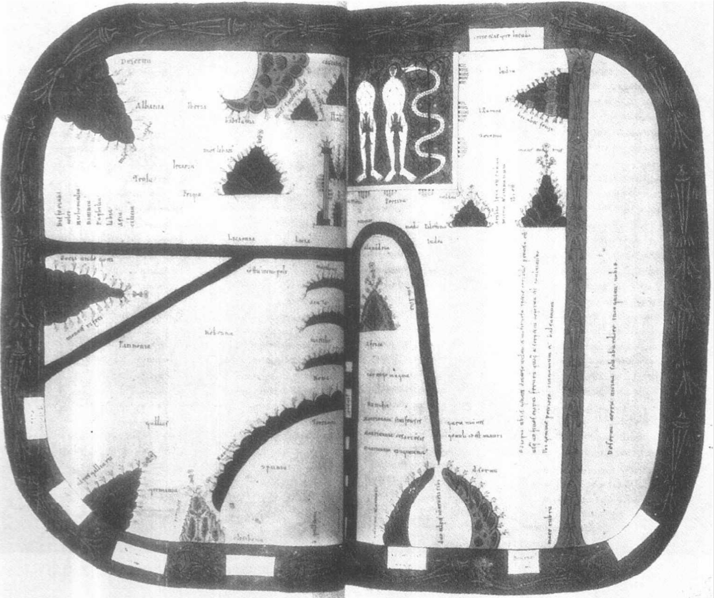

图 11.4 一幅修改后的 T-O 图 - 贝亚图斯地图（公元 1109 年）。第四大陆被显示在右侧远端。伦敦，大英图书馆，MS Add. 11695, 39v-40r。承蒙大英图书馆惠准。更多的讨论，见 J. B. Harley 和 David Woodward 编辑 The History of Cartography，第 1 卷，13。

络。波尔托兰图表首先应用于地中海，然后又用来描绘黑海和欧洲的大西洋海岸线。波尔托兰图表的应用使更富冒险性的探险远征航海成为了可能，这反过来又极大地拓展了欧洲人的地理知识。最终，当人们获得在15世纪早期被译成拉丁文的托勒密《地理学》——它教给欧洲人如何在二维平面上表现球体的数学技巧——之后，绘图学发生了决定性的转变。 $ ^{20} $

---

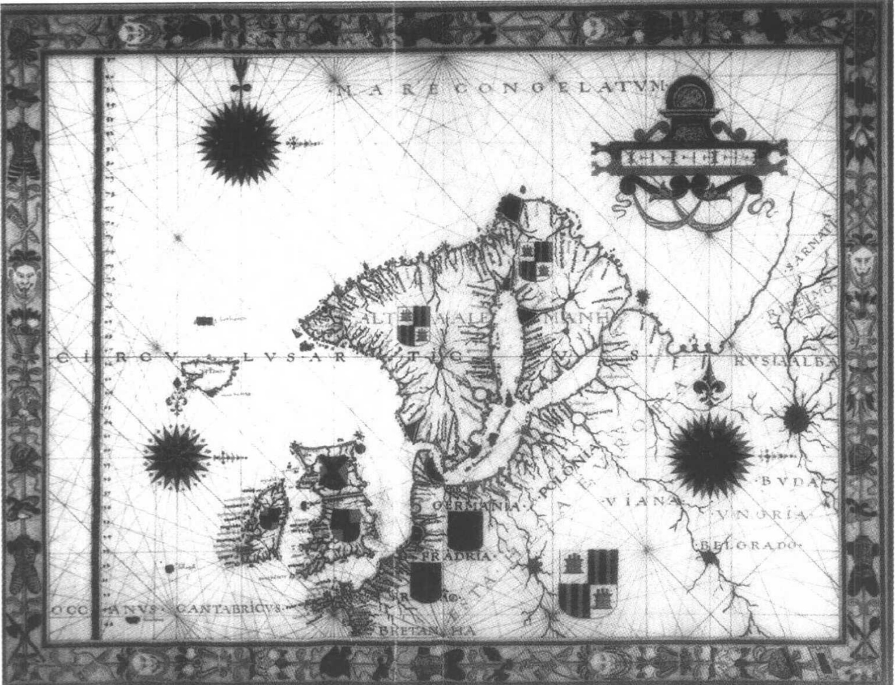

图 11.5 一幅由费尔南·瓦斯·多拉多绘制的波尔托兰图表（约 1570 年）。亨廷顿图书馆，HM 41（5）。

如果说绘图工作能给人们留下深刻印象是因为它的实用性，那么我们也将在这一部分的最后，考察一个看来（至少在表面上）并无任何实际应用价值的问题，即地球是否围绕着它的轴旋转，如果答案是肯定的，会出现什么情况呢？亚里士多德已经令人信服地提出了使人们相信地球静止不动的那些理由；尽管中世纪的所有学者都赞同他，但还是有一些人认为对地球转动的论证值得深入研究。在研究这个问题时，他们获得了古人的支持，这是因为，这种思想从

---

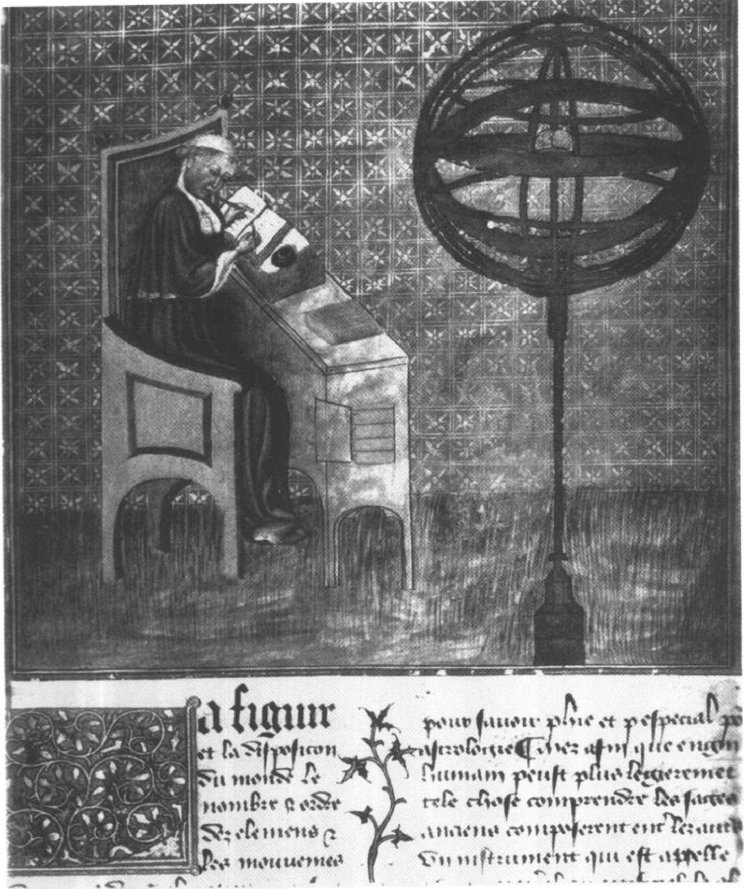

图 11.6 奥里斯梅。巴黎，国家图书馆，MS fr. 565, 1r (15 世纪)。巨大的仪器是一个浑天仪，一种用来给出关于黄道、天球赤道和其他天环的物理表征的教具。

---

来就没有在古代宇宙论和天文学的文献中完全销声匿迹：亚里士多德、托勒密和塞内加都讨论过该问题。在14世纪，对转动的地球所具有的内涵作出的最彻底探索，来自于约翰·布里丹和尼古拉·奥里斯梅。

并没有人想要把地球从宇宙的中心移开。布里丹和奥里斯梅所考虑的仅仅是地球围绕其轴的周日转动。假设存在这种旋转有一个明显的优越之处，那就是消除了让每个天球都作一周日运动的必要性，它意味着用惟一较慢的运动取代了许多快速运动。这几乎是每个人都乐于接受的一种经济的思想。 $ ^{21} $布里丹指出，天文学家所观察的是相对运动而非绝对运动；并且，赋予地球一个周日旋转并不会对天文学的计算产生任何影响。但重要的是，关于地球是否旋转的问题并不能根据天文学来决定，而必须依赖于物理学的论证。布里丹自己就提出了这样一个推论，他指出，(在无风的日子里)一支从旋转的地球表面垂直向上射出的箭将不会落回原来的位置，因为当它处于空中时，地已经在它下面发生了移动。他认为，既然向上射出的箭确实能够落回原处，我们就应当确信地球是静止不动的。

若干年后，奥里斯梅对这个问题作了更充分的考察。作为中世纪最敏锐的一位自然哲学家，奥里斯梅把回答那些反对地球旋转的权威观点作为他考察的起点。他论证说，我们所能感知到的都是相对运动，因此，通过观察并不能解决这个问题。他回答了布里丹的箭的推论，坚持说，在旋转的地球上，当这支箭垂直上升并继而垂直下落时，它同时也带有一个水平运动，它将始终处于它在地面上的射出点的上方并最终落回到该点。为了增强这种观点的说服力，奥里斯梅提出一个类似17世纪时伽利略用来捍卫运动相对性的船的例子：

这种情况看来可能发生，因为，当一个人处于一艘向东疾驶的船上而没有意识到这种运动，并且当他顺着船桅沿直线向下伸出手去时，对他而言，他的手好像是沿（向下的）直线运动着的。但是按照这种想法，在我们看来，这与一支沿直线向下或向上射出的箭是一样的情况。在这样

---

运动着的船上可以做各种各样的运动——水平的、十字交叉的、向上的、向下的、以及各种方向的——这些运动与在静止的船上的运动看上去完全相同。这样，如果船上的人以较之船向东运动的速度慢的速度向西运动，他认为自己向西而实际上他却是在向东运动。同样，在前面这个例子中，所有运动看上去也同地球静止时是一样的。

奥里斯梅继而论证说，《圣经》中教导地球恒定不动的论述似乎可以解释为《圣经》所作的一种从俗，“它遵从通俗表述中的习惯用法”。 $ ^{22} $于是，在反驳了否定地球运动的观点以后，他提出一个正面的例子，由此完成了这个论证——该论证支持地球的运动而不是所有天体的运动所带来的经济性。

对地球围绕其轴旋转，这是一个有力而且和（对于我们这样的哥白尼主义者而言）令人信服的论证。然而，它能让奥里斯梅同时代的人也这样相信吗？不，而且事实上它甚至显然也没有使奥里斯梅本人完全信服。尽管奥里斯梅对他所能构想的地球运动作出的论证代表了最好的哲学或理性论证，但神是全能的这一教义使这种论证最多也仅仅是一个可能的论证，它不会被允许去限制上帝的自由创造。因为众所周知，上帝可能会选择一个不经济的世界。因此，奥里斯梅最终承认了地球静止不动这一传统看法，他引用《圣经·诗篇》92：1中的一句话来支持它：“因为上帝已经创造了这个世界，它将不再被移动。” $ ^{23} $ 显然，这样一句《圣经》的表述不再（像其他表述那样）遵从于《圣经》从俗的原则。

历史学家一直不能确定该怎样解释奥里斯梅的这种明显转变。许多人猜想，这是由于他看到自己正面临着神学上的麻烦，于是作出了放弃的姿态，以保全自身。事实上，奥里斯梅奋力来解释自己的作为，我们肯定应当认真对待他本人的解释。他的意图，正如他所表明的，是要为那些试图用理性论证攻击信仰的人提供一个反面教训。他认为，他成功地为地球旋转这类“违背自然理性”的观念提出令人信服的哲学论点，恰恰证明了理性的不可靠，因此也证明

---

了在这种理性论证触及信仰的时候，必须谨慎从事。他的意图从一开始就既是宇宙论的又是神学上的。 $ ^{24} $

## 西方天文学的希腊背景和伊斯兰背景

我们已经探讨了宇宙的整个结构和一些运行原则，现在我们转到开展精确的天文观测和发展能定量解释行星数据的模型那些努力上来。我们必须首先讨论某种具有广泛影响的解释体系，皮埃尔·迪昂把这种解释体系建立在对天文学模型两种可能看法的区别之上。按照“实在论”的观点，天文学模型表征了物理上的实在，它回答了物理学家或自然哲学家提出的实体标准问题；而从“工具论”的观点来看，天文学模型仅仅是一种方便的构想——它是预测行星位置的一种有用的数学工具，但没有任何物理上的真实性。

根据迪昂的说法，古代天文学几乎完全是一个工具论的成就。迪昂认为，天文学和物理学逐渐被看成是相互独立的两种事业，物理学家（或自然哲学家）的任务是研究真实存在的事物的结构和本性，而天文学家的工作则是发展能用于准确预测的数学模型。天文学家若以实在性的考虑干预其数学任务，便是违反了学科的界限。迪昂就是用同样的概念体系和范畴来理解中世纪的发展，他追溯了这种假设的实在论和工具论的命运。 $ ^{25} $

但是有理由相信，迪昂严重夸大了古代天文学思想中的工具论倾向。在晚近的古代，仅仅有个别资料指明了这种实在论和工具论的区别，并且即使有，也很少有人把工具论视为一种研究天文学的方法。 $ ^{26} $这并不是否认希腊人对物理方法和数学方法作了区分，并不是否认托勒密等人致力于一项主要是数学的计划，也不否认寻求数学上的成功会使托勒密和其他天文学家忽视物理学上的考虑，这里仅仅是坚持认为：在物理学方法和数学方法之间作出区别或发现它们有时相互冲突，这并不等同于要让它们分家。我还要坚持的是，数学天文学家的长远目标，即使他们不能总是实际地实现它们，是要建立一种注重公认的自然法则并与之相调和的数学天文学。我们一

---

定要记住，托勒密既写了高度数学化的《至大论》，也写了更具物理学意义的《行星假说》。而且，即使在《至大论》中，在他最专一地集中于数学上的目标时，他也没有完全忽略物理上的实在性。

当我们注意中世纪天文学时，我们会发现它主要是一种数学的事业，从罗马时代以来它一直属于数学四艺，并且从未与数学中断过联系。但我们一定不要把它的数学目标看成是一种数学工具论的表现。同其古代的前辈们一样，中世纪的数学天文学家感兴趣的是几何模型甚至精确的预测。但是，他们中没有谁由此得出结论说，天文学应当脱离物理的实在性。而且，在中世纪，天文学和宇宙论并不是隔着一条方法论的鸿沟彼此对视，而是在一个方法论的统一体中并肩前行。

如果我们不能在方法论背景下明确区分天文学和宇宙论，那么我们是否还有理由把它们看成是两种不同的事业或学科？答案是肯定的。区分中世纪学科的一个最好方法，是忘掉它们正式的定义，而把它们当作一种文本传统来考察。在本章开始部分，我们所关注的那些宇宙论问题往往出现在对一些原著——亚里士多德的物理学著作（特别是《论天》和《形而上学》）、萨克罗博斯柯的约翰尼斯（Johannes of Sacrobosco）的《球体》(Sphere)、伦巴第的彼得(Peter Lombard)的《教父名言集》(Sentences)和《创世记》中的创世说——的注释中。 $ ^{27} $但是，对于天的数学分析则属于另外一个不同的文本传统，该传统源于托勒密的《至大论》和希腊化时期其他数学天文学著作。然而，任何人只有愿意实践（甚至是理解）数学天文学，他才可能掌握这种奥妙的技术，这就阻止了任何试图把这两种传统合并成一种总的“天的科学”的努力。

伊斯兰的天文学已经在本书中出现过。为了理解西方天文学的发展，我们必须要在这里增加一点细节。伊斯兰天文学受到的最早影响来自希腊天文学著作的印度和波斯文本。然而在9世纪，穆斯林天文学家直接接触到了希腊的文献资料，其中最重要的是托勒密的《至大论》，该书在9世纪先后几次被翻译——最后的也是最好的一个版本，是伊萨克·伊本·胡那恩在巴格达的“智慧所”中完成的。一

---

个生机勃勃、主要基于托勒密原理的伊斯兰天文学传统在后来几个世纪中得到了弘扬。年代学、计时术和历法方面的问题，如计算阴历和阳历的相互关系、预测阴历月的开始、以及决定祷告的时辰等等，是这种天文学研究背后的主要推动力，这些问题都迫切需要天文技术来解决。伊斯兰天文学发展的另一动因无疑是天文学与占星术活动的紧密结合，后者得到了伊斯兰宫廷的大力支持。 $ ^{28} $

用一个简短的概括根本不可能反映出伊斯兰天文学的丰硕成果，但我们可以把注意力集中于那些能够统摄这些成就的范畴，从而多少取得某些进展。首先，人们将大量的努力投入掌握、改善和传播托勒密的天文学说。法加尼和巴塔尼的天文学教科书是这一成就的杰出代表。第二，球体三角学的发展提高了托勒密天文学的计算水平，它包括了对六个现代三角几何函数的应用（托勒密使用“弦”以区别于其中的一个函数）。 $ ^{29} $

第三，天文观测和仪器的应用取得了重要的进展。为了改进和补充托勒密的数据，在伊斯兰地区建立起许多天文台和观测站——其中一些延续了相当长时间，而另外一些则昙花一现。制作出数值表及其使用说明书，并且它们得到了广泛传播。许多观测仪器也问世了，其中包括用来测量恒星和行星高度的庞大和固定的四分仪和六分仪：马拉加(Maragha)天文台的四分仪造于13世纪下半叶，半径四米多长；15世纪在撒马尔罕(Samarkand)由兀鲁伯(Ulugh Beg)制造、主要用来进行太阳观测的巨大子午弓仪，其半径超过了40米。 $ ^{30} $

从数学角度看，给人印象最深、用途最广的天文仪器是星盘，它发明于希腊化时期，在伊斯兰得以完善。星盘是一种手持设备，它由一个标有刻度的圆盘、一个能围绕其轴旋转从而能对恒星和行星的高度进行观测的视尺（照准仪）、以及一套置于一个铜体（“母体”）内能使星盘成为天文学计算器的铜制圆盘组成。（见图 11.7，11.8）星盘成为计算器的数学原理是一种立体投影法，它能把球形的天空投影在一套平整的盘面上（见图 11.9）。最上面的“网”盘（rete）用来代表转动的天空，它包含一个星图（限于一些最显著的星）和一个代表黄道的偏心圆；这个圆盘被切去很多，这样，使用者就可以透

---

图11.7 意大利星盘，约1500年。直径：4.25英寸。伦敦，科学博物馆，Inv. No. 1938-428。本图片的复制承蒙该博物馆理事会的惠准。

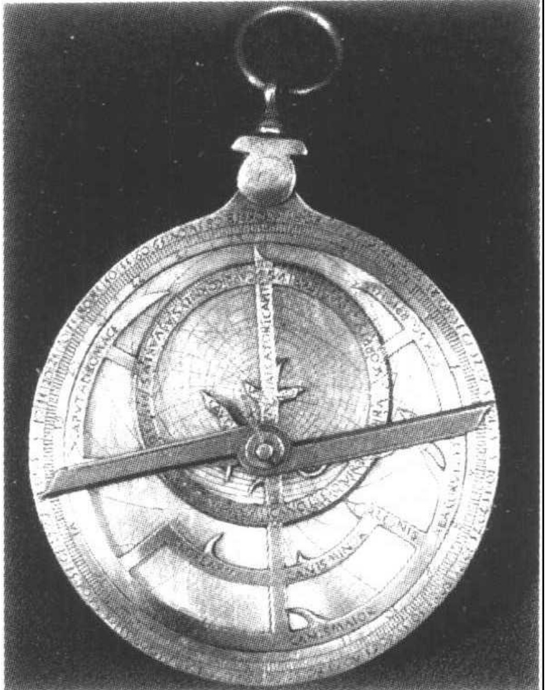

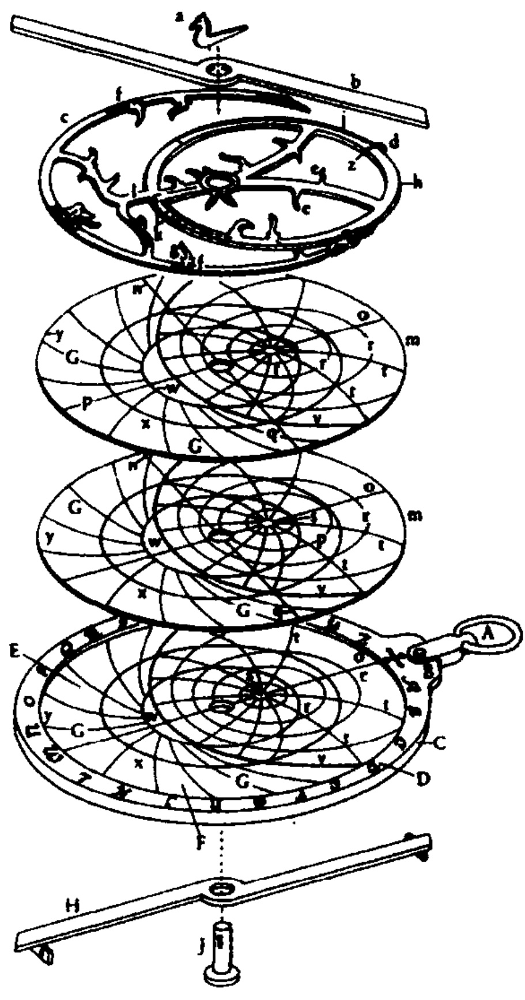

图 11.8 关于星盘的一种“突破性”观点。

▶ 承蒙 J. D. North 惠准。最早发表在 J. D. North 著 Chaucer's Universe，第 41 页。

a 马（一个一端带有马头的楔子）；
b 尺；
c 网盘；
e 星指针；
h 黄道圈；
k 黄道带各区域的分隔线；
m 势盘；
r 等高圈；
s 天顶；
t 等方位角线；
v 水平线；
w 北回归线；
x 赤道；
y 南回归线；
C 母体；
G 时间角度线；
H 照准仪（带有视孔）；
J 针。

---

266 图 11.9 等高圈的立体投影。等高圈（顶部）被投影到经过天球赤道的水平面上，正像一个位于南天极的观察者所见到的那样。这些等高圈以及等方位角线，是星盘中势盘的主要特征。承蒙 J. D. North 惠准。该图最早发表于 North 著 Chauceris Universe，第 53 页。

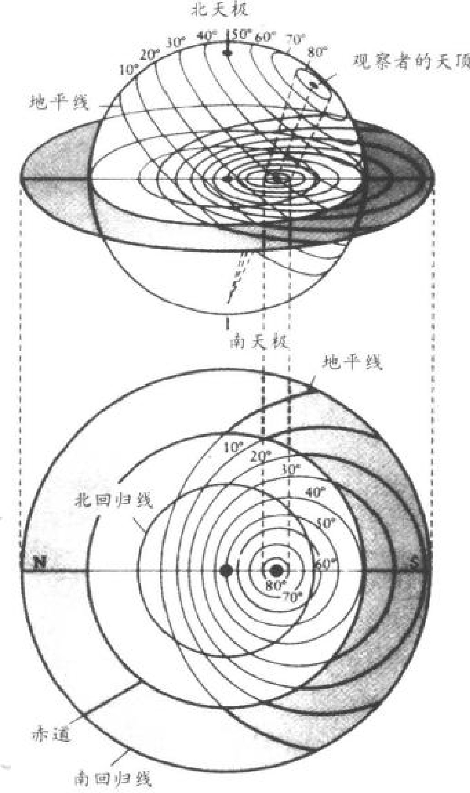

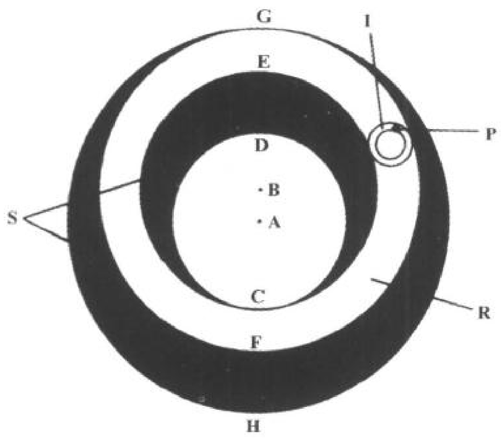

图11.10 伊本·海塞姆关于托勒密本轮和均轮的实心球模型。

---

过它看到一个固定在下面的盘，这就是“势”盘（climate），在势盘上面产生出一个表明使用者所处纬度的固定坐标系统的投影。势盘是由一条水平线、若干等高圈和具有相同方位角的线以及天赤道和南北回归线组成。网盘能在势盘的上方旋转，以模拟天对于地上的观察者的转动，太阳在黄道上的位置也被标示出来，于是各种有用的计算就成为可能。 $ ^{31} $

第四，伊斯兰学者对托勒密天文学进行了根本的批判，他们也努力去改进或纠正它。伊本·海塞姆（约卒于1040年，西方人所熟悉的名字是海桑（Alhazen））是早期的批判家之一，他以违背始终如一的运动原则为由，反对托勒密使用的均轮，他也试图沿着托勒密本人在《行星假说》中发展出的路子，为偏心圆和本轮提出一个物理学的解释。他的努力就是试图将研究天文现象的数学方法和物理学方法统一起来——这比托勒密本人更好地整合了《至大论》中的数学技巧和《行星假说》中的物理学设计，其基本思想是使每个行星的天球增厚到一定程度，从而能容纳一个本轮所运行的偏心轨道或圆环。

在图 11.10 中，增厚的空间 S 位于球体表面 CD 和 GH 之间。A 是宇宙的中心，地球就位于这一点。与这个球相切的偏心圆环 R 的中心位于 B 点，它被约束在球表面 CE 和 FG 之间。在这个圆环内有本轮 J，它容载着行星 P。整个球体带着圆环一起围绕着它的中心 A 进行周日转动，同时，本轮在这个行星的行星期（该行星绕黄道带一周所需的时间）内“绕过”这个圆环，这样，行星始终沿着旋转的本轮运动。其他的每个行星也都需要一个类似的增厚天球。如果所有的天球都一个接一个地紧紧嵌套在一起，我们就得到了行星系统的一个物理学模型，它吸收了托勒密行星天文学的基本原理，而同时为亚里士多德的同心球体系提供了一个令人可以接受的解释。 $ ^{32} $

在 12 世纪的西班牙，对托勒密的攻击特别激烈，在那里，一些学者，包括伊本·巴贾（Ibn Bajja，即阿维帕西）、伊本·图费勒（Ibn Tufayl）、伊本·拉西德（即阿维洛伊）和贝特鲁吉（al-Bittruji，即奥尔比特拉吉），以其在物理上不可能为由批判了托勒密的行星模型。

---

这些学者进而开始寻求一种同亚里士多德物理学相一致的天文学。伊本·拉西德反对使用偏心圆、本轮，特别是对分点，认为它们根本没有反映出任何的物理实在。他力主回归到亚里士多德的同心球模型上来。贝特鲁吉试图展示根据一个简单的同心球系统作出的预测能够与托勒密天文学的预测相媲美，在这方面他所付出的努力远远超过了拉西德（尽管没有获得成功）。在贝特鲁吉的体系里只有一套简单的同心球，每个球都是为一个行星而设的。所有行星天球都在原动力的推动下自东向西匀速旋转（因而无需既要有自西向东运动又要有自东向西运动了，而这正是许多自然哲学家不同意亚里士多德宇宙论的地方），原动力的推动作用是逐渐减弱的。为了解释观测到的行星运动的不规则性，贝特鲁吉使每个行星可以在自己的天球内缓慢移动（这种运动受球面上的本轮和均轮的制约）。 $ ^{33} $

## 西方天文学

在中世纪早期，西方没有接触到希腊的数学天文学文献——如希帕恰斯、托勒密以及其他人的著作。天文学肯定是被理解为一门数学的艺术，属于数学四艺之一，但中世纪早期的学者对数学天文学的实际了解微乎其微。普林尼、马蒂纳斯·卡佩拉和伊西多尔等著作家初步描述了天球及其主要的圆、七个行星及其经黄道带的自西向东运动，包括逆运动，以及水星和金星与太阳相关联的运动。处理年代学和历法问题的能力也得到了充分发展，但对于托勒密的模型或其他为严肃的数学天文学活动而建构的体系，人们却一无所知。 $ ^{34} $

西方天文学知识的这种状况在10和11世纪时由于与伊斯兰世界的接触而迅速发生了改变，这种接触主要是通过西班牙进行的。欧里亚克的吉尔伯特（约945-1003年）肯定与之有关。可能他在西班牙北部学习后带回了一些天文学论文。不管确切的细节如何，这些早期的接触带给基督教世界一个有广泛用途的天文学工具——星盘，以及与之有关的数学知识。从阿拉伯文译成拉丁文的关于星盘构造和使用方法的若干著作也在11世纪流传开来。反过来，星盘又引起

---

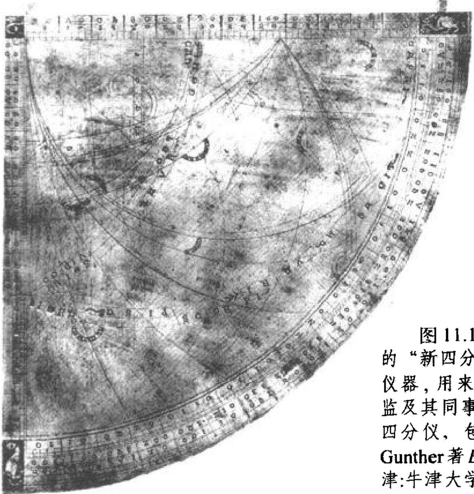

图 11.11 普罗法修（Profatius Judaeus）的“新四分仪”——14世纪一个典型的天文学仪器，用来测量高度。承蒙牛津默顿学院学监及其同事惠准。关于对中世纪各种各样的四分仪，包括默顿仪器的描述，参见 R.T. Gunther 著 Early Science in Oxford，第 2 卷（牛津：牛津大学出版社，1923 年），第 165-175 页。

了西方天文学的一次重新定向，使它从定性研究转向了定量研究。 $ ^{35} $

然而，严肃的定量化的天文学需要大量的观测数据。到12世纪早期时，西方学者已经开始直接搜集这样的数据了。但是更多更实用的数据则来自于对阿拉伯文献资料的翻译。花喇子模（卒于847年后）的天文表及其使用说明书《标准》在1126年时由巴斯的阿得拉尔翻译出来。托莱丹星表（Toledan Tables，公元11世纪时由扎卡里(al-Zarqali)在托莱多编纂而成）稍后也被翻译出来。 $ ^{36} $这些翻译而来的图表成为定量化的天文学知识的宝贵财富，但它们产生时并非是为了将来的应用。因此，需要对它们进行修正——12世纪的一些学者，包括马赛的雷蒙(Raymond of Marseilles)和切斯特的罗伯特从事了这种工作。在他们的著作中，我们看到了一个真正的西方数学天文学传统的发端。

尽管天文工具和天文图表是数学天文学研究所必需的，但仅有

---

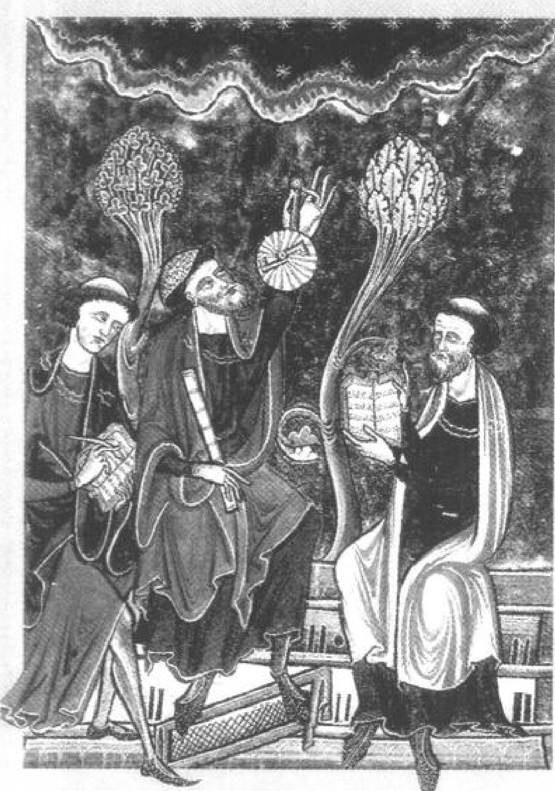

图 11.12 一位使用星盘进行观测的天文学家。巴黎，阿森诺图书馆，MS 1186, 1v(13 世纪)。

它们还不够。第三个要素是天文学理论。从一套天文图表所附带的说明中，其理论基础可见一斑，但它的数量有限并容易使人迷惑。理论天文学论文是人们所需要的，通过它们，可以作出在那些数据和计算背后的数学模型。它们又是通过翻译而得到补充的，这一次是来自于希腊文和阿拉伯文文献。1137年，塞维尔的约翰将法加尼关于托勒密天文学的基础手册翻译成《天文学基础》。而到12世纪下半叶时已经能见到伊本·库拉、托勒密和其他学者专业性更强的天文学著作了。托勒密的《至大论》两次被译成拉丁文，一次从希腊文翻译，后一次（由克里莫纳的杰拉尔德）从阿拉伯文翻译。大约与

---

此同时出现的占星术文献提高了人们对于占星术理论和计算的兴趣。占星学家对天文学计算的需求，以及占星术与医学之间越来越多的联系，都有助于解释天文学研究的扩展。

到 12 世纪末期，那些最重要的天文学著作在拉丁世界中已经都可以得到了。在此之前，西方天文学史讲述的，是对天文学知识的逐渐掌握和日渐传播，这主要发生在大学当中。大学中的一个必需品是教科书，它们会把托勒密天文学的复杂性限定在学生力所能及的范围内。一本导论性著作，如法加尼的《天文学基础》，当然可以拿来使用，但大学老师很快就有了自己的教科书。最早也是最流行的一本，是萨克罗博斯柯的约翰尼斯（又称霍利伍德的约翰，John of Holywood）所著的《球体》，该书大约作于 13 世纪中期的巴黎。这本书不断被人加以注释，并作为大学教科书一直沿用到 17 世纪。它包括了对球体天文学的一个初步描述和对行星运动的一些概要性评论。例如，萨克罗博斯柯描述了太阳沿黄道以每天 1 度的速率自西向东运动；他指出，除太阳外每个行星都沿着一个本轮运行，本轮又沿着一个均轮运行；他还说明了怎样用本轮—均轮模式解释逆运动，而且他把月食和日食分别归因于地球和月球投下的阴影。除此之外，他的行星天文学就没有别的东西了。 $ ^{35} $

显然，就那些对年代学、计时术和构建历法（computus）感兴趣的学生而言，他们从萨克罗博斯柯的《球体》中得到的收获可能只是最初级的天文学知识。而此后不久的另一本著作《行星理论》(Theorica planetarum，或 Theory of the Planets)，则把有关行星天文学的讨论提升到了一个实质上更高的水平，写这本书的是一位佚名作者，他可能也是巴黎大学的老师。《理论》概述了托勒密关于每个行星的基本理论，并补充了带有几何图表的描述。例如，太阳沿黄道的运动被解释为它沿一个偏心均轮以每天59分8秒（略小于1度）的速率自西向东匀速运动的结果；同时，这个偏心轮被“宇宙”或恒星天球带动着，以每天一个完整循环的速率自东向西旋转。在高位行星——火星、木星和土星——的模型中，行星P（图11.13）沿本轮自西向东匀速运动，同时对于对分点Q而言，本轮的中心沿均轮的运

---

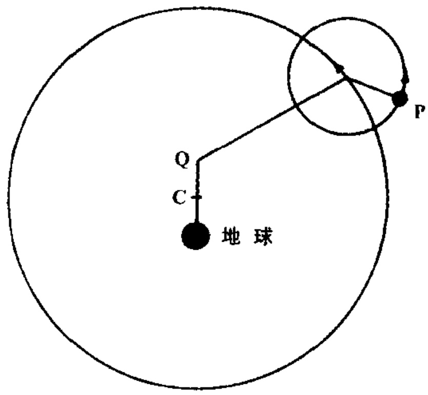

图11.13 根据《行星理论》的一个高位行星的（运动）模型。

动也是匀速的；均轮的中心位于对分点和地的中心点两者间的中点。 $ ^{38} $《理论》似乎很快就成为了天文学理论的标准教科书，它使托勒密模型在与任何可能的对手竞争中牢牢地确立了自己的位置，并且它把天文学术语固定了长达好几个世纪。

托勒密理论的确立带来的一个严重问题是，怎样使之与亚里士多德宇宙论和谐共处。对学者们而言，托勒密天文学中的偏心轮和均轮看上去并不容易与亚里士多德的同心球体系或亚里士多德的自然哲学原理相调和；如果谁还没有察觉这个问题的重要性，那么他可以看看阿维洛伊对托勒密天文学各种观念所作的攻击。在定量化观点看来能够获得成功的那种惟一体系，从物理学或哲学的立场来看却令人怀疑。13、14世纪时，为了解决这个问题，学者们在探索理论主张的特征或寻求折衷性的观点时费尽周折。天文学家必定需要定量的结果，他们除了保留托勒密模型以外别无选择。而对于那些更有哲学倾向的人来说，在亚里士多德原理的基础上创建一种精确定量化的天文学的想法，始终只是一个虚无缥缈的梦。 $ ^{39} $

经过伊本·海塞姆发展了的固体天球的托勒密体系在13世纪时显露出来。罗吉尔·培根在13世纪60年代的著作表明，他似乎是西方学者中对该体系作出了全面探讨的第一人。自他以后，方济各会

---

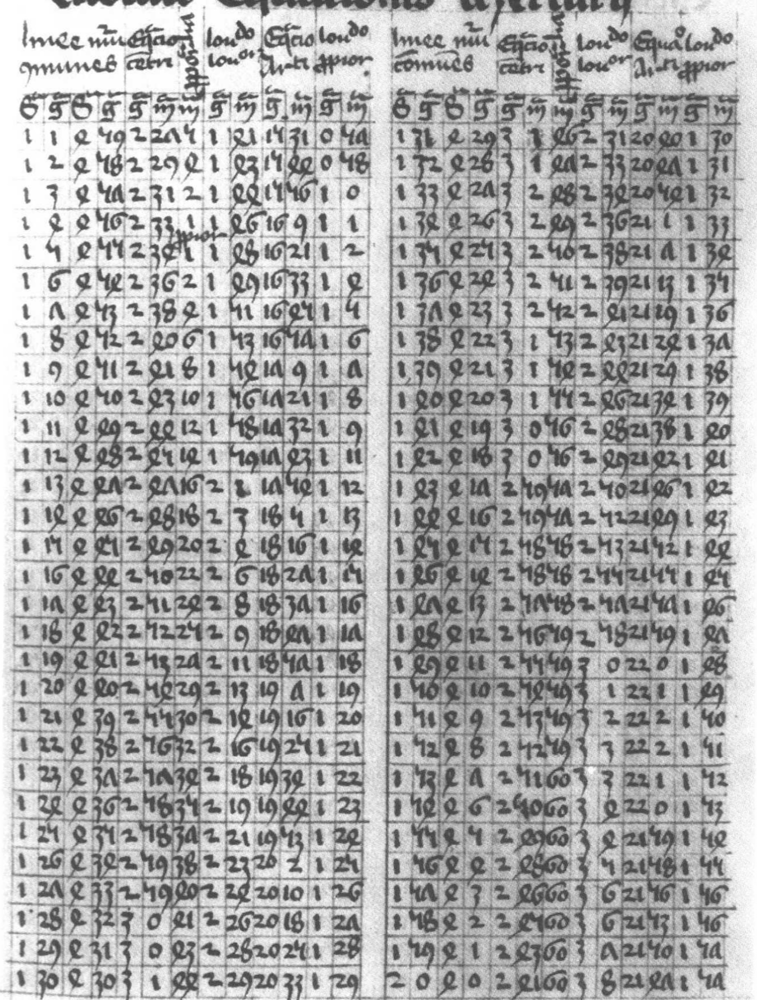

图 11.14 阿尔丰索星表中关于水星的一页。豪顿图书馆，哈佛大学，fMS Typ 43, 46r(约1425年)。承蒙豪顿图书馆惠准。

---

教士中似乎对这种学说产生了一股小小的兴趣，因为凡尔登的贝尔纳（Bernard of Verdun）和圭多·德马尔基亚（Guido de Marchia）（两人都是方济各会教士）都对它作了描述。这种观念似乎也暗含在该时期的某些天文学著作中，例如诺瓦拉的卡帕努斯的著作。但是直到得到乔治·波伊尔巴赫（Georg Peuerbach）这位对15世纪天文学复兴作出贡献的威尼斯学者的重新研究，它才又成为严肃的宇宙论争论的对象。 $ ^{4} $

《理论》没有介绍托勒密天文学中定量化的内容或进行实际天文学计算的方法。这一功能由托莱丹星表承担，约1275年以后则由阿尔丰索星表（Alfonsine Tables，在卡斯蒂尔的阿尔丰索十世的宫廷中完成）承担，阿尔丰索星表常常同《理论》一起出现。在16世纪遇到新的对手之前，阿尔丰索星表（图11.14）一直是指导数学天文学活动的标准。 $ ^{41} $

对那些受过大学教育的人而言，拥有一些初级的天文学知识已经十分普遍，而由托莱丹星表、阿尔丰索星表甚至《理论》所代表的高级知识，无疑还十分匮乏。大学授予艺学学位很少要求具备天文学知识，尽管它们也常常开设一些天文学的教学（这种教学最经常出现在关于《理论》的讲座中，偶尔也出现在关于托勒密《至大论》的讲座中）。然而，天文学在大学课程中地位低下的状况，并不意味着天文学到处都难以立足。事实上，尽管研究它的人相对稀少，但是在这些研究者当中，数学天文学的知识正逐步趋于精密。到15、16世纪时，从这一中世纪的传统中将出现天文学家约翰尼斯·雷吉奥蒙塔努斯（Johannes Regiomontanus）和尼古拉·哥白尼的身姿。 $ ^{42} $

## 占星术

长期以来，占星术因历史学家当中流行的一种倾向而受到损害，这种倾向粗暴地把占星术看成是由蠢人或江湖骗子发展起来的一种原始、非理性或迷信的思想。当然，确实如中世纪的批评者乐此不疲地指出的那样，曾有江湖骗子兴风作浪。但是中世纪的占星术也

---

有其作为严肃学术的一面，并且我们务必不要让自己的态度感染上今天人们对它的轻视。中世纪学者是用中世纪的理性标准和他们在当时所能获得的证据来评判占星术理论和实践的，并且，我们所能期待的、也是我们惟一能做的，就是理解占星术在中世纪的重要性和它变化的命运。 $ ^{43} $

一开始就作出下述区别将有助于我们的理解: (1) 占星术作为关于宇宙内部物理影响的一套信仰和 (2) 占星术作为一种诸如决定吉辰之类的占卜术。前者是自然哲学中一个值得人们尊重的分支，其结论很少招致怀疑。相反，后者却常常会受到各种（经验的、哲学上的和神学上的）反对意见的攻击，在整个中世纪它一直都是争论的主题。尽管我们也会触及到第二种意义上的占星术，但那种作为宇宙物理学一个方面的占星术才是我们主要关心的对象。

有一些明显的理由使人们相信天和地在物理上是相关联的。首先，观测数据使这种关联显而易见：没有人会怀疑天是地界光和热的主要来源；季节明显与太阳沿黄道的运动相关联；潮汐则明显与月球的运动有关；一旦罗盘（后来在12世纪）出现后，天球的极对某些矿物产生的磁影响就显现得足够清楚了。

这种根据观察得出的推论也得到了传统宗教信仰的支持。天与神的关联以及对于神在地界施加了影响的认识正是古代宗教的突出特征。恒星和行星的事件是地上各种事件的预兆（是一种征兆而非原因），这种信念在古代美索不达米亚广为流传，在那里，理解这种预兆成为了一种专门的艺术，它需要一定的天文学知识。随着新成份的加入，这种信仰逐渐丰富起来并发生了改观，其中包括这样一种观念：一个人被怀胎或出生时的天象能用来预言他一生中的某些细节（见上文第一章）。 $ ^{44} $

在希腊文化中，占星术观念得到了各种哲学体系的支持。在《蒂迈欧篇》中，柏拉图的造物主明确地把创造月下区各种事物的任务赋予了行星或行星神；并且这表明建立天界与地界之间的关系是可能的。柏拉图也强调了宇宙的统一性，其中包括在整个宇宙和单个人之间的对应关系（大宇宙一小宇宙类比）。在亚里士多德的宇宙

---

中，不动的推动者不仅是天球运动的根源，而且是月下区运动和变化的根源。在他对天象学现象的讨论中，亚里士多德认为地界“与上（天界的）运动有一种肯定的联系；因而它的所有能量都来自于它们”。在其他地方，他把季节变化以及地界的所有生与朽都归因于太阳沿黄道的运动。最后，斯多葛派的观念似乎也已贴近并捍卫了占星术，因为它把宇宙看成是一种以统一和连续性为特征的活性的、有机的宇宙。那么应当清楚的是，占星术在其物理学或宇宙论形式上，是对天与地的因果关联的一种经验和理性的考察。几乎任何一位古代哲学家都认为否认这种关联是极其愚蠢的。 $ ^{45} $

托勒密是一个极好的例子——这不仅仅是因为他完整而清晰地论述了这个问题，而且因为他对伊斯兰和西方占星术传统都产生了有力的影响。在他的占星术手册《星象回说》(Tetrabiblos)中，托勒密承认占星术的预见不能同天文学证明的确定性相媲美，然而，他断定天的作用是真实存在的，以及总体而言占星术预见是有效的。他论证道，对于任何人都显而易见的是，

从永恒的以太实体中发出的某种力量……渗透在整个地界之中……太阳……总是以某种方式影响着地上的万物，这种影响不仅来自伴随着动物的繁衍、植物的生产、水的流动和身体的变化的那种变化，而且也来自于它的周日转动。这种转动带来了热、湿、干、冷，它们都遵循着固定的顺序并符合于它们各自相对于天顶的位置。月球也……将其影响最大限度地施加于尘世万物，这些事物中的大多数，无论是有生命的还是无生命的，都与之相通并随着它的变化而变化。而且，恒星和行星在天空中通过，经常意味着空中的热、风和雪的情况，地上的事物相应地会受到影响。

占星术实践者理解了这些影响并掌握了天的运动和天象就能够预言各种各样的自然现象：

---

那么，如果一个人确切地了解所有恒星、太阳和月球的运动……如果作为先前不断研究的结果，他已经能够从总体上区分它们的本性……并且在研究这些数据时，通过科学的成功猜想，能够断定各种因素合起来所产生的质的独特标志，那么，在每个给定的情况下，有什么能阻止他根据当时各种现象间的关系辨别出空气的特点，例如，它是比较热还是比较湿呢？就个人而言，他为什么就不能根据其出生时的氛围，察觉出他一般的性情呢？例如，他的身体如何如何、他的灵魂如何如何，为什么他不能运用这种事实——如此如此的一种氛围对应于如此如此的一种性情，能给人带来吉利，而另一种氛围却不能这样，反而会导向损害——来预知偶然的事件呢？ $ ^{46} $

希腊化时期的哲学及后来的伊斯兰和基督教传统，也表露出一些反占星术的情绪。但是，这些攻击的目标并不是占星术对天的影响真实存在的信仰，而是决定论和（一些神父们）使恒星和行星具有神性从而带来的威胁。在基督教世界中，最有影响的声音来自于奥古斯丁（354-430年）。奥古斯丁攻击了粗鄙的占星术，他视之为一种骗子的把戏；但他最关心的是占星术理论中的宿命论和决定论倾向。无论如何，意志的自由必须受到保护，因为否则就不存在人的责任问题了。在论证中，奥古斯丁经常借助于“孪生子的问题”（并非他的发明），他指出，孪生子是在同一瞬间被怀胎并几乎同时出生的，然而他们的命运却常常有着戏剧性的差别。但是，奥古斯丁却打开了通向物理影响的可能性的大门，只是他认为它仅仅能作用于身体，他写道：

仅仅从物理上的差异来考虑，认为存在某种星（例如恒星）的影响，这并不是完全荒谬的说法。我们看到，一年中季节随着太阳的接近和远去而交替变更；随着月球的

---

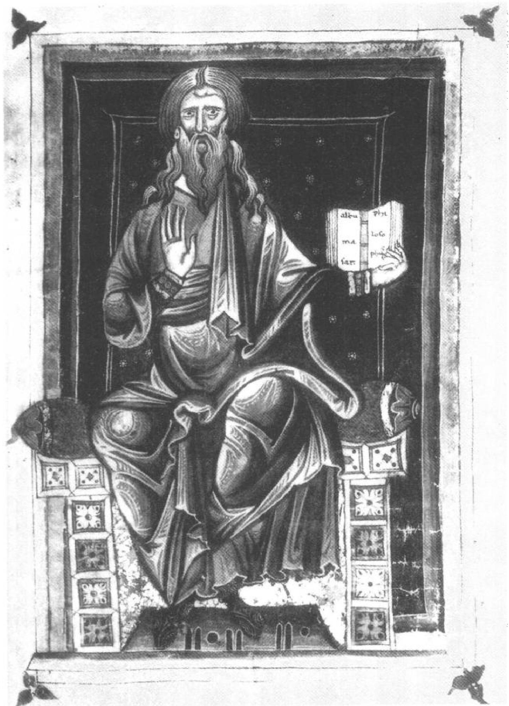

图 11.15 阿拉伯占星学家阿布马夏（或称阿布·马夏尔），可能是拿着他的《占星学导论》。巴黎，国家藏书馆，MS Lat. 7330, fol. 41v(14 世纪)。

---

盈亏变化，我们也看到某些种类的事物在生长或萎缩，例如海胆、牡蛎以及神奇的潮汐。但意志的选择并不受星的位置的影响。 $ ^{47} $

奥古斯丁和其他神父反占星术的争论有助于在早期中世纪形成一种敌视占星术的气氛。在早期中世纪的著作中，我们发现到处都有对占卜性占星术活动的谴责——但是，同时它们往往也承认天的作用及其对地上各种现象的影响是真实存在的。 $ ^{48} $

12 世纪柏拉图哲学在西方的繁荣，以及希腊和阿拉伯占星术著作的重新发现，使得人们对于占星术的兴趣重新高涨起来，并且对它的教义给与了更多的赞许态度。当然，任何占星术的决定论主张仍然受到诅咒，但是，关于恒星和行星的影响具有实在性以及成功的占星术预见具有可能性的主张，已成为了人们共同接受的观念。例如，圣维克托隐修院的于格（Hugh of St. Victor，卒于 1141 年）在其有影响的《学问之阶》(Didascalicon，写于 12 世纪 20 年代后期）一书中，赞扬了占星术中的“自然”部分，该部分研究了物体的“性情或‘相’，例如健康、疾病、暴风雨、平静、生殖力和不育，它们随着星体的相互排列而变化”。一位天文学著作家在 12 世纪晚期或 13 世纪早期的著作中指出，“我们不相信恒星和行星的神，也不崇拜它们，但我们信仰和崇拜它们的造物主，无所不能的上帝。” 12 世纪的另一位作家在谈论决定论问题时写道：“恒星……能带来一种获得财富的才能，但从不能带来获得财富的事实”。 $ ^{49} $

从阿拉伯文和希腊文移译而来的占星术著作，对形成这种新的态度至关重要。这些著作主要是托勒密的《星象回说》，它译于12世纪30年代；阿布马夏（Albumasar）的《占星学导论》(Introduction to the Science of Astrology)，该书在12世纪30和40年代被翻译过两次；以及各种占星术小册子，最终，亚里士多德的那些论述天的影响的著作也加入进来。《星象回说》捍卫了占星术信仰，并将这门艺术中的一些技术原理引介给读者。例如，它指出了各种行星对地的具体影响：太阳造成热和干，月球主要带来潮湿，土星的影响主要是冷

---

另外也有干，木星造成适度的热与湿。某些行星的影响是有利的，其他行星的影响则是不利的；某些行星是阳性的，而另外一些则是阴性的。《星象回说》也根据行星与太阳的几何关系（它们的“相”）解释了行星的力量是如何增多和减弱的。它使黄道带的各种迹象具有了某些具体的属性。并且用不同地区与行星和控制它们的黄道迹象之间的“亲密”或同情关系，解释了住在那些地区的人们的共同特质。

阿布马夏《导论》的贡献在于，它详细阐述了托勒密《星象回说》和其他占星术文献（包括波斯和印度文献）中的占星术原理，更特别的是，通过整合传统的占星术学问与亚里士多德自然哲学，它使得占星术确立在一个适当的哲学基础之上。从实际而言，这意味着要吸收亚里士多德关于质料、形式和实体的形而上学思想，及其认为天体是地上所有运动的根源和生与朽的动因的主张。通过行星的影响，形式被加于四元素之上，从而产生日常经验中的物理实体；行星星象的变化带来了永无休止的转化、生与死和成与灭。亚里士多德对生与朽的解释集中在太阳沿黄道的运动；而阿布马夏（沿天文学传统）在重点考虑太阳的同时，也把其他行星及其与太阳和黄道征兆之间的几何关系置于了因果图景之中。 $ ^{50} $

当然，由于在12世纪时获得了亚里士多德本人的著作，占星术进一步被亚里士多德化了。在13世纪期间，占星术信仰扎下了根并成为了中世纪世界观的一个标准部分。占星术也紧密地联系着医学活动：在中世纪后来的那些有名的内科医生中，谁也想象不出在没有它的情况下还能够成功地开展医学活动。 $ ^{51} $ 哲学家和神学家继续对占星术的决定论忧心忡忡——它被列入了1277年的大谴责中，并且，从事占星术活动的人仍被习惯性地贬斥为江湖骗子。但是，即便那些最激烈地反对占星术的人，也愿意承认天的影响的真实性。尼古拉·奥里斯梅这位曾写过整本整本的著作攻击占星术的人也承认：涉及大规模事件，如“瘟疫、死亡、饥馑、洪水、大战、王国兴衰、先知、新的宗教等类似变化的那部分占星术，能够而且的确很有名，但这仅仅是从总体上来说的。特别是我们不能知道在哪一国、哪一月、通过什么人或在什么样的环境下，发生这种事情。”至于天对健康和

---

疾病的影响，他说，“关于那种来自于太阳和月球的影响，我们能够了解一些，但除此之外我们就几乎或甚至完全一无所知了。” $ ^{52} $ 占星术作为自然哲学的一个特殊方面，一直繁荣到17世纪和以后。