# 第十二章 月下区的物理学

把“物理学”一词放入本章的题目似乎并不妥当，不妥之处在于，有的读者可能因中世纪的物理学与近代物理学共用“物理学”这一名称而把二者混为一谈，持这一想法的读者将自然而然地得出这样的结论：中世纪的物理学家在努力成为现代物理学家，只是成功的很少，或者认为中世纪的物理学是现代物理学一个原始的或不成功的版本。但是，如果我们把中世纪物理学看作不成功的现代物理学，就不可能理解中世纪物理学特有的目的和它自身的成就。

事实上，中世纪物理学就其本身而言，是高度协调的理论体系，它成功地回答了许多中世纪学者提出的物理学问题。总的说来，这些问题比现代物理学家提出的问题要宽泛一些。当我们考察中世纪的相关术语时，中世纪物理学的范围就清晰地呈现出来。拉丁语名词“physica”和“physicus”（分别表示“物理学”和“物理学家”）取自古希腊著作中“physis”一词，一般译为“本性”（nature）。对亚里士多德（在本章的研究领域，他的影响达到了最高点）来说，“physis”或事物的本性是该事物具备了它自身特征和行为方式的内在原因，正是本性引起了事物所有的自然的变化。自然作为一个集合概念，包括了拥有这一本性的所有事物，物理学家就是考察这些事物及其自然变化的人。简言之，物理学家就是研究有关自然所有现象的学者或哲学家。

---

这并不是说，在中世纪物理学和近代物理学之间没有明显的连续性。中世纪学者所关心的一些问题，或多或少传给了16、17世纪的后继者，而且，中世纪学者为早期近代科学提供了一部分重要的科学语汇和概念框架。显然，这种连续性在历史考察中是合理而且重要的研究对象，本章不会完全忽略。但本章的目标是理解中世纪关于自然的思想的目的和成就，所以连续性问题不是这里研究的主要对象。 $ ^{2} $当我们发现中世纪物理学的某些片断在以后时代受到褒扬时，我们应当不受引诱，据此断定我们已经理解了中世纪物理学家认为其学科甚为重要的基本特征。

## 质料、形式和实体

什么是中世纪物理学或自然哲学的基本解释原则呢？在12和13世纪消化、吸收了亚里士多德哲学后，有关原则基本上是亚里士多德理论提供的，尽管设立这些原则的亚里士多德众多哲学文本里所存在的含糊、不完整和不连贯之处，为日后理论的综合以及对细节理解的争论留下了余地。这里我们将对亚里士多德自然哲学的基础作一简略回顾。 $ ^{3} $

亚里士多德认为，月下区所有物体(亚里士多德称之为“实体”)都是形式和质料的合成物。对于个体而言，形式是积极因素，是动因，是属性的承担者。质料是形式的被动接受者，形式与质料的结合不可分离，产生了物质具体、实在的内容。如果我们所说的物体是一个“自然”的物体，(区别于匠人雕琢出的工艺品)，它就具有本性(本性主要由形式决定，其次，质料也会对它产生影响)，物体本性决定了该物体的某些行为倾向。这样，火自然与热联系在一起，石块自然地下落(如果把它们从原有的自然位置上挪开的话)，孩子们会自然地长大和成熟，橡树籽自然地长成橡树，这些本性是我们能够通过长期不懈的观察得到的：凡不是偶性产生的(因为其出现具有规律性)，或不是由人的干预产生的(因为这些现象与人的干预毫无关系)，就必然是自然的结果。因为本性是对一切自然变化起决定性作用。

---

定作用的因素，所以物理学家和自然哲学家必对此有着浓厚兴趣。

亚里士多德的中世纪信徒，在思考了这一概念之后，提出了两种形式，一种与事物的基本属性（essential properties）相联系，另一种与事物的偶然属性（incidental properties）相联系。决定事物的特征，即使之如此的特征，由后来所谓的“本质形式”（substantial form）体现出来。本质形式与绝对无属性的第一质料结合，就产生了实体或使实体得以存在，并且赋予实体成其为自身的属性。然而除基本属性之外，实体还有偶然性质或偶然一类的性质，它与“偶在形式”（accidental form）相关联。因此，一只家狗可以或短毛或长毛，或瘦瘠或肥硕，或友善或凶狠，或闹腾或安静，但它仍然具有确定无疑的狗的特征（这些特征由本质形式所产生）。

亚里士多德的形式、质料和实体理论是他的元素理论的恰当例证。亚里士多德接受了他的先辈柏拉图和前苏格拉底派的观点，即人们日常经验中接触到的材料或实体并不简单，而是很复杂。这即是说，月下区的可感事物是复合物或混合物，可还原为一组基本的“根”或构成要素，称之为“元素”。亚里士多德吸收了恩培多克勒和柏拉图提出的土、水、气、火四元素的说法，并认为四元素以不同的比例结合在一起，就形成了一切可感的实体。亚里士多德同意柏拉图认为的四元素本身并非固定不变或不可改变，而是可以相互转化。而亚里士多德的形式与质料理论就解释了上述四元素的转化何以可能的问题。

亚里士多德认为，每一种元素都是由形式和质料结合而成的结合物，由于所说的质料能够采取各种形式，所以元素可以相互转化。因为形式与四种原初的或“基本的”性质——热、冷、干、湿——联系在一起，所以形式有助于产生元素。把冷和干赋予基本质料后产生了土，把冷和湿赋予基本质料后就产生了水，依此类推。基本质料能够与任意四种基本性质相合，因此，如果土元素中干的性质因某种机制让位于湿的性质，则土元素不能存在，而相应数量的水元素将取而代之。亚里士多德认为，这种转变经常发生，所以，元素间的转化也经常发生。这种变化能够解释很多我们熟悉的日常现象。

---

我们现在把这些现象与化学和气象学科学相联系。 $ ^{4} $

形式与质料的理论不难理解，但把它应用到真实世界时就遇到了一系列的问题。现实世界似乎包含了一个庞大的形式和质料的等级结构，亚里士多德上述的理论用于其中某些层次妥帖一些，而用于另一些层次就显得局促。亚里士多德认为，质料是形式无条件的接受者，这可以很好地说明元素的组成，那些接受了基本性质（冷、热、干、湿）的本质形式的质料，完全没有自身的特性，除了有能力接受本质形式这一点。质料是不可察觉的，不可知的，而且也不是真实的存在。亚里士多德把这种东西称为“基本质料”（primary matter）。但把偶性施加给本身已经作为独立的实在而存在的质料：被雕刻成石像的大理石在雕刻之前已是实在的物体，它具有一系列属性（大小、形状、颜色、密度和硬度），这些属性在雕刻家把石像的偶性赋予大理石之前，大理石就已拥有了。同样，头发在变成灰色之前（这里，头发是被“灰色”这一偶性赋予其上的质料）已经是一种实在的存在物。具体说来，就是头发在颜色改变之前就已具有具体的、可识别的特征了。上述讨论中所反映出的问题，促使亚里士多德学说的古代和中世纪继承者修正了亚里士多德学说的原有定义，明确区分了在偶然变化的情况下，元素的非实质基本质料（insubstantial primary matter）和实质的非基本质料（substantial secondary matter）。 $ ^{5} $

质料和形式理论在阿拉伯地区被阿维森那(伊本·西那，980-1037年)和阿维洛伊(伊本·拉西德，1126-1198年)详加发挥，他们所做的工作对西方世界产生了巨大影响。这两位阿拉伯的评注家认为，不可能通过把元素的形式直接赋予基本质料直接得到元素，这其间需要一个过渡的步骤。为此，他们设想出了“实体形式”(corporeal form)的概念，第一步必须是把实体形式赋予基本质料，从而产生出一个三维体。然后，这个三维体（一种非基本质料）与本质形式结合才形成元素。实体形式的观点被传到基督教世界，在那里产生了较大的影响和争议。罗伯特·格罗斯代特接受了这一观点，他把光看作是一种实体形式。 $ ^{6} $

---

亚里士多德把形式与质料放在同样基本的地位上，不存在一个比另一个更基本，而是各自有各自的功能。事实上，这种平衡难以维系。在新柏拉图主义传统里（阿维森那即是明显的一例），有轻视质料的倾向，把质料作为真正的虚无，同时把形式抬高到一个准自主的高度。比阿维森那年轻的评注家阿维斯布朗（Avicebron，即伊本·贾比罗，卒于1058年）转向另一做法，重质料而轻形式，阿维斯布朗的影响可能有助于解释西方学者（尤其是方济各会的修士，例如米德尔顿的理查德（Richard of Middleton）和邓·司各脱）为何乐于认为神能在没有形式的情况下创造出质料。

## 结合与融合

质料，形式与实体的理论可以运用于一类重要的现象之中，这类现象与我们今天所称的“化学结合”（chemical combination）相关联。根据亚里士多德的理论，这类现象的核心显然就是，在月下区的真实世界里，所有实体，包括有机组织，都是四元素结合而成的结合体（compound）。因此，亚里士多德进一步探究化学结合的本性以及结合体中原有成份的地位，我们就无须感到惊奇了。亚里士多德把机械聚集（mechanical aggregate）与真正的融合（true blending）作了区分。机械聚集是指两种实体的很小的微粒紧密地排列在一起，却并未失去各自的特性；真正的融合是指不同的成份结合成同质的结合体，在这种新物质里，诸成份各自原有的特性已消失，亚里士多德称这种物质为“融合物”（“mixt”或“mixture”。本书将用拉丁术语“mixtio”表示融合过程，“mixtum”表示融合的产物，以保留亚里士多德头脑里已有的技术上的涵义），正是这种结合被他认为适用于元素的融合。

根据亚里士多德的观点，在融合物里，诸成份各自的本性被一种新的本性取代了，新的本性渗透到结合体的最细小部分。融合物的性质是诸成份的性质的平衡。例如，如果我们把一个湿的元素和干的元素（比如说水和土）结合在一起，则它们的结合体介于原有

---

的非常湿与非常干之间，湿与干的程度由两元素湿与干的多少决定。尽管原有元素在融合物中已不存在，但亚里士多德认为，它们仍保有实质性的或潜在的存在，对融合物产生某种持续的影响。 $ ^{8} $

亚里士多德的讨论为他的评注者留下了许多问题。其中之一是用质料和形式的概念体系重新表述结合与融合的理论，因为在亚里士多德的表述中并未出现这些术语。在这一过程中，需要研究新的融合物的本质形式是如何从各组成元素的形式中产生出来的。另一个极重要的问题是要解决，在怎样的意义上讲，原有元素的形式继续存在于融合物中。由于我们承认在融合物受到破坏后，形成融合物的元素将重现，很明显，这些元素看来是以某种方式存在于融合物之中。上述问题的争论变得相当复杂，我们在这里只能简要地作一介绍性评述。

大家都认为，组成元素的本质形式被融合物的新的本质形式取代了。但这是怎样完成的呢？一般认为，当各元素融合在一起时，各自的性质相互作用，各自的本质形式消解了，新的本质形式就出现了。然而，从亚里士多德原来的理论出发，有足够的理由相信，新的本质形式不可能从原有的本质形式或组成元素的性质里产生出来，似乎需要外界的作用介入此过程。惯常的解决办法就是援引更高级的力量，如天的力量，天的智灵，甚至上帝本身，让它们在各元素融合时把新的本质形式注入到基本质料之中。

至于融合物中组成元素存在与否的问题，人们一致认为应找到某种方式使组成元素以潜在或实存的方式匿迹于融合物中，等待合适的机会展示自身的特性。阿维森那认为，元素的形式在融合物中原封不动地保留下来，只是它们的性质被弱化到无法察觉的程度。阿维洛伊则坚持认为，在融合物里，元素的形式与性质在力度与强度方面都弱化了，只能以潜在的方式存在着。根据亚里士多德本人的观点，本质形式并无程度上的差别，这即是说，本质形式并不能被强化或弱化（毕竟，一只特定的四足哺乳动物要么是狗要么不是狗，在这种情况下讨论本质形式的强弱毫无意义。）由此，阿维洛伊断定，组成元素的形式一定不是本质形式，它的地位介于本质形式和

---

偶在形式之间。托马斯·阿奎那（约1124-1174年）认为，元素的形式在融合过程中消失了，但它们的性质在融合物中却仍具有某种真实的影响。这些观点以及其他一些观点构成了中世纪后期自然哲学家激烈争论的基础。

我们需要解决的最后一个问题与有形实体的机械可分性有关，这些有形实体就是指木头、石头和有机组织这类东西。分割是否可以无限制地进行下去？实体的最小部分的性质是什么？它们是和原子一样的东西吗？亚里士多德曾经暗示过融合物成份的最小部分，这些最小部分相互融合且相互作用。亚里士多德的评注者根据他的这些话建立了一套理论，称为“最小量”(minima或minima naturalia)。该理论原则上承认机械分割是不可穷尽的，无论你所要分割的部分有多小，都找不到无法再次分割的实在理由。但它又认为，每种物质都有一个最小量，在这个最小量之下，该物质即不再成其为自身，因为其形式无法存在于比最小量更小的量中。

中世纪还有人试图将最小量理论解释为原子论的一种变异。原子论和最小量理论都承认物质的特殊结构，但此外它们却相差甚远。原子论者的微粒是不可分割的最小单元，中世纪的最小量却是可分的，尽管在继续分割时它们会失去自身的特性。所有的原子都有相同的组成成份，只是大小和形状有差别，而最小量所从属的物质有多少差别，最小量就有多少差别。在原子论者看来，一般来讲，世界里的事物在微观世界里找不到确切的对应物。例如，原子论者并不用花的组成微粒是红色的来解释花的红色。原子论者的解释是把感觉经验世界里性质的多样性还原为素朴的、性质单一的原子（原子仅有大小、形状、运动，可能还有重量）。相较而言，持最小量理论的学者继承了亚里士多德的解释方案，把整体的性质赋予它们的最小单位。对他们来说，木头的最小量仍然是木头。 $ ^{10} $

## 炼金术

与中世纪的有形实体、结合与融合理论紧密联系在一起的是炼

---

金术或称炼金科学，这是中世纪科学中后人研究得最少并且解释得最差的部分之一。这里，我们将对炼金术的目的、成就及其理论基础，略作阐发。 $ ^{11} $

炼金术既是一门经验性技艺又是一门理论科学，前者的目的是把贱金属转化为金子（或其他贵金属），后者的目的则是解释和指导前者的活动。在现实中，一种实体转化为另一种实体的情形不容怀疑。一株植物或一棵树在成长过程中把水和泥土里的养分转化成艳丽的花朵和多汁的果实。还有更显著的例子，一头绵羊似乎有能力把吃下去的水和草转化为羊毛和羊肉。按照炼金理论就有理由认为，这一点之所以可能，是因为所有的有形实体具有基本统一性。亚里士多德的自然哲学对这一统一性提供了解释，它将四元素描述为基本质料的产物，同时又是冷、热、干、湿四性质两两组合形成的产物。性质改变了，一种元素就转化为另一种元素。融合物中各元素的比例改变了，融合物也就转变为另一种实体了。

但是，炼金术士的兴趣主要集中在金属方面。据源于亚里士多德体系的一种影响甚广的理论，所有的金属都是硫磺和水银的结合体或融合物。 $ ^{12} $ 硫磺和水银的融合过程被想象成为在热力的影响下，在地球内部自然发生的成长和成熟过程。特定金属的出现有赖于所有适宜的因素都参与到成熟过程中来，这些因素包括硫磺和水银的纯度、同质程度、它们在融合物中的比例，以及热度。这样，炼金术士要做的就是利用人工方法加速金属的形成，而这些金属如在地球内部自然形成本来需要上千年时间。如果一切顺利，炼金过程的终点及其目标产物是金子，如果未达到适宜条件或偏离了适宜条件则会炼出其他金属。

具体而言，炼金术士们首先要做的是去除金属的本质和偶在形式，将其还原为基本质料，然后利用恰当的炼金配方把形式注入基本质料之中。通过这种方法，就能把贱金属重构为贵金属。另一方面，炼金术士们在努力寻找一种“炼金万能丹”或“哲入石”（即点金石，philosopher's stone）的配方，据说它们可以渗入到所炼金属之中，将之转化为金子。在这些实践的过程中，炼金术士们认识了许

---

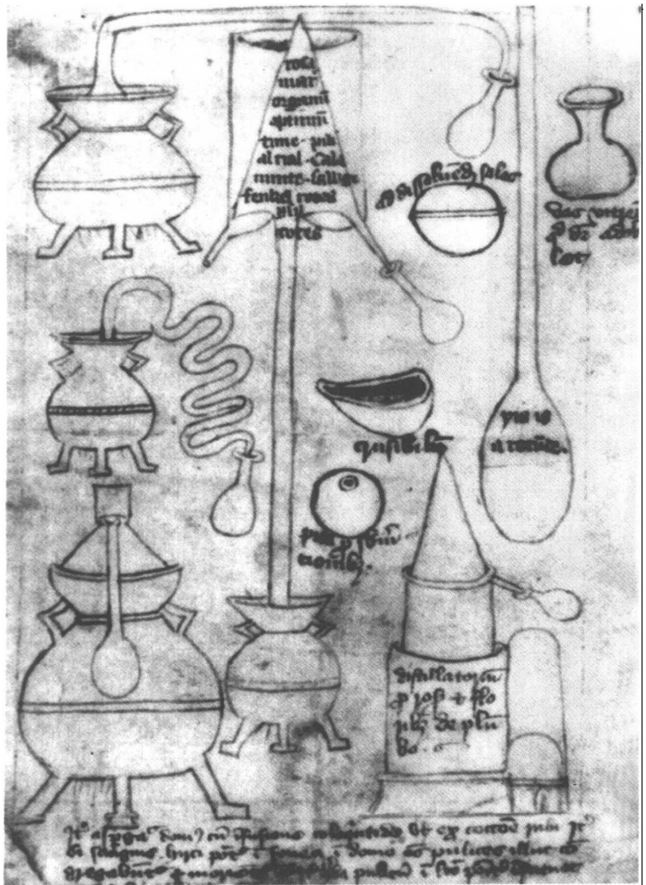

图 12.1 炼金装置，其中包括熔炉和蒸馏器皿。大英图书馆，MS Sloane 3548, fol. 25r（15世纪），承蒙大英图书馆惠准。

---

多化学过程，包括溶解、锻烧、熔化、蒸馏、腐化、发酵和升华，他们还制作了所需的仪器，包括用于加热和熔化的各式坩埚，用于蒸馏的净化瓶，各式长颈瓶、接受器以及用于熔化、融合、研磨、收集炼金物料的容器。 $ ^{13} $

炼金术的源头似乎可以追溯到古希腊，它可能发源于古希腊时期的埃及。古希腊的著作被不断翻译成阿拉伯语，形成并丰富了多种伊斯兰的炼金传统。在主要的阿拉伯炼金著作中，吉伯(Gber，即贾比尔·伊本·哈扬(Jabir ibn Hayyan)，活跃于9-10世纪)的全集和穆罕默德·伊本·扎卡里亚·拉齐(Muhammad ibn Zakariyya al-Razi，约卒于925年)所著的《秘术揭密》(Book of the Secret of Secrets)尤为重要。在12世纪下半叶刚刚开始时，这些炼金著作的大部分被译成了拉丁文，形成经久不衰的拉丁炼金传统。有些人坚信炼金理论是正确的，同时也坚信炼金的目的完全有可能达到。这种信念得以传播，但远未达到众人皆相信的程度。自阿维森那以来，一套力量强大的、严格的炼金传统发展了起来，争论炼金术可能与否的著作与炼金理论和炼金实践方面的著作一样多。在长期的炼金过程中，炼金术融合了许多其他技术（如冶金术和染色术）和思想体系，它借鉴了神学的、巫术的、隐喻的说法，逐步变成了一种无所不包的神秘哲学。例如，到中世纪末期，炼金术士常常把炼金过程中金属的变化与炼金者的精神变化扯到一起，其中有些人还认为点金石不但能把贱金属变成金子，还能带来不朽。 $ ^{14} $

## 变化与运动

历史学家不断地把亚里士多德宇宙的静态特征与原子论哲学的动态特征相比较。他们各自的主张并不难理解。在亚里士多德的月下区里，当运动物体到达了它的自然位置时，自然运动就停止了。当外力不复作用于物体时，物体的非自然运动就会立即停止。如果我们把所有的物体都归于它们的自然位置并撤去一切外力，则亚里士多德的世界就是一个没有运动的静止状态。另一方面，原子论者所

---

描绘的世界处于一刻不停的运动之中，原子在不断地运动、碰撞，在永无止境的运动中形成暂时的聚集体。

然而，亚里士多德的宇宙之所以给我们一个静态的印象，是因为它将我们的注意力限制在一种变化上，即位置变化或“位移运动”(local motion)。如果深入下去，把眼光从物体的位置移向物体的本性，则亚里士多德宇宙真正的动态特性就彰显出来。在亚里士多德看来，自然的事物总是处于流变的状态之中，从潜能向现实的转变是事物的本性之一，这在生物界中最明显不过了。在生物界里，生长和发育是不可回避的，但是，亚里士多德的生物学研究有力地塑造了他的全部自然哲学。亚里士多德认为本性是一切自然物体变化的内在根源。我们有理由说这一定义有着生物学的缘起，但这一定义也适用于有生命世界和无生命世界。亚里士多德自然哲学的主要研究对象就是各种形式和表象所体现的变化。亚里士多德在他的《物理学》(第3卷)中说得很明白，如果我们对变化无知，我们则对自然无知。 $ ^{15} $亚里士多德宇宙里的可见物体看去是静止的，而不是运动的，但在物体外表下的深层处，变化在剧烈地进行。

亚里士多德和他的中世纪继承者区分了四种变化: (1) 生与朽; (2) 质变; (3) 增大和减小; (4) 位移运动。当某一事物 (即实体) 出现或消逝时, 就会出现生与朽的变化。质变是指属性的变化, 如物体由冷变暖。增大或减小指数量的变化, 如大小的变化, 提纯或浓缩。位移运动指位置的变化, 这种变化被 17 世纪的科学家提高到物理学中不曾有过的核心地位。

因此，当我们回顾亚里士多德的运动理论时，我们只是在讨论他的变化理论中的一个方面。亚里士多德及其评注者所关心的是一般意义上的变化，位移运动是其中之一，而且决不是最基本的。牢记这一事实，就会避免很多思想上的混乱。站在现代力学的立场上，我们看到的亚里士多德和中世纪的运动理论似乎很奇怪，带有个人风格，但如果根据亚里士多德和中世纪学者意欲回答的问题来看，就会看到一种全然不同的情形。

这带来了一个不可回避的重要且难解的认识论问题。研究中世

---

纪运动理论的惯常做法，是把现代动力学的概念体系搬来，用现代理论制成一副眼镜，通过它来观察中世纪的情形。这一做法的显著优点在于，我们能以熟悉的理论作为研究的基础，其缺点是只关注那些与现代理论的片断相似的中世纪科学的发展。另一种做法是努力把握中世纪的观点，这一做法的显著优点是能够正确认识我们试图理解、但在实践中几乎无法照搬的中世纪思想体系。中世纪运动理论的思想体系是一片概念的密林，只有我们这个时代里那些坚韧不拔的行家里手，以百折不回的勇气前行时才能穿越。这时，面临两个选择，一是站在17世纪或20世纪科学的位置上，与中世纪科学保持适当的距离，远远地注视那片密林；一是根本就不去注视这片森林。绝大多数的中世纪科学史家都令人可以理解地选择了前一做法。我个人的观点是必须在二者中达到妥协，形成一个中间路线。在下面的内容里，我将引导读者走上一条较安全的路线，使他们不致陷入密林难以自拔，又能较清晰地看到地面上密林的原貌。为了帮助读者掌握中世纪理论框架自身的发展，我们还要考察一些后来产生重要影响的中世纪理论的进展，努力描绘出它们的发展历程。

## 运动的本性

当一位古代或中世纪的自然哲学家着手研究某一领域时，他首先想知道的是，都有哪些（与他的研究有关的）事物存在于这一领域。这是一个关于宇宙中普遍存在的实体的问题。一旦解决了这一问题，就可以研究其他的问题了，如存在着的事物的本性是什么？它们都有哪些存在的方式？它们怎样变化？怎样相互作用？我们是怎样知道它们的？如果研究对象是运动，首先要搞清楚运动是否存在，如果存在，运动属于哪一类事物？

亚里士多德对这一问题的讨论模棱两可，给后世的评注家留下了很多可供反复琢磨的地方。在阿拉伯世界，阿维森那和阿维洛伊这两位伟大的亚里士多德评注者都卷入了对该问题的热烈讨论。在西方，这一问题由大阿尔伯特重新提出。这里我们无法深入谈论这

---

场技术性极强的论战的细微之处，但我们还是可以通过13世纪末出现的两种主要观点和用于评判这两种观点的一些说法，来勾画出对这一问题的讨论。其中一个观点名为流形说（forma fluens），它认为，运动是一种不能与运动物体分离或相区别的东西，运动就是运动物体及其连续变动的空间。当阿基里斯（Achilles）在比赛中奔跑时，存在着的只有阿基里斯和规定了空间被连续占据的东西，除此之外，没有其他东西存在。“运动”一词所指涉的不是一个存在的东西，而仅是阿基里斯不断占据新的空间这一过程。阿维洛伊和大阿尔伯特发展了这一观点。另一观点称为流性说(fluxus formae)，认为除了存在着运动物体及其连续占据的空间，运动物体之中还存在某些固有的东西，我们称这个东西为“运动”。 $ ^{16} $

考察这两种学说各自的著名论据，我们可能就会看到这场论争的由来。奥卡姆的威廉(约1285-1347年)利用严格的逻辑捍卫流形说，他认为“运动”是抽象的、虚构出来的术语，是在现实中找不到确切存在的对应物的名词。奥卡姆并不是否定事物的运动，他仅仅认为运动并不是一个具体的东西。奥卡姆又说，为了明了这一点，可以思考一下这句话：“任何运动都由推动者产生。”普通读者可能以为“运动”这一名词表达的是一个真实存在的东西（一个实体或一种属性），因为名词往往起这一作用。但是，我们可以改变一下上面这句话的表达方法，而使前后的两句话有着相同的运动的涵义，但却暗含着运动的不同本性：“任何运动的物体都因推动者使之运动。”这里，“运动”的名词形式消失了，伴随消失的，还有运动是某种具体的东西这种涵义。但是我们怎么选择这两句话以及它们各自描述的世界呢？根据经济原则，尽管两句话传达出了相同的关于运动的内容，在运动不是一个真实存在物的世界里，世界更简洁一些，因为这个世界所包含的东西较少。因此，我们应该认为这个世界是真实的世界，除非另一观点有足以令人信服的理由。 $ ^{17} $

约翰·布里丹（约1295-1358年）基于一套完全不同的考虑而坚持流性说。在他对亚里士多德《物理学》所作的评注里，布里丹根据神学教义回答了诸位读者现在已很熟悉的问题——位移运动是否有

---

别于运动物体和物体连续占据的位置。布里丹讨论该问题的神学起点，是假设上帝利用他的全能使整个宇宙在进行旋转运动。布里丹确信这点，是出于上帝能够在绝不会自相矛盾的情况下做任何事情的原则，而且，1277年大谴责中的一段文字（按照布里丹的理解）明确地肯定了上帝能够推动整个宇宙沿直线运动。但是如果我们接受了流形说，认为运动只不过是运动的物体及其连续占据的位置，则立即产生了一个严重的问题。亚里士多德根据周围的物体定义了位置。由于宇宙并没有被任何东西所包围（任何容器都可视为宇宙的一部分），也就没有位置。如果宇宙没有位置，那当然没有宇宙由于位移运动而改变了位置的情况。而如果宇宙不能变换位置，就不能说宇宙运动了。但是这就与我们假设的起点不符，我们假设的是上帝使整个宇宙处于旋转运动之中，且这个假设是不可能出错的。由此，布里丹认为解决之道是采取一种较广义的“流性”运动的概念。如果运动不是简单的运动物体和运动物体连续占据的位置，而是运动物体某种类似于性质的属性，这样宇宙就能够在无位置的情况下因具有运动这一属性而运动。上述的矛盾之处至少也能部分地克服。这一理论暗含的是，运动是一种属性，或一种能够被当作属性来处理的某种东西。这一看法在14世纪后半叶自然哲学家中相当流行。 $ ^{18} $

## 运动的数学表达

我们今天把数学用于运动问题是顺理成章的事情，运动理论的前身是理论力学，理论力学通过定义的方式把数学引入了运动之中。对于任何人来讲，要掌握现代物理学就必须先掌握数学。但这种结论只是一种事后聪明，是现代人以现代观点得出的结论，对于亚里士多德以及延续亚里士多德传统的学者而言，把数学引入运动是不合理的。我们仍须牢记，亚里士多德及其中世纪继承者认为位移运动只是四种变化中的一种，他们认为，对运动的分析应与对一般意义上的变化分析是一样（或基本一样）的。我们知道，对于绝大多数变化的情形而言，并没有什么固有的数学规律可言。当我们看到

---

健康战胜了疾病，美德战胜了邪恶，由冷变暖，从这些变化中跳不出数的大小或几何图形。实体的生与朽和性质的转变也不是明显的数学过程，只有经过了数个世纪英雄探险般的不懈努力，一些学者才找到了把数学引入少数几种变化之中的方法，这几种变化中包含有位移运动。这里，我们要考察的是这一过程的早期阶段，它发生在中世纪后期。

当然，自然的数学化在古代就有人提出，提出者包括毕达哥拉斯派、柏拉图和阿基米德。早期取得的成就可见于天文学、光学和平衡研究（见第五章）。不可避免的是，这些领域的成功鼓励了对数学方法有兴趣的其他学科的发展。我们能在亚里士多德的《物理学》中找到对运动进行数学分析的最基本的开端，在这本书里，可以定量表示的空间和时间，都可以作为运动的尺度。亚里士多德说，两个运动物体中运动得较快的一个，在相同时间里走过的距离较大，或者走过相同的距离所需的时间较短。而运动快慢一致的两个物体在相同的时间里走过的距离相等。奥托里克斯(Autolycus of Pitane，活跃于公元前300年)是亚里士多德下一代的数学家，他的做法前进了一步，他把在相同时间里走过相同距离的运动定义为匀速运动。应该注意，在这些对时间和距离的古代讨论里，时间和距离被作为衡量运动的重要尺度，有可能赋予具体数值，但“快慢”(quickness)或速度(speed)从来没有取得这一地位，所以它仍然是模糊的、不可量化的概念。 $ ^{19} $

在中世纪西方国家里，数学化分析开始产生的影响可见于布鲁塞尔的杰拉尔德(Gerard of Brussels)的著作。杰拉尔德是一位数学家，可能在13世纪上半叶任教于巴黎大学。杰拉尔德的《论运动》(Book on Motion)很简明，该书最可贵之处，在于把内容严格限制在我们今天所说的“运动学”(kinematics)问题之内。为了理解这一点，我们先简单地区分一下运动学和动力学，此二者的区别可以作为下面讨论中世纪运动理论时组织材料的一个原则。如果我们研究物体的运动，则有两种基本途径。我们可以集中讨论运动的原因，描述运动的产生者或推动力，或许将它们与运动的数量或速度连系起来。另

---

一途径是根本不考虑引起运动的原因，只描述运动本身。前者集中于原因研究，称为“动力学”，后者限制在对运动的描述（一般是数学描述）方面，称为“运动学”。由此杰拉尔德的重要性即在于他是拉丁西方运动学研究传统的开创者。 $ ^{20} $

在 14 世纪，运动学研究传统在一批逻辑学家和数学家那里产生出了非凡的成果，这些学者都与 1325 至 1350 年期间的牛津大学默顿学院有很深的关系。这些学者中包括托马斯·布拉德沃丁（卒于 1349 年），他后来成为坎特伯雷教区的大主教；威廉·海特伯里（William Heytesbury，活跃于 1335 年）；邓布尔顿的约翰（John of Dumbleton，约卒于 1349 年）和理查德·斯怀因谢德（Richard Swineshead，活跃于 1340-1355 年）。首先，默顿学派的学者们严格区分了在杰拉尔德的《论运动》一书中仅以隐含的方式存在的运动学与动力学的区别，注意到运动既可以从运动的原因来分析，也可以从运动的作用来分析。默顿学派的学者努力发展出了一套概念体系和专业术语来研究运动学意义上的运动，其中包括速度和瞬时速度，它们都被视为可以量化的科学概念。 $ ^{21} $ 默顿学者区别了匀速运动（速率保持不变的运动）和非匀速运动（或加速运动），他们还为匀加速运动下了一个准确定义，这一定义与我们对匀加速运动下的定义一样：如果某运动物体的速度在相等的时间单位里增量相等，则称该运动为匀加速运动。最后，默顿学者提出了许多运动学理论，下面我们要考察其中几个。 $ ^{22} $

在我们考察这些理论之前，必须考虑运动学成就的哲学基础。古代用距离和时间来衡量运动，速率作为一种衡量运动的新尺度，它的出现需要解释一下。毕竟，速率是一个非常抽象的概念。它不会主动引起运动的观测者的注意，而只能由自然哲学家创造出来并将之加于运动现象。速率概念是怎么产生的呢？在对性质及其力度与强度的哲学分析中找到了这一问题的答案。

基本的观点是这样的，属性或形式可以不同的程度或不同的强度存在。暖或冷不以单一的程度存在，从极冷到极热之间存在着一系列的强度或程度差异，在极冷到极热的范围内，形式或属性可以有差异。这即是说，形式或属性可以加强或减弱。用中世纪的专门

---

术语来讲就是，它们可以被强化或弱化。 $ ^{23} $ 当对属性强化或弱化的一般讨论转向位移运动这一具体情况时（运动被当作一种属性或与属性相类似的东西），马上就产生了速率概念。运动属性的强度，即衡量运动的力度或程度，只能是快慢或（用中世纪的术语表达为）速率。这样，运动属性的强化或弱化就必然指涉速率的变化。

在考虑属性、属性的强度和属性的加强时，就会引起另一个问题，即属性的强度与这一强度的延伸或量值有何区别。下例可以帮助我们理解它们的区别。以热为例，很明显，一物体可能比另一物体热得多。这时我们已有了强度或度的观念（多少与我们所说的温度概念有些相似） $ ^{24} $，但显然还不止这些。也就是说，还有某物体（一个热的物体）的热这一属性的分布。设想我们把相同度的热或相同强度的热加于两物体，这两个物体一个是另一个体积的两倍，其余完全相同。较大的物体必定含有两倍于较小物体的热。热的“强度”(intensity)并不因上述两物体的体积不同而不同，只是较大物体所含热的“量”(quantity)是较小物体所含热的量的两倍。把热的属性换成重量的属性考虑一下，就产生了重量的度或强度（即我们所说的密度或比重）与同一物体的重量分布（重量的总和）之间可对比的差别。人们假定所有其他的属性（包括运动）都可以和上例一样来看待，这样就需要区分一般意义上的属性的强度和属性的量。 $ ^{25} $

默顿学派对属性分析产生出的新颖成就，很快传到欧洲的学术中心，在此过程中，通过几何表达体系丰富并澄清了这一属性分析的成果。默顿学派原来对属性的分析只形诸文字，基本上和我们上面讲述的一样。但几何分析的优点很快引起了关注，终于，相当精细的几何表达体系产生了。乔瓦尼(Giovanni di Casali)是第一批发展这种几何表达的学者之一，他是波伦亚的一名方济各会修士，曾经在剑桥大学呆过一段时日，他的著作大约写于1351年。在同一时期稍后一段时间里，尼古拉·奥里斯梅在巴黎大学形成远比前者详尽的几何分析体系，对奥里斯梅的几何表达体系做一了解必然令我们深受启发，一如其曾影响了中世纪读者一样。

第一步就是要用线段来表示性质的强度，这一步对熟谙亚里士

---

多德（他曾用直线表示时间）和欧几里得（他曾用直线表示数的大小）的中世纪学者来说并不困难。如线段 AB（图 12.2）代表某性质的强度，则线段 AC 代表两倍于前一强度的强度。这么做很不错，但还不能使我们有很大进展。关键在于下一步，要让这样的直线能够表示出物质属性的任意强度，取一支杆 AE（图 12.3），非均匀地加热，使一端比另一端热。在杆的 A 点以及任意点画垂直的线段，这些线段代表那一点的热的强度。如果杆的温度自 A 至 E 均匀升高，在图形上表示就能看出，从 A 到 E 代表强度的垂线在均匀的延长。奥里斯梅做了一个抽象的步骤，用一条水平直线取代了对杆 AE 的描画，这一做法使该系统抽象程度大大提高。这对于创造一个能够表示一般物体的普适体系（图 12.4）很有影响，在这样的图中，水平线（又叫“物线”或“延展线”）代表物体。不管它是什么物体，垂直线代表

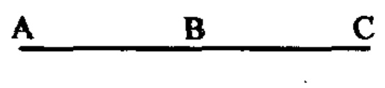

图 12.2 用线段方法来表示属性的强度。

图 12.3 一支杆上的温度分布情况。

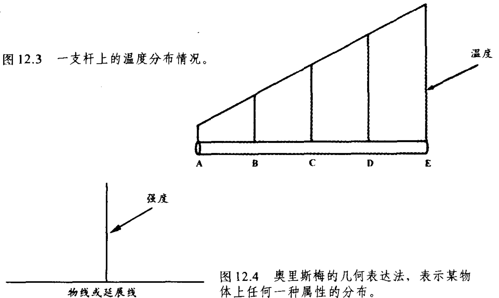

图 12.4 奥里斯梅的几何表达法，表示某物体上任何一种属性的分布。

---

图 12.5 固定住支杆的一端，使杆运动，杆上各点的速率分布情况。

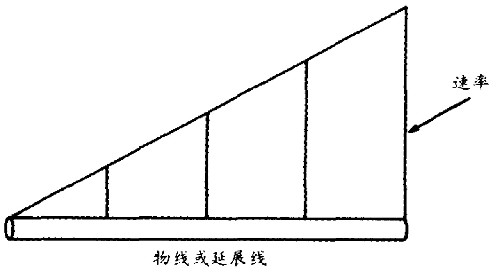

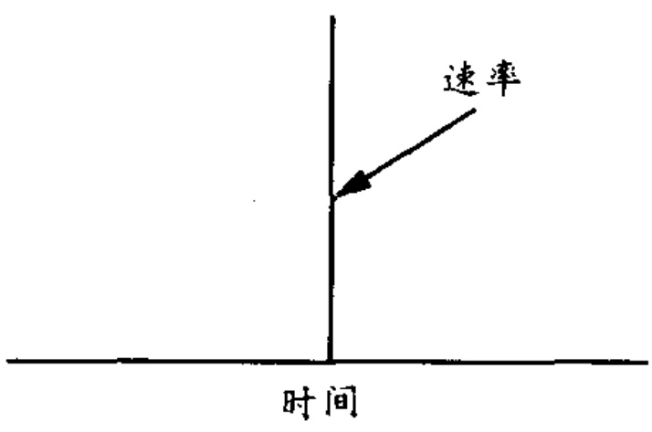

图 12.6 速率作为时间的函数。

的是，在物体的的任一点我们所选取性质的强度。

奥里斯梅创造出来的是几何表达形式，它是现代几何图形表达的前身。在几何表达中，图形的形状（如图 12.3）告诉了我们物体属性的强度变化。但我们如何把对一般属性的几何表示转移到具体的运动中呢？办法之一是考虑一个物体，该物体不同的部分运动速度不同。固定住杆的一端，使杆做圆弧运动就是一例。这样，可以水平地画一支杆，在杆的任意点上垂直地画出线段，用以表示这一点的运动速率。结果将得到杆在各点的速率分布，即如图 12.5 所示。

还有一种情形，因为需要更加抽象化的处理而较为困难。设想某物体的整体都参与运动，且在运动时各个部分的速度相同，但使物体的速度随时间变化。奥里斯梅解释到，理解这一运动的方法是，不要把物线看作是如上例所示的实在物体的延展，而是位移运动的间隔。这里，时间变成了物体，于是就产生了一个原始的坐标系，在这个坐标系里，速率可以作为时间的函数（图12.6）。基于此，奥里

---

斯梅开始讨论在时间变化时速率的变化方式。匀速运动可以用各垂直线段等高的图形表达，即用矩形图表示。非匀速运动则各垂直线段长短不一。在对非匀速运动分类时，可以得到均匀的非匀速运动（即匀加速运动），它可用三角形表示，还可以得到不均匀的非匀速运动，它可以由许多其他的图形来表示（见图 12.7）。最后，奥里斯梅如何处理上面提到的属性的其他特征，即所有运动的总量呢？他把运动的总量等同于物体走过的距离。他说，在速度 - 时间图中，运动的总量必须由图形的面积表示。

由此，奥里斯梅发展出了一套非常精当的几何学体系来表示运动。他和他的继承者是固步自封，还是在此基础上更求进益呢？事

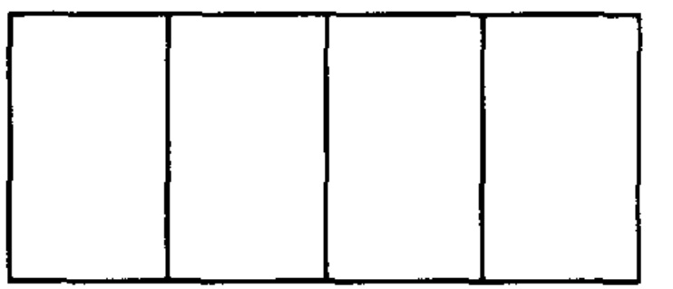

(a)

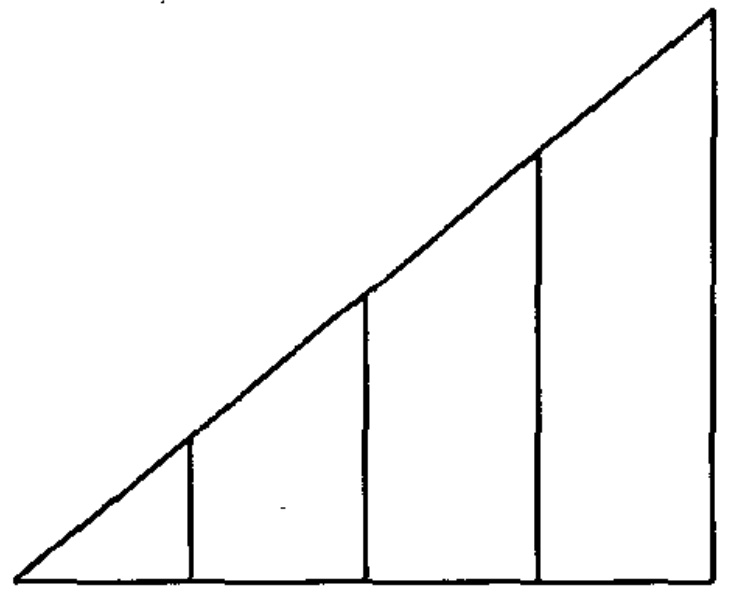

(b)

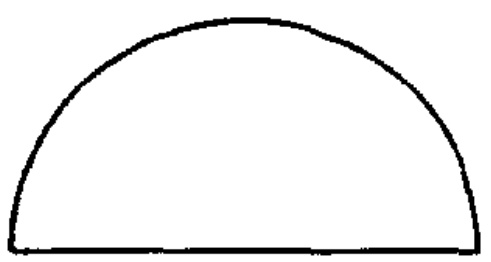

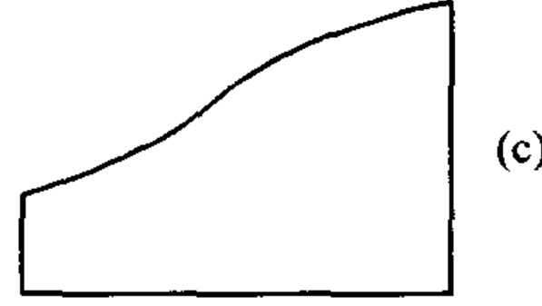

(c)

图 $ 12.7^{\circ} $ 各种运动的表示。

(a) 匀速运动，

(b) 均匀的非匀速运动（即匀加速运动），

(c) 不均匀的非匀速运动。

---

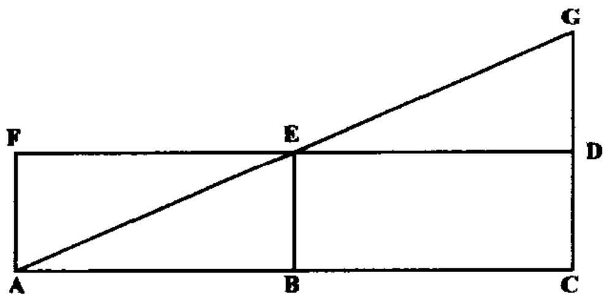

图 12.8 奥里斯梅对默顿规则的几何证明。

实上，他们成功地发展了运动学定理，利用它揭示了匀速运动或匀加速运动的一些显著的数学特性。最重要的是对匀加速运动的数学分析，由图12.7（b）表示。这一例子在14世纪引起人们很大的兴趣，不是因为它被认为是真实世界里的特殊运动，而是因为它提出了一个实实在在的数学的挑战。这里，我们回顾两个可用于在匀加速运动中的重要定理。

第一个定理已被默顿学者阐释过，但没有提供几何证明和图示。现在被称为“默顿规则”（Merton rule）或“均速定律”（mean-speed theorem），这一定律试图通过与匀速运动的比较来度量匀加速运动。定律的内容是：做匀加速运动的物体在一定的时间里所走过的距离，与以匀加速运动的平均速度作匀速运动的物体在相同时间里走过的距离相等。以数学的语言来讲就是，一个做匀加速运动的物体在从速率10增加到速率30的过程中所走的距离，与以速率20做匀速运动的物体在相同时间里经过的距离相等。现在，奥里斯梅为这一定理提供了一个简洁明了的证明。匀加速运动可由三角形ACG表示（图12.8），它的平均速度由线段BE表示。则可与此匀加速运动相比拟的匀速运动必然由矩形ACDF表示（矩形的宽BE是匀加速运动的平均速度）。默顿规则简单地说一种运动走过的距离与另一种运动走过的距离相等。在奥里斯梅的图形中，由于物体走过的距离由图的面积表示，只需表明三角形ACG与矩形ACDF的面积相等就能证明该定理。所言不虚，一望可知。 $ ^{26} $

与第一个定理一样，第二个定理也是利用对距离进行比较揭示

---

匀加速运动的数学特征。这里所说的是，匀加速运动前半段时间里走过的距离与后半段时间里走过的距离相比是1:3的关系。用几何定理证明这一结论时，只需考察四边形BCGE（图12.8）的面积，它代表后一半时间所走过的路程，三角形ABE代表前半段时间里走过的路程，可见两者之比是3:1。和前一定理的证明一样，简单地比较一下就能知道情形确实如此。 $ ^{27} $

最后，需要提到两个一般性观点。第一，我们必须时刻提醒自己，中世纪的运动学完全是抽象的推演——很像现代数学。例如，它的陈述方式是，如果存在一个匀加速运动，那么默顿规则就可以运用到该运动中去。还没有一个中世纪学者在现实世界中找到一例他们所描述的这种运动。对这种古怪的现象可以给出令人满意的解释吗？可以。在中世纪特定的技术水平之下（尤其是测量时间的技术很落后），证明某一具体运动是匀加速运动确是一项艰巨的事业。即使在20世纪，也可以想象，在没有实验室测量装置的条件下，要产生或确认一个匀加速运动有多么困难。但更重要的是，中世纪发展了运动学的学者是数学家和逻辑学家。他们和现代的数学家与逻辑学家一样，不会把自己的研究场所从书斋搬到工场去。

第二，从这种纯粹的理智活动里产生出一套运动学的新概念体系，而且为伽利略在17世纪形成运动学提供了许多定律（如默顿规则）。通过伽利略的工作，这些定律被汇入了近代力学的主流之中。 $ ^{28} $

## 位移运动和动力学

上面已对利用数学来描述运动的中世纪运动学作了回顾。最后我希望简略考察一下中世纪动力学对运动的因果分析所作的贡献。中世纪动力学的思考起点是亚里士多德的一条基本原理：物体的运动总是由一推动者引起的。首先我们必须弄清楚这一原理在中世纪意味着什么。然后在几个特别困难的运动实例中，看看人们如何试图找出推动者。最后，我们将考察一下定量表示推动者的力或能与由此产生的受推动物体的速率之间关系的努力。

---

读者们应该还记得，亚里士多德把运动分为两大类：自然运动和受迫运动。自然运动是物体向自身的自然位置的运动。这显然由物体的内在原理、即它的本性所决定。而任何指向非自然位置方向的运动都是受迫运动，它由一个与物体持续不断地接触的外力推动而产生。粗略看去，这再明显不过了，但当中世纪学者试图找到自然运动的确切推动者时，当他们面对受迫运动中一个疑难例子时，问题就来了。

亚里士多德在《物理学》中，描述自然运动的推动者时颇费踌躇，他在开始时提出了自然运动可能有其内在原因，这里说的内在原因即物体的本性。后来又说物体的本性不会是自然运动的全部原因，自然运动仍然需要外在推动者的参与。亚里士多德模糊的言辞为其中世纪追随者提出了显而易见的问题，这些人认为，必须搞清楚物体的本性是不是物体运动的充分条件。阿维森那和阿维洛伊认为，由于没有明确区分什么是被推动的东西（物体），什么是推动物体的东西（物体的本性），所以物体由其本性推动这一论断不可接受。他们发现了形式－质料的区分似乎能够成为满意的解释，提出了形式是物体的推动者，质料是被推动的东西。在西方，托马斯·阿奎那拒绝这一解释，提醒人们注意形式与质料不可以分开，且不能作为不同的东西来看待。阿奎那认为（这一看法重提亚里士多德的一个主张）自然运动的推动者就是最先使物体离开它的自然位置的那个东西。此后，物体在自然运动中就不需要其他的推动者，只须顺应自然即可。对这一问题的争论贯穿整个中世纪的后期，没有哪一种观点占据明显的优势。 $ ^{29} $

受迫运动中给人们带来疑问的特例是抛射物的运动，问题在于如何解释抛体与抛物者失去接触后，为什么还能持续运动下去？亚里士多德认为是介质的作用，认为抛物者把力施于抛体的同时也把能量传给了抛体周围的介质，这一能量从一个局部传向另一个局部，抛体总是被一部分能够使它运动的介质包围着。从上述的解释来看，物体的运动需要一个外在的力持续不断地与抛体相接触。

第一个对亚里士多德的观点作出有力反驳的是6世纪亚历山大城

---

的哲学家约翰·菲洛普纳斯（卒于575年之后），他在对亚里士多德《物理学》的评注中认为，介质与其说是运动的推动者，不如说是运动的阻碍者，不但如此，他也怀疑介质既可提供动力同时又可提供阻力的说法。作为新柏拉图主义者和坚定的反亚里士多德主义者，菲洛普纳斯深入批评了亚里士多德的自然哲学，包括“受迫运动需要外在的推动者”这样的观念。相反，他提出无论是自然运动还是受迫运动，都是内在推动者起作用的结果。因此，当一个物体被抛射出时，抛物者给抛体施加了一个“无形的推动力”，是这个内在的力使得抛体继续运动下去。 $ ^{30} $

尽管菲洛普纳斯提出的施加动力有着激烈反对亚里士多德的背景，但这一学说最终被中世纪亚里士多德传统所吸收。菲洛普纳斯对亚里士多德《物理学》的评注在阿拉伯文的译本里影响很大，对中世纪罗马天主教的思想似乎也有间接的影响，尽管传承的细节仍有待充分加以探讨。 $ ^{31} $ 在13世纪，那些与菲洛普纳斯观点相类似的理论由罗吉尔·培根和托马斯·阿奎那作了讨论和批驳。在14世纪，首先是方济各会的神学家弗朗西斯库斯(Franciscus de Marchia，活跃于1320年)，随后是约翰·布里丹和其他人出面捍卫菲洛普纳斯的施予的力理论。下面我们考虑一下布里丹理论的大致情形，这一理论往往被认为是这一理论的最高级的形式。

布里丹使用了一个新的术语“冲力”（impetus）来表示施予的力，这一术语直到伽利略时代仍是标准的术语。布里丹将冲力描述为一种性质，它的本性就是使受到它作用的物体运动。布里丹还尽力区分了“冲力”这种性质和由它产生的运动：“冲力是一种永久性的东西，与改变抛物位置的位移运动不同。……冲力可能是一种自然呈现的性质，它具有一种使受到它作用的物体产生运动的倾向。”为了维护冲力理论，布里丹指出了冲力与磁石的相似之处，磁石能够赋予铁块向磁石运动的性质，和其他的性质一样，冲力在受到反对力量或阻力时就衰解了，但如果没有遇到这类阻力，冲力将保持它原有的力量。布里丹宣称，冲力的力量可以由速率和物体包含质料的多少来衡量，由此，他迈开了使冲力定量化的第一步。最后，布里

---

丹拓宽了冲力理论的解释范围，使它不局限于单纯的抛射体运动，而认为上帝在创世的瞬间把冲力施予天球使之运动，于是，天上的运动也能够用冲力得到合理的解释，由于天不会产生任何阻力，冲力不会减弱，于是天球就将以永远不变的运动方式（就像观测者观测到的那样）运动下去。布里丹说，落体的加速运动可以通过一个假设得以解释，即在下落过程中，物体的重量不断在物体内产生额外的冲力，冲力增加，则速度增加。 $ ^{32} $

在 17 世纪之前，冲力理论始终是解释抛射体运动的主流理论。此后，一种关于运动的新理论（该理论否认无阻力的连续运动需要内在的力或外在的力）逐步取代了冲力理论。在科学史上，很多人尝试着把冲力理论作为指向近代动力学的重要步骤，例如，这种看法常常关注布里丹的冲力概念（速度 × 质料的量）与近代的动量概念（速度 × 质量）之间的类似性。无疑，这两个概念有联系，但我们必须注意布里丹的冲力是抛射体连续运动的原因，而近代的动量是对运动的度量，这里的运动只要没有阻力就能永远持续下去，不需要原因。简言之，布里丹仍然在以亚里士多德的概念框架为基础思考问题，这意味着他的世界（或世界观）与 17 世纪的自然哲学家大不相同，后者把他们创立的新力学奠基于一套新的关于运动和惯性的概念体系。

## 动力学的量化

还有一个问题，有没有可能把动力、阻力和速度之间的动力学关系加以量化？很多中世纪学者认为能够。问题还要回到亚里士多德那里，他开创了简单而基本的量化分析。他维护这样一些命题，例如，（一个落体）重量越大，则运动越快；（落体所遇到的）阻力越大，则运动越慢；运动物体越小，则同样的力作用于该物体产生的运动越快。经过不懈的努力，历史学家从上述的陈述里总结出了数学关系，认为亚里士多德的观点是，速度与力成正比，与阻力成反比。用现代的术语来表示就是：

---

$$
\mathrm{~V~}^{\infty}\mathrm{~F~}/\mathrm{~R~}
$$ 

这一简约的方式对传达出亚里士多德动力学的核心部分无疑很有用，它解释了这一关系式为什么总是被后人提起。但同样也有可能误导读者，必须引起我们足够的小心。亚里士多德当然不会同意数学公式所揭示的，F 和 R 取任何值，速度与力都成正比，与阻力都成反比。而且，亚里士多德并没有明确的速率概念，没有把速率概念作为一个技术性的、可量化的、哲学的或科学的术语。

亚里士多德的动力学思想明显暗含了运动可能发生在真空中。如果落体运动的快慢是落体遇到的阻力的作用，那么在真空中，由于不存在阻力，则没有任何东西会阻止物体的运动。在这种情况下，物体将以无限速度（infinitely swift）运动。亚里士多德认为， $ ^{33} $无限速度显然是荒唐的，很明显，真空其实并不存在。利用亚里士多德的运动理论（即认为  $ V \propto F / R $）证明虚空不存在，引起了亚历山大城的新柏拉图主义者约翰·菲洛普纳斯的全面反驳。菲洛普纳斯通过日常观察拒绝接受亚里士多德学派的基本观点：落体通过介质下落的时间与它的重量成反比。

“(亚里士多德的)这种观点完全错误，我们的观点由于出自真实的观测而比口头的论辩有效得多。如果我们让两个重量不同的物体从同一高度下落，其中一个的重量是另一个的好几倍，你将会看到物体运动所需的时间之比与物体的重量之比没有单一的依存关系，两个运动所需的时间差别很小。因此，如果重量的差别不显著，例如一个是另一个的两倍，则下落所需的时间将不会有差别，或只有我们根本察觉不到的差别。……” $ ^{34} $

如果亚里士多德的理论是错的，那么什么是对的呢？菲洛普纳斯告诉他的读者按照以下的方式设想下落的物体：物体下落的有效

---

原因是它的重量，在真空不存在阻力，惟一决定物体运动的是物体的重量。因此，较重的物体在同一段距离里的运动将快于较轻的物体（即用较少的时间走过同样的距离）。当然，无论物体是轻是重，都不会像人们认为亚里士多德设想出的那样，以无限速度运动。（菲洛普纳斯并没有说，在真空中运动的快慢将与物体的重量直接成正比，但他可能已作为一个隐含的条件事先预设了）。现在可以看出，在介质里，介质的阻力使运动减慢了一些，这一减速的全部作用在于弥合较重物体和较轻物体在运动快慢上的差别。这就产生了上述引文所述的观测事实。

菲洛普纳斯的观点被阿拉伯的阿维帕西(伊本·巴贾，卒于1138年)发展并捍卫。而阿维帕西遭到阿维洛伊的反驳。通过阿维洛伊的反驳，这场争论又传到了西方。在西方，这一问题在14世纪重新被默顿学者布拉德沃丁提出，但布拉德沃丁有所不同。虽然他的所有的先辈都主要关心运动的本性和运动的起因，布拉德沃丁决心用数学的方法来看待上述问题。这表明他不得不在开始的时候就为争论各方的观点建立各自的数学公式，他找到了三个关系。布拉德沃丁用日常语言而不是用数学符号表达各方的观点，但下面的公式足以把握他的原意。

第一种理论（无疑是代表菲洛普纳斯和阿维帕西的观点）：

$$
\mathrm{~V~}\propto\mathrm{~F~}-\mathrm{~R~}
$$ 

第二种理论（由阿维洛伊的一篇论文提出）：

$$
\mathrm{~V~}\propto\left(\mathrm{~F~-~R~}\right)/\mathrm{~R~}
$$ 

第三种理论（代表对亚里士多德观点的传统解释）：

布拉德沃丁提醒人们注意由这三种关系产生的荒唐或不可接受的结论，从而否定了上述三种理论。以第一种理论为例，它的错误在于，与亚里士多德所说的动力和阻力各增加一倍物体的运动速度不变相矛盾。第三种理论的错误在于没有预示当阻力等于或大于动

$$
\mathrm{~V~}\propto\mathrm{~F~}/\mathrm{~R~}
$$ 

---

力时，物体的运动将停止。

针对这些不可信的理论，布拉德沃丁提出了“动力学定律”。找不到一种简单方法来表达布拉德沃丁的“定律”，拘泥布拉德沃丁自己的描述，可能使我们深陷于中世纪的比例合成理论，难以自拔。表达布拉德沃丁头脑里的数学关系的最简单的现代方式恐怕是：根据他提出的“定律”，当F/R作几何增长时，速率作代数增长。也就是说，如果想得到两倍的速度，必须使现有的F/R为原有的F/R的平方。如果要得到三倍的速率，必须使现有F/R为原有F/R的立方，依此类推。看下面数字的例子：

原有的力（F1）为4，现有的力（F2）为16，物体受到的

阻力（R）为2，则F/R的比率为：

$$
\mathrm{~F~1~/~R~=~4~/~2~=~2~}
$$ 

$$
\mathrm{~F2~/~R~=~16~/~2~=~8~}
$$ 

那么速度之比是多少呢？由于 8 是 2 的立方，则由现有的力

16 产生的速率是原有的力 4 产生的速率的 3 倍。 $ ^{35} $

关于布拉德沃丁的成就，还有三点需要指出。首先，我们上面通过现代术语把布拉德沃丁原有的“定律”复杂化了。我们需要理解布拉德沃丁的研究工作是在中世纪的数学传统中开展的，他在表达比率的合成与增加时是通过加法的语言完成的。因此，我们所指的两比率的乘积在布拉德沃丁的术语里就是一个比率加上另一个比率。而我们所指的F/R比率的平方在布拉德沃丁的术语里就是F/R的两倍。因此，布拉德沃丁不是说F/R的比率做几何增长时关系到速率的代数增长（如我们上述表达的那样），他仅仅说，如果你想使速率加倍，你必须使F/R的比率加倍，简言之，布拉德沃丁提出的“定律”不是一些深奥的数学关系，而是（正如一位史学家最近指出的）“他能够找到的最不复杂的表达”。 $ ^{36} $

第二，布拉德沃丁提出的“动力学定律”的表达式影响很大。它的涵义被14世纪理查德·斯怀因谢德和奥里斯梅所做的杰出工作揭

---

示了出来，这一定律直到16世纪还在不断讨论。 $ ^{37} $ 第三，无论怎样来准确评价布拉德沃丁的成就，必须承认他所做的工作是数学领域内的工作。的确，他在反驳种种观点时借助了日常经验，但很明显，他的基本目的是满足数学和谐的标准。简言之，布拉德沃丁既不是通过实验方法揭示和维护他的“定律”，也看不出如果他采取实验方法，这将对他有什么益处。中世纪学者的任务是形成一套适合于分析运动问题的概念体系和数学框架。这只是全部事业的开端，而中世纪学者做得非常出色。下一步的任务是向自然提问，以探明上面形成的概念体系能否被接受，这得由将来的学者完成了。

## 光 学

我将在下面对光学（拉丁文为perspectiva，这是拉丁语基督教世界对这门学科的叫法）作一简略描述，以此结束对月下区物理学的讨论。把光学放在这一章来讨论有些武断，因为光学是一门涉猎极广泛的学科，以一种或多种方式把多门学科联系在一起，包括数学、物理学、宇宙学、神学、心理学、认识论、生物学和医学。 $ ^{38} $但放在这里来谈也并非没有道理。

亚里士多德、欧几里得和托勒密的著作支配了希腊人关于光与视觉的思想，这些著作全部被译介到阿拉伯国家，并形成了阿拉伯人光学研究的基本传统。他们严肃认真地看待、维护和拓展希腊人研究光学现象的方法。但阿拉伯光学的主要成就还在于成功地整合了原来分离的、不相容的希腊光学传统，使之形成了一个单一的综合理论。

大多数的希腊光学思想都由一套或另一套相对局限的标准引导，被局限在一个很专业的范围里加以研究。例如，亚里士多德只关心光的物理性质和被观察物体与观察者眼睛之间产生视觉接触的物理的机械过程。在亚里士多德有关光的理论中，数学分析以及解剖学和生理学问题没有占到一席之地。具体地说，他认为可视物体可以使透明介质产生一种变化，介质在瞬间把这种变化传递给观察者的

---

眼睛，二者接触就产生了视觉。这是一种“入射”理论，之所以这么命名是因为视觉感受产生的机制是从被观察物体指向眼睛的。古希腊的原子论者也对视觉进行了物理的描述，他们找到了一种不同的动因——是原子的一层极薄的“膜”或“像”，从物体的外层“剥离”，而不是透明介质的变化引起视觉。但他们也同意亚里士多德的观点，认为视觉产生的原因必然是“入射”理论。

相比之下，欧几里得关心的几乎都是严格的数学问题。他写作《光学》的目的就是要基于视锥，发展出一套有关空间视觉的几何理论，而对光与视力的非数学方面极少关注。根据他的视觉理论，眼睛发射出的射线，形成一个圆锥的视域，当圆锥范围内的射线被不透明物体拦截时，就产生了视觉。眼睛所见的大小、形状和物体的位置由被拦截光线的形状和位置决定。因为这一理论认为眼睛发出了视线从而能够产生视觉，我们称这种理论为“出射”理论。

最后，如卡尔西登的希罗弗勒和盖伦这样的生理学家关心的是眼睛的解剖学构造和视觉的生理机制。盖伦对数学问题和因果问题有很深刻的把握，但他对视觉理论的主要贡献在于对眼睛的解剖学分析，以及认为多种器官在视觉过程中共同协调形成了视觉通道。

正如我上面指出的，阿拉伯学者所作的贡献在于把原来毫不相同的古希腊理论的条条支流汇合在一起。尽管古代最后一位伟大的光学著作家托勒密曾指出过这一点，但汇合工作的主要设计者是杰出的数学家和自然哲学家海桑（西方人称海桑，阿拉伯人称伊本·海塞姆，约965-1040年）。如果我们把中世纪传统中对解剖学和生理学的关注放在一边，把讨论严格限制在视觉理论的数学和物理学方面，则我们对海桑的成就的分析就会简单一些。

首先，我必须指出一点，即古代有其数学目的的视觉理论（如欧几里得和托勒密的视觉理论）都假设了光从眼睛发出，而那些把关注点放在对视觉的物理合理性方面的理论（如果我们从亚里士多德和原子论者的著作中判断）则倾向于假设光入射到眼睛里的“入射”理论。 $ ^{39} $ 如果有人对这种关系有所怀疑的话，他只要精研亚里士多德的著作，就会看到亚里士多德本人在对光现象（在他解释虹现

---

象的理论里）进行数学分析时采用了“出射”理论，并且因此打消怀疑。 $ ^{40} $

海桑的成就是两方面的。首先，他提出一套令人信服的论据消解了“出射”理论。例如，他让人们注意亮度很高的物体有刺伤人眼的能力（注意，伤害的本性是从未遭受伤害到遭受伤害）。可是，当我们观察天空时，如果眼睛是射线的源，射线射出后充满了整个空间并上达到恒星，眼睛怎么可能受到伤害呢？否定“出射”理论之后，他继而提出并维护一套新的“入射”理论，这套理论借用了出射理论中的视锥概念。随着视锥，“出射”理论中的数学功能也被借用过来，由此，“出射”理论第一次和“入射”理论提供的令人满意的物理解释相结合。这一步看似简单，但不妨考虑以下几点障碍。 $ ^{41} $

第一，古代著作家并没有写出足以完成海桑目标的发光理论。在古代文献中，发光被作为一个整体过程一般性地提出，在这个过程里，可见物体作为一个连续的整体发光。发光并不（像近代光学理论所说的）是一个个的点独立地发光，而是一个物体作为整体发出整个图像，或者发出能量，从而穿过介质到达眼睛（就像原子论者说的薄膜理论或像理论） $ ^{42} $那时还没有找到一个途径，把视锥放入对这一发光过程的构想中。然而，关于发光的新的构想由哲学家金迪（约卒于866年）提出并被海桑接受（或独立发明）。金迪和海桑设想，发光是一个不连续的过程，在发光过程中，发光物体上单个的点或极小的部分发光，而不是连续的整体发光，每一个点的发光都是独立的，与其他点无关，并且可以射向任何方向。（图12.9）。

这是一项重要的革新，对于那些希望捍卫“入射”理论的人来讲，这一思想有新的问题。始于可视物体的不连续的发光过程能够解释视力正常的人们体验的连续的视觉过程吗？如果可视物体的每一个点都向各个方向发光，则眼睛上的每一个点都将接收到视域内每一个点发出的光（图 12.10），这将在视觉上引起混乱而不会产生清晰的视图。需要解释的是，视觉经验告诉我们，眼所见的物体与物体本身是一一对应的关系，眼的主要功能部分，即水样液（由盖伦及其继承者发现，它的功能等同于晶状体或透镜）上的每一个点都

---

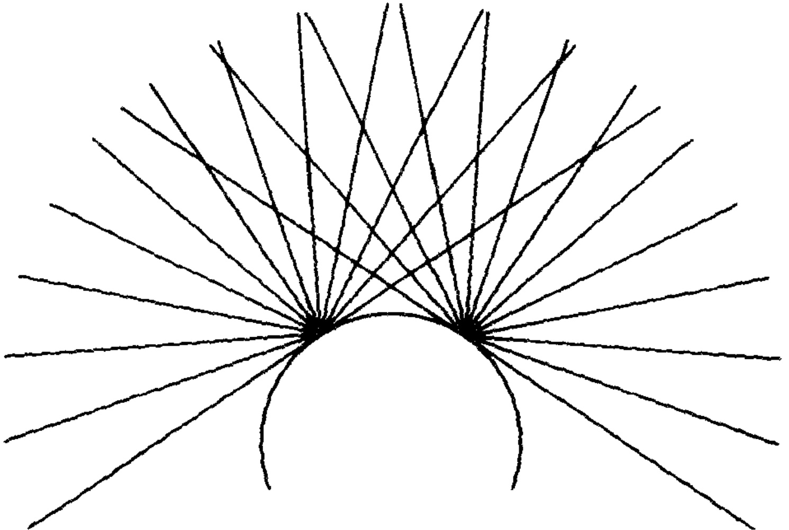

图 12.9 一个发光体上两个点的独立发光。

对应着视域内每一个点发出的光。如果可能，眼睛里接收点的样子应与视域内发光点的样子完全一样。这样就解释了外部世界与我们眼见的世界之间的对应。

海桑对这一问题的解释是，尽管视域内的每一个点都确实向眼睛上的每一个点发出光线，但并不是所有的这些光都能够被眼睛感觉到。他指出，视域内的一个点向眼睛发出多条光线，只有垂直射入眼睛的那一条光线才能被感觉到（图 12.11），其他所有斜射入眼睛的光线都被折射掉了。折射的结果使垂直入射外的其他光线减弱了，它们在视觉过程中只起到偶然介入的作用。眼睛的主要感觉器官是玻璃体和晶状体，它们只感受垂直入射的光线，这样就正好形成一个视锥，该视锥的底是视域，顶点是眼睛的中心。于是，海桑就达到了他的目标：成功地把“出射”理论中的视锥引入“入射”理论，把出射理论和入射理论的优点结合起来，在一个单一理论中把对视觉的数学分析与产生视觉的物理过程结合在一起。还需要说明一点，

---

图 12.10 从可见物体两端发出的光线在眼中的相交，为简化起见，在不同界面上由折射引起的光线弯曲未在此图标出。

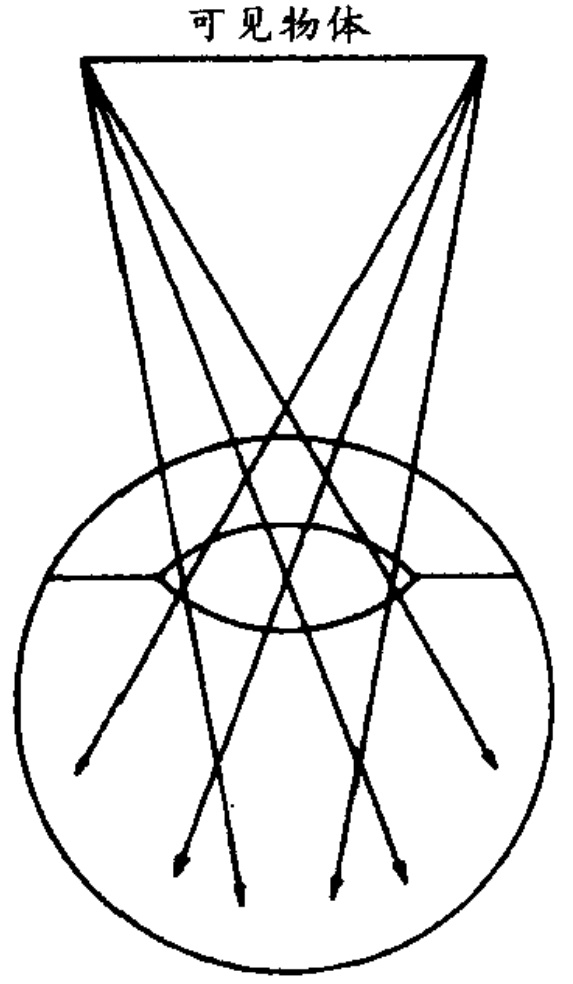

尽管我们没有更多的篇幅钻研得更深，海桑还把盖伦传统中有关解剖学和生理学的思想融合在一起（图 12.11 表现了他对眼的解剖学的基本认识），这样就产生了一个统一的视理论，对三种侧重点不同的理论都做了回应。

视理论是海桑光学理论的主要部分，但他的兴趣覆盖了光学现象的所有部分。他分析了伴随光和色的发光的性质，区分了天然发光体与反光或二次发光的物体，他思考了反射和折射的物理学，继承并发展了对发射光与色的数学分析，用复杂且高级的方式处理了反射和折射成像的问题。他还针对视觉的心理学分析进行了严肃的、有影响的讨论。

在12世纪末或13世纪初，海桑的《光学》被译成拉丁文传入西方国家并产生了巨大的影响，但这并不是惟一有影响的思想。那时，人们早就得到了柏拉图的《蒂迈欧篇》，这篇对话不但讨论了视觉问题，而且形成了新柏拉图主义光学思想的主流传统。欧几里得、托勒密和金迪的光学著作在12世纪下半叶被翻译过来，在人们接触到海桑的《光学》之前，这些著作就显示出光学中数学分析的光明前景。

---

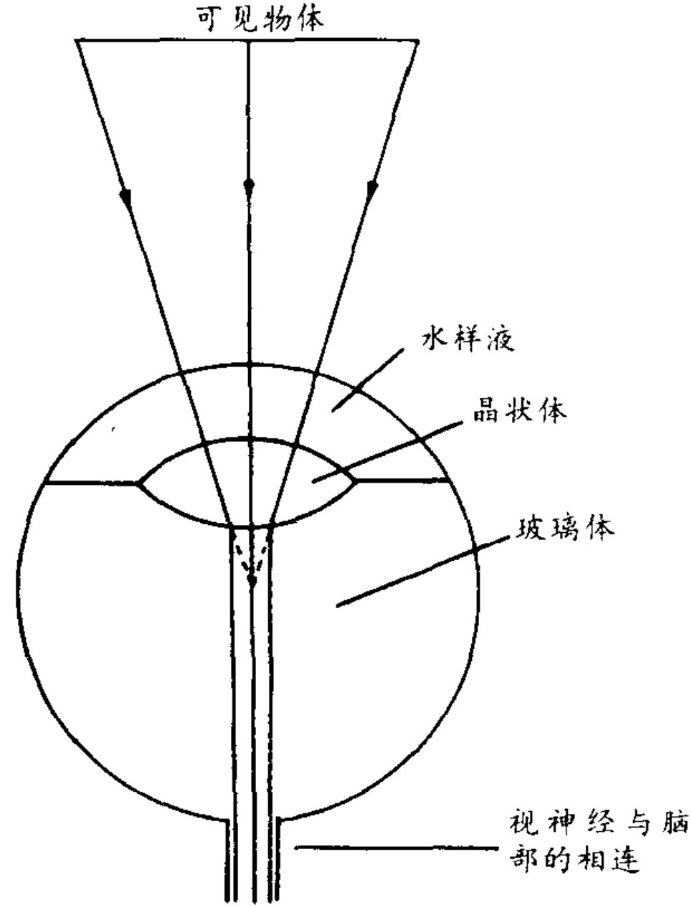

图 12.11 海桑入射理论中的视锥和眼睛。从物体斜射入眼睛（及被折射）的光线未在此图标出。因为它们仅仅偶然介入到视觉过程中来。

途。亚里士多德、阿维森那和阿维洛伊的著作给人们留下了深刻的印象，即光学中真正的问题是物理学和生理学的问题，而不是数学问题。包括胡那恩·伊本·伊萨克一本小书在内的其他各式文献，表达了盖伦传统中解剖学和生理学的内容。不仅在上述范围内，而且在其他很多有关光学的领域里，西方学者忽然发现一个杰出而新颖的知识体系丰富起来，这个体系绝非简单，而是相当复杂，包容着相互抵触的思想和倾向。西方学者的任务就是面对这些问题，调节和融洽抵触的地方，重新对这个令人难以把握的思想传统进行加工，使之成为自洽和统一的自然哲学。 $ ^{4,3} $

首先开始这项工作的是两位著名的牛津学者：格罗斯代特在1220和1230年代，罗吉尔·培根在1260年代。格罗斯代特（约1168-1253年）较早开始了研究，但由于缺乏上面提到的丰富的光学知识，

---

他的光学著作主要因思想的火花而显出其价值。罗吉尔·培根（约1220-1292年）受格罗斯代特思想的启发，同时又掌握了古希腊和中世纪阿拉伯文化中丰富的光学知识，正是他决定了光学这门学科的未来发展历程。

循着由海桑形成的较宽泛的光学理论研究的路子，培根几乎巨细无遗地采纳了海桑关于视觉的入射理论。海桑对光与视觉的成功的数学分析给培根留下了极深的印象。在他自己的著作里，培根也把数学方法表现出的光明前景卓有成效地传给了后来人。但培根（和他的很多同行人一样）深信，所有古代西方和阿拉伯的学术权威在基本思想上并无分歧，所以他明确表示，所有（或几乎所有的）曾写出光与视觉著作的学者都只有一个基本的思想观点，这意味着他不得不把亚里士多德、欧几里得、海桑以及新柏拉图主义者的思想融合起来。下面的两例可以看出他是如何勉为其难的。 $ ^{44} $

在思考发光的方向时（光从眼睛发出还是光射向眼睛——这是持出射理论和持入射理论的学者争论的焦点），培根同意海桑和亚里士多德的看法，认为光线射入眼睛才产生了视觉。那么如何处理柏拉图、欧几里得和托勒密赞同的出射理论呢？很明显，出射光线不会产生视觉，但它们仍然能够存在，并在视觉过程中起到辅助的作用，其作用是使介质作好准备，以接收从可视物体发出的光线，从而提高入射光线的作用，使之能够作用于眼睛。关于发光的性质，培根接受了新柏拉图主义的宇宙概念，把宇宙设想成一个由力构成的巨大网络，在这个结构里，每一个物体通过力的发射与邻近的物体相互作用。而且，他设想这种无处不在的力是导致一切因果关系的手段，并以此为基础，发展出了一套很有影响的自然哲学。至于光与颜色，培根认为，它们（包括光学作者讨论的其他可视自然现象）都是这种普适的力的具体表现。 $ ^{4.5} $

培根并不是13世纪下半叶讨论光学问题时惟一有影响的人物。但主要是由于他以及与他同时代的两名较年轻的学者，海桑的光学理论，以及他把物理学、数学、生理学的倾向融合在一起的方法得以主宰西方的思想。后两位学者，一位是英国方济各会修士约翰·佩

---

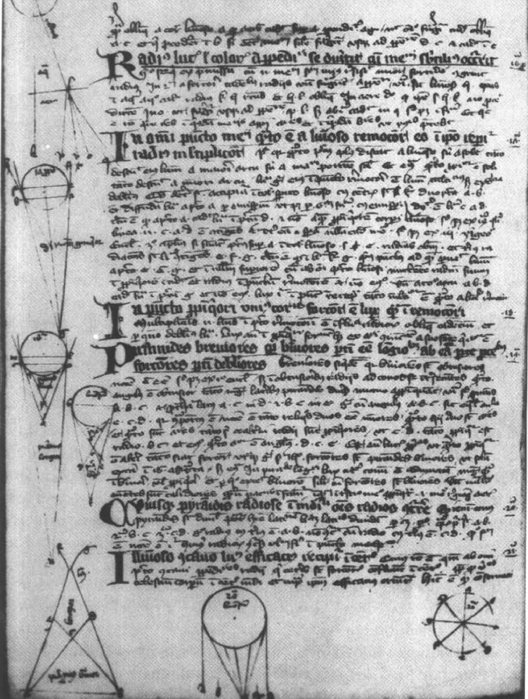

图 12.12 约翰·佩尚所著《光学》一书中的一页，它是中世纪大学里流传最广的光学教材，圣尼古拉斯医院图书馆，MS 212, fol. 240v（15 世纪初），这是一个曾一度为库萨的尼古拉所拥有的手抄本。左上角表示光的折射图，其余的图解表示各种发光图。

---

尚（卒于1292年），另一位是与教廷有联系的波兰学者维特罗（Witelo，卒于1281年之后）。当光与视觉理论在14世纪的自然哲学中出现时（就像它们经常尤其是出现在认识论的讨论中），它们几乎总是来自于海桑和培根的传统。当开普勒在1600年开始思考视理论（这一努力使他终于发现了视网膜成像理论）时，他重新操起了培根、佩尚和维特罗遗留下的问题。 $ ^{46} $