# 第十三章 中世纪的医学和自然史

## 中世纪早期的医学传统

中世纪的医学是(上文第六章讨论的)古代医学传统的自然发展和延续。中世纪的行医者是希腊和罗马的健康与疾病理论、诊断技术与医疗程序的继承者。但他们对这些古代医学遗产的把握，是不完整的，有时是不牢靠的，这些古代医学遗产中能够被中世纪伊斯兰世界和基督教世界得到的部分，不得不适应新的文化环境，而这一文化环境极大影响了它的发展和应用。

要想勾画出一幅关于西方中世纪医学的图景相当困难， $ ^{2} $与罗马帝国解体相伴随的是社会与经济的混乱，但也许这些并未严重影响治疗的技艺方面，即对创伤和普通疾患的处理、接生、接骨、常见药物的制作与分发等。尤其在农村地区和家庭里，那些熟悉治疗术的人大体上一如即往地运用他们的医疗技艺。在医学领域，真正因罗马帝国崩溃而遭受损失的部分是医学中的学术部分，尤其是医学的理论和哲学部分损失最大。学校的衰微和希腊诸公共设施的逐渐消失，加快损害了西方医学中继承希腊医学传统的学术部分，这样，能够灵活掌握古代医学学术传统的行医者，其人数在迅速减少。

这并不是说西方世界与希腊的医学知识从此隔绝。早期的拉丁百科全书涉及到某种程度的医学知识（包括塞尔苏斯、老普林尼和

---

塞维尔的伊西多尔各自编著的百科全书）。 $ ^{3} $而且，在6世纪中叶，可以看到一个篇幅不大的希腊医学著作文集的拉丁文译本。但是希腊的医学文献体现了希腊人从理论到实践的极广泛的医学兴趣。而翻译过来的著作明显倾向于实践方面的兴趣，其中包括盖伦和希波克拉底的几部作品，由奥里布修斯(Oribasius，约活跃于4世纪)编排的、摘录了希腊医学文献的文集，苏拉内斯(Soranus，约1世纪)为接生婆写的一个手册和迪奥斯科里德斯(Dioscorides，活跃于公元50-70年)的伟大著作《药典》(De materia medica)。

中世纪早期的医学中注重实用和治疗的倾向清楚显示在迪奥斯科里德斯的《药典》和它所催生的药学传统中，迪奥斯科里德斯的工作是希腊医学的伟大成就，他的《药典》包括对近900种据说有药用价值的植物、动物和矿物质的描述。该书于公元6世纪被译成拉丁文，但在中世纪早期，它只在一个很有限的小圈子里流行，原因可能是它涉及面太广，综合性太强以致显得不实用。也难怪，这本书中描绘的很多药物是中世纪早期的欧洲人无缘见到的。那时最为流行的是一部篇幅较短、对药草做出说明的书，书名是《妇科学》(Exherbis femininis)。该书以迪奥斯科里德斯的著作为基础写成，全书仅对71种有药用价值的植物进行了描述，这些药草均可在欧洲找到。除此之外，还有很多收集了医药秘方的小册子在中世纪早期被炮制出来。 $ ^{4} $

使用上述这些医药著作的行医者是些什么人呢？在意大利，罗马式世俗的、非宗教的医学留存下来，虽然它在数量上无疑是减少了。在东哥特人的统治下，公开收取费用的外科医师在6世纪早期的意大利还是可以找到的。据说，6世纪下半叶，特拉里斯的亚历山大(Alexander of Tralles，一名希腊外科医生)曾经在罗马行医。大量证据表明，在意大利以外，皇家宫廷（如5世纪末法兰克王克鲁维(Clovis)的宫廷)和主要的城市（马赛和波尔多）的世俗行医活动从未停止。 $ ^{5} $

虽然如此，医疗业最周到的设置却日益见之于宗教机构之内，尤其是修道院。对修道院来说，照顾社区里的病人是它的一项重要义

---

图 13.1 迪奥斯科里德斯《药典》的希腊文手抄本上的一页。巴黎，国家图书馆，MS Gr. 2179, fol. 5r (9世纪)。

---

务。这方面最早的证据来自卡西多勒斯（约480-575年）的记载，卡西多勒斯是威瓦里姆一所修道院的创始人，他指导僧侣们阅读希腊医学著作的拉丁文译本，其中包括希克波拉底、盖伦和迪奥斯科里德斯（可能把他的《药典》作为《妇科学》的参考书来读）等人的著作。还有一些证据表明此时实践医学的水平已相当高了，包括对非宗教医学文献的利用。在修道院的几个中心，如蒙特卡夏罗、赖歇瑙和圣加尔(St.Gall)， $ ^{6} $上述情况较为明显。我们估计，在整个中世纪，除了非常小的修道院，大多数修道院里都不乏医疗技术。尽管修道院里的行医对象主要是修道院所在社区的成员，但毫无疑问，这种治疗偶尔也会涉及外人，如朝圣者、来访者和修道院周围的居民。

在修道院的环境下，世俗医学文化和与之相关的医疗实践的存在产生了一个无法回避的问题：即希腊和罗马的世俗医学是怎样与基督教有关治疗的观念相互作用的？我们无法得到一个简单的答案，但如果牢记以下几点，对于了解这一复杂的状况就会大有裨益。第一，医学传统中的自然主义传统（相信只有自然的原因在起作用）和基督教里的超自然主义传统（相信神迹治疗）之间存在着理念上的抵牾。第二，大多数人（包括受过教育的人）不重理念，因此，几乎没有人注意到这种抵牾。第三，那些注意到此点的人，除了拒斥一种医学传统或另一种医学传统外，往往有多种方法来减缓或消除这种抵牾。

这种抵牾的来源很明显，当基督教精神逐渐成熟，布道和宗教文献常常向人们灌输这样一种思想：生病是神的造访，是神意欲惩罚人的罪孽或激励他的精神。无论是惩罚还是激励，治疗都被看作是针对精神的，而不以肉体为对象。而且，基督教还发展出一套流传很广的超自然治疗传统，这种治疗尤其与对圣徒和圣物的崇拜紧密联系在一起。为了完整地描述上述这幅画面，我们还有具体的证据说明，那时的宗教领袖曾当众宣布世俗的医学根本没有能力治愈疾病。

我们很容易把这种信念和态度演变成一幅简单化的图景，认为基督教与希腊和罗马的医学水火不容，认为它毫无保留地坚信超自

---

然的因果律，只知使用超自然的治疗手段。可是，这一想法严重地误解了历史的实际状况。尽管当时人们普遍认为疾病的产生缘于神灵，但并不因此就排除了自然原因的存在。从希波克拉底著作的抄本问世后，大多数中世纪的基督徒都同意一个事件或一次疾病能够既是自然使然，又是神灵使然（见第六章）。在基督教的文化中，人们有理由相信神通常利用自然的力量来完成上天的旨意。例如瘟疫，既可以解释为人的罪孽招致的报应，还可以解释为天象不对或空气不清引发的结果。 $ ^{8} $ 在医学实践和使用自然的药物方面，所有的基督教著作都认为对灵魂的治疗要比对肉体的治疗更重要，还有一些人公开反对使用任何世俗的药物。克莱尔沃的贝尔纳（1090-1153年）在12世纪写给一些僧侣的文字中表达了已存在数个世纪的观点：

“我清醒地认识到你们生活在一个不健康的地区，很多人都生了病，……寻求肉体的治愈违背了修道誓约。况且，世俗的医学也无法给你们带来健康。像劳苦人一样用些寻常的草药有时还是可以接受的，这是我们的习俗，但是花钱买特殊的药品或外出找医生，吞下他们开出的令人作呕的药丸，这不应是僧侣们的做法”。

但是大多数的基督教领袖人物非常欣赏希腊和罗马的医学传统，认为这是神对人间的赐物，是神的一种恩宠。因此，在实际中运用这一传统就是合乎情理，甚至是义务了。凯撒里亚的巴塞尔(Basil of Caesarea，约336-379年)写道：“如果必要的话，我们必须小心谨慎地使用这些医术，并不是要它完全对我们身体状况的好坏负责，而是利用它彰显神的光辉。”这些话道出了许多神父的心声。即使是德尔图良(约155-379年)这样一位对希腊和罗马传统抱有敌视态度的作者，也表示自己非常欣赏希腊和罗马的医学。出现在圣徒生平中的对传统医学的诋毁，有其一种论辩作用，即通过证明圣徒超凡出众的治疗能力，来证明和扩大圣徒的力量。我们不能把这种诋毁当作著作者对世俗医学的观点（更不用说中世纪社会里的其他成员了），

---

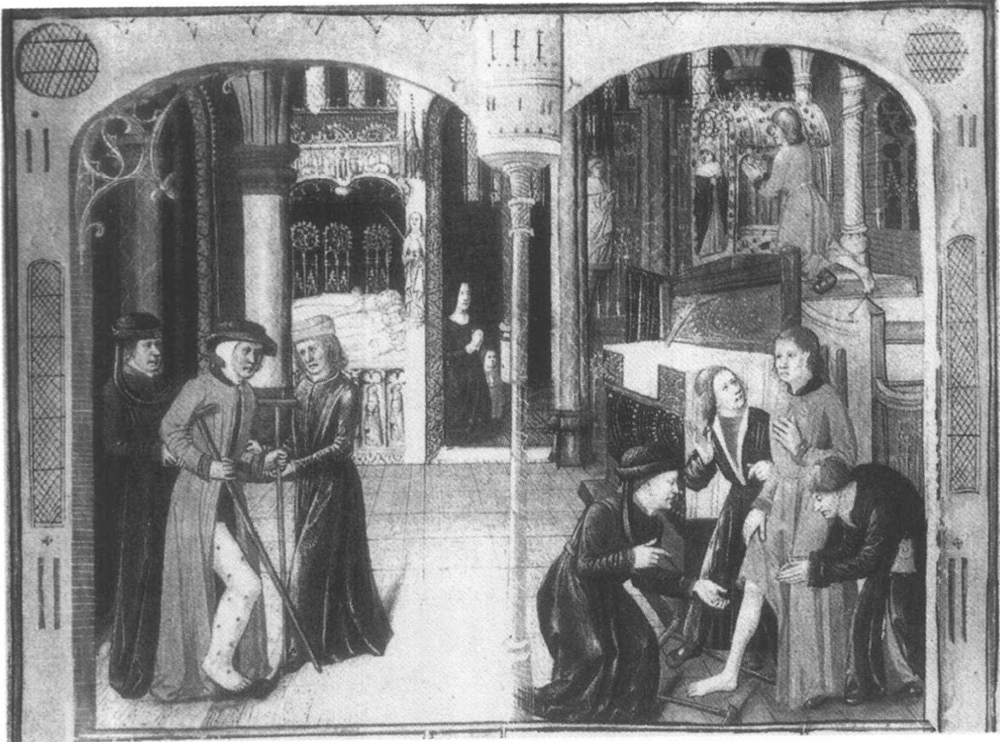

图 13.2 用超自然的方法治疗病腿。巴黎，国家图书馆，MS Fr. 2829, fol. 87r（15世纪晚期）。关于本插图的讨论，见 Marie-Jose Imbault-Huart 著 La medicine au moyen age travers les manuscrits de la Bibliothèque Nationale，第 182 页。

因为这些作者中的许多人在其他著作或甚至在同一部著作中表达了对传统医学实践非常尊重的态度。神父们想要公开指摘的不是利用世俗医学，而是反对过分看重世俗医学，未能认识到或者不承认其源于神授。 $ ^{10} $

我们在排除基督教会拒斥医学传统这一错误说法时，还必须避免走向另一个极端。毫无疑问，中世纪早期的基督徒是坚信治疗的奇迹的，他们同时利用宗教的治疗术和世俗的医学为他们服务，有时同时使用，有时则有先有后地使用这两种方法。在公元4世纪和5

---

世纪，对圣徒的膜拜成为欧洲文化的主要特征，圣祠建在圣徒墓地或遗物（可能是一根骨头）的周围，成为人们趋之若鹜的朝圣地。使这些地方有着巨大吸引力的一个原因是，据说在这里曾出现神迹治疗，有一个简单的例子值得一书：比德(卒于公元735年)在他的《英格兰人教会史》一书中描述了很多神迹治疗故事，包括一个在林迪斯凡岛（Lindisfarne，位于英格兰东北海岸之外）上的僧侣，患了中风，被带到库思伯特（Cuthbert）的坟墓。

“俯伏在上帝化身的遗体之前，他虔诚而热烈地祈祷着，请求主施以无边的仁慈：当他正在祷告时，他感到（他后来总是向别人这么说）一只圣洁宽大的手抚摸在他那悲哀郁结的头颅上，而这只手缓缓地滑过他身体中感到不适的各个部位，这些部位在病疾的折磨下曾经被深深地‘激怒’，不肯安宁下来。这只灵光的手一直抚摸到他的脚下，慢慢地，疼痛消失了，而健康又回到了他的体内。” $ ^{11} $

在中世纪，类似的故事多得不胜枚举。

如果教会既不是希腊和罗马医学传统的敌人，也不是它的坚定支持者，那么我们怎么归纳它的态度和影响呢？一个常用的办法是把两方面权衡一番，即把教会对希腊和罗马医学传统的反对和赞同的意见比较一下，然后说明，教会是一种积极的、抑或是一种消极的力量。但这种结论导致简单化。如果我们避免区分出反对与赞同这两种基本态度，而把教会视为一种强有力的文化力量，这股力量与世俗的医学传统产生互动，利用它并改变它，这样，我们将更准确地逼进事实本身。教士们从未简单地拒斥或接受世俗医学，而是使用它，要它适应新的环境，并因此一点点地（在某些方面是激烈地）改变世俗医学的特征。但是，上述这种特征的转变还没有强烈到可以认为在基督教世界里世俗的和宗教的治疗传统发生了融合。在新的历史条件下，希腊和罗马的医学不得不适应基督教观念中神的全能、天佑和神迹的信念。在修道院提供的全新公益性环境下，世

---

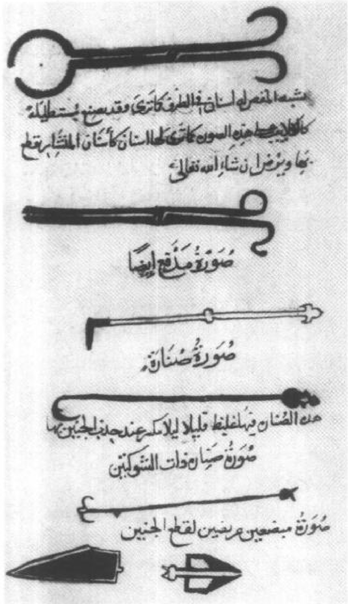

图13.3 来自 Abu-I-Qasim az-Zahrawi (Abulcasis) 的论文《论外科手术及器械》中的阿拉伯外科手术器械。牛津，波德莱恩图书馆，MS Huntington 156, fol. 85v。

俗医学在欧洲历史上这一段危险时期不但得到滋养，并保存了下来，而且还被统合到体现基督教仁爱思想的服务之中（由此产生的一个重要成果是医院的发展和普及）。最后，世俗医学在大学里的建制化保存了它与各种哲学流派之间的联系，进一步把医学的地位提升为科学。

---

在我们离开中世纪早期阶段之前，还有一个非常重要的发展值得注意。从8世纪起，人们开始将希腊的医学著作翻译成阿拉伯文，这项工作持续到整个10世纪。当翻译工作结束时，大多数的重要希腊医学著作都能够找到阿拉伯文的译本，包括迪奥斯科里德斯的《药典》、希波克拉底派的多种著作和盖伦几乎全部的著作。伊斯兰和西方在接触希腊医学文献方面所表现出的巨大差别，能够从对盖伦全集的参考中表现出来。11世纪之前，在西方只能找到两三种有拉丁文译本的盖伦著作，而在阿拉伯世界，胡那恩·伊本·伊萨克（803-873年）在巴格达列出了他知道的129种盖伦著作，他声称亲手将其中40种翻译成了阿拉伯文。

以希腊医学文献为基础，复杂而高级的伊斯兰医学传统得以建立。这一医学传统的几个特征需要简单提及。首先，伊斯兰的医学传统是建立在对希腊医学传统的全盘掌握之上的，它吸收了希腊医学的多个目标和大多数内容。第二，出现在伊斯兰医学传统中的医学思想核心是盖伦的解剖学、生理学以及盖伦关于健康、疾病（包括流行性疾病）诊断与医疗的理论，盖伦影响的一个重要方面是他揭示出了医学和哲学之间的联系，这一联系成为后来伊斯兰医学思想的基本特征。

第三，盖伦的医学理论并没有生硬地限制伊斯兰的医学思想和医学实践，它是一种将得到不断拓展、完善、与其他医学和哲学体系进行整合的理论框架。医学在伊斯兰文化中是一个动态的体系，而不是静态的。第四，不但盖伦著作的译本得到广为流传，而且，与之相伴随的是，本地的伊斯兰医生的著作也在大量产生。这些原创的阿拉伯文献包括许多种，其中尤为杰出的是一系列综合性的、百科全书式的著作，这些著作涉猎了医学理论和医学实践中的某些部分甚至方方面面。其中三种这类百科全书式的著作对以后的西方医学发展产生了极深的影响，它们是腊泽斯(Rhazes，阿拉伯世界称拉齐，约卒于930年)的《历书》(Almansor)、哈里·阿拔斯(Haly Abbs，卒于994年)的《全书》(Pantegni，或称《通用技艺》Universal Art)、以及阿维森那的《医典》。这些著作以及其他许多翻译过来的著作，

---

塑造和指导了中世纪后期的西方医学。 $ ^{12} $

## 西方医学的转变

在 11 和 12 世纪，一系列的影响开始对欧洲的医学传统产生冲击，并使它的特征发生转变。随着人口的激增，这一时期政治和经济上的复兴导致了影响深远的社会变革，其中包括城市化和受教育机会的大大增加。在新的城市学校里，课程的领域拓宽了，课程的重点放在了一些在修道院环境下曾经被认为没有什么意义或根本没有出现过的学科上。与此同时，对修道院制度的改革运动试图减弱修道院与世俗文化的牵连（见本书第九章）。这些变革交织在一起，产生了这样一个转变，即医疗教育的场所从修道院转向城市学校，伴随而来的是医疗的职业化和世俗化倾向。同时，城市里的上层人物对医术精到的行医者的需求不断增加，这一需求导致医学实践成为一种可以赚钱的（或可以出人头地的）事业。

有关城市医疗活动复兴的最早实例，可追溯到10世纪意大利南部的萨勒诺（Salerno）。10世纪末期，萨勒诺因聚集了许多医术精湛的行医者而闻名。这些行医者中包括神职人员和妇女。从严格意义上看，学校似乎还不存在，有的仅是一个医疗活动的中心（并且日益成为一个著名的医疗活动中心）。男子或妇女从学徒做起，有很多机会掌握治疗术。在10世纪并延伸到11世纪的时间里，萨勒诺成果最丰的不是医疗的学术方面，而是治疗术。然而，在11世纪，萨勒诺的一些行医者才开始写作医学实践方面的著作，在12世纪初，从萨勒诺流向其他地方的文献逐渐增加，并更趋理论化，这一现象反映了阿拉伯医学著作的哲学取向开始在它的拉丁文译本中流行开来。这些医学著作中，很多新的作品是用于教学的教材，它们（明显地）与组织完善的萨勒诺医疗教学相联系。 $ ^{13} $

12 世纪影响萨勒诺医学活动的阿拉伯医学著作的翻译工作，不久就在全欧洲范围内使医疗教学与医学实践活动发生转变。最早出现的翻译是非洲人君士坦丁（活跃于 1065-1085 年）的翻译，此人是

---

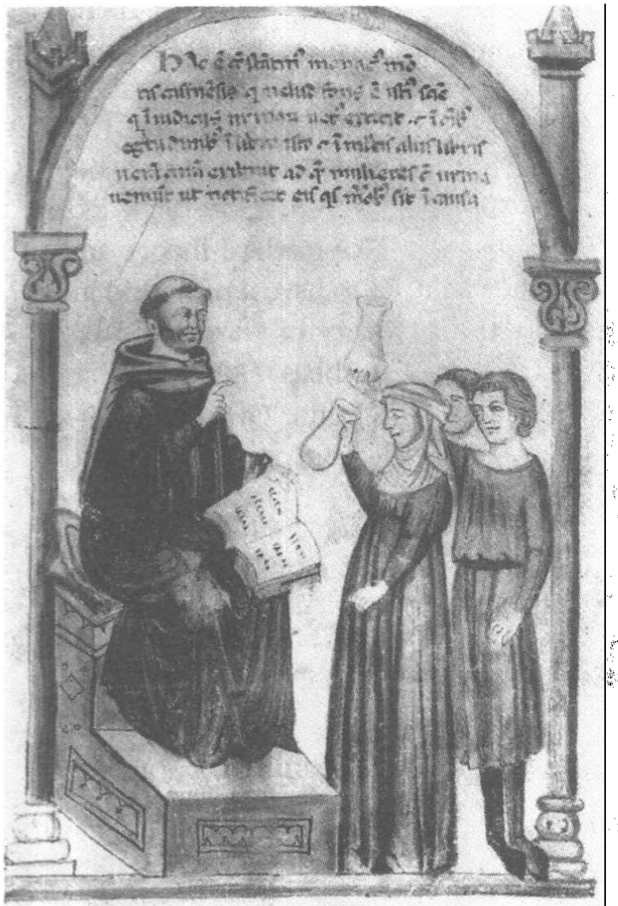

图 13.4 非洲人君士坦丁正在进行尿液检查。牛津，波德莱恩图书馆，MS Rawlinson C. 328, fol. 3rl(15世纪)。有关它的评注，见 Loren G. MacKinney 著 Medical Illustrations in Medieval Manuscripts，第 2-13 页。

意大利南部蒙特卡夏罗修道院的一位僧侣，他与萨勒诺的联系很紧密。君士坦丁的阿拉伯知识无疑与他出身北非有关，他翻译了希波克拉底和盖伦的著作、哈里·阿拔斯的《全书》、胡那恩·伊本·伊萨克的医学著作以及其他一些文献，他的工作被其他翻译家在此后的150年里继承下来，他们在意大利南部、西班牙和其他一些地方继续进行翻译工作，逐渐把希腊和阿拉伯医学中大部分的全集从阿拉伯国家引进到拉丁世界，在托莱多，克里莫纳的杰拉尔德（约1114-1187年）翻译了九篇盖伦的论文、拉齐的《历书》（这一部书是题献给拉齐的资助人曼苏尔·伊本·伊萨克（Mansur ibn Ishaq）的）、阿

---

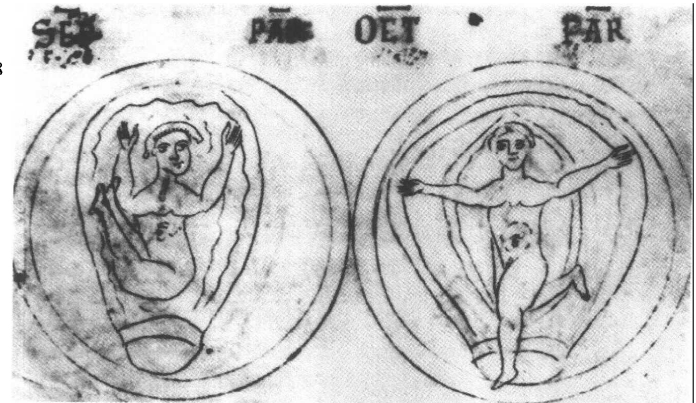

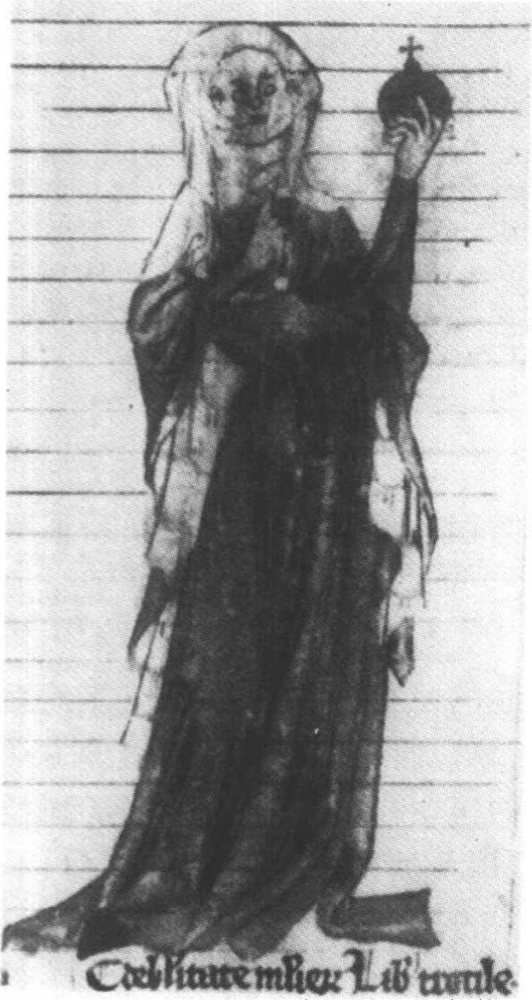

图13.5 子宫中的胎儿。哥本哈根，皇家图书馆，MSGL. kgl. Saml. 16540. fol. 18r（12世纪）。

图 13.6 特罗图拉，一位 12 世纪的萨勒诺行医者，伦敦，威尔康姆研究所图书馆，MS 544，第 65 页（12 世纪）。

---

维森那的伟大的《医典》，这些新的著作极大地拓宽和加深了西方医学知识，与中世纪早期的医学相比，它赋予了西方医学远为强烈的哲学取向，并最终在新建立起来的大学里，使医疗教育的形式和内容定形。 $ ^{14} $

## 中世纪的行医者

今天，我们一般都认为医学是一门需要学问的职业，只有那些在学校里受过长期专业教育并取得相应从业资格的人，才能够从事这一职业。但我们如果把这一套想法加于中世纪，肯定会产生很大误解。与那时的医疗活动相比，现在能找到的一个非常类似的对应物是木匠活。木匠活的从事者包含了一系列等级，从做基本家居装修的木匠到建筑行业的专业木匠，再到从事土木工程的工匠直至建筑师。最简单的木匠活所需的知识渐渐成为尽人皆知的常识（几乎所有人都知道，或者都想知道一些基本的室内维修知识）。一个利用周末时间把修复古董作为业余爱好的人，可能掌握了大量的知识和技术。建筑行业的木匠多是通过做学徒来获取这门行业所需的专门知识。最后，土木工程师和建筑师为这个领域带来了理论知识。

上述情形与中世纪医学实践的情形相仿，家庭中简单的医疗知识几乎为所有人掌握。如果需要更多的专门技术，在每一个社区里都能找到众所周知很有办法对付某些疾病的人，从这里，我们开始攀上医学专业化和专门化的阶梯。大多数的村庄里都有接生婆、接骨人、懂得药草和药草疗法的人。在城市里，人们能找到很多“江湖郎中”，他们凭经验吃饭，有能力处理创伤、医治牙病和其他一些外科疾病（例如，切破疖疮，治疗疝气或去除肾结石）。在更高职业化的水平上，有药剂师、受过专门训练的外科医师、从做学徒开始接受指导的技术精湛的专业行医者，最高等的是受过大学教育的医生。但这绝不是一个静态的或严格不变的线性等级结构，也不是说在任何地方，情况都是如此。而且，在多个水平等级上，因为存在世俗的行医者和宗教的行医者（比如，教士们总是把传统的医学实

---

践和他们的宗教职责联系在一起)，事情更趋复杂。此外，划分的界限很不清晰，因为，对行医者的管理与授权虽然需要明确分类，但这一管理和授权只是在中世纪后期才慢慢地制度化，并且从没有达到普遍有效的程度。尽管如此，上述分类还是大致反映了中世纪医学图景的一般特征。 $ ^{15} $

现在，我们只找到了有关中世纪欧洲行医人数的粗略数据。然而，从这些已掌握的零星数据中还是能看出一些东西。1338年，就欧洲城市而言，佛罗伦萨的医生在市民中所占比例无疑是最高的，在120,000人口中大约有60名各种专业的特许行医者（包括外科医生和没有受过正规教育的“江湖郎中”）。20年过后，由于黑死病流行而人口锐减，佛罗伦萨42,000的城市人口中有56位特许行医者，这个比例表明每10,000名城市居民之中就有12到13位医生，而且这一比例在这一世纪的剩余几十年里一直保持下来。 $ ^{16} $而在乡村地区，人们一定更难接触到的受过训练的医生。

还有人数很多的妇女也包括在中世纪行医者的行列中，她们不仅活跃于产科和妇科领域，也参与到其他一些医学专业领域。其中最富盛名的是特罗塔或称特罗图拉（Trota或Trotula），她来自12世纪的萨勒诺。她可能没有写过妇科方面的著作，但人们常常说某些著作是她的手笔，但她似乎写过一本关于实用医药和医疗建议的一般性读物。另外，在欧洲犹太人居住的某些地区，行医者数量也相当大。 $ ^{17} $

## 大学里的医学

在行医者中，我们了解得最多的是在中世纪欧洲的正规医学学校里学习或教授医学的人，因为这些医生识字，他们的著述流传至今，我们从中能够了解他们的身份、他们的研究内容以及他们的医学专长。 $ ^{18} $

正规的医学研究可能出现在 10-11 世纪的天主教学校里，其目的不是培养职业医生，而是把医学教育作为普通教育的一部分。例如，

---

在沙特尔，医学研究大约出现在990年，而在此后的下一世纪，医学教育在其他地方类似的学校里也可以找到。 $ ^{19} $然而，只有在12世纪的萨勒诺，重新翻译的具有希腊和阿拉伯传统的医学著作才第一次被吸收，而且萨勒诺这个地方才把医学作为一种需要学问的职业。在这些发展的背后，驱动力不仅仅是人类求知的好奇心和治病救人的利他主义（无疑这二者都存在），而且还有对地位和事业发达的渴求。正如上文分析的那样，医生已经在行医者的行列中处于最高等级，因此已是有文化的人，他们认识到通过模仿其他需要学问的职业（如从业于法律），有可能提高他们的社会地位，于是也要求行医者取得正规教育的资历，其目的是希望把医学从技艺或手艺的层次提高到科学的层次。医学在萨勒诺的发展影响巨大，在13世纪，蒙彼利埃（Montpellier）、巴黎和波伦亚的大学里的医学专业已受到相当的重视。而在帕多瓦、费拉拉（Ferrara）、牛津和其他一些地方的大学里，也产生了程度略逊于上述几所大学的医学专业。

中世纪大学里医学的体制化对医学理论和医学实践的发展极为重要。首先，它不但保证了医学研究得以延续，而且保证了一个重要团体，即受过大学教育的医生团体从中世纪直到现在的持续存在。第二，把医学研究引入大学（相对于把研究机构建立在别处）为医学和其他知识门类的融合创造了条件，因此，极其深刻地影响了医学在今后发展的道路。尤为重要的是，文学院的学位成为攻读医学的一般先决条件（不一定是普遍的），这表明学习医学的学生开始掌握逻辑和哲学的工具并利用它把医疗转化为严格的、学术化的事业（是好是歹则另当别论）。这同时也为医学向亚里士多德的自然哲学以及占星术（乃至占星术的姐妹学科天文学）接近提供了机会，自然哲学可以为医学提供一些重要原则，占星术将构成医生诊断和治疗通常必备的一部分知识。让我们简略地回顾一下当时的医学课程。

有一段时间，首先是在萨勒诺，然后在其他的医学院里，教学围绕着一本由若干篇简短论文汇编而成的文集来进行，这本文集一般被称为《医艺集》(Articella)，其中包括胡那恩·伊本·伊萨克（西方人称为约翰尼特斯）写的一篇医学导论、从希波克拉底著作全集

---

图 13.7 中世纪的医学教学。摘自阿维森那《医典》的一个摹本。巴黎，国家图书馆，MS Lat. 14023, fol. 796v (14 世纪)。

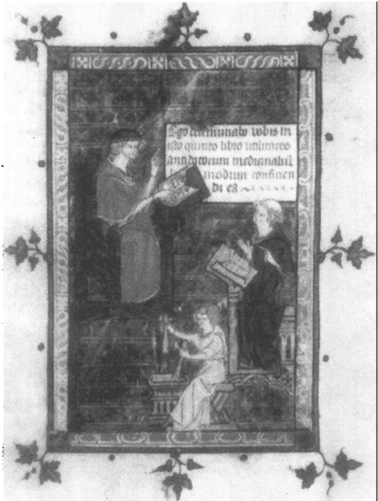

里选出来的几篇文章，以及有关尿液分析和诊脉方面的作品。在14和15世纪，文集又补充了盖伦、拉齐、哈里·阿拔斯、阿维森那和其他一些人的著作。医学理论要求直接与自然哲学的一般原则相适应，于是医学专业的课程具有了明显的哲学取向。教学使用的是典型的学院式教学法，包括对权威著作的评注和对有争议问题的争论，但这并不表明（但有一些人认为）那时候大学里的医学纯粹是理论的、埋头书本的活动。事实上，很多大学里的医学教授致力于个人的医学实践活动，同时，医学院的学生也常常被要求掌握一些临床经验。 $ ^{20} $

最后，那时到底有多少学医的学生呢？这方面有点滴数据。在

---

15世纪最初的15年里，波伦亚大学（欧洲最早的医学院之一）共颁授65个内科学位和一个外科学位。在15世纪稍后的36年里，都灵（Turin，同在意大利北部）大学共颁授13个医学的博士学位。（自从1477年开办以来），在此后的60年里，图宾根（Tubington）大学授予学生医学学位的比率大约是两年一个。当然，在医学院学习的学生人数远比获得学位的人数多，原因是大多数学生没能完成全部学业。有人认为，读学位的人与获得学位的人的比例为10:1。从这些数字中我们所能得知的是，受过大学正规训练的医生实属凤毛麟角，尤其是获得博士学位的医生，他们是城市中上流社会的成员。一般说来，只有富人和权贵才是他们服务的对象。 $ ^{21} $

## 疾病、诊断、预后和治疗

中世纪行医者的医学理论、诊断方法和治疗手段，依行医者本人的受教育水平、专业和职业环境而各不相同。实际上，我们了解的大多是有学问的医生的医学观点和行医程序。有理由相信，他们的医学信念和医学实践向下扩展，影响了各式各样的行医者。例如，大量证据表明，为了让能够识字却不懂拉丁文的行医者从中受益，拉丁文的医学论文被翻译成各国当地文字，或既被翻译又被引述。 $ ^{22} $同时，另一种明显的趋势是民间医学和民间治疗方法向上传递，影响了职业的、甚至（在某种程度上）学院派的行医群体。因此，如果我们判断下述的医学思想和医疗实践曾经在中世纪的大多医疗活动中程度不同地出现过，则不会偏离现实情形太远。

中世纪疾病理论的基础是这样一种观念，即每个人都有特定的气质（相）或性情，它决定于四元素以及人体内与四元素相对应的四种性质（冷、热、干、湿）之间的平衡。一般认为，气质对于各人来讲都是独一无二的，一种平衡对某人正常，对另一个人就是异常的。与气质（相）理论紧密相关的思想是从盖伦和希波克拉底那里得出的，它认为，人体包含四种基本的、有重大生理意义的流体或体液——血液、粘液、胆汁和忧郁液，这四种体液正是人体四种性

---

333 质之间保持适当平衡的媒介。人们认为健康与适当的平衡有密切关系，生病就是平衡被破坏。例如，发热被当作异常的热从心脏发散的结果。最后，健康与疾病被认为受到一系列称为“非自然”条件的影响。这些条件是指呼吸、饮食、睡眠与清醒、活动与休息、养分的保持与排出以及思维的状态。 $ ^{23} $

如果病疾是一个人偏离了正常气质引起的后果，那么治疗的方向必须是保持平衡。有很多技能可以达到这一目的，首先是节食，由于体液是食物被消化后的最终产物，为了保持健康，适当的节食绝对必要。药物根据其主要性质分类，医生可以开出药物帮助保持体内平衡。如果需要更加大胆的治疗，可能就需要通过腹泻、“呕吐”、放血等疗法，把多余的体液排放出去。为了决定病人适于哪一种治疗方式，医生就需要研究病人的生活方式或养生术（即饮食、睡眠、性生活和沐浴等行为），探明男女病人独特的气质和需要哪种养生术。事实上，为了达到最大的治疗效果，医生应该在较长一段时间里密切关注病人的活动，而这一目的只有在一位医生（假定他精通医道）受雇于富有的恩主时才能实现。通过对这位作为恩主的病人的长期观察，医生站在医疗（理论）的角度为他的病人提出如何保持或恢复健康的建议。掌握精深医学知识（和在某种程度上需要较少理论知识的医学实践）的最终目的反映出这样一种医生形象，即医生就是医疗顾问，他们的基本职责是从事我们现在称为预防医学的活动，但在预防失效时他们有能力进行适当的药物治疗。 $ ^{24} $

最常见的医疗手段是药物治疗，因此，识别和制作药物的能力和对药物药性的认识一起，成为中世纪大多数医师不愿外泄的一部分秘密。这些药物成份或是单一的，或是合成的，最常用的成份是药草，但有时也用动物或矿物质入药。很多药都是民间秘方，通过几代人的成功使用而获得大家的认可。例如，当地医师通过长期的经验，认识到某些植物的成份对通便或止疼有效。无疑，中世纪的某些药物是有效的，但事实上大多数只是无害而已，个别的可能还相当危险。其中有一些药物带给人无法忍受的恶心。比如，相信猪粪是治疗鼻出血的良方。在这种情形下，可以说药物比疾病更让人

---

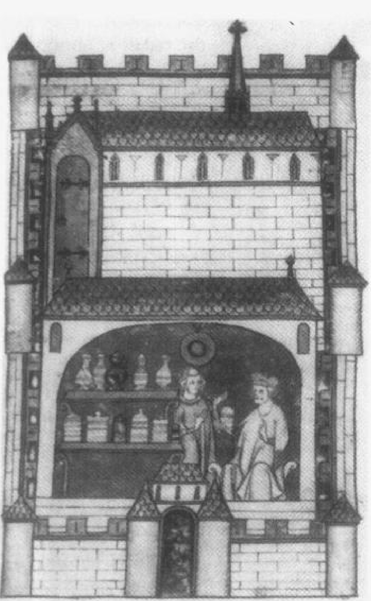

图 13.8 中世纪的药剂店。伦敦，大英图书馆，MS Sloane 1977, fol. 49v（14世纪）。承蒙大英图书馆惠准。

难以接受。 $ ^{25} $

如果说中世纪药物治疗方面存在大量经验的（往往是民间的）成份，那么，它也带有明显的来自希腊和阿拉伯医学传统的理论成份。迪奥斯科里德斯的《药典》（经修订和增添后的版本）在西方有适量的发行，在12世纪，有关医药配方的新的、更有影响的文集出现了。最后，盖伦、阿维森那和其他一些人的著作的新译本，为整理药物知识并使之系统化提供了理论上的支持。联系着自然物质的冷、热、干、湿这四种基本性质，一个基本的理论假设是认为一切自然物质都有益于健康。根据这一理论，阿维森那作了进一步引申，他认为，被用作药物的物质可能都有一种“特殊的形式”，这种“特殊的形式”

---

独立于它们的基本性质，因此就不能单纯地根据四种基本性质来解释治疗效果了。因此，正是因为这种特殊的形式，解毒糖剂（一种在古代就为人们所知、用毒蛇肉和其他一些成份制成的药物）才获得了显著的医疗特性。12世纪的《解毒药集》(Antidotarium Nicolai)一书把诸多医疗特性赋予了这种药物：

“解毒糖剂……对人体各部分的大多数严重疾病都有疗效，它可以治疗癫痫症、强直性昏厥、中风、头疼、腹痛和偏头痛；治疗嗓音嘶哑和胸闷；治疗支气管炎、哮喘、吐血、黄疸病、水肿、肺炎、疝痛、肠疾、肾炎、结石、霍乱；它能诱导月经，打掉死胎；它能治疗麻风病、天花、间歇性发寒和其他慢性疾病；它对治疗所有的中毒、被蛇或其他爬行动物咬伤尤为有效……；它能清除各种麻痹(？)，它能增加心脏、大脑和肝脏的功能，使得全身不受损伤并保持健康的状态。” $ ^{26} $

另一个理论领域关注的问题是，合成药物的药性是怎样依赖于药物中各种单一成份的性质的。伊斯兰和欧洲的著作者们共同参与了对这一问题深入的理论探讨（包括数学分析）。结果，上述形式与性质的强化与弱化的学说得到了发展，而部分原因在于该学说能够用于药学理论。 $ ^{27} $

在结束对中世纪疾病和医治的讨论之前，我们还须谈到中世纪两种主要的诊断技术——尿液分析和诊脉。这两种技术古已有之，大量的著作都提到了它们，其中包括盖伦的著作。有两篇包含在《医艺集》里的较短论文产生了进一步的影响，这两篇论文中一篇讨论脉搏，另一篇则讨论尿液。另外，阿维森那的《医典》对此也有较长篇幅的讨论，这样，就保证了尿液分析和诊脉技术在中世纪医学诊断中的核心地位。人们认为尿液分析能够揭示出肝脏的情况，而脉搏则反映出心脏健康与否。尿液的主要特征有颜色、排尿的连续性、气味和透明度。例如，13世纪早期的医学著作家科尔贝的吉勒斯

---

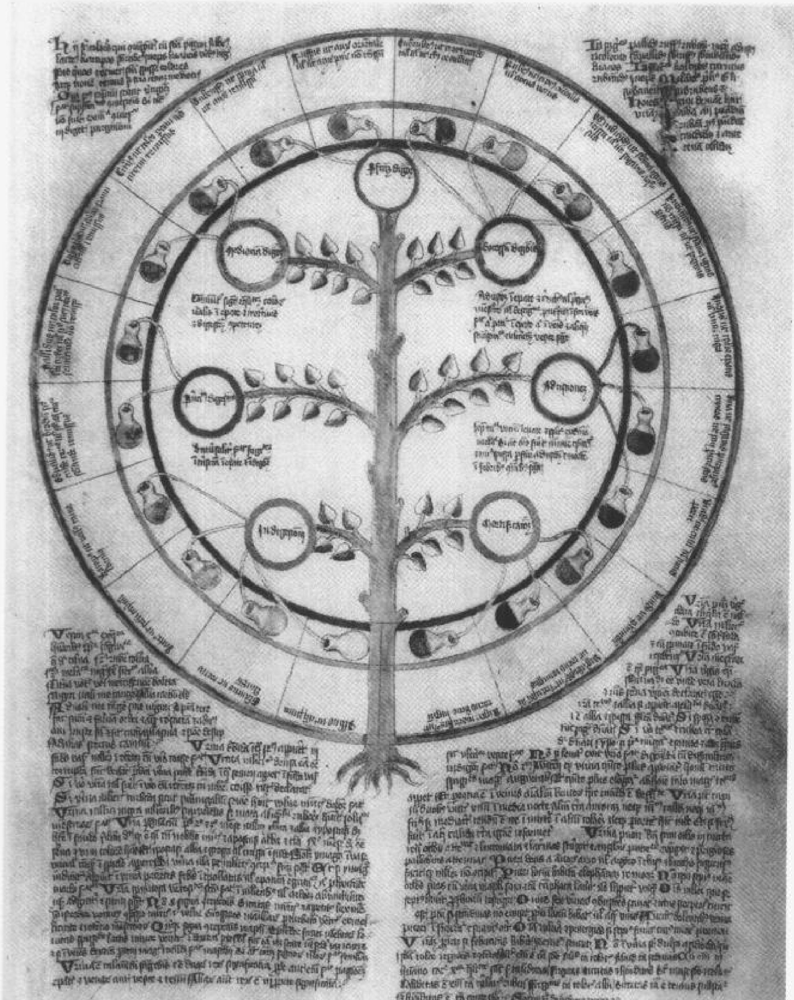

图 13.9 一张有关尿液颜色的图表。尿液的不同颜色与消化的不同阶段相对应。伦敦，威尔康姆研究所图书馆，MS 49, fol. 42r（15 世纪）。有关进一步的评论，见 Nancy G. Siraisi 著 Medieval and Early Renaissance Medicine，第 126 页。

---

(Giles of Corbeil)认为“如果尿液浓稠、苍白、浑浊或呈蓝白色，则表明可能有水肿、疝痛、结石、头痛、多痰、体内发炎或泻痢等”。 $ ^{28} $利用图表揭示不同颜色的尿液与不同疾病的关系，成为中世纪医学著作一个共同的特征（见图13.9）。

在检查病人的脉搏时，医生试图了解脉搏的强弱、持续时间、规律性和幅度等等。脉搏被细分为许多种类，并且，许多分类方法也在发展，13世纪出于无名氏之手的一篇论文中描述：

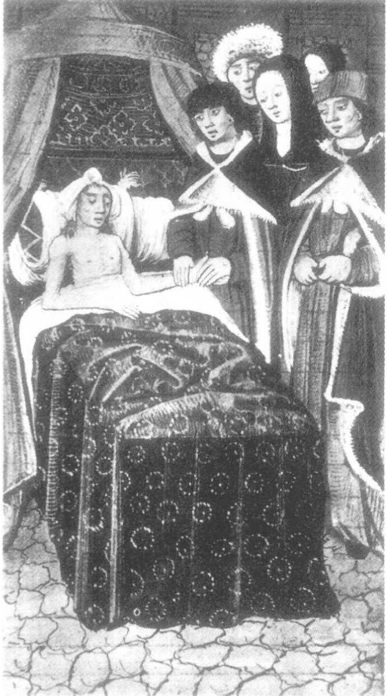

图 13.10 诊脉。格拉斯哥大学图书馆，MS Huler 9, fol. 76r（15世纪）。关于对这幅插图的讨论，见 Mackinney 著 Medical Illustrations from Medieval Manuscripts, 第 16、17 页。承蒙格拉斯哥大学图书馆馆长惠准。

---

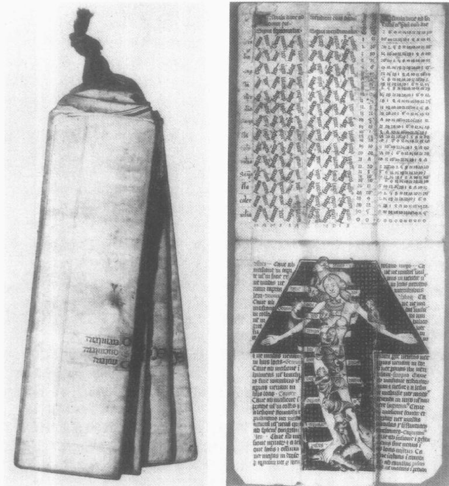

图 13.11 一本内科医生的腰挂图书，伦敦，威尔康姆研究所图书馆。它可系于腰带上，能方便地指导内科医生的日常行医。左图是该书折叠起来的样子，右图是其中一页打开后的内容，这一页包含了占星术方面的内容，有关它的详细讨论，见 John E. Murdoch 著 The Album of Science: Antiquity and the Middle Ages，第 318-319 页。

---

“医生以多种方法区分脉搏的类别，尤其是根据下述五个方面来考虑：（1）动脉的跳动；（2）动脉的状况；（3）舒张期和收缩期；（4）脉搏跳动加强或减弱的情况；（5）跳动的规则和不规则。根据这些考虑，可以区分十类不同的脉搏。” $ ^{29} $

脉搏衰弱可以用于预告死亡时间，因此，它对预后和诊断都是很有用的。

至此，我们尚未提及中世纪医学理论和实践中另一个普遍存在的因素，它在中世纪医学领域盘桓甚久，塑造了医师们的医学信念和他们实用的治疗手段，这就是医学中的占星术，它是一种认为行星能够以一种看不见的力量对疾病与治疗产生影响的信念。有足够的理由相信行星的这种影响。试举一例，医学权威希波克拉底似乎就对天体影响人体持肯定态度，他的著作里有好几篇可以做如此解释。中世纪后期一篇占星术医学论文以希波克拉底的名义流传。但更重要的是，任何掌握了自然哲学基础的人都懂得天对人体及其周围的环境是有影响的，没有理由怀疑天能够对健康与患病的全过程产生影响。 $ ^{30} $

天体对人的影响从胎儿时期就开始了，它能够影响母腹中胎儿的性情或气质。孩子出生之后，每一个人都是天体作用力连续流动的被动接受者，这种作用力或直接或通过周围的空气作用于人体，影响人的性情、健康与疾病。实际上，人们常常用占星术来解释流行病，例如1347-1351年发生的黑死病。迫于对这种特殊瘟疫作出解释的需要，巴黎大学的医学研究者们得出这样的结论：这是木星、土星和火星在1345年相互接近引起空气腐败产生的后果。 $ ^{31} $

如果疾病缠绵不去，医生们就需要考察行星的排列状况，以便从中引出有效的治疗方案。只有在行星排列处于某种适当位置的时候，才便于制作和使用药物，服用药物的剂量要考虑占星的结果。类似于放血这样的外科手术也必须择吉时而动。外科论文中常常有“放

---

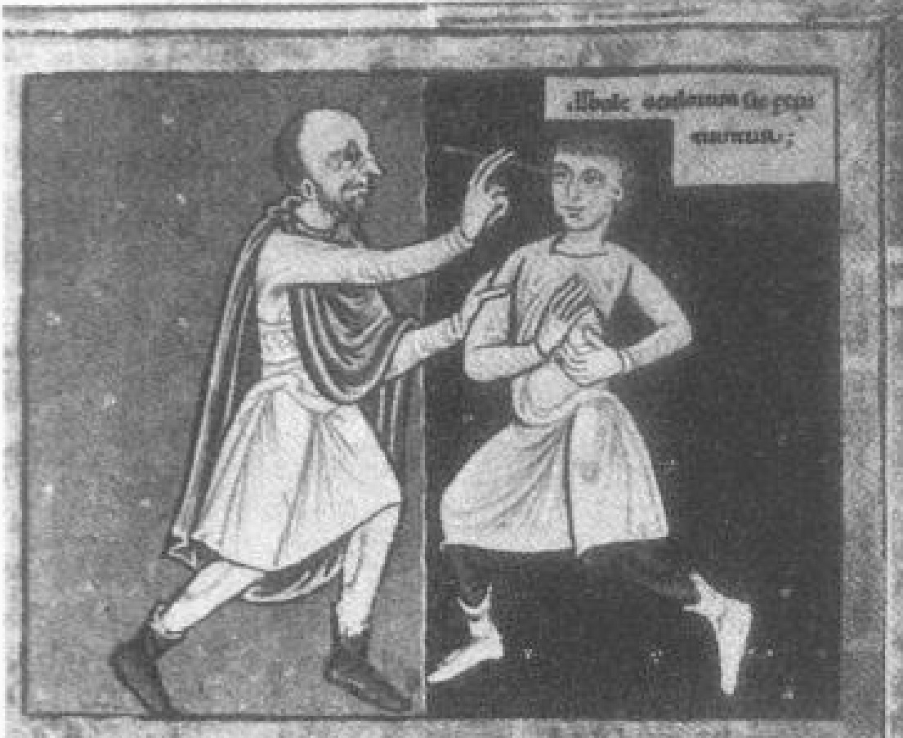

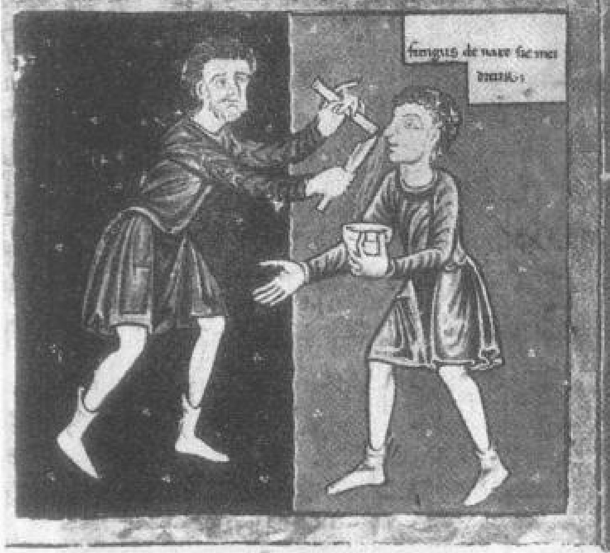

图 13.12 白内障摘除手术（上图）和鼻息肉切除手术（下图）。牛津、波德莱恩图书馆，MS Ashmole 1462, fol. 10r (12 世纪)。关于这幅插图的评注，见 MacKinney 著 Medical Illustrations from Medieval Manuscripts，第 70-71 页。

图 13.13 阴囊疝手术。注意病人被绳所缚，同时被人向后扳倒。蒙彼利埃，大学间图书馆，MS. H. 89, fol. 23r（14世纪），MacKinney 著 Medical Illustrations from Medieval Manuscripts 中对这一插图有所讨论。第 78-80 页。

---

血图”，可以用它来指导手术医师在放血时选择时日，在特殊的放血处进行手术。最后，希波克拉底关于“关键时日”的理论被认为与占星术有关，该理论认为急性病的发作期是以病情发作或转折点为标志的。在各因素中人们相信是时机决定了病情发作的结果，这个时机就是指病情的发作是否发生在占星术所说的吉日里。

## 解剖学和外科

毫无疑问，中世纪的医师们都倾向于使用手段温和的方法来治愈病人，例如控制饮食、指导服药。但有些疾病和医疗中的紧急情况需要更激烈的医疗手段。在欧洲，总有一些行医者乐于把刀子伸入人体之内。根据不同的专业和受教育程度，中世纪的外科医师有很多种。有专门进行某一项外科手术的医师，他们巡回行医，全凭观察和经验来处理病症；也有受雇于国王或教皇，受过大学教育的医生。在中世纪，一直存在着一种倾向，把外科作为一种手艺，认为外科医师的地位低于受过大学教育的内科医生。然而，在欧洲南部，外科医师们试图把外科引入大学，使其建制化（例如，蒙彼利埃和波伦亚），并希望由此享有知识分子的地位。通过12和13世纪的翻译工作，西方能够看到大量的阿拉伯外科文献，而这些文献又促使外科著作中的欧洲传统得以发展，其中最有影响的欧洲文献是罗吉尔(Roger Frugard，12世纪）的《外科学》(Surgery)，这本书以章节形式广为流传，还有居伊·德肖利亚克(Guy de Chauliac，约1290-1370年)的《大外科》(Chirurgia magna或称Great Surgery)。居伊·德肖利亚克曾是三位教皇的内科医生和外科医师，他的著作不仅在拉丁国家流传甚广，而且还翻译成英语、法语、普罗旺斯语、意大利语、荷兰语和希伯来语。 $ ^{32} $

无疑，大多数的外科医生所做的手术都不是特别大胆的手术，他们所做的手术包括接骨、关节复位、处理溃疡或疼痛，伤口清洗和缝合，刺破疖疮，放血术和烙术（用烧红的铁块烙身体的多个部位，形成溃疡，排放体内不需要的体液）也是常见的手术。 $ ^{33} $ 割除外痔可

---

能也是相当平常的。但有一些中世纪的外科医生承担了更有冒险精神的手术，试举白内障清除手术为例，医师用锐利的手术器械刺破角膜伸入病人眼内，迫使水晶体从眼球中脱离出来，落入眼底。其他手术还有清除膀胱结石和利用外科方法校正疝气。有一本书描绘了清除膀胱结石的具体过程：

“如果膀胱里有结石，探明它的做法如下：让一个强壮的人坐在长凳上，脚放在矮脚凳上；病人坐在此人的膝上，用绷带把病人的腿吊在此人的脖子上，或者把病人的腿固定在助手的肩膀上。医生则站在病人前面，把右手的两指插入病人的肛门，左手握成拳压迫在病人的阴阜。医生的手指在膀胱处寻找结石，不断摸索。如果他发现一个坚固的小丸，这就是肾里的结石了，……若要取出结石，先让病人轻度节食，并在术前禁食两天，在第三天，……找到结石，把它挤到膀胱的颈部；这里就是膀胱的入口，用器械在肛门以上两指处把膀胱纵向切开，然后取出结石。”

再举最后一个危险性很高的外科手术的例子，颅骨骨折有时需要使用环钻术（用锯把颅骨开一个小圆洞），目的是减少颅内压力，把血和脓排放出来。所有这样一些外科手术使用的镇定剂和麻醉剂都很少；如果说中世纪的外科手术中有一些显然是冒险的做法，那么真正富于冒险精神的是病人而不是医生。 $ ^{34} $

中世纪的外科医师或内科医生到底了解多少人体解剖学的知识？解剖学指导和临床的解剖研究在中世纪行医者群体的受教育状况中占有什么样的地位？尽管盖伦强调解剖学知识在成功地进行疾病处理时的重要性，但解剖学知识与临床医学的联系很微弱，与古代时情形差不多。可以肯定的是，那时候大多数的行医者认为，他们虽然只掌握少得可怜的解剖学知识，也一样能够干得很好。因为，他们在为病人分发药品、提供节食建议、开出草药处方时，很少用到人体结构的精确知识。外科医师对解剖学知识的要求高一些，但

---

也很有限。他们掌握的解剖学知识，大都是常识性的，通过诸如屠宰牲口之类的日常经验取得，除此之外，其他的一些知识则是从学徒期间的动手操作和外科实践中学到。

12 世纪的翻译活动唤起了人们对解剖学问题的重新关注，对盖伦的解剖学著作和以盖伦著作为基础的阿拉伯医学著作（包括阿维森那、哈里·阿拔斯、拉齐和稍后的阿维洛伊的著作）的翻译，为西方带来大量的解剖学文献。这些文献不能不引起人们的重视，倒不是因为这些文献使医师相信它们能够在医疗实践中产生巨大的、立竿见影的作用，而是因为它们隶属于整个医学理论的体系，受过良好教育的医生们正试图掌握它，以此索取作为知识分子的社会地位。对解剖学知识的新的关注首次出现在 12 世纪的萨勒诺，这一关注表现为真正的解剖学意义上的解剖，解剖的对象是一只猪，人们认为它在解剖学意义上可以和人体进行类比。

人体解剖似乎始于意大利的某些大学，尤其是13世纪后期的波伦亚，当时的具体情形现在已难以廓清，但其目的似乎源于法律上的需要，为了查明死因，法庭的成员需要验尸。后来，人体解剖逐步拓展开来，纳入了外科教学，但对这一过程，我们一无所知。到1316年，曾执教于波伦亚大学的蒙迪诺(Mondino dei Luzzi，约卒于1326年)已对人体解剖相当熟练，他写了一本用于解剖的手册，名叫《解剖学》(Anatomia)，在此后的两个世纪里，成为人体解剖的权威指导书。

在整个14世纪，解剖学成为帕多瓦大学、波伦亚大学和其他一些大学里医学教学的正规组成部分。居伊·德肖利亚克在《大外科》一书中，详细描述了他在波伦亚大学的导师尼古拉斯(Nicolaus Bertrucius)解剖人体的过程。

他把死尸放在手术台面上，针对尸体讲解四个方面的内容，首先处理与营养有关的部分（即胃和肠），因为它们最易腐烂，其次解剖与神经有关的部分（心脏、肺、气管），然后轮到肉体部分（颅骨、脑、眼和耳），最后解剖人体的

---

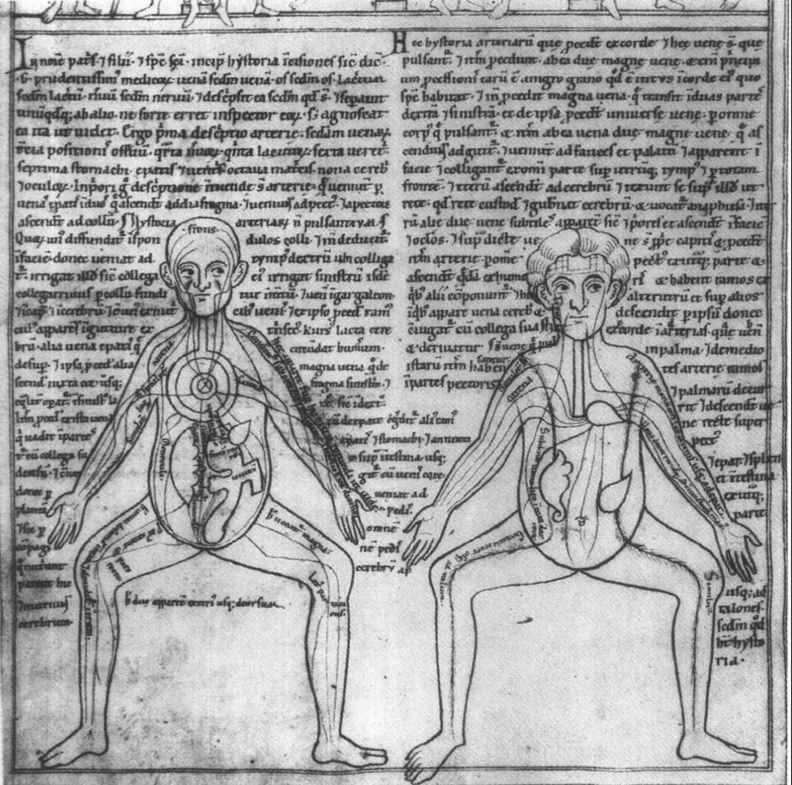

图 13.14 人体解剖图，说明了盖伦关于人体静脉（左图）和动脉（右图）的理论。慕尼黑，巴伐利亚州图书馆，CLM 13002, fol. 2v（12 世纪）。有关评注和更多的解剖学图示，见 Siraisi 著 Medieval and Early Renaissance Medicine，第 92-95 页。

末端，如手、脚。依据对（盖伦）各学说的注释，在上述四部分中，每一部分我们都要了解九个方面：它的位置、组成它的材料、结构、数量、形状、连接处的相互关系、运动、用途，可能对它们产生影响的疾病……我们也使用一些经过处理的尸体进行解剖，如把尸体在阳光下晒干，把尸体埋在泥土里腐烂得只剩骨骼，或把尸体浸泡在流动或

---

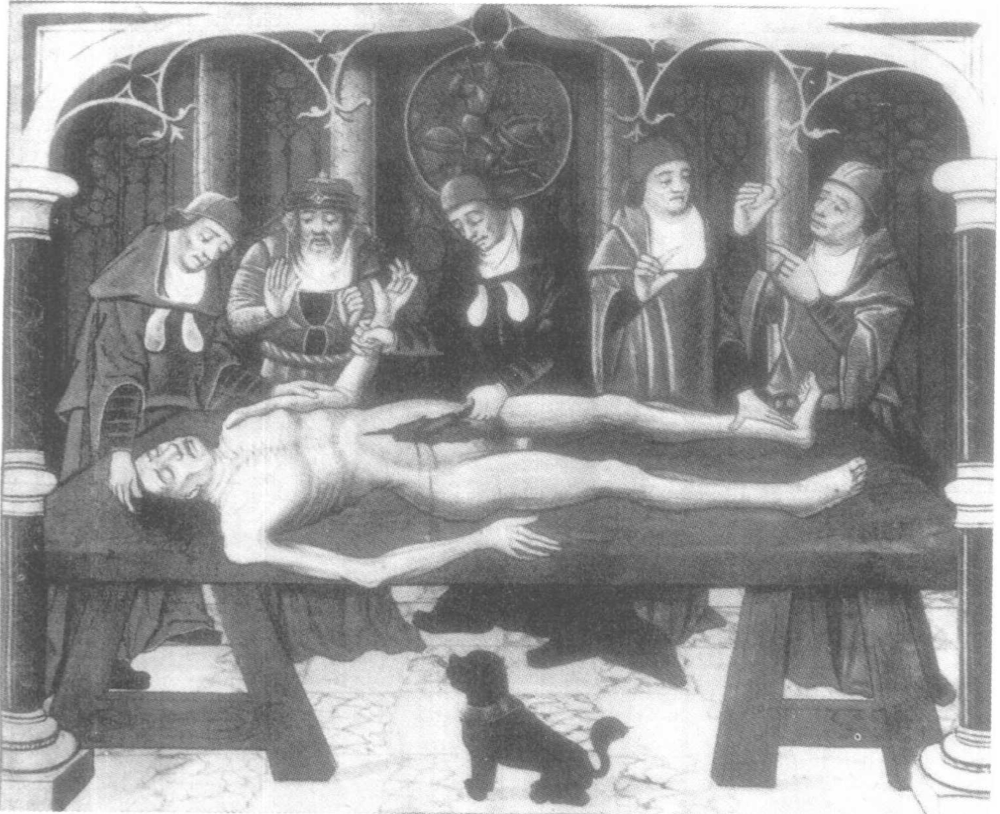

图 13.15 人体解剖。巴黎，国家图书馆，MS Fr. 28, fol. 56r（15 世纪晚期）。

沸腾的水中，解剖这些尸体至少能让我们认识到人体的骨骼、软骨组织，关节、较大的神经，腱和韧带。 $ ^{36} $

这样的解剖一般以罪犯的尸体为对象，对这些罪犯行刑的日期可以根据医学院对死尸的需要来确定。罪犯的尸体并不经常有，一年解剖一具死尸估计是最普通的。须知，中世纪的学生在上解剖课时是观察者而不是主刀者，解剖的目的不是研究而是教学，他们把解剖作为解读盖伦著作的图例说明。

---

中世纪医生的做法常为现代史学家所诟病，史学家们指责他们认识事物的方法论，批评他们不是以看到的人体结构为认识标准，而是以本本为标准，把本本作为解剖学不可动摇的权威。这一方法论产生的难堪后果便是盖伦对人体解剖的许多错误描述代代相传。那么我们应该怎样看待这一批评呢？无疑，中世纪的医生认为盖伦的解剖学成就已达到令人生畏的高度，自然会把他的著作看作权威（尽管并不绝对），但这并不意味着他们都是傻瓜。让我们想想发生在现代的类似情形，现代的解剖学教科书是现代医学的杰出成就，如果一个医学院学生在上解剖学这门必修课时，发现教材上的描述与尸体呈现出来的情形存在某种不符之处，这时他宁愿把这一差别解释为尸体的变异，而不会把它看作教材的错误。由此，中世纪的内科医生和外科医师的类似行为就不足为奇了。他们总能找到理由相信盖伦是对的（事实上，盖伦所述的绝大部分是对的），并视研读盖伦的著作为最可靠也是最有效（乃至最洁净）的获取解剖学知识的途径。

在医学教育中，尸体解剖只占较次要的地位，但我们看到解剖传统已经在13世纪后期和14世纪早期发展起来。这一传统在此后200年里不断加强并逐渐变得精细复杂，同时，它也保持了与解剖学知识中的文本传统不间断的对话。到了15世纪，它与印刷术相结合，使得教材出版成本下降和忠实可靠地复制解剖图成为可能，而解剖图的质量也因天才画家的不断涌现而进一步提高。到16世纪，上述这些因素和重新研读盖伦的希腊文本相结合，终于产生了维萨留（Andreas Vesalius，1514-1564年）和其他人光辉的解剖学成就。

## 医院的发展

关于中世纪医学，最后我将对其建制做一些说明，并简略描述一下中世纪医学成就中最令人鼓舞的成就——医院的出现。要追溯医院的起源，困难之一在于对医院这一概念的界定，如果我们根据“医院”（hospital）一词的字面意思，用它来指称“教会为旅客提供的招

---

待场所”，我们就会把许多为穷人、朝圣者和病人提供食物和栖身之所的机构都归入“医院”之中，但在这些机构里病人只能得到极少的专业医疗护理，甚至根本得不到任何医疗护理。如果“医院”这个词专门用来指称致力于照料病人、包括提供有经验的医疗护理机构，那么，我们就使用了一个非常狭窄的范围界定这个概念。前一种意义上的机构在整个中世纪的欧洲相当普遍（这种机构往往由修道院或世俗的兄弟会团体来维系），但这不是我们研究的对象，后一种形式的建制才是我们关注的对象。 $ ^{37} $

那么，作为医疗机构的医院从何而来呢？它的起源似乎可以追溯到拜占廷帝国时期，即大约公元6世纪或者更早，基督教的仁爱理想引导人们建立为病人提供专门医疗护理的医院。这些最早的医院中，我们能确证的一所是位于君士坦丁堡的桑普松医院（Sampson Hospital，医院的名称取自4世纪一位圣徒的名字）。例如，7世纪时，一位教会职员患了腹股沟感染，就在这里接受了外科治疗并逐渐康复。拜占廷的其他医院也是以同样的形式组织起来的。12世纪，同在君士坦丁堡的潘托克雷特医院（Pantokrator Hospital）为病人准备了50个床位（38个用于男性患者，12个用于女性患者）。为了满足病人在医疗和其他方面的要求，医院雇用了47人，其中有内科医生和外科医师。 $ ^{38} $

拜占廷医院模式渐渐为伊斯兰国家和西方国家所了解，在阿拉伯或在西方，拜占廷医疗模式与当地的医疗护理传统相互作用，在一定程度上，前者塑造了后者。在伊斯兰，我们发现9世纪早期就有类似拜占廷医院的机构存在，这可能要归功于巴尔马克家族的影响，该家族曾在哈伦·拉西德执政时期（786-809年）权重一时。当然，拜占廷模式之所以能够传播，肯定有许多因素使然。原因之一似乎是这样的，十字军第一次东征时，于1099年征服了耶路撒冷。耶路撒冷陷落不久，那些在耶路撒冷圣约翰医院工作的兄弟会成员（后来被称作医务人员（hospitallers））又重新以拜占廷模式把医院组织起来。由于它位置显要，规模又大，渐渐地在全欧洲都出了名。一个世纪以后，这所医院的参观者曾报告说，它容纳了1000名甚至更

---

多的病人。后来，这些医务人员在意大利和法国南部又建立了许多医院。这些医院颁行了各种条例（其中之一曾要求医院至少聘用四名医生来照料病人），这样，耶路撒冷模式渐渐为西方所熟悉，它影响了对患者和穷人的慈善医疗思想，推动将医院最终发展成为一个特殊的医疗建制。 $ ^{39} $

上述文字只是对医院的形成作了一个粗略的框架性介绍，其中含有许多不确定之处。无论医院模式在传播和吸纳过程中详情如何，总的说来，在12和13世纪，医院模式作为一种医疗建制在西方迅速

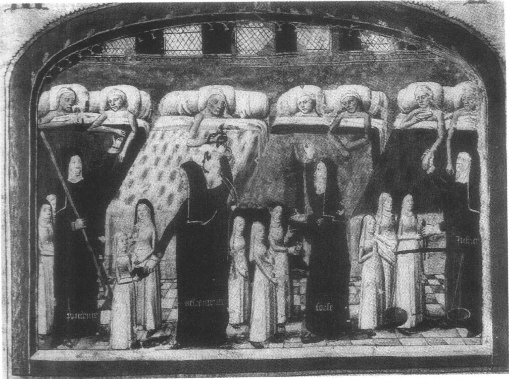

图 13.16 中世纪的医院，摘自 Jean Henry 著 Le livre de vie active des religieuses de l'Hotel-Dieu（15 世纪晚期）。巴黎，公共救济图像中心。这幅插图在 Imbault-Huart 著 La medecine au moyen age 中得到讨论，第 168 页。

---

蔓延开来，所以在整个欧洲的城镇里都能找到医院，这些医院或大或小，大的有几百个床位，小的只能容纳几个病人，它们或是由教会办的，或是由普通人办的，情形不一。这些医院的光顾者主要是下层平民，偶尔也有例外。医院一般有专职医生，医院为他们的劳动支付年薪。那时相当关心病人的需要，比如说卫生和饮食。在床柱上系上绳子，把草垫做成的床悬吊起来，这样设计的床能支撑两个甚至三个病人的重量。一段写于1288年、描述米兰的医疗设施的文字是这样的：

“在这座城市里，包括它的郊区……共有10所为病人服务的医院。……其中最重要的一所是布罗洛医院(Hospital of the Brolo)，该医院由杰福瑞(Geoffrey de Bussero)于1145年创立，设施相当完备。尤其是在疾病猖獗之时，人们发现这所医院容纳了500多位卧床病人，并且还有更多尚未躺倒的患者。所有的病人都由医院提供饭食，开销由医院承担。除此之外，医院还接受了350名或者更多的婴儿，他们一出生就与单独的护士呆在一起，接受悉心照料。医院对各式各样的穷苦人（除了麻风病患者，另有医院会接纳他们）来者不拒，并热情慷慨地为他们服务，努力使他们早日康复，他们的食宿均由医院提供。而且，所有需要外科治疗的穷人都受到认真照料，由三名指定的外科医师负责这一工作。” $ ^{40} $

尽管这段描述传达的是医院光明的一面，但它还是揭示了中世纪医院的护理水平，这也是中世纪医学所追求的目标。

## 自然史

在中世纪，医学无疑是生物学知识的主要贮存库，却不是惟一的贮存库。亚里士多德的自然哲学中包含了大量的动物学和植物学

---

知识。几乎每部百科全书都有讨论植物和动物知识的部分。而且，中世纪的药草集和动物寓言集分别对植物和动物作了详细描述。还有，中世纪的人们对当地的植物和动物具有详尽的第一手知识。本章结束前，我们不妨简略总结一下中世纪的植物学和动物学知识。

由于植物的主要用途是制作草药，（这里我们暂不考虑那些构成欧洲的部分饮食的植物），中世纪的植物学知识与医学关系非常紧密。为加强药草的医药用途，需要编写关于药草的手册，对大量的药草及其医学用途作出描述，因此，中世纪出现了大量药草文献，绝大多数是基于实用目的而撰写的，迪奥斯科里德斯的《药典》是上述文献的一个典型代表，在该书修订过的拉丁文译本中，为了使用方便，以字母顺序对药材加以排列。一个一般的药草条目包括该植物特有的名称（有时一个植物有多个名称），该植物的明显特性、产地、对有显著药用价值的部分及其疗效的描述，并且对如何制作和使用相应的药草加以指导。把药草按字母顺序加以编排表明了按照实用目的的分类方法（即根据药材的名称在书中查找），压倒了按照生物种类或其他理论考虑进行分类的方法。 $ ^{[1]} $

除了这些实用的文献，另外还有更理论化、更哲学化的文献，在这些文献里，人们把植物的生命放在了自然哲学的背景之下加以考察。这些文献大多是以这种或那种途径从《论植物》(On Plants)一书演化而来，这部书据说是亚里士多德的著作，中世纪学者也相信确是如此，但它的作者有可能是大马士革的尼古拉斯（公元前1世纪）。这部著作有很多评注（其中大概有十余种是我们已知的），其中最著名的评注是大阿尔伯特(约1200-1280年)的《论草木植物》(On Vegetables)。这篇评注包含了对《论植物》的详述，与此同时，阿尔伯特试图把一种理性秩序带入植物的自然哲学之中，书后附有按传统的字母顺序列出的药草及其用途的清单。阅读此书能让人感到大阿尔伯特对这些内容极为精通，这是他的同时代人无法望其项背的。凭着他在这方面的深湛知识，大阿尔伯特观察并描述了许多植物学现象。 $ ^{42} $

人们可能以为动物学文献会与植物学文献呈现出非常类似的情

---

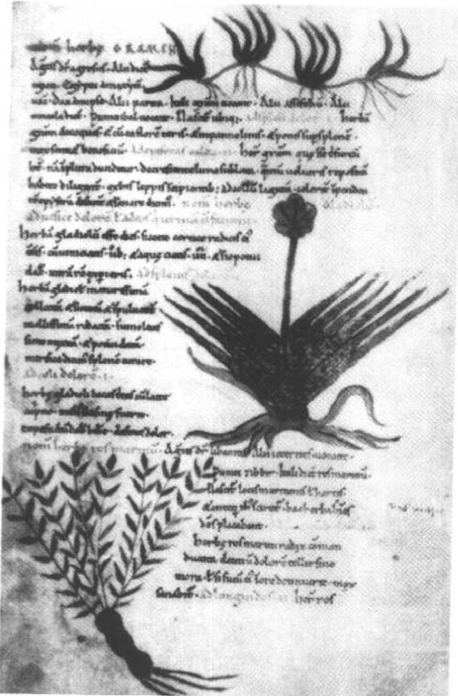

图 13.17 伪艾普利亚斯（Pseudo-Apuleis）的《药草集》（Herbal）一书中的一页，描绘和说明的是茅草、剑兰和迷迭香。牛津，波德莱恩图书馆，MS Ashmole, 1431, fol. 21r（12世纪）。这些内容在 Joan Evans 编 The Flowering of the Middle Ages 一书中得到说明，第 190、352 页。

形，然而，中世纪的动物学知识在医学领域却几乎没有应用，而且在其他领域也几乎找不到它的实用价值。因此，药草集是实用植物学知识的储存库，而在动物学领域，却找不到一个相应的储存库。因为亚里士多德写了一系列内容丰富而且重要的动物学著作，在动物学领域，潜在地存在着亚里士多德的文本传统，亚里士多德的这些著作译为拉丁文（并伴有阿维森那的重要评注），并引起了重视，不

---

仅因为这些文献包含了详尽的动物学知识，更重要的是，它们与自然哲学中更为一般性的问题有关。在这里，大阿尔伯特再次成为该领域的主要人物之一，在《论动物》(On Animals)和其他一些著作里，他构造了一个描述性和理论化的庞大动物学体系。令人特别感兴趣的是他对营养和胚胎学的讨论。例如，他对胚胎发育及其概念的处理，就不仅仅基于亚里士多德有关概念体系的理论，而且在相当大的程度上依赖于对动物繁殖特性的亲身观察。中世纪动物学史至今尚未问世，但从大阿尔伯特的贡献来看，动物学的哲学方面已接近该学科的顶点了。 $ ^{43} $

除了亚里士多德传统中的动物学著作，还有许多其他种类的与动物有关的文献，其中有两类受到了广泛的重视。一类是关于猎鹰训练术的实用文章，此类文章中最著名的由腓特烈二世(Frederick II，约13世纪中叶）在西西里撰写，名为《禽猎术》(the Art of Hunting with Birds)。这篇有关禽类的名文中，最为人称道的观点是，腓特烈二世通过经验指出，兀鹰寻找食物时利用的是它的视觉而不是嗅觉，腓特烈二世把兀鹰的眼睛蒙住，发现它再也无法寻找食物，由此探明了它的捕食方式。 $ ^{44} $

如果说腓特烈二世关于猎鹰训练术的文章似乎明显地既实用又现代，找不到人们习惯与中世纪相联的幻想和形而上学色彩，那么我们下面要举的最后一个有关动物的中世纪文献则走向另一个极端。中世纪的动物寓言常被人们用作例子，证明中世纪人缺乏客观观察世界和直接获取动物学知识的能力。动物寓言的全部内容都是源于某位佚名作者的《自然哲学家》(Physiologus)一书，通过代代相传形成的。《自然哲学家学》从亚历山大城流传开来，当时用希腊文写成(约为公元200年前后)，后被译为拉丁文和主要欧洲国家的文字。《自然哲学家》和受其影响的其他一些中世纪著作是有关动物知识的汇编，在不同动物的名称下，编排了简短的条目或较长的章节，条目的数量在《自然哲学家》里大约有40条，而在后来的动物寓言里则超过了100条。 $ ^{45} $

动物寓言中典型的条目常常在一开始就对该动物的名称进行语

---

源学阐释，例如，在12世纪的动物寓言里，有关“马”的条目这样介绍到：马又叫“equus”，这个词源于另一个词“equabantur”后者是指当“将马四匹为一组套车时，要对其作出‘搭配’，即‘equabantur’，那些体型匹配、步伐一致的马能够配合在一起”。 $ ^{46} $ 如果某些动物具有显著的外在特征，在语源解释之后就会介绍，然后再说明其不寻常或让人感兴趣的习性，描述那些使人羡慕或令人遗憾的特性。从这本12世纪的动物寓言里，我们看到刺猬以利刺覆身，能蜷成一团以御外敌；狐狸是一种“既狡诈又机敏的动物”，为了捕捉猎物常常装死；鹤群在走动时俨然保持着军队行进的阵容；蟒又叫做蛇怪(basilisk，传说中用目光或气息致人死地的怪爬虫)，能以夺人魂魄的一瞥立毙某物于其目光之下；而猞猁（一种大山猫）的尿能够变成宝石；狮子总是满怀怜悯之情同时又勇气可嘉，它们的眉毛和鬃便是这种气质的体现。最后，许多（并不是全部）条目在描述动物时也会从中引出道德或神学寓意。刺猬代表谨慎；鹤代表谦恭和有责任心；狐狸被用于塑造邪恶的类型，它正是通过特有的欺诈本性引诱那些肉欲强盛的男子；而雄狮在死胎出生三天后仍把气息吹入死胎体内，这代表了圣父使死去的耶稣复活。

我们应当如何评价这些把事实、冥想和寓言混为一谈的古怪复合体呢？中世纪的动物寓言显然和我们现代的动物学手册读起来很不一样，因此，科学史家有时候就对编纂寓言的中世纪人有些微词，认为他们是不称职的或不成功的动物学家。这一看法是基于这样一个假设，即认为寓言的编者是在试图（或应该试图）写一本现代动物学手册，却不知如何入手，他们的严重的缺点即在于，不能区分什么是事实，什么是空想。但认为中世纪人的兴趣和着眼点与我们完全一致实在是荒诞不经的，从药草集和有关猎鹰训练术的书来看，中世纪的学者完全有能力写出与上述著作相类似的动物学著作。因此，他们没有把动物寓言写成一本动物学手册，原因必定在于他们的目的与我们有所不同。

那么，动物寓言的目的究竟是什么呢？它是一本收集动物学知识和动物神话的集子，大量使用象征和联想的手法，以传授知识和

---

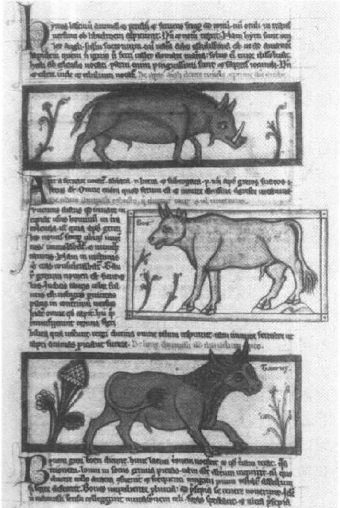

betränkt, und weltweit vorgängig, und weltweit erwähnlich, und weltweit

图 13.18 中世纪动物寓言中的一页，描述野猪、阉牛和公牛。伦敦，大英图书馆，MS Harley 3244, fol. 47r (13 世纪早期)。承蒙大英图书馆惠准。

娱乐读者。毫无疑问，无论编纂者还是读者都不会要求这种寓言里的内容具备亚里士多德的自然哲学中的那种真实。一本寓言的成功在于它成功地把读者带入到一个集传统的神话、隐喻和直喻的世界里去。 $ ^{47} $ 我们现代人自己也有与此相类似的神话，有关土拨鼠预告冬天长短的传说就是一例，每年的二月份，报纸、电台和电视台都郑重其事地报道此事（至少在我的国家我所处的地区是这样）。是不是每个听到预告的人都会认定此预告所言都是真的？我估计不会。但

---

提出这个问题就表现了对土拨鼠的传说的目的产生了误解。这种知识与气象学知识没有某种“科学的”关联，而是大家共同参与到传统习俗之中，在这种年年重复的形式下，传统得以继承，于社会和个人心理均不无裨益。

我们中的大多数人对辨别自身文化中不同种类的文学和艺术作品非常在行。我们能够毫不费力地立即指出，在科学的主张与苏博士所写的故事或土拨鼠吉米提供给我们的天气预报之间有何不同，科学的主张必须经受多种严格的认识论检验以达到真正“科学的”程度。而后者的作用与前者完全不同，因此就需要另一套标准来衡量它们，我们在研究之中，同样需要体会中世纪的人和他们的成就，包括他们创造出来的各种各样的文学和艺术。如同我们（本书第十一章）已经看到的，中世纪的世界地图一般说来与现代的世界地图目的完全不同。由此，我们一定不可认为所有涉及自然现象的中世纪著作都有其哲学或科学的目的，就像我们现代人在写一本科学教科书时所想的一样。另外，还应理解中世纪的学者们有可能是为了满足各种层次读者的需要，为了让他们在阅读时感到愉悦并获取知识。我们如果能够这样来体会中世纪的文化产品，学会根据编著者的本意评价其作品的成就，就能够在阅读中充分领略中世纪的特征、成就和魅力。